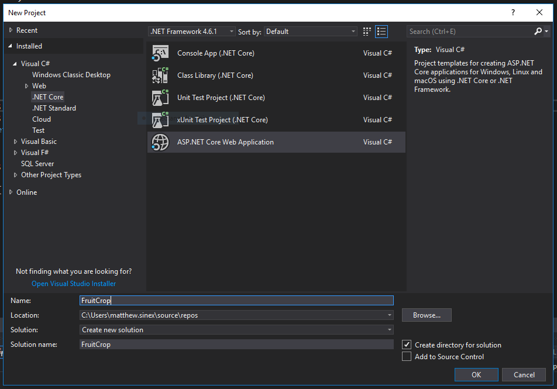
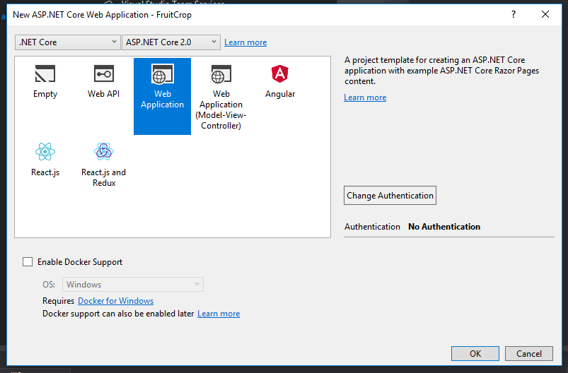
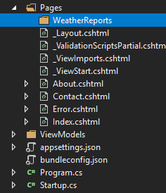
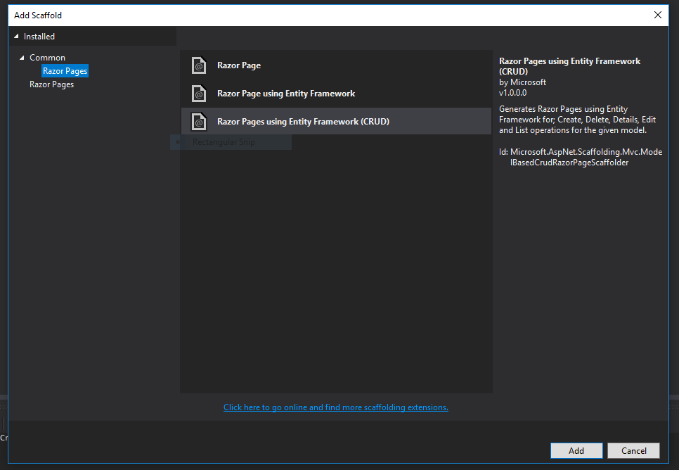
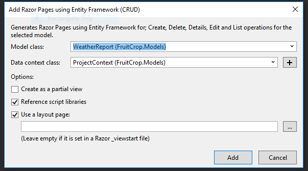
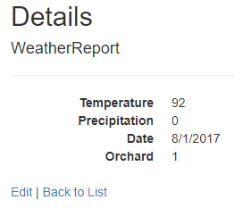

When you start looking at suggested packages to use in ASP.Net development, AutoMapper is one that comes up often. ASP.Net Core AutoMapper solves the problem of having to write tedious mapping code between objects. But what does this mean? Admittedly, when I first starting out learning MVC, I had trouble wrapping my head around the concept. I wasn't even sure what a ViewModel was, or why it might be necessary. What I hope to do in this article is to explain why you would want to use AutoMapper, what problems it might solve, and how you might extend it for more advanced scenarios. I'm also going to be discussing this in terms of .Net Core, as there are a few differences between it and MVC 5, especially in light of Core's emphasis on Dependency Injection.

## Our ASP.Net Core AutoMapper Scenario

For the rest of the examples, we're going to imagine a business case and build our app around it. We'll pretend that we've been hired by a fruit juice company. The company wants to keep track of the orchards and groves where they get their raw fruit from. They also want to track weather reports to see how the weather might affect those crops.

To start, we'll create a new project.

Next, let's create the classes for our models. We'll keep them fairly simple to start, recognizing that in a full-fledged application, we'd be adding a whole lot more. We might want to keep track of orders, or inventory, but for now, these will do.

### Crop.cs

public class Crop
{
  public int ID { get; set; }
  public string Name { get; set; }
}

### Orchard.cs

public class Orchard
{
  public int ID { get; set; }
  public string Name { get; set; }
  public string Address { get; set; }
  public int CropID { get; set; }

  public virtual Crop Crop { get; set; }
}

### WeatherReport.cs

public class WeatherReport
{
  public int ID { get; set; }
  public int OrchardID { get; set; }
  public double Temperature { get; set; }
  public double Precipitation { get; set; }
  public DateTime Date { get; set; }

  public virtual Orchard Orchard { get; set; }
}

As a side note, after building this app, I realized that, technically, some fruits are in orchards, and others are in groves. According to some sources I've read, "grove" might be the more appropriate general term. Such are the perils of naming things in web development.

Once we have these models in our _Models_ folder, we'll need to put together our DbContext class.

public class ProjectContext : DbContext
{
  public ProjectContext(DbContextOptions<ProjectContext> options)
      : base(options)
  { }

  public DbSet<Crop> Crop { get; set; }
  public DbSet<Orchard> Orchard { get; set; }
  public DbSet<WeatherReport> WeatherReport { get; set; }
}

We'll also want to add our database connection to _Startup.cs_. For these examples, I'll be using a local database.

public void ConfigureServices(IServiceCollection services)
{
    services.AddMvc();

    var connection = @"Server=(localdb)\\mssqllocaldb;Database=TestDb;Trusted\_Connection=True;ConnectRetryCount=0";
    services.AddDbContext<ProjectContext>(options => options.UseSqlServer(connection));
}

Once we've done that, we can run our Code First migrations to set up the database. Run the following commands in the Package Manager Console.

add-migration InitialCreate
update-database

If you're new to Code First migrations, know that, if we change our models later, we'll need to run these commands again, but with a different migration name.

Finally, we need to add some data to our tables. We could scaffold some views and page models to enter in the data via forms, or direct edit the table in SQL Server. You could also add some code to seed this data, but whatever the case, here's the data I'm using.

### Crop Data

\[table id=12 /\]

### Orchard Data

\[table id=13 /\]

### WeatherReport Data

\[table id=14 /\]

I took the orchard and weather report data from real orchards and groves in Arizona. This presents a problem for the precipitation data, since the dates I chose had no precipitation whatsoever. Look at all those zeros. I genuinely tried to pick dates around the monsoon season, hoping to get lucky. I didn't. Sorry. But, the data is what it is, and I'm leaving it, because I'm stubborn like that.

## What is a View Model and why would we need it?

A **view model** is a representation of the data we're going to display to our user in the view. The properties and methods in our view model are optimized for the way we're going to render the view. The source of the data doesn't matter. The view model could be a transformation of data from a single database table, or multiple tables, or an external API call.

Let's take a really simple example and create some views for our Weather Reports.

If you haven't already, create a folder called _WeatherReports_ in the _Pages_ folder.

Next, right click on the folder, and choose _Add -> Razor Page..._ You'll be presented with a few dialogues where you need to choose _Razor Pages using Entity Framework (CRUD)_, and then choose the _WeatherReport_ class.

Navigate to the weather reports index view, which should look like `localhost:YOURPORT/WeatherReports`. Click on the `Edit` link for any of the items, and you'll see a `Details` view that should look something like this:

Now, let's say that we want to change a few things here. Instead of the orchard's ID, we want to actually display the orchard's name. Also, let's imagine that we want to be more precise with the date, and format it to include the hours as well. Finally, we'll format the temperature and precipitation fields to show two decimal places.

### Bad Approach #1: Change the Model

We _could_ change our model to accommodate these changes. However, what happens when we have another view that uses the same database, but we want to display the data in yet another way? Your model becomes harder to maintain because you're not just using it to represent a row in the _WeatherReport_ database. You're using it to also represent two or three different user views. Then when you go to make changes or to debug, you have to remember which properties belong to which representation, and the whole thing becomes a nightmare to maintain.

### Bad Approach #2: Change the Razor markup

We _could_ change the view markup to reflect our changes. We could change the display code to something like:

@Html.DisplayFor(modelItem => item.Orchard.Name)

But this violates the DRY (Don't Repeat Yourself) principle. Now, every time we want to show the data in this particular representation, we'll have to change the code on every Razor view. This also becomes cumbersome to maintain, especially as your views become more numerous and complicated.

What we want to do instead is to create a View Model.

### Good Approach: Create a ViewModel

Create a folder called _ViewModels_. Inside, create the class file _WeatherReportView.cs_.

public class WeatherReportView
{
  public int ID { get; set; }

  \[DisplayFormat(DataFormatString = "{0:0.00}")\]
  public double Temperature { get; set; }

  \[DisplayFormat(DataFormatString = "{0:0.00}")\]
  public double Precipitation { get; set; }

  \[DisplayFormat(DataFormatString = "{0:MM/dd/yyyy hh:mm tt}")\]
  public DateTime Date { get; set; }

  \[Display(Name = "Orchard")\]
  public string OrchardName { get; set; }
}

We've added the extra OrchardName property, and provided data annotations for the various formats for our numerical data. This will help our (hypothetical) users understand the data better.

After we've added the view model class, we need to make some adjustments to our razor markup and to the page model. The razor markup is easy; we just need to change these two lines:

@Html.DisplayNameFor(model => model.WeatherReport.Orchard.ID)
@Html.DisplayFor(model => model.WeatherReport.Orchard.ID)

To this:

@Html.DisplayNameFor(model => model.WeatherReport.OrchardName)
@Html.DisplayFor(model => model.WeatherReport.OrchardName)

Our page model code is a little more complicated. Currently, we're getting a weather report from the database table and returning that data directly to the view. Instead, we want to take that data and transform, or _map_, the data into our view model. Here are the changes we would make to _Details.cshtml.cs_:

public class DetailsModel : PageModel
{
  private readonly FruitCrop.Models.ProjectContext \_context;

  public DetailsModel(FruitCrop.Models.ProjectContext context)
  {
      \_context = context;
  }

  public WeatherReportView WeatherReport { get; set; }

  public async Task<IActionResult> OnGetAsync(int? id)
  {
    if (id == null)
    {
      return NotFound();
    }

    var weatherReport = await \_context.WeatherReport
      .Include(w => w.Orchard).SingleOrDefaultAsync(m => m.ID == id);

    if (weatherReport == null)
    {
      return NotFound();
    }

    WeatherReport = new WeatherReportView
    {
      ID = weatherReport.ID,
      Date = weatherReport.Date,
      Precipitation = weatherReport.Precipitation,
      Temperature = weatherReport.Temperature,
      OrchardName = weatherReport.Orchard.Name
    };

    return Page();
  }
}

## What is mapping?

Notice how, in the example we just used, we need to transform the data from our database into our view model. This process is called **mapping**. One by one, we take the properties from the database model and assign them to the properties in the view model.

While doing this once may not be so bad, mapping objects quickly becomes tedious. This is especially true once the amount of the properties balloons, and when you're using the view model in a number of different views, like both the details page, index page, and the delete page. You have to type out all of the properties every single time.

The ASP.Net Core AutoMapper package aims to make this process less tedious. Let's look at how to install and use it in our application.

## ASP.Net Core AutoMapper Basics

To install AutoMapper, run the following command in the Package Manager Console:

Install-Package AutoMapper.Extensions.Microsoft.DependencyInjection

This will install the AutoMapper base package, as well as the DependencyInjection extension that you'll need to have this work with ASP.Net Core.

In _Startup.cs,_ add the line `services.AddAutoMapper()` to the `ConfigureServices` method, like this:

public void ConfigureServices(IServiceCollection services)
{
  services.AddAutoMapper();
  services.AddMvc();

  var connection = @"Server=(localdb)\\mssqllocaldb;Database=TestDb;Trusted\_Connection=True;ConnectRetryCount=0";
  services.AddDbContext<ProjectContext>(options => options.UseSqlServer(connection));
}

Next, we'll need to add a class that inherits from `AutoMapper.Profile`. This is where you'll define your maps, or the relationships between objects that you're mapping. When your application starts up, AutoMapper will search the assembly for this class, and use whatever maps it finds there.

We'll create the file _MappingProfile.cs_ in our _Models_ folder. Then, we want to add a map between our _WeatherReport_ class and our _WeatherReportView_ class. Here's how:

public class MappingProfile : Profile
{
  public MappingProfile()
  {
    CreateMap<WeatherReport, WeatherReportView>();
  }
}

Back in the Page Model, we need to change our code a bit. We'll need to create a mapper object, and assign to the object in the constructor using dependency injection. We'll also, finally, replace our manual mapping code with the automatic mapping that AutoMapper provides.

public class DetailsModel : PageModel
{
  private readonly FruitCrop.Models.ProjectContext \_context;
  private readonly IMapper \_mapper;

  public DetailsModel(FruitCrop.Models.ProjectContext context, IMapper mapper)
  {
    \_context = context;
    \_mapper = mapper;
  }

  public WeatherReportView WeatherReport { get; set; }

  public async Task<IActionResult> OnGetAsync(int? id)
  {
    if (id == null)
    {
        return NotFound();
    }

    var weatherReport = await \_context.WeatherReport
      .Include(w => w.Orchard).SingleOrDefaultAsync(m => m.ID == id);

    if (weatherReport == null)
    {
      return NotFound();
    }

    WeatherReport = \_mapper.Map<WeatherReport, WeatherReportView>(weatherReport);

    return Page();
  }
}

The line with `_mapper.Map` does all the work here. The first object type is the source object, and the second object type is the destination object. AutoMapper tries to match up the source properties with the destination properties. The ones that match exactly, like `Temperature` in both classes, work as we would expect.

But AutoMapper can also infer _some_ of the relationships, even if the names are a little different. For instance, our ViewModel has a property called `OrchardName`. Even though our `WeatherReport` model doesn't have that property, AutoMapper will infer that you want to map `Orchard.Name` to `OrchardName`. AutoMapper will also infer relationships between similarly named methods and properties, like `GetTotal()` to `Total`. As long as the properties are named appropriately, you do not have to manually set the property mappings. If you do need to have more fine-grained control over the mappings, you'll have to do a little bit more work.

## AutoMapper Projection

Taking a source value and transforming it into a destination that doesn't exactly match the naming structure is called **projection**.

Let's say that, when users create a new WeatherReport, we want to let them input the date and time separately. In fact, as the view is currently coded by the default scaffolding, users can't input the time at all. Let's fix that. We'll make a new ViewModel, and call it _WeatherReportCreateView.cs_.

public class WeatherReportCreateView
{
  public int ID { get; set; }
  public int OrchardID { get; set; }
  public double Temperature { get; set; }
  public double Precipitation { get; set; }

  \[DataType(DataType.Date)\]
  public DateTime Date { get; set; }

  \[DataType(DataType.Time)\]
  public DateTime Time{ get; set; }
}

Notice how we've separated out the date and time properties. We'll also need to add the extra form field to our _Create.cshtml_ view.

  <label asp-for="WeatherReport.Time" class="control-label"></label>
  <input asp-for="WeatherReport.Time" class="form-control" />
  

The biggest change we'll need to make is in our _MappingProfile.cs_ file. Since the names of the properties don't match up, we'll have to tell AutoMapper how to deal with the naming inconsistency.

CreateMap<WeatherReportCreateView, WeatherReport>()
  .ForMember(
      dest => dest.Date, 
      opt => opt.MapFrom(src => src.Date.Add(src.Time.TimeOfDay))
  );

The first lambda, the "dest", is the destination member, or which property we're transforming _to_. In this case, our destination is the `Date` property on the model. The second lambda expression describes the source, where the data is coming _from_. Since we're combing the date field and the time field, we'll perform that date math here.

If the source was a property that was just named differently, and didn't require any date math, you could give the name of that property, like this:

CreateMap<WeatherReportCreateView, WeatherReport>()
 .ForMember(dest => dest.Date, opt => opt.MapFrom(src => src.SomeOtherProperty));

We can chain as many `ForMember` calls as we want, in case we need to use projection on more than one property.

In our PageModel, we'll just do the same dependency injection we did before, change the class types, and add one line to _OnPostAsync_:

\[BindProperty\]
public WeatherReportCreateView WeatherReport { get; set; }

public async Task<IActionResult> OnPostAsync()
{
  if (!ModelState.IsValid)
  {
      return Page();
  }

  var weatherReport = \_mapper.Map<WeatherReportCreateView, WeatherReport>(WeatherReport);

  \_context.WeatherReport.Add(weatherReport);
  await \_context.SaveChangesAsync();

  return RedirectToPage("./Index");
}

Hopefully, by now you'll recognize that this will take the view that comes from the user input, and this will be transformed into the _WeatherReport_ model, which we'll then write to the database.

## AutoMapper Custom Value Resolver

If the transformation from destination to source is a bit more complicated, and you don't want the code in a projection, you can move it to a custom value resolver.

Let's imagine that we want to show the temperature in both Fahrenheit and Celsius. We already have our temperature data in Fahrenheit, but we'll need to calculate the Celsius value.

We'll change our _WeatherReportView_ class by deleting the `Temperature` property adding adding these two:

\[DisplayFormat(DataFormatString = "{0:0.00}")\]
public double Fahrenheit { get; set; }

\[DisplayFormat(DataFormatString = "{0:0.00}")\]
public double Celsius { get; set; }

We'll need to create a custom _CelsiusResolver_ class so that we can tell AutoMapper how to resolve the data transformation.

public class CelsiusResolver : IValueResolver<WeatherReport, WeatherReportView, double>
{
  public double Resolve(WeatherReport model, WeatherReportView viewModel, double member, ResolutionContext context)
  {
    return (model.Temperature - 32) \* .5556;
  }
}

Next, in our _MappingProfile.cs_ file, we'll just need to add these configurations for the map:

CreateMap<WeatherReport, WeatherReportView>()
  .ForMember(dest => dest.Fahrenheit, opt => opt.MapFrom(src => src.Temperature))
  .ForMember(dest => dest.Celsius, opt => opt.ResolveUsing<CelsiusResolver>());

Again, for Fahrenheit, we don't need to do anything fancy, so we're just going to use projection. We tell AutoMapper to take the value from `Temperature` and put it into `Fahrenheit`. For the  `Celsius` property, we let AutoMapper know to use our _CelsiusResolver_ class to populate the value.

## AutoMapper and IEnumerable in the Index

To use AutoMapper in our Index views, we just need to change a single line in our PageModel.

public IList<WeatherReportView> WeatherReport { get;set; }

public async Task OnGetAsync()
{
  var weatherReport = await \_context.WeatherReport
      .Include(w => w.Orchard).ToListAsync();

  WeatherReport = \_mapper.Map<IEnumerable<WeatherReport>, IList<WeatherReportView>>(weatherReport);
}

Notice how we simply changed the types in our `Map` call to an IEnumerable and an IList. There's no need to add additional code in our `MappingProfile` class. AutoMapper knows how to handle lists of your mappings just fine.

## Is AutoMapper in ASP.Net Core Worth It?

It takes some time to configure AutoMapper, and the process can seem like overkill. To be honest, I haven't used AutoMapper for most of my career, and have only just now started to look into it. I've gotten along just fine without it so far. I do feel torn on whether the extra steps of configuration are worth the solution. My gut feeling is that I wouldn't start out a new project using AutoMapper. I would only start using it once I started to find that my project needed view models, and that the mapping code I was writing manually was becoming tedious.

Another common complaint I've seen is that AutoMapper can make your code harder to debug. If there's some kind of error in your mapping profile, you won't know about it until run-time. There was an error that I came across in writing this guide, where I tried to map to a destination of `Date.Date` instead of just `Date`. Intellisense didn't pick this up, and only once I ran the application did I receive the error.  To combat this, AutoMapper does come with unit-testing methods. You can read more about those, along with even more advanced topics, at the [Official AutoMapper Documentation](http://automapper.readthedocs.io).

My final thought on the topic is that AutoMapper would be worth using in many applications, but it certainly isn't necessary to have a successful application. Again, I'd recommend using it once you've started to use ViewModels in your project, and those view models start to have so many properties that writing the mapping code becomes boring and tedious.
