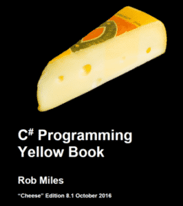

I spent weeks researching twelve of the most recommended C# books. A few of them were excellent contenders, but many were written with intermediate or experienced programmers in mind. I think that [The C# Player’s Guide](https://www.amazon.com/C-Players-Guide-3rd/dp/0985580135) is the best book to learn C# for beginners.

## Best Book to Learn C# for Beginners

### [The C# Player's Guide](https://sensibledev.com/recommends/c-players-guide/)

### 

### Written with the C# beginner in mind, The C# Player’s Guide is a beautifully-written, clear guide to the language.

## Best Free Book to Learn C# for Beginners

### [C# Yellow Book](http://www.csharpcourse.com/)

### If you don’t want to spend any money, and want something with a little more personality and wit, check out the C# Yellow Book.

## Who I Am

I was a High School teacher for seven years before switching career paths and learning web development in ASP.NET. Since then, I’ve spent years developing web apps. I’ve had my feet in both the education and tech realms for as long as I can remember.

This puts me in a unique position to judge educational materials about programming. Years of classroom experience informs my opinion about what different learners need, and where they’re going to struggle.

As an ASP.NET developer, the main language I work with is C#. I took a more traditional route to learn the basics, taking classes in high school and college. However, I’m a huge proponent of self-driven learning, and I think that every programmer should look for additional materials to close the gaps in their knowledge.

## How I Chose the Books

I took a liberal sampling of book recommendations from Reddit posts, Quora questions, and a number of “Best C# Books” articles on blog sites. Many of the books showed up multiple times, though I did look at a few that were one-offs, just to be thorough. I discuss nearly all of the contenders that didn’t make the cut at the end of this article. If your favorite book for beginners isn’t on the list, please let me know in the comments.

## How I Judged the Books

Effective educational books need to have several key qualities. In this case, I’m evaluating these books for how appropriate they are for beginners to programming.

1. **A Good Understanding of the Reader’s Prior Knowledge.** Prior knowledge just means, “what the reader already knows.” In a book for beginners, the author needs to explain simpler concepts before introducing more complicated ones. The effective author makes reasonable assumptions about the reader’s comfort level. For example, you wouldn’t want to explain how to use an object instance of the StreamWriter class before explaining what a class is, and what objects are.
2. **Clear, Practical Examples.** After an author introduces a concept, he should give a clear, real-world example as soon as possible. This helps to solidify understanding. If the author uses metaphors to explain concepts, these metaphors should be easily understandable and relatable.
3. **Clear, Logical Typography.** This is specific to books and eTexts. Since you’re reading instead of watching a video series, the physical layout of the text needs to make sense. Headings should be used effectively, and the type should be easy to read.
4. **An Engaging Voice.** Technical guides aren’t meant to be entertaining, and you can’t expect a comedy routine from them. However, because the material is so dry to begin with, the voice of the writer needs to be interesting enough that you don’t doze off in the middle of reading.

I evaluated the books based on whether they met these four criteria and on whether they were appropriate for beginners to programming. When it was immediately clear that a book was inappropriate, I read the first few chapters and moved on. I read the top contenders more thoroughly.

## Why Learn C#?

C# is the general-purpose language used in Microsoft’s .NET platform. You can use C# to make Windows console applications and desktop applications. I use C# daily to produce web applications in ASP.NET.

You can code C# in Xamarin to develop mobile applications. C# is also used to create games using the Unity Engine.

C# is routinely in the list of in-demand programming languages. At the time of writing, it’s currently ranked #6 in [the TIOBE index](https://www.tiobe.com/tiobe-index/). It routinely stays in the top 10. This translates to a lot of jobs, particularly in ASP.NET web development.

If you’ve worked with languages like Java before, C# is pretty easy to pick up. Even if you haven’t programmed at all, C# is still a good entry-level language. But, like a lot of skills, even though it’s easy to get the basics down, mastering the language takes a lot more work.

## Best Book to Learn C# for Beginners

### [**The C# Player’s Guide**](https://sensibledev.com/recommends/c-players-guide/), RB Whitaker

The scope of the book is perfectly suited for beginners. Whitaker covers basic programming principles, object-oriented programming, and a few advanced topics, like lambdas and asynchronous programming.

There’s little discussion of frameworks that use C#, like Windows Forms, or MVC, because those topics get in the way of learning the fundamentals of the language. The entire book is just a hair above 300 pages, and that’s a good thing for beginners. There are other books that run up to nearly three times as long, and while they might be more comprehensive, they are just as likely to overwhelm a newcomer.

Whitaker covers everything that I would expect in a beginner’s guide. Programming concepts are defined with simple, clear metaphors, like this one for variables:

“A _variable_ is a place in memory where you can store information. It’s like a little box or bucket to put stuff in.”

When explaining _if_ statements, the author uses a scenario where a teacher is assigning grades. The examples are illustrative, but not overly fanciful. They’re appropriate and don’t distract you from the subject matter. I never felt lost or overwhelmed reading this book.

The physical layout is excellent. Each chapter begins with a box that summarizes the main points of the chapter, so you can easily skip around if that’s how you like to learn. The chapters are also sprinkled with “Try It Out!” segments where Whitaker asks you to complete a short assignment. These are great for practicing the concepts you’ve been reading about. Font choices and physical page layout make these sections, and others, easy to identify and scan.

The author’s voice is formal, but conversational in way that feels very appropriate for the subject matter. If you’re the kind of person who needs something more informal, try out my free pick or _Head First C#_, one of my alternatives.

If what you’re looking for is a simple, straightforward introduction to C# that isn’t too hard and doesn’t get in the way of itself, this book will suit you extremely well.

There are only a few aspects that keep this book from being perfect. The first is the title, which is a little misleading. Some of the lowest Amazon reviews for this book felt that the phrase “Player’s Guide” indicated a book for advanced, skilled audiences. This is not the case. It’s also not a book about game development, which seemed to be the assumption of other reviewers.

According to the author, the term “Player’s Guide” is used in the same way that you would use it for a _strategy_ guide to a video game. The explanation makes sense, I suppose, but I can see why some people were confused.

The other thing I would’ve liked is to see more sample projects and exercises.

In spite of these negatives, the C# Player’s Guide is still the best book you can buy if you’re a beginner learning C#.

## Best Free Book to Learn C# for Beginners

### [C# Yellow Book](http://www.csharpcourse.com/), Rob Miles

The book begins by assuming not only that you have no programming experience, but that you barely know what a computer is. In the first chapter, the author spends a considerable amount of time discussing how to gather information from clients and create specifications. This should give you an idea of how much of "high-level" view the author takes on the subject.

My favorite aspect of the book is probably how Miles takes so much time to explain good programming practices, and not just how to code in C#. The author walks you through how to think like a programmer, anticipating issues, handling errors, and communicating with clients.

For instance, Miles advises his readers to "work through your programs on paper" before ever writing a single line of code. "You need to be able to solve the problem yourself before you can write a program to do it."

In another paragraph cautioning against overly clever solutions, Miles writes: "When you are writing programs, the two things which you should be worrying about are 'How do I prove this works?' and 'How easy is this code to understand?' Complicated code does not help you do either of these things."

The C# topics covered include both the necessary and advanced: variable types, methods, object-oriented programming, threads, error handling, generics.

The pacing of the topics is excellent. I never felt like the book moved too quickly, or lingered for too long. Each section took the learner's prior knowledge into account. On the occasion that the author mentions something within explaining it fully, he's careful to remark that we'll return to it later and explain why it's important.

The only thing that’s a little odd to me is that Miles doesn’t explain how to get Visual Studio up and running, or how to use it to compile programs. In fact, he says, “How you create and run your programs is up to you.” This is going to be a stumbling block for first-timers.

Miles uses a lot of snappy analogies. Most of these are explanatory and hold the reader's interest very well. Others seem "off" either in terms of culture or time, like this analogy explaining semicolons in C# programs: "You can equate these characters with the sprocket holes in film, they keep everything synchronised." I get it, but the connection isn't immediately obvious.

The typography is serviceable, though I felt the paragraphs could use a little extra line height. The lines need just a little bit more breathing room. Other than that, Miles does a good job of using headings and blocking off his authorial asides. The code samples are readable as well, and indented properly.

The C# Yellow Book is rife with humor, like this passage from the first chapter defining hardware: "Hardware is the physical side of the system. Essentially if you can kick it, and it stops working when immersed in a bucket of water, it is hardware."

There are some small punctuation errors, mostly with missing commas in the beginning. It's not enough to make the book unreadable, and I stopped noticing them after the first chapter or so.

Overall, this is an excellent free book for beginners learning C#.

## The Other Books

While many of the other books I examined were well-written and detailed, many of them were for more advanced C# programmers. Others were deficient in one or more of the things I was looking for in a book about learning programming.

Keep in mind that this is not necessarily a criticism of these books, but an evaluation for a specific purpose.

### [Head First C#](https://sensibledev.com/recommends/head-first-c/), Jennifer Greene & Andrew Stellman

The Head First series comes highly recommended, and I would actually consider this my second choice behind my top pick. What many people like about this book, and other Head First guides, is the zany humor and unique style.

Each page is full of diagrams, pictures, and annotations that make it look like someone’s already gone through it with a pen in hand. The fonts are funky and a lot of the examples are silly. This is by design, and it’s intended to make a dry subject interesting and fresh.

I personally find each page too busy, and difficult to focus on. With so many arrows, annotations, and little pictures, I find myself more distracted than I should be. I don’t find it very easy to read.

Also, many of the Amazon reviews complain of the book being out-of-date. The latest version of the book I could find uses Windows 8 and Visual Studio 2013 as its technologies.

However, if the book’s style appeals to you, this might be a great introduction to C#. Take a look at the Amazon preview and see what you think.

### [Murach’s C# 2015](https://sensibledev.com/recommends/murachs-c-2015/), Anne Boehm & Joel Murach

I really like this book. Its major sections include the fundamentals of C#, along with object-oriented programming and (a big plus) database programming which is really essential in just about any real-world app.

I don’t like how it begins by having you build a WinForms application, which is pretty much a dead technology in today’s web-based world. It’s not really until the fourth chapter, 100 pages in, that you start learning the fundamentals of C#.

That aside, there’s a lot of great information here. There’s also a lot of explanation and discussion about _why_ you’re doing something or what some of the alternatives are.

It also has a unique “paired-page” format, with the “essential syntax, guidelines, and examples on the right page and the perspective and extra explanation on the left page.” This helps a lot if you use this as a reference guide, because it makes it easier to scan through the pages.

Ultimately, I like this one a lot, just not quite as much as my top pick for beginners. I wouldn’t feel bad recommending it as the second book that you read about C#.

### [C# in Depth](https://sensibledev.com/recommends/c-in-depth/), Jon Skeet

This book delivers on its title. It teaches about the C# language by focusing on the evolution of different features from version to version. For example, in the section about sorting objects, the author explains how you had to use IComparer in C# 1, and contrasts this to C# 3 where you can use LINQ and extension methods to make the process easier.

Make no mistake, this is a great book and very in-depth, but inappropriate for beginners.

The author even says in the introduction that “If you don’t know any C# at all, this probably isn’t the book for you.” Take him at his word. Read an introductory text, and then come back to this one.

### [C# 7.0 in a Nutshell](https://sensibledev.com/recommends/c-7-0-in-a-nutshell/), Joseph Albahari & Ben Albahari

The subtitle of this book is “The Definitive Reference,” and the volume certainly has the weight to support that claim. At over 1000 pages, this is a very comprehensive guide to the C# language.

However, the book is intended for “intermediate to advanced audiences.” From just the Amazon preview, I would only recommend this book as a reference work for advanced programmers. Beginners are certain to be confused from almost the first page.

### [Pro C# 7: With .NET and .NET Core](https://sensibledev.com/recommends/pro-c-7-with-net-and-net-core/), Andrew Troelson, Philip Japiske

This is another great reference work. It’s long, comprehensive, and goes beyond C# itself to discuss assemblies, ASP.NET MVC, Entity Framework, WCF, and .NET Core. The examples are clear, the diagrams are great, and the typography is easy to read.

But it’s not for beginners.

### [Learn C# in One Day and Learn it Well](https://sensibledev.com/recommends/learn-c-in-one-day-and-learn-it-well/), Jamie Chan

Let’s be honest: the title is great for marketing purposes and name recognition. But you really _can’t_ learn C# in one day and expect to learn it well.

In reading through the sample, I found the explanations to always be a bit too brief, and concepts not adequately introduced.

On the other hand, the book does have a lot of high reviews on Amazon, so maybe brief is your style. Check it out if you want a very terse overview of the language. If you find yourself getting lost, come back to the two recommendations here.

### [C# Essentials](https://www.techotopia.com/index.php/C_Sharp_Essentials), Techotopia

This free eBook contains some nice information, but it isn’t nearly as comprehensive or as easy to read as my free pick. Some of the pacing feels off as well. The book jumps from installing the .NET Framework straight into creating a GUI in Visual Studio. Then it circles back to discussing variables, loops, conditionals, etc.

### [Starting Out with Visual C#](https://sensibledev.com/recommends/starting-out-with-visual-c/), Tony Gladdis

This is a textbook. Most of the text looked fine, with plenty of examples and diagrams, but I can’t justify recommending a book that costs nearly $150 to C# beginners.
