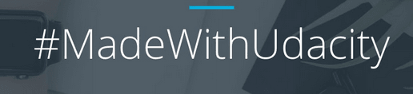
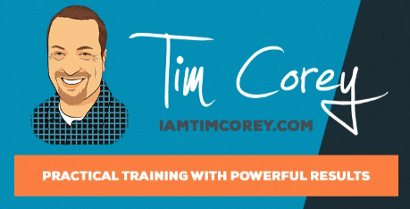

I've been thinking a lot lately about how to best teach programming. If someone were to come to me and ask how to become a programmer, what would I say? In the days when I was first learning, video lectures were almost non-existent. Now, it would be difficult to imagine _not_ recommending at least a few YouTube channels to new learners. With that in mind, I've put together a short list of the best YouTube programming channels.

What makes a good YouTube programming channel? In my former life, believe it or not, I was a high school English teacher, so I have a few thoughts on what makes a good learning tool. A YouTube channel worthy of recommendation would:

- **Balance abstract theory with concrete, specific examples.** Both need to be interwoven, with very little time between the abstract and the concrete. If you're going to introduce a new concept, you need to give an example as soon as possible.
- **Explain concepts and terms at a level appropriate for the audience.** If a series is geared towards people who've never coded before, don't assume that your audience knows the SOLID principles of object-oriented design, or that they even know what an object _is_.
- **Produce videos with a high production value, including high-quality audio and video.** Programming is difficult enough to learn without squinting at an ill-captured screen, or trying to make out the instructor's words through a substandard microphone.

Each of the channels that I've picked excels in each of these areas. While not every video is perfect, it's clear that the content creators care very deeply about teaching effectively. Also, as a .NET developer myself, the channels will be most helpful to those learning ASP.NET web development.

One more note: video is hard to produce well. It takes time, sometimes much more slowly than the technology advances. If you're watching a 10-part video series that was posted a year ago, you cannot reasonable expect every last detail to be perfectly up-to-date. One thing you'll need to learn as a programmer is to become self-reliant.

If something isn't working, or looks different, go off to the documentation or to Stack Overflow. While there are many resources out there for you, no one is going to hold your hand the entire time. So go into this mode of learning with a realistic expectation of what you're going to get out of it.

## [Udacity](https://www.youtube.com/user/Udacity/)

[Udacity](https://www.udacity.com/), the online learning platform, has its own YouTube channel. Some of the more recent uploads include segments from a technology conference, but the videos of Udacity's course content will be of particular interest to online learners. Their [Courses Built with Google series](https://www.youtube.com/user/Udacity/playlists?sort=dd&view=50&shelf_id=8), for example, includes videos on Android Apps and Responsive Web Design Fundamentals. While you won't earn one of their Nanodegrees just by watching their YouTube videos, you will certainly learn something.

#### Good Video Series for Web Development Beginners

[Intro to HTML and CSS](https://www.youtube.com/watch?v=1cZtdKNB9jo&list=PLAwxTw4SYaPmd5v7c9i883AwqVZquegHM)

What I love about this course is that teaches the basics of HTML and CSS "backwards" from what you would normally think. Instead of starting with tags and markup, this video series teaches you how to use Chrome's Dev tools. They start with real-life examples, like examining Wikipedia's HTML and CSS, rather than starting with a contrived toy example. This is great, because people learn best when they can relate their learning to high-interest, real-life examples.

One of the big mistakes teachers make is to not make their courses "concrete" enough. You wouldn't show someone how to work on a car engine by starting with diagrams. You'd begin by looking at the actual engine, and then turning to the diagrams later once you have a model, in your head, of how things fit together. The same is true with learning how to program. I haven't seen many courses, personally, that do this effectively. Kudos to the Udacity people.

Other nice features of this video series include extensive whiteboarding, drawings, and some neat real-life exercises, like physically printing out web pages and cutting them up. Each video in the series is short, so it's easy to find your place after some time away from the keyboard.

## [LearnCode.academy](https://www.youtube.com/user/learncodeacademy)

This YouTube channel is an enormous repository of free web development tutorials. One of its standard features is the yearly [Must-know Tech](https://www.youtube.com/watch?v=gVXcqO9A1vo) rundowns, where the creator covers "what it will take to be a great web developer this year." This video lays out a roadmap for what skills you should be focusing on, and even gives some ideas for complete beginners. Of course, the channel pushes its own tutorials for learning about all those topics, but you could always supplement your learning from other places.

I really liked this video, because one of the scariest things about being a web developer is that you don't always know what you should be learning. This is especially true for complete beginners, who are very confused by what technologies they need to learn first, and what skills are dependent on others. The Must-know Tech video for 2018 has a very detailed mind map that explains what you should learn first, and why. This is of great value to those new to the field.

#### Excellent Series for Cleaning Up Your Javascript

[Modular Javascript - Javascript Tutorial on the Object Literal Pattern](https://www.youtube.com/watch?v=HkFlM73G-hk&list=PLoYCgNOIyGABs-wDaaxChu82q_xQgUb4f)

Holy cow, this tutorial on how to implement modules in your Javascript is exactly what I _wish_ I had watched years ago. The series begins by taking a look some jQuery spaghetti-code (something that I've, ashamedly, written too often). Then, step-by-step, the author talks about how to implement the object literal pattern. This reinforces the concepts of separating your concerns and DRY (don't repeat yourself), which are good practices in every programming language, not just Javascript. The examples are great, and the explanations even better. If you work with Javascript, watch this one.

Bonus thought (on a personal note): the third video in the series was the first time in my career that the self-executing anonymous function actually "clicked" in my head. Thanks, bro.

## [Tim Corey (IAmTimCorey)](https://www.youtube.com/user/IAmTimCorey)

Tim Corey's channel is one of the better that I've seen that focuses mostly on C# and SQL. As an ASP.NET developer myself, I sometimes feel like the Microsoft stack is underrepresented in tutorials and guides. Some of the topics on IAmTimCorey include creating a C# application from start to finish, delegates, interfaces, and logging. I really like how down-to-earth Corey seems, and how he appears to be genuinely concerned with his audience's education.

For instance, in one of his responses to a comment, he explains that he doesn't try to teach ASP.NET MVC right off the bat in his series about creating a C# application, because to do so for complete beginners would be too overwhelming. In another video, he cautions against using Entity Framework, because it's a "black box" that can prevent you from understanding the underlying SQL. His attitude seems to be very focused on his audience understanding fundamental patterns and techniques.

Each of the videos on the channel that I watched had extensive screencasting. Corey takes his time to explain what he's doing at every step, and most of the videos clock in at over an hour. If you follow along, you'll certainly know your way around Visual Studio and get the C# basics.

#### Great Video for Learning the Basics of ASP.NET MVC

[Introduction to ASP.NET MVC in C#](https://www.youtube.com/watch?v=phyV-OQNeRM)

Tim Corey's teaching style is deliberate and methodical. One of his strengths is to really slow down when it comes to gotchas or things that might just be unclear. For instance, he spends almost a whole ten minutes at the beginning of the video just explaining the setup options for a new project. That might seem like overkill (if you haven't seen the video), but I would argue that there are a lot of options that might be confusing for a beginner. There are many "rapid-fire" YouTubers out there, and I really appreciated a more thoughtful approach.

You'll also want to check out Tim Corey's website, [IAmTimCorey.com](http://IAmTimCorey.com). He has courses available for sale, as well as a blog.

## [Programming with Mosh](https://www.youtube.com/user/programmingwithmosh)

Moshfegh Hamedani maintains this YouTube channel, which is updated often with a variety of programming topics. There are many series on topics like JavaScript for beginners, Node.js, Angular, and, yes, C#. The videos are very professional, with high-quality audio and visuals. The code examples are presented with an eye for readability, unlike some channels that don't really seem to care about font choice, size, or placement. In the videos that I watched, each topic was also accompanied with helpful diagrams, when appropriate.

#### [C# Tutorial for Beginners: Learn C# from Scratch](https://www.youtube.com/watch?v=gfkTfcpWqAY)

I've been really struggling to find a C# video that is truly geared towards beginners. This video comes the closest I've seen yet. It begins with a quick overview of what C# and .NET are, and gives definitions for things that new programmers might be unfamiliar with, like classes, namespaces, and assemblies. I find that too many tutorials simply assume that newbies already know these concepts and gloss over them.

Now, I'll warn you, this video is, in a way, an advertisement and preview for Mosh's paid course. (There's even a few ads for the full course in the video. And, no, I haven't taken it, so I can't comment on its quality.) However, there's enough good content here that you could still learn enough to get you started. The video clocks in at almost two hours and should serve as a good, general introduction to C#.

## Best YouTube Programming Channels: Summary

I've explained what I think are some of the best YouTube channels out there, especially for learning web development. You should always be on the lookout for ways to learn more about your profession, and YouTube is definitely one of those avenues. If you have any other suggestions, please let me know in the comments. Happy coding!
