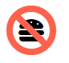
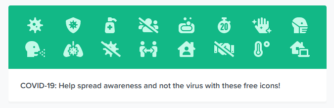

Some of my most popular posts on this blog are about integrating Bootstrap 4 and .NET. Recently, Bootstrap released an alpha version of an SVG icon library, so I thought this would be a good time to check it out. We'll look at how to install it, how to do use, and also do a Bootstrap 4 icon comparison with other popular icon libraries. To be clear, you could use these font libraries with _any_ framework or web project, not just Bootstrap. However, there's a need to decide on a font system if you're using Bootstrap because the framework doesn't come with one by default.

## Bootstrap Icons

If you're familiar with npm and have it integrated into your project, you can install it that way:

npm install bootstrap-icons

Otherwise, you can just download it directly from here:

[Bootstrap Icons](https://icons.getbootstrap.com/#install)

I'd suggest putting it into the **wwwroot/lib** folder.

Now, as far as using it? Here are your options.

### Embedded

Since you're working with SVG icons, you can just put the markup (including the SVG path) directly onto your Razor view. Obviously, if you're working with a different framework, you can put this wherever you HTML is rendered.

So, let's say we go to the [Bootstrap Icons](https://icons.getbootstrap.com/#install) page and decide we like the _Chat Quote_ icon for something we're building.

Click on it, and it'll take you to another page.

You'll need to highlight and copy the SVG code (there's no clipboard button yet). Then, just past this into your HTML markup and you'll have yourself a chat icon:

<svg class="bi bi-chat-quote" width="1em" height="1em" viewBox="0 0 16 16" fill="currentColor" xmlns="http://www.w3.org/2000/svg">
  <path fill-rule="evenodd" d="M2.678 11.894a1 1 0 01.287.801 10.97 10.97 0 01-.398 2c1.395-.323 2.247-.697 2.634-.893a1 1 0 01.71-.074A8.06 8.06 0 008 14c3.996 0 7-2.807 7-6 0-3.192-3.004-6-7-6S1 4.808 1 8c0 1.468.617 2.83 1.678 3.894zm-.493 3.905a21.682 21.682 0 01-.713.129c-.2.032-.352-.176-.273-.362a9.68 9.68 0 00.244-.637l.003-.01c.248-.72.45-1.548.524-2.319C.743 11.37 0 9.76 0 8c0-3.866 3.582-7 8-7s8 3.134 8 7-3.582 7-8 7a9.06 9.06 0 01-2.347-.306c-.52.263-1.639.742-3.468 1.105z" clip-rule="evenodd"/>
  <path d="M7.468 7.667c0 .92-.776 1.666-1.734 1.666S4 8.587 4 7.667C4 6.747 4.776 6 5.734 6s1.734.746 1.734 1.667z"/>
  <path fill-rule="evenodd" d="M6.157 6.936a.438.438 0 01-.56.293.413.413 0 01-.274-.527c.08-.23.23-.44.477-.546a.891.891 0 01.698.014c.387.16.72.545.923.997.428.948.393 2.377-.942 3.706a.446.446 0 01-.612.01.405.405 0 01-.011-.59c1.093-1.087 1.058-2.158.77-2.794-.152-.336-.354-.514-.47-.563zm-.035-.012h-.001.001z" clip-rule="evenodd"/>
  <path d="M11.803 7.667c0 .92-.776 1.666-1.734 1.666-.957 0-1.734-.746-1.734-1.666 0-.92.777-1.667 1.734-1.667.958 0 1.734.746 1.734 1.667z"/>
  <path fill-rule="evenodd" d="M10.492 6.936a.438.438 0 01-.56.293.413.413 0 01-.274-.527c.08-.23.23-.44.477-.546a.891.891 0 01.698.014c.387.16.72.545.924.997.428.948.392 2.377-.942 3.706a.446.446 0 01-.613.01.405.405 0 01-.011-.59c1.093-1.087 1.058-2.158.77-2.794-.152-.336-.354-.514-.469-.563zm-.034-.012h-.002.002z" clip-rule="evenodd"/>
</svg>

This would be appropriate for icons that you use very rarely, but I think it's clear you don't want to do this with most of your icons, especially the ones you use a lot.

One advantage to this format, though, is that you can add bootstrap  `.text-*` classes to color your icons.

This markup, for instance, will give you an **X** icon colored green because of the  `text-success` class.

<svg class="bi bi-x text-success" width="1em" height="1em" viewBox="0 0 16 16" fill="currentColor" xmlns="http://www.w3.org/2000/svg">
  <path fill-rule="evenodd" d="M11.854 4.146a.5.5 0 010 .708l-7 7a.5.5 0 01-.708-.708l7-7a.5.5 0 01.708 0z" clip-rule="evenodd"/>
  <path fill-rule="evenodd" d="M4.146 4.146a.5.5 0 000 .708l7 7a.5.5 0 00.708-.708l-7-7a.5.5 0 00-.708 0z" clip-rule="evenodd"/>
</svg>

### External Image

If you've got the library downloaded, you can use markup like this to include your icon:

You'll need to replace the `src` attribute value with the path to wherever you downloaded the icons.

### How Does it Look?

The library looks pretty consistent in style. It's hard to describe, and I'll be the first to admit that I'm not a designer, so let me just give you some examples.

There are a few that are oddball, like... eggs?

But most of them are really useful, and have a lot of cool variety to them, like these variations on the hamburger menu / list:

## Font Awesome: A Popular Alternative for Bootstrap 4

I've used Font Awesome as an icon set for many years with my personal and work projects. It makes it super-easy to get started, and there's a wide variety of icons. There's a paid and free version. I'll be covering the free version today, but you should be aware that the paid version has a _lot_ more icons than the free library, about **five** **times** as many. As of this writing, the free Font Awesome includes 1,588 icons, while the paid version includes 7842. The paid version also apparently gives you more freedom about which icons to include in your custom CDN link. The way they advertise this feature is: "**Want to go Faster?** Choose Pro icons and automatically load only what your site uses!"

It had been a while since I'd started a new project with Font Awesome, so I was a little confused as to why, on the **Get Started** page, that Font Awesome wanted my _email._

Looking for an explanation, I found this on the same page:

> We create kits for each website so you can quickly upgrade and change your settings all without ever pushing code. To do this, we need to create a Font Awesome account so we know which kits are yours and so you can come back and manage them.
> 
> A Font Awesome account is free to have, **but a valid email account is required to set up an account**.

Okay... So, the cynic in me thinks this just sounds like a way to get my email and sell me stuff.

All right, for science, let's try this out. Email goes into the form field and I click on "Send Kit Code." After doing that, I get an email asking me to create an account. I do so, making a password, and, admittedly, I think this is kind of weird just to get some icons.

Once I'm into my Font Awesome account, I can finally get to some useful stuff.

### Font Awesome Kit Dashboard

"Kit" in this context seems to mean something like "project."

At the top of the dashboard, there's a display for a CDN link, unique to your project. I've obscured the actual URL, just in case.

That same dashboard page then lists three steps to get started:

1. **Add Your Kit's Code to Your Project.** This really amounts to copying and pasting the script tag (like the one in the image above) into your HTML's **head** tag. There's also a link here to change your kit's settings, but I've found you don't really need to tweak this. This is where you would upgrade to the pro version if you wanted.
    
2. **Add Icons to Your Project's UI.** Also includes a helpful search box.
3. **Add Some Style.** This section includes links to tutorials on Font Awesome's icon styling options.

All right, so let's do some of that.

### Installing and Using Font Awesome

First, you'll need to add the kit link to your HTML head. Here's the template that Font Awesome actually provides:

<!doctype html>
<html>
  <head>
    <!-- Place your kit's code here -->
    
  </head>

  <body>
    <!-- Ready to use Font Awesome. Activate interlock. Dynotherms - connected. Infracells - up. Icons are go! -->
  </body>
</html>

Next, we need to add some icons to the page. Since we tried out the "chat" icon last time, let's see if we can find a similar one. There's a search box on your kit's dashboard page, or you can just [go here to see the search directly](https://fontawesome.com/icons?d=gallery).

After typing "chat" into the icon search box, I received _735_ results. Most of these are paid, however, and will be slightly grayed out to indicate this. You can filter the search results by just free or paid, though. Scrolling down, I tried to find the most vanilla chat icon I could, and found something suitable:

That "pro" icon on the right is for the "light" version of the icon. Selecting the middle option, I get to a page that shows what the icon looks at different sizes. At the top of the details page is a really helpful section showing me what HTML to use in my page, and I have the option to download the SVG if I wanted to.

You see that third item, the **i** HTML tag? That's what you need to put into your markup to generate the icon. Helpfully, clicking on that markup will copy it to your clipboard.

So, let's say I put the following markup into my page:

<i class="far fa-comment"></i>

That would generate... hey, exactly what we would expect:

Yes, it actually is that small. Speaking of which, what if we wanted to change the size of the icon?

### Styling Font Awesome Icons

Font Awesome Provides a number of utility classes for [size](https://fontawesome.com/how-to-use/on-the-web/styling/sizing-icons), [alignment](https://fontawesome.com/how-to-use/on-the-web/styling/fixed-width-icons), [color](https://fontawesome.com/how-to-use/on-the-web/referencing-icons/basic-use), [rotation](https://fontawesome.com/how-to-use/on-the-web/styling/rotating-icons), and [stacking icons on top of each other](https://fontawesome.com/how-to-use/on-the-web/styling/stacking-icons). Just add the class to the the icon, and you're off to the races.

As an example, here's how you would render the camera icon in all the different sizes:

<i class="fas fa-camera fa-xs"></i>
<i class="fas fa-camera fa-sm"></i>
<i class="fas fa-camera fa-lg"></i>
<i class="fas fa-camera fa-2x"></i>
<i class="fas fa-camera fa-3x"></i>
<i class="fas fa-camera fa-5x"></i>
<i class="fas fa-camera fa-7x"></i>
<i class="fas fa-camera fa-10x"></i>

For another example, let's say you were tired of people eating hamburgers, and wanted to stack the universal "banned" symbol on top of a hamburger. Font Awesome makes that almost dead simple, with a wrapping span around the two icons you want to stack:

  <i class="fas fa-hamburger fa-stack-1x"></i>
  <i class="fas fa-ban fa-stack-2x" style="color:Tomato"></i>

As you can see from the above code, you can also use CSS to add color, borders, opacity, or anything else in your CSS toolbox.

### Downloading Font Awesome Icons Locally

If you want to download the icons locally, you can absolutely do that, by going here and downloading the complete package:

[Hosting Font Awesome Yourself](https://fontawesome.com/how-to-use/on-the-web/setup/hosting-font-awesome-yourself)

You can use the SVGs with JavaScript in the same way described above, or use the individual SVG files if that's really the way you want to go.

### Font Awesome: How Does it Look? And Final Impressions

Font Awesome looks great. As with the Bootstrap Icons, these have a very consistent look, and is very professional. The amount of time and care put into these is impressive.

I'm not a _huge_ fan of having to create an account, but once that's done, using the icons is pretty easy. I also really like the styling utility classes, which Bootstrap's alpha library doesn't have (at least not yet).

Font Awesome has a _lot_ of icons, but most of them are only available in the Pro version. Still, you still get nearly two-thousand free icons, and you can check which are paid and which are free here:

[Font Awesome Gallery](https://fontawesome.com/icons?d=gallery)

Finally, I have to give kudos to Font Awesome for being on top their "current events" game. They currently have a free "Covid-19" icon set, as advertised on their homepage:

How awesome is that?

## Feather Icons

Let's do one more quick comparison, this time with the [Feather library](https://feathericons.com/), one that's listed as one of Bootstrap's recommended font sets.

If you just want to download SVGs, the process couldn't be simpler. Head to [Feather's home page](https://feathericons.com/), and find one of the 282 icons that you'd like to download.

Then click on it, save it to a folder in your project, and include it in your HTML with an **img** tag, like we did earlier:

If you want to change the size, stroke width, or color of the SVGs, that's really easy with this widget on the side of Feather's home page:

There are so few of these icons that you can also just click on "Download All" at the top and not worry too much about file size.

Or, if you want to not download anything, you can just use JavaScript, as detailed on their GitHub readme.

Here, for example, is the HTML template they suggest:

<!DOCTYPE html>
<html lang="en">
  <title></title>
  
  <body>

    <!-- example icon -->
    <i data-feather="circle"></i>

    
  </body>
</html>

As you can see, you've included a script to their icons, and the **data-feather** attribute value is whatever icon you want to use. The call to `feather.replace()` will, as the name suggests, replace those icon tags with the SVGs. A good way to quickly try out the icons without having to download them, perhaps, though as kind of an old(-ish) school coder, using JavaScript like this feels a little unnatural.

### How to Feather Icons Stack Up Visually?

Great, actually. I would describe them as uncomplicated and unified. You aren't going to get nearly as many icons as Font Awesome, but most of the ones you would need for a standard app are here. I've included a complete visual comparison a little further down the page.

## But Do You Really Need an Icon?

Something I'd like you to consider before using any icon library is this: do you actually _need_ an icon for the UX you're making when text would be clearer?

In my work, I've often come across apps where I've used an icon, then realized that it didn't really convey what I wanted to, and users would ask "what does this do?" If that's the case, the icon isn't doing its job.

Also think about how universal an icon is. For instance, what is this?

Maybe this is more recognizable than I think, but I don't think I would've guessed the answer (**hard drive**) on first glance.

I went a lot more icon-happy in my early projects, but over time, I've developed the following philosophy: If I can make something a text link and not have it look ugly, that's my first choice. If I'm going to use an icon, its meaning should be completely unambiguous.

## Bootstrap 4 Icon Libraries: A Quick Visual Comparison

So that you can get an easy comparison between the libraries, here's a quick Bootstrap 4 icon comparison to show how some of the most common icons look:

And that's it for now! If you're looking for more Bootstrap tips, especially ones geared towards .NET, I have [a lot of posts on the subject](https://sensibledev.com/category/bootstrap/), including this one about [Bootstrap Forms in MVC](https://sensibledev.com/mvc-bootstrap-form-example/).

Happy coding! Stay safe and healthy.
