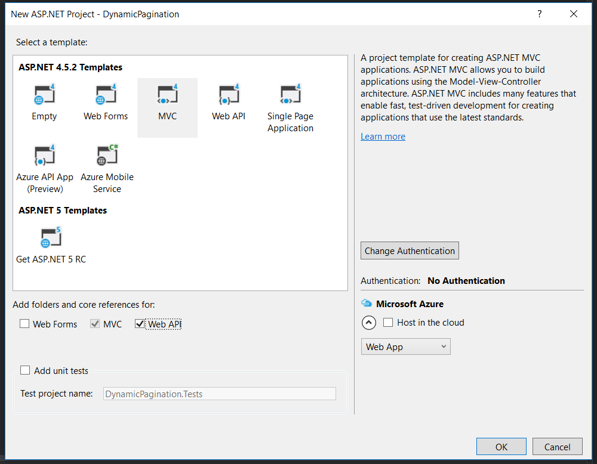

Pagination is a common feature of modern web pages. This component is designed to showcase related content across several pages. In this article, I'd like to demonstrate a bootstrap dynamic pagination example with Bootstrap 4 and ASP.NET. In these examples, we’ll build a process to generate as many page links as necessary, depending on our content.

For instance, if our database query returns 47 items, and we only want 10 items per page, our code should be able to figure out how many page links to put in the Bootstrap pagination, and how to connect them to the right page.

## When to Use Pagination

You'll want to consider whether pagination is right for your project or not. Pagination is often contrasted with infinite scrolling, where new content just appears once the user scrolls down to the bottom.

Infinite scrolling is great for scanning content quickly, like an image search result, or discovering something on a news feed that updates often.

Pagination is better when you want to come back to a specific point in a long list. Let's say that you’re on an infinite scroll site, then follow a link offsite. When you come back later, you'll have to start at the very top again and wait as you scroll and scroll again, trying to find your place.

Pagination fixes this, but at the cost of having to click more to get to other pages.

I like the way that [this article](https://uxplanet.org/ux-infinite-scrolling-vs-pagination-1030d29376f1) sums up the pros and cons of infinite scrolling vs. pagination:

> “In general, an infinite scroll works well for something like Twitter where users \[are\] consuming an endless stream of data generated in real time _without looking for anything in particular_, while \[a\] pagination interface is good for search results pages _where people are looking for a specific item and where the location of all the items the user has viewed matter._”

* * *

## Wait!

Before you dive in to the next section, where you'll be seeing a lot of code, I want to tell you about something that might make your day easier.

Sometimes it really helps to see code in context. Want to get the complete Visual Studio solution for every example in this post, and a whole lot more? You can get it, right now, in my book [_Bootstrap for .NET Devs_](https://sensibledev.com/recommends/bootstrap-for-dot-net-mvc-forms-1/). Check out the sample chapters instantly, for free.

\[maxbutton id="4" url="https://sensibledev.com/recommends/bootstrap-for-dot-net-mvc-forms-1/" \]

* * *

## Create a New Project

Let's begin by creating a new project in ASP.NET.

You can leave the authentication alone if you want. I'm going to change it to "No Authentication" because this is just a demo.

I'm going to check the "Web API" box because we'll be adding some asynchronous functionality later in the project.

### Updating Bootstrap 3 to Bootstrap 4

I want to use the latest version of Bootstrap for this tutorial, and, by default, Visual Studio's template has Bootstrap 3 in it.

You can follow a very detailed guide on how (and why) to set this up by reading my article about [Bootstrap 4 Forms and ASP.NET](https://sensibledev.com/mvc-bootstrap-form-example/). Here's the quick and dirty way to do it, though.

### Install Bootstrap 4

In the Package Manager Console, run this command to install Bootstrap 4:

Install-Package bootstrap

### Update Your Application's Layout Page

Head to _Views/Shared/\_Layout.cshtml_. Replace the div with the class of `navbar` with this markup:

<nav class="navbar navbar-expand-lg navbar-dark bg-dark">
    

        @Html.ActionLink("Application name", "Index", "Home", new { area = "" }, new { @class = "navbar-brand" })
        <button type="button" class="navbar-toggler" data-toggle="collapse" data-target=".navbar-collapse" aria-expanded="false" aria-label="Toggle navigation">
            
        </button>
        

            <ul class="nav navbar-nav mr-auto">
                <li class="nav-item">@Html.ActionLink("Home", "Index", "Home", null, new { @class = "nav-link" })</li>
                <li class="nav-item">@Html.ActionLink("About", "About", "Home", null, new { @class = "nav-link" })</li>
                <li class="nav-item">@Html.ActionLink("Contact", "Contact", "Home", null, new { @class = "nav-link" })</li>
            </ul>
        

    

</nav>

Add a `RenderSection` called "styles" in the head. This will let us define custom styles in our Razor views later.

<head>
    <meta charset="utf-8" />
    <meta name="viewport" content="width=device-width, initial-scale=1.0">
    <title>@ViewBag.Title - My ASP.NET Application</title>
    @Styles.Render("~/Content/css")
    @Scripts.Render("~/bundles/modernizr")
    @RenderSection("styles", required: false)
</head>

### Remove the Default CSS

In the Solution Explorer, open up _Content/Site.css_. Remove all of the styles there, as they're going to mess up the styling we'll do ourselves later. Just clear all of the CSS out.

Try building the application and running it locally.

If you get errors like this:

Then go to your _Scripts_ folder and find the `index.d.ts` file. Exclude it from your project.

Now try running your project again, and you ought to see a functional, if boring, homepage.

### Adding a Model and Scaffolding the Database

For this example, we'll pretend like we're creating an ecommerce store with products for sale. Let's create a model to represent these entities, and use Entity Framework to create a local database for us.

Add these two C# classes to the _Models_ folder.

_Product.cs_

public class Product
{
    public int ID { get; set; }
    public string Description { get; set; }
    public double Price { get; set; }
}

_ApplicationContext.cs_

public class ApplicationContext : DbContext
{
    public ApplicationContext() : base("name=default")
    {
    }
    public DbSet<Product> Products { get; set; }
}

Install the Entity Framework by running this in the Package Manager Console:

Install-Package EntityFramework

Add a connection string to _Web.config_. We'll use a default local database for our pagination example.

_Web.config_

<connectionStrings>
  <add name="default" connectionString="Server=(localdb)\\mssqllocaldb;Database=TestDb;Trusted\_Connection=True;ConnectRetryCount=0" providerName="System.Data.SqlClient" />
</connectionStrings>

Next, we need to enable migrations, which will let us use Code First Migrations to create and see our database. Run this in the Package Manager Console:

Enable-Migrations

Now, we could create our tables and add the data manually. But we'll choose to seed our Products table in our initial migrations. In _Migrations/Configuration.cs_, add this code to the `Seed` method:

protected override void Seed(DynamicPagination.Models.ApplicationContext context)
{
    //  This method will be called after migrating to the latest version.

    //  You can use the DbSet<T>.AddOrUpdate() helper extension method 
    //  to avoid creating duplicate seed data.

    context.Products.AddOrUpdate(x => x.ID,
        new Product() { ID = 1, Description = "Hammock", Price = 82.99 },
        new Product() { ID = 2, Description = "Lawn Mower", Price = 199.00 },
        new Product() { ID = 3, Description = "Bottle Opener", Price = 8.99 },
        new Product() { ID = 4, Description = "Bicycle", Price = 179.99 },
        new Product() { ID = 5, Description = "Fork", Price = 2.98 },
        new Product() { ID = 6, Description = "Sunglasses", Price = 14.99 },
        new Product() { ID = 7, Description = "Firecrackers", Price = 15.99 },
        new Product() { ID = 8, Description = "Bathtub Mat", Price = 12.99 },
        new Product() { ID = 9, Description = "Wastebasket", Price = 13.99 },
        new Product() { ID = 10, Description = "Robes", Price = 18.99 },
        new Product() { ID = 11, Description = "Bed Sheets", Price = 27.00 },
        new Product() { ID = 12, Description = "Mattress Topper", Price = 57.99 },
        new Product() { ID = 13, Description = "Indoor HDTV Antenna", Price = 38.98 },
        new Product() { ID = 14, Description = "Bluetooth Headphone Adapter", Price = 19.99 },
        new Product() { ID = 15, Description = "Shovel", Price = 34.32 },
        new Product() { ID = 16, Description = "Hand Mixer", Price = 129.89 },
        new Product() { ID = 17, Description = "LED Desk Lamp", Price = 29.99 },
        new Product() { ID = 18, Description = "Mechanical Pencils", Price = 5.26 }
    );
}

Finally, run the following two commands in the Package Manager Console to create our database:

Add-Migration initial
Update-Database

At last, we've created our database and set up Bootstrap 4. Now we're ready to build out our app.

## A Non-Paginated List

Let's start by making a list of our products, and not worry about paginating at first.

Right-click on the _Controllers_ folder and select _Add_ \-> _Controller.._. Select the `MVC 5 Controller with views, using Entity Framework` option.

Select the appropriate options for our `Product` model.

Next, head to the _Index.cshtml_ Razor view in the _Views/Products_ folder. We're not going to be working with a table in this case, so delete all of the markup and replace it with this:

@model IEnumerable<DynamicPagination.Models.Product>

@{
    ViewBag.Title = "Products";
}
@section Styles {
    
}

<h2>Index</h2>

    @foreach (var item in Model)
    {
        

            

                

                    <h5 class="card-title">@item.Description</h5>
                    
$@item.Price

                

            

        

    }

Instead of table rows, I've used the Bootstrap [Card components](http://getbootstrap.com/docs/4.1/components/card/) to display the products. I've also wrapped those cards in a flexbox container. Without going into too much detail, this will ensure that each row has four cards, regardless of the total number. I've also added a style to add extra space in the last row, in case we don't have enough cards to fill the entire row.

This isn't perfect. It's not responsive, for example. But it'll do for now.

Now that we have our card layout done, let's start making some adjustments to paginate our data. The first step is to filter the cards based on which page we've navigated to. Page one should show us the first eight items, for example, while page two will show us the next eight. We'll begin by filtering entirely server-side.

 

* * *

## Do More With Bootstrap and .NET

Enjoying the article so far? If you want even more expert knowledge about merging Bootstrap with .NET web development, [_Bootstrap for .NET Devs_](https://sensibledev.com/recommends/bootstrap-for-dot-net-mvc-forms-1/) has you covered.

\[maxbutton id="4" url="https://sensibledev.com/recommends/bootstrap-for-dot-net-mvc-forms-1/"  text="Give Me the eBook Now"\]

* * *

## Bootstrap Pagination Example in MVC

So let's think about how we need to do this. We'll need to allow the user to request a certain page of information, like if they want the third page of the products list. Let's set that as a route parameter in our `Index` action. We'll also give it a default value of one, so that the first page shows up if the request doesn't indicate a specific page.

public ActionResult Index(int page = 1)
{
    var products = db.Products;
    return View(products);
}

We'll also need to set the number of products per page. That's easy enough.

public ActionResult Index(int page = 1)
{
    int productsPerPage = 7;

    var products = db.Products;
    return View(products);
}

If we continued to build this out, it might be smart to put this in a separate class as a constant. It'll do for now.

Then, we'll want to grab all of our products, and filter them to only show the products on that page. Let's say that we want eight products per page. We can use the LINQ methods `Skip` and `Take` to get a partial result set. If we wanted page two, for example, that would mean skipping the first eight products, and then only getting the next eight products. We might implement that like this:

public ActionResult Index(int page = 1)
{
    int productsPerPage = 7;

    int start = (page - 1) \* productsPerPage;

    var products = db.Products;

    var paginatedProducts = products.OrderBy(p => p.ID).Skip(start).Take(productsPerPage);
    return View(paginatedProducts);
}

Great! The only thing missing is to figure out how many pages we have in total. This number will be used to generate the links in the pagination component. If there are three pages, we'll want three links.

You may think to just divide the number of products by the number of products per page. This works fine when there's no remainder.

ViewBag.PageCount = products.Count() / productsPerPage;
//18 / 6 = 3

But let's say that you wanted to have seven products per page, and had 18 total products.

7 / 18 = ~2.571

Our page count will evaluate to two (truncating the remainder) instead of three, like we want.

In order to get the true page count, we'll have to use `Math.Ceiling` to round up. Here's the final version of our controller method:

public ActionResult Index(int page = 1)
{
    int productsPerPage = 7;

    int start = (page - 1) \* productsPerPage;

    var products = db.Products;
    ViewBag.PageCount = Math.Ceiling(products.Count() / (double)productsPerPage);
    var paginatedProducts = products.OrderBy(p => p.ID).Skip(start).Take(productsPerPage);
    return View(paginatedProducts);
}

### Razor View

Now let's add the Bootstrap pagination component to our Razor template.

Add this below the grid of products:

<nav aria-label="Page navigation">
    <ul class="pagination">
        @for (int i = 1; i <= ViewBag.PageCount; i++)
        {
            <li class="page-item"><a class="page-link" href="@Url.Action("Index", new { page = i })">@i</a></li>
        }
    </ul>
</nav>

As you can see, we're looping through the number of pages in `ViewBag.PageCount`. This was determined in the controller. On each iteration through the loop, we're adding a link to the unordered list.

This link will have the text of the page number, and the href is set to the home page, but with a query string of the selected page. If the user clicks on `3`, for example, the browser will navigate to `/Home/Index?page=3`.

Our controller code will then filter the results like we've specified. Here's what clicking on page 2 looks like:

There's one thing missing from this that would make it even better. We want to show the user which page they're currently on. If you add the `active` class to the pagination list item, it'll be colored blue to indicate the current selection.

The amount of data we're passing to the view is becoming a little cumbersome with `ViewBag`, so let's create and use a ViewModel.

Add a folder to the project called _ViewModels_. Then, add a class to the folder and call it _ProductIndexView_.

_ProductIndexView.cs_

public class ProductIndexView
{
    public IEnumerable<Product> Products { get; set; }
    public int ProductsPerPage { get; set; }
    public int CurrentPage { get; set; }

    public int PageCount()
    {
        return Convert.ToInt32(Math.Ceiling(Products.Count() / (double)ProductsPerPage));
    }

    public IEnumerable<Product> PaginatedProducts()
    {
        int start = (CurrentPage - 1) \* ProductsPerPage;
        return Products.OrderBy(p => p.ID).Skip(start).Take(ProductsPerPage);
    }
}

In addition to storing our products in the ViewModel, we've added properties for the number of products per page and the current page. We've also moved the logic that used to be in the controller to the class.

Generally speaking, you want your controllers to be as "thin" as possible, and this is a good example of why. Our solution is now much cleaner, and all of the business logic is separated out. Now, when we're working in our controller, we just have to worry about what the request is and what type we're sending back.

With that in mind, let's change our controller code so that we instantiate a new `ProductIndexView` and set its initial values.

public ActionResult Index(int page = 1)
{
    ProductIndexView productView = new ProductIndexView();
    productView.ProductsPerPage = 7;
    productView.Products = db.Products;
    productView.CurrentPage = page;

    return View(productView);
}

Finally, we can change our View markup to use this ViewModel.

@model DynamicPagination.ViewModels.ProductIndexView

@{
    ViewBag.Title = "Products";
}
@section Styles {
    
}

<h2>Products</h2>

    @foreach (var item in Model.PaginatedProducts())
    {
        

            

                

                    <h5 class="card-title">@item.Description</h5>
                    
$@item.Price

                

            

        

    }

<nav aria-label="Page navigation">
    <ul class="pagination">
        @for (int i = 1; i <= Model.PageCount(); i++)
        {
            <li class="@(i == Model.CurrentPage ? "page-item active" : "page-item")">
                <a class="page-link" href="@Url.Action("Index", new { page = i })">@i</a>
            </li>
        }
    </ul>
</nav>

Take a look at the for loop. You'll notice that, inside the list item, we determine the class programmatically. (This is the ternary operator, if you're not familiar with the syntax.) If the current page is the same as the integer we're displaying, the class list will include `active`.

Now, run the project and you'll see that our current page highlighting is working as it should.

## Bootstrap Dynamic Pagination with Web Api

We could stop right here, but let's improve our project a little. As it is, we're still doing complete page refreshes every time we click on a new page of products.

Wouldn't it be neat if we could just update the grid asynchronously and avoid the refresh flash? Let's do that.

In the `Products` controller, add a method that is identical to the `Index` action, but name it `IndexAsync`.

public ActionResult IndexAsync(int page = 1)
{
    int productsPerPage = 7;

    int start = (page - 1) \* productsPerPage;

    var products = db.Products;
    ViewBag.PageCount = Math.Ceiling(products.Count() / (double)productsPerPage);
    var paginatedProducts = products.OrderBy(p => p.ID).Skip(start).Take(productsPerPage);
    return View(paginatedProducts);
}

Then, add a new View to the _Views/Products_ folder and call it `IndexAsync`. You can leave the default settings, as we'll be replacing all the markup with our own anyway.

Add the following markup to the Razor view. You'll notice that we've left the grid container empty for now. This is intentional, because we'll want to use Javascript in order to generate the grid instead of Razor.

@model DynamicPagination.ViewModels.ProductIndexView

@{
    ViewBag.Title = "Products";
}
@section Styles {
    
}

<h2>Index</h2>

<nav aria-label="Page navigation">
    <ul class="pagination">
        @for (int i = 1; i <= Model.PageCount(); i++)
        {
            <li class="page-item"><a class="page-link" data-page="@i" href="#">@i</a></li>
        }
    </ul>
</nav>

Let's think about what we want to do. Every time that a user clicks on one of the links in the pagination component, we want to delete the existing products and replace them with the new ones. Fair enough.

On the first load, we ought to take the server-side generated list of products from our model and send it to our Javascript for rendering. We're already getting the products in our controller, so we may as well use them. Otherwise, we'll be calling the database twice: once in the controller, then once again in the Javascript on the initial load.

We should only use AJAX on the subsequent page clicks. On that note, let's create a Web API to serve a JSON list of products.

Create a new folder in the project called _ApiControllers_. Right-click on it, and select _Add -> Controller…_ Then, choose the option labeled _Web API 2 Controller with actions, using Entity Framework_.

Click on _Add_, and make sure you select the _Product_ model class.

This will create a default Web API. We're really just concerned with the `GET` action here. Like the other controller action, we'll need to add the code to filter products by page number. In the _ApiControllers/ProductsControllers.cs_ file, change the `GetProducts` method to this:

// GET: api/Products
public IEnumerable<Product> GetProducts(int page = 1)
{
    ProductIndexView productView = new ProductIndexView();
    productView.ProductsPerPage = 7;
    productView.Products = db.Products;
    productView.CurrentPage = page;

    return productView.PaginatedProducts();
}

Now, when we request the endpoint, our server will return a list of the products on the specified page.

Let's head back to _Views/Products/IndexAsync.cshtml_ to finish our view.

Remember how we left our grid container empty? We'll need to fill it, somehow, with the product cards. Here, you have your choices. If you're familiar with a Javascript library for creating user interfaces, like React or Vue, you could certainly use either of those and be fine.

For this tutorial, I'm going to use [Mustache templating](http://mustache.github.io/), because it's extremely simple and easy to understand. Again, if you have experience with a different framework, feel free to use that. (I won't hold it against you.)

First, add this Mustache template to the grid container:

    

Then, add this bit of Javascript to the bottom of the Razor view:

@section Scripts {
    
    
}

There's quite a lot happening here, so let's dive in. The first thing to understand is that I'm creating a module by using the object literal pattern. You can learn more about the object literal pattern and modules by watching [this playlist](https://www.youtube.com/watch?v=HkFlM73G-hk&list=PLoYCgNOIyGABs-wDaaxChu82q_xQgUb4f). It comes from LearnCode.academy, one of the recommendations on my list of [the best YouTube programming channels](https://sensibledev.com/best-youtube-programming-channels/).

When we call the `init` function, we're going to pass in the list of product objects from our model. The `Html.Raw` and `Json.Encode` methods are there to correctly transform the C# objects into JSON.

In the `cacheDom` function, our code grabs all of the DOM elements that we'll be working with in the other methods, like the page links from the pagination component and the grid container.

Next, `bindEvents` specifies that, when we click one of the page links, that we'll call the  `handlePageLinkClick` function. That function will call our Web API endpoint, using the `data-page` attribute from the page link to determine the page number.

After the server responds with our data, we'll render it to the page with Mustache.

And that's it! Run the project and test it out.

## Bootstrap Dynamic Pagination with DataTables

Before we sign off, let's examine one more possibility. In our examples above, we've used Bootstrap cards. However, it very often happens that you want to paginate your _table_ data.

In that case, it may help to check out the DataTables jQuery plugin. Searching, result count, and pagination are included right out of the box, without much configuration on your part.

What's also cool is that you can [install DataTables](https://datatables.net/manual/installation) with a Bootstrap 4 option for the styles. You'll have to use [this selector screen](https://cdn.datatables.net/), which also has options for Bootstrap 3, Foundation, and a few others.

In the _Contollers/Products_ controller, add an action called _IndexDataTables_:

public ActionResult IndexDataTables()
{
    return View();
}

Next, let's change our Web API endpoint to return all of the products, not just some of them. In _ApiControllers/ProductsController_, change the `GetProducts` method to this:

public IQueryable<Product> GetProducts()
{
    return db.Products;
}

In the _Views/Products_ folder, add an empty Razor view with the name _IndexDataTables_. Copy and paste the following markup and Javascript code:

@{
    ViewBag.Title = "Products";
}
@section Styles {
    <link rel="stylesheet" href="https://cdn.datatables.net/1.10.18/css/dataTables.bootstrap4.min.css" />
}

<h2>Index</h2>

<table class="table" id="products">
    <thead>
        <tr>
            <th>Description</th>
            <th>Price</th>
        </tr>
    </thead>
</table>

@section Scripts {
    
    
    
}

As you can see, we've included the stylesheet and Javascript files from the DataTables CDN. For our table, we've only included the header row. DataTables will create the body rows from the data in our API.

In the Javascript code, all that we have to do is call the `DataTable` method on the products table and pass in our options. DataTables has a _lot_ of options that you can use to tweak the appearance and functionality. In our case, we've included the AJAX source, specified the columns, and modified the length menu to allow for displaying 5 items per page.

Here's what it looks like when we run the project:

Pretty slick!

## Bootstrap Dynamic Pagination Example: Conclusion

We've looked at a number of ways to use the Bootstrap pagination component. You can generate it completely server-side, or use it to pull AJAX content, either with your own code or with DataTables (if you're generating a table).

If you want to learn more about how to use Bootstrap 4 and ASP.NET, check out these other articles on the subject:

[MVC Bootstrap Form Example](https://sensibledev.com/mvc-bootstrap-form-example/)

[Bootstrap Modal with AJAX Content](https://sensibledev.com/bootstrap-modal-with-ajax-content/)

[How to Use Bootstrap Datepicker in MVC](https://sensibledev.com/how-to-use-bootstrap-datepicker-in-mvc/)
