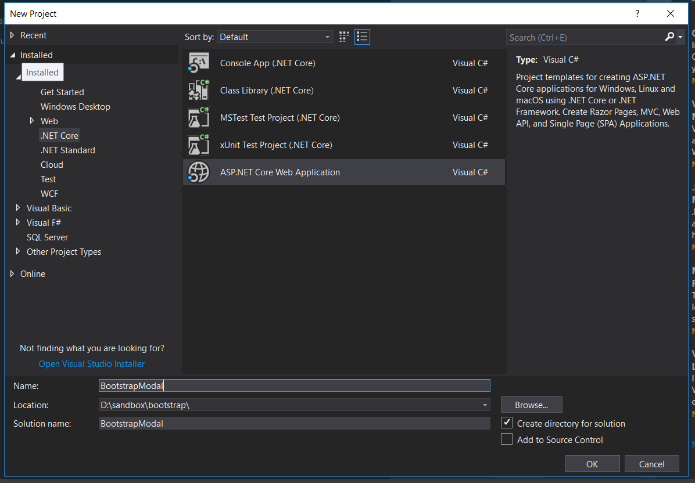
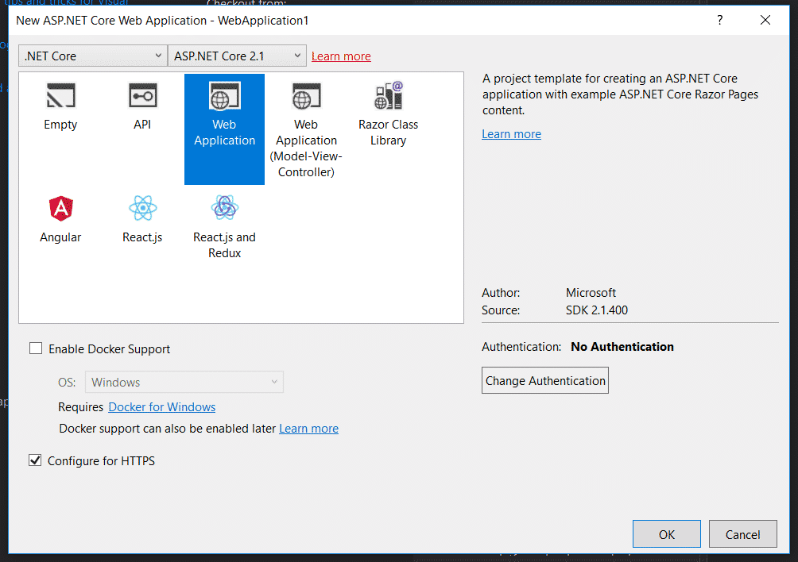
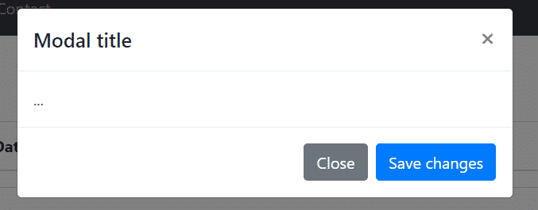
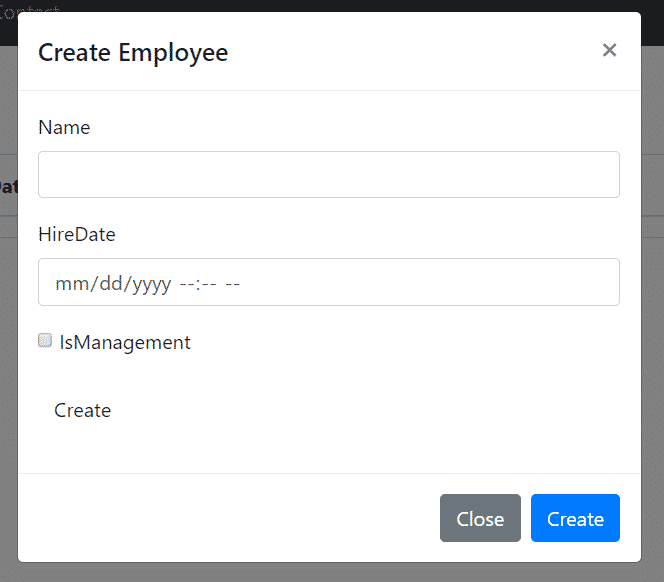
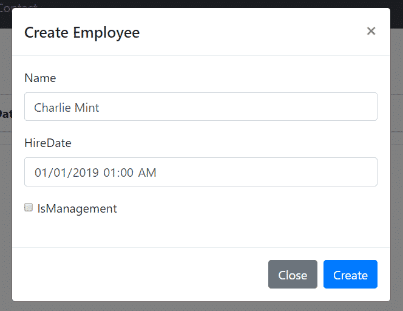
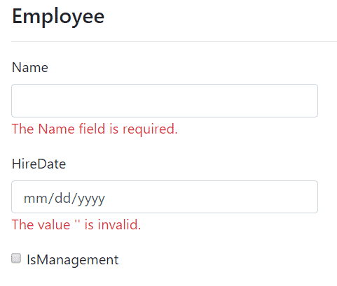
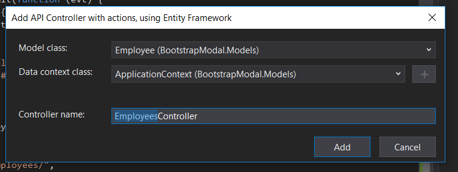
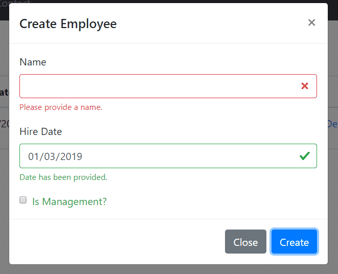

In the past, I've written extensively about [Bootstrap 4 forms](https://sensibledev.com/mvc-bootstrap-form-example/), as well as [Bootstrap 4 modal popups](https://sensibledev.com/bootstrap-modal-with-ajax-content/). Today, let's take a look at how to combine these two together with a Bootstrap modal form validation example. Since I work mostly in ASP.NET, I'm going to be using examples with that technology stack. However, you could certainly adapt this to whatever framework you might be using.

* * *

## Wait!

Before you dive in to the next section, where you'll be seeing a lot of code, I want to tell you about something that might make your day easier.

Sometimes it really helps to see code in context. Want to get the complete Visual Studio solution for every example in this post, and a whole lot more? You can get it, right now, in my book [_Bootstrap for .NET Devs_](https://sensibledev.com/recommends/bootstrap-for-dot-net-mvc-forms-1/). Check out the sample chapters instantly, for free.

\[maxbutton id="4" url="https://sensibledev.com/recommends/bootstrap-for-dot-net-mvc-forms-1/" \]

* * *

## Setting Up The Project

I'm using .NET Core in this example, but you can, of course, use the version of Visual Studio that you're used to.

If you're using a different technology stack, then set up a basic web app where you can accept a form submission.

Start by creating a new project. Name it `BootstrapModal`and create a Web Application with no authentication.

Next, let's make a model and database. We'll use the boring old Employee example. I know, I know, it's been done to death, but it works.

### Creating a Model and Scaffolding the Database

Create a folder called Models in the root of the project. Inside the folder, create a file called _Employee.cs_.

public class Employee
{
 public int ID { get; set; }
 public string Name { get; set; }
 public DateTime HireDate { get; set; }
 public bool IsManagement { get; set; }

}

Next, create a DbContext in the same folder called ApplicationContext.cs.

using Microsoft.EntityFrameworkCore;

public class ApplicationContext : DbContext

    {

       public ApplicationContext(DbContextOptions<ApplicationContext> options)

           : base(options)

       { }

       public DbSet<Employee> Employees { get; set; }

    }

Now pop into **appsettings.json**. We'll be providing a connection string to a test database. If you chose Individual Account authentication earlier, this part is probably already set up for you.

Add this ConnectionString section to the file:

{
  "ConnectionStrings": {
    "Default": "Server=(localdb)\\\\mssqllocaldb;Database=TestDb;Trusted\_Connection=True;ConnectRetryCount=0"
  },
  "Logging": {
    "LogLevel": {
      "Default": "Warning"
    }
  },
  "AllowedHosts": "\*"
}

In **Startup.cs**, you'll now want to add the `DbContext`with this line at the end of the `ConfigureServices` method:

services.AddDbContext<ApplicationContext>(options => options.UseSqlServer(Configuration.GetConnectionString("Default")));

Finally, we just need to use Entity Framework to scaffold our database. Enter following two commands into the package manager console:

Add-migration initial

Update-database

If all went well, you should now have a database with columns for your Employees.

Now, let's make some Razor pages to get some basic CRUD functionality in place.

Create a folder called _Employees_. Right-click it and select:

**Add -> Razor Page… -> Razor Pages Using Entity Framework (CRUD)**

After you scaffold the Razor pages, try to build the project. You'll get an error. This is because the current scaffolds don't properly generate markup for a boolean property in Razor Pages.

To fix it, go to each view affected, and find this line:

<input asp-for="Employee.IsManagement" /> @Html.DisplayNameFor(model => model.IsManagement))

Change the HTML helper to:

@Html.DisplayNameFor(model => model.Employee.IsManagement)

Now, when you debug, you ought to be fine.

## Updating to Bootstrap 4

You're going to want to upgrade from Bootstrap 3 to Bootstrap 4 at this point. The easiest way is to just head out to [the official site](https://getbootstrap.com/) and download the compiled Bootstrap 4 files.

Then, replace the Bootstrap CSS and Javascript files in _wwwroot/lib/bootstrap/dist_.

Update \_Layout.cshtml:

<nav class="navbar navbar-inverse navbar-fixed-top">
  

    

      <button type="button" class="navbar-toggle" data-toggle="collapse" data-target=".navbar-collapse">
        Toggle navigation
        
        
        
      </button>
        <a asp-page="/Index" class="navbar-brand">VetVisit</a>
    

    

      <ul class="nav navbar-nav">
        <li><a asp-page="/Index">Home</a></li>
        <li><a asp-page="/About">About</a></li>
        <li><a asp-page="/Contact">Contact</a></li>
      </ul>
    

  

</nav>

Clear out the styles in _wwwroot/css/site.css._ You won't need them, and they'll get in the way more than help you. Just delete all the styles in the file and breathe a sigh of relief.

## Creating a Bootstrap 4 Modal in ASP.NET

Head over to `https://localhost:YOURPORT/Employees`. You'll see an empty Index page.

Now, normally, when we click on "Create New," we'll be redirected to the Create page. Instead, we want this link to open up our modal.

Change the link to look like this:

<a asp-page="Create" data-toggle="modal" data-target="#exampleModal">Create New</a>

And add the following markup below the table:

  

    

      

        <h5 class="modal-title" id="exampleModalLabel">Modal title</h5>
        <button type="button" class="close" data-dismiss="modal" aria-label="Close">
        &times;
        </button>
      

      

        ...
      

      

        <button type="button" class="btn btn-secondary" data-dismiss="modal">Close</button>
        <button type="button" class="btn btn-primary">Save changes</button>
      

    

  

If you debug the project, you'll see that clicking on "Create New" will now open the modal.

So let's start to customize this a bit more. Change the \`h5\` with the title to reflect our entity:

<h5 class="modal-title" id="exampleModalLabel">Create Employee</h5>

Change the primary button to be a little bit more clear:

<button type="button" class="btn btn-primary">Create</button>

Next, we need to add our form. Go to _Create.cshtml_ copy the form. (Don't copy the entire Razor markup, obviously, just the form element.) Paste the form into the `modal-body` div.

You should see Intellisense go crazy at this point, and underline all of your form field properties in red. That's because the scaffolding named the IList of Employees the singular `Employee` (as much sense as that makes).

To fix this, head to _Index.cshtml.cs_. Change the name of the list to `Employees`. Then, add a property called Employee of the `Employee` class type. Your class should look like this:

public IList<Employee> Employees { get; set; }
public Employee Employee { get; set; }
public async Task OnGetAsync()
{
  Employees = await \_context.Employees.ToListAsync();
}

Finally, change the HTML helpers in your table to match the `Employees` list you just renamed. In other words, as an example, the first  `th` should look like this:

<th>
  @Html.DisplayNameFor(model => model.Employees\[0\].Name)
</th>

_Your form should look something like this._

Also, we need the validation scripts from the Create page in order to validate our fields before the form submission. Place this at the bottom of _Index.cshtml_:

@section Scripts {
  @{await Html.RenderPartialAsync("\_ValidationScriptsPartial");}
}

Okay, now we're getting somewhere!

### Fixing the Form

Of course, we still have a few issues to iron out. The styles are still in Bootstrap 3 styles instead of 4, so we'll need to fix that. There are now two submit buttons, so we'll need to get rid of one. The more important issue is that the form will try to POST to our Index method… which, of course, doesn't exist.

First, let's update a few things to be in line with Bootstrap 4.

Labels no longer need the \`control-label\` class, so you can get rid of the `class="control-label"` attributes.

The checkbox layout is completely different from what `asp-for` generates, so take out the form group with the checkbox and replace it with this:

  <input class="form-check-input" type="checkbox" name="IsManagement" id="IsManagement" />
  <label class="form-check-label" for="IsManagement">Is Management?</label>
  

We now should be good with the styling.

Next, we need to have the form POST to our Create method, at `/Employees/Create`.

If you were following the online .NET Core documentation at this point, you might have tried something like this:

<form method="post" asp-controller="Employees" asp-action="Create">

Instead of rendering a correct action route, however, this will create a Url with query string parameters that renders like this:

<form method="post" action="/Employees?action=Create&controller=Employees">

This obviously isn't what we want, and won't do anything but throw an error if we try posting.

The controller and action directives _would_ work, if you were using MVC controllers. If you're using Razor Pages, as we are in this tutorial, you'll need to use the Page directive instead, like this:

<form method="post" asp-page="/Employees/Create">

Now let's fix that double button. In order to preserve the Bootstrap modal structure, let's get rid of the first button, the one inside the form you copied from the Create Razor page. In fact, just get rid of the whole form group. The only buttons you should have are in the modal footer.

Now, just give the form an `id`:

<form id="createEmployee" method="post" asp-page="/Employees/Create">

Add a `form` attribute to the "Create" button and change the type to "submit."

<button type="submit" class="btn btn-primary" form="createEmployee">Create</button>

Now, try inputting some information into the modal and hitting submit.

You should see the page refresh, and a new row with your Employee's information. Awesome!

## Modal Form Validation with Data Annotations

On with the show.

If you're using .NET, the easiest way to perform validation is to simply add Data Annotations to your model.

Change the `Employee` class to the following. Notice how I've also added some annotations to the `HireDate` field in order to clean up the look of our date display.

public class Employee
{
  public int ID { get; set; }
  
  \[Required\]
  \[StringLength(100)\]
  public string Name { get; set; }
  
  \[Required\]
  \[DisplayFormat(DataFormatString = "{0:MM/dd/yyyy}")\]
  \[DataType(DataType.Date)\]
  public DateTime HireDate { get; set; }
  
  public bool IsManagement { get; set; }
}

This will make it so that both the Name and HireDate fields are required. We've also provided a format to the date, and specified it as a date instead of a date-time. (We really don't care about the _minute_ that an employee was hired.)

Let's try it out! Run the project, open the modal, and try to submit the form without any of the fields filled out.

Oops! While the form is certainly validating, we're being redirected to the Create page, and not our modal popup, when there are model errors. This makes sense, because this is how forms and validation are supposed to work normally.

So, instead, we need to submit the form values asynchronously to a Web API and validate from there.

## Creating a Web API

Create a new folder called **Controllers** in the root of your project. Right-click on it, and select:

**Add -> Controller… -> API Controller with actions, using Entity Framework**

Make sure you choose the correct `Employee` model class.

 

This will set up an API with reasonable default endpoints. The one we care about is the Post action, which we don't even have to mess with.

Head back to _Index.cshtml_. Change the opening `form` tag to just had the `id`, since we're going to be using jQuery to post the form from now on:

<form id="createEmployee">

Next, we need to add the necessary JavaScript to post the form. This needs to do a few things:

1. When the form is submitted, check if the form is valid.
2. If it is valid, create an Employee object literal.
3. Use jQuery's ajax function to post the data to our Web API endpoint.

Start by adding this code in the `Scripts` section:

$("#createEmployee").submit(function (evt) {
  if ($(this).valid()) {
  //post the form values to the server
});

This takes care of our first step. The `valid()` function plays nicely with our .NET setup, because the framework took our data annotations and put the appropriate validation attributes on the fields. (For example, our `name` input has the `required` attribute.)

Now, let's fill in the rest:

var employee = {
    Name: $("#Employee\_Name").val(),
    HireDate: $("#Employee\_HireDate").val(),
    IsManagement: $("#IsManagement").prop('checked')
  };
  
$.ajax({
  url: "/api/Employees/",
  type: "POST",
  data: JSON.stringify(employee),
  contentType: "application/json; charset=utf-8",
  dataType: "json",
  success: function (data) {
  
  },
  failure: function(data) {
  
  }
});

You may have thought to use jQuery's `$.post`method, which works fine with MVC 5. For some reason, in .NET Core you have to explicitly set the content-type to "application/json".

Once you have that all set up, try it out! You should see the form validate your input, then post to the server.

As a future extension, you should add some actions in the success and failure functions. You could close the modal, like this:

$("#exampleModal").modal("hide");

You could also set up some templating to update the Employees table in the view. This is beyond the scope of this article, of course, but would be a logical next step.

## Bootstrap Modal Form Validation Example

If you aren't using .NET, you can, of course, use a similar setup. Take the standard modal layout as above, but in the `modal-body` div, start with the following form:

<form id="createEmployee" class="needs-validation" novalidate>

</form>

The `novalidate` attribute will make it so that the browser validation styles won't override our Bootstrap styles.

Next, add the fields into the form:

  <label for="Name">Name</label>
  <input id="Name" name="Name" class="form-control" required />
  

    Name has been provided.
  

  

    Please provide a name.
  

  <label for="HireDate">Hire Date</label>
  <input id="HireDate" name="HireDate" type="date" class="form-control" required />
  

    Date has been provided.
  

  

    Please provide a hire date.
  

  <input class="form-check-input" type="checkbox" name="IsManagement" id="IsManagement" />
  <label class="form-check-label" for="IsManagement">Is Management?</label>

The `valid-feedback` and `invalid-feedback` divs will only show after the form is submitted, based on the validity of the input.

Lastly, you need to add the following Javascript into your Scripts section:

// Example starter JavaScript for disabling form submissions if there are invalid fields
(function () {
  'use strict';
  window.addEventListener('load', function () {
    // Fetch all the forms we want to apply custom Bootstrap validation styles to
    var forms = document.getElementsByClassName('needs-validation');
    // Loop over them and prevent submission
    var validation = Array.prototype.filter.call(forms, function (form) {
      form.addEventListener('submit', function (event) {
      if (form.checkValidity() === false) {
        event.preventDefault();
        event.stopPropagation();
    }
    
      form.classList.add('was-validated');
      }, false);
    });
  }, false);
})();

At last, try out the modal, and you should see something like this:

## Bootstrap Modal Form Validation Example: Conclusion

In this article, we've used .NET Core to create a model, database table, and API. We then created a modal popup using Bootstrap 4, as well as a form to go inside it. We can use .NET to automatically create validation attributes from our model. If you're not using ASP.NET, it's also easy enough to create the form yourself and add the appropriate feedback sections. Let me know if you have any questions. Happy coding!

* * *

Would you like to download a complete, working project with all the code mentioned in this post? Now you can! For only $5, you can support this site and get your work done faster.

[Download the Code](https://gum.co/IMmu)

Or, even better, you could grab a copy of _[Bootstrap for .NET Devs](https://sensibledev.com/bootstrap-for-dot-net-devs/),_ my ebook about incorporating Bootstrap with a .NET environment. You'll get access to complete code samples, not just for this post, but for a lot of other Bootstrap and .NET topics as well.

\[maxbutton id="4" url="https://sensibledev.com/recommends/bootstrap-for-dot-net-mvc-forms-1/" \]
