In a previous post, we looked at [how to create Bootstrap 4 forms in ASP.NET](https://sensibledev.com/mvc-bootstrap-form-example/). For this post, we're going to examine one of the many useful components in Bootstrap 4: the modal popup. It's pretty straightforward to create one, or to have the modal markup rendered from our Razor views. Loading dynamic content into a Bootstrap modal is a little bit trickier. In this article, we'll examine how to load a Bootstrap modal with AJAX content. We'll being using .NET Core and a Web API to serve our content. However, you could grab the AJAX content from any backend technology that you have access to.

For our examples, we'll pretend that we're maintaining an application about hiking trails in our area. We'll begin by creating a new ASP.NET Core project.

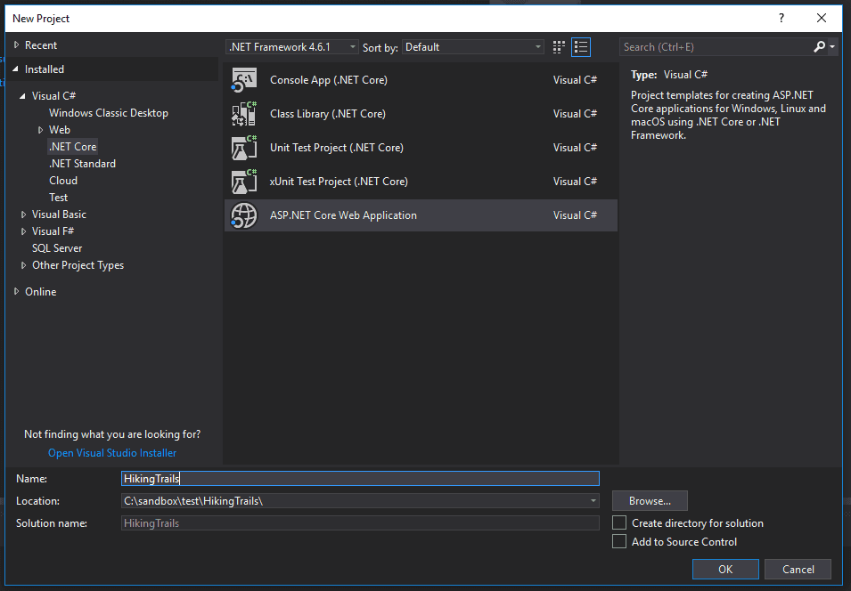

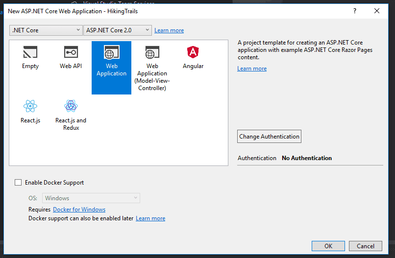

Next, we'll create a _Models_ folder in our project, and add the files for our database context and our `Trail` model. 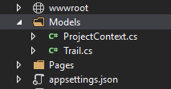

### ProjectContext.cs

public class ProjectContext : DbContext
{
  public ProjectContext(DbContextOptions<ProjectContext> options)
      : base(options)
  { }

  public DbSet<Trail> Trail { get; set; }
}

## Trail.cs

public class Trail
{
  public int ID { get; set; }
  public string Name { get; set; }
  public double Miles { get; set; }
  public string ImageUrl { get; set; }
}

We'll also need to add the DbContext to the `ConfigureServices` method in _Startup.cs_ so that we have a connection to our local database.

public void ConfigureServices(IServiceCollection services)
{
  services.AddMvc();

  var connection = @"Server=(localdb)\\mssqllocaldb;Database=TestDb;Trusted\_Connection=True;ConnectRetryCount=0";
  services.AddDbContext<ProjectContext>(options => options.UseSqlServer(connection));
}

Run the code-first migration commands in the package manager console. This will create our tables in the database.

add-migration initial
update-database

Finally, we'll create a nested _Trails_ folder inside the _Pages_ folder to house our CRUD pages. Right click on the _Trails_ folder, then select _Add -> Razor Page..._ and choose the option _Razor Pages using Entity Framework (CRUD)_. Select the appropriate model class and data context class. We're off!

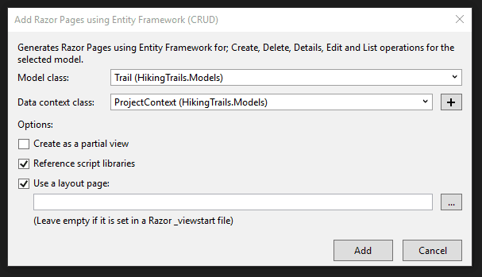

Since we're learning about Bootstrap modals, we'll obviously need to reference the Bootstrap stylesheet and Javascript files. Bootstrap 3 ships with Visual Studio projects, so we'll want to upgrade to version 4. When working with .NET Core, I find it easiest to update via Bower. I go into extensive detail on how to do this in [my previous post on Bootstrap](https://sensibledev.com/mvc-bootstrap-form-example/). That post also explains how to update the shared page layout to conform to Bootstrap 4 standards.

However, you could use whatever method of installation you want, or even stick with Bootstrap 3 if you wanted. (The structure and class names for the modals may be a little different.)

Once we have Bootstrap in our project, it's time to get some data into our database. You could open up SQL Server Management Studio and add the rows in the backend, or just run the project locally and use the CRUD forms. Either way, my database is going to have these rows:

\[table id=15 /\]

* * *

## Wait!

We're about to dive into setting up Bootstrap 4. Want to make your life a little easier?

Sometimes it helps to see code in context, with detailed explanations. You can get the upgrade instructions, and much more, right now in my work-in-progress book. It includes complete Visual Studio solutions in both MVC and .NET Core. Check out the sample chapters of [Bootstrap for .NET Devs](https://sensibledev.com/recommends/bootstrap-for-dot-net-datepicker-1/) instantly, for free. And, while it's still in beta, you can get it at a reduced price.

\[maxbutton id="4" url="https://sensibledev.com/recommends/bootstrap-for-dot-net-datepicker-1/" \]

* * *

## Adding a Basic Bootstrap 4 Modal

Before we get to the more complicated topic of loading content via AJAX, let's just start out with a basic Bootstrap modal. We'll make one without any substantial content to understand the structure and the function.

Go to your `Index` view for the Trails pages we just made. Replace the existing Razor syntax with this markup that includes a simple, barebones modal:

@page
@model HikingTrails.Pages.Trails.IndexModel

@{
    ViewData\["Title"\] = "Index";
}

<h2>Index</h2>

  <a asp-page="Create">Create New</a>

<table class="table">
  <thead>
    <tr>
        <th>
            @Html.DisplayNameFor(model => model.Trail\[0\].Name)
        </th>
        <th>
            @Html.DisplayNameFor(model => model.Trail\[0\].Miles)
        </th>
        <th>
            @Html.DisplayNameFor(model => model.Trail\[0\].ImageUrl)
        </th>
        <th></th>
    </tr>
  </thead>
  <tbody>
@foreach (var item in Model.Trail) {
    <tr>
      <td>
        @Html.DisplayFor(modelItem => item.Name)
      </td>
      <td>
        @Html.DisplayFor(modelItem => item.Miles)
      </td>
      <td>
        @Html.DisplayFor(modelItem => item.ImageUrl)
      </td>
      <td>
        <a href="#" data-toggle="modal" data-target="#trailModal">Modal</a>
      </td>
    </tr>
}
    </tbody>
</table>

<!-- Modal -->

  

    

      

        <h5 class="modal-title" id="trailModalLabel">Trail</h5>
        <button type="button" class="close" data-dismiss="modal" aria-label="Close">
          &times;
        </button>
      

      

        ...
      

      

        <button type="button" class="btn btn-secondary" data-dismiss="modal">Close</button>
      

    

  

Next, start running the project locally, and navigate out to your Trails Index view. It should be at `http://localhost:YOURPORT/Trails`. If you were following along and already input the same data that I did, you should have an index that looks something like this:

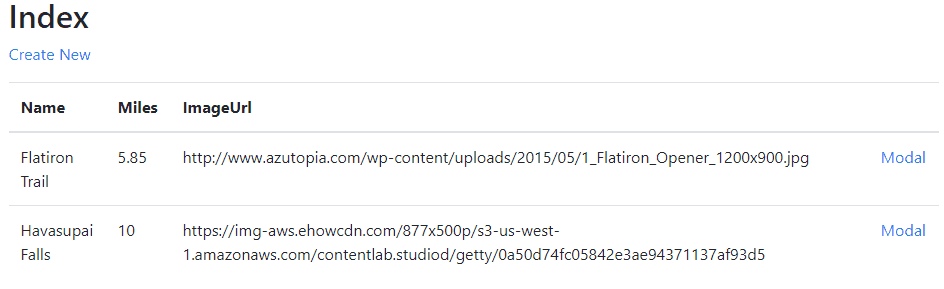

If you click on either of the "Modal" links, you'll activate the modal popup.

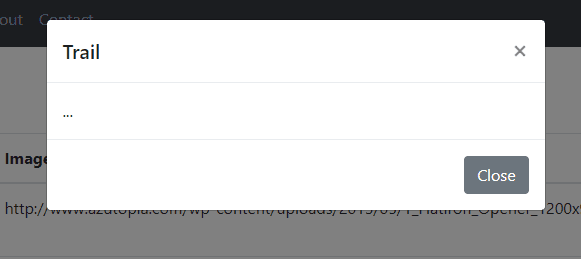

So what's happening? The Bootstrap Javascript finds any elements with the `data-toggle="modal"` and `data-target="#..."` attributes. This tells Bootstrap that clicking on the element will toggle the popup with the specified id. We could have also used a button for the toggle, or really any other element.

The `data-dismiss` attributes in the buttons on the modal perform a similar function, simply in reverse. Clicking on the close button or X button will close the modal popup instead of toggling it.

This is great so far, but it doesn't help us load the Bootstrap modal with AJAX content. First, let's create a very simple web API, so that we actually have an asynchronous source to pull data from.

## Creating a Web API to Serve AJAX Content

Start by making a new _Controllers_ folder in the root of your project.

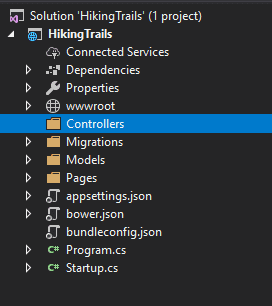

Right click, then choose _Add -> Controller..._ Then choose _API Controller with actions, using Entity Framework_.

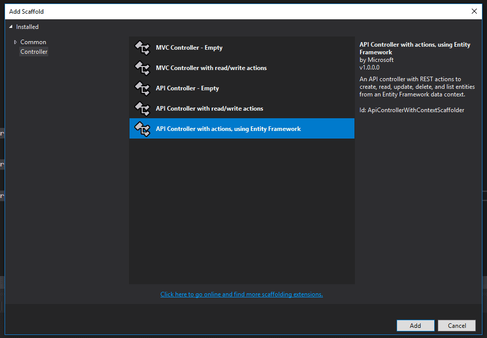

Finally, make sure you have the Trail model selected, and click _Add_ to make your API controller.

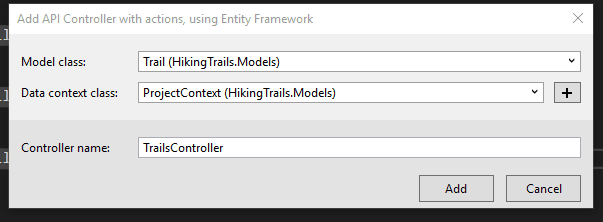

This will create a default RESTful API so that we can pull our Trail data asynchronously. There are some neat and advanced methods for testing out our API to make sure it's working. You could, for example, install and use [Postman](https://www.getpostman.com/). However, for some quick and dirty testing, just run your project, and navigate to `http://localhost:YOURPORT/api/Trails`. You should see a JSON representation of our trail data.

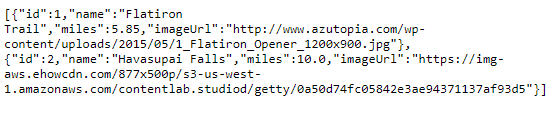

Great! This is exactly what we want. Now, let's go back to our Trail Index view, and change our modal code to use our AJAX data.

Before we do, though, I just wanted to acknowledge that Web APIs can be confusing. That's understandable! I know I felt confused after working with synchronous controllers for so long. Making the switch to a RESTful API was a real paradigm shift.

* * *

## Do More With Bootstrap and .NET

Enjoying the article so far? If you want even more expert knowledge about merging Bootstrap with .NET web development, [_Bootstrap for .NET Devs_](https://sensibledev.com/recommends/bootstrap-for-dot-net-mvc-forms-1/) has you covered.

\[maxbutton id="4" url="[https://sensibledev.com/recommends/bootstrap-for-dot-net-mvc-forms-1](https://sensibledev.com/recommends/bootstrap-for-dot-net-instant-access/)/"  text="Give Me the eBook Now"\]

* * *

## Bootstrap Modal with AJAX Content

First, we're going to take out the `data-toggle` and `data-target` attributes from the anchor tag. We don't want Bootstrap's JavaScript to fire the modal popup. Instead, we're going to write some custom scripting to pull in the AJAX data first, _before_ showing the modal. We'll also need a way to determine the ID of each trail, since our API is going to need that to find our data. We'll add a `data-id` attribute to the button for this purpose. Our final open button will look like this:

<a href="#" class="openModal" data-id="@item.ID">Modal</a>

And each row in the rendered table will have an anchor tag with the correct ID:

<a href="#" class="openModal" data-id="2">Modal</a>

We're also going to change our modal markup a bit. Since we want to populate our modal with data from our API, we'll need to create the HTML elements to house it after the AJAX call. Here's one way of doing it (note the changes in the div classed with `modal-body`):

<!-- Modal -->

  

    

      

        <h5 class="modal-title" id="trailModalLabel">Trail Details</h5>
        <button type="button" class="close" data-dismiss="modal" aria-label="Close">
          &times;
        </button>
      

      

        <h4 id="modalName" class="card-title" ></h4>
        
        

      

      

        <button type="button" class="btn btn-secondary" data-dismiss="modal">Close</button>
      

    

  

At the bottom of our view, if you've been following along, you'll need to put a Scripts section. This will make sure that our custom scripts will be rendered _after_ the references to the jQuery scripts. If your main layout has a different structure (like if you put the jQuery references in the head), you may not need this.

@section Scripts {
//our scripts will go here
}

Finally, here's our JavaScript code to call our API, grab the trail data, populate the modal, and then display it:

As mentioned, each button has a `data-id` attribute, which is where we get the ID of the trail. Using jQuery's `.get`, we'll grab the AJAX data from our API. Once that's done, we put the data into the appropriate places on the modal. Notice how we need to do different things based on the content, like setting the image `src` for the image and the text for textual information. Maybe your API will have data that needs to be manipulated in a different way. Last, we show the modal, and everything is right with the world.

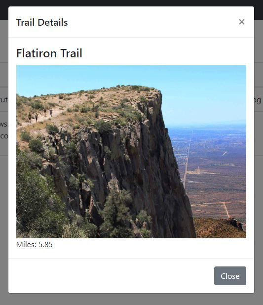

## Bootstrap Modal with Edit Capabilities

What if we wanted to go the extra mile here (pun somewhat intended), and let the user edit the trail right from the modal popup? Doing so is not too much of a stretch, actually. First, we'll adjust our popup to have fields, as well as a Save button.

<!-- Modal -->

  

    

      

        <h5 class="modal-title" id="trailModalLabel">Trail Details</h5>
        <button type="button" class="close" data-dismiss="modal" aria-label="Close">
            &times;
        </button>
      

      

        <input type="hidden" id="modalId" />
        

          <label for="modalName">Name</label>
          <input type="text" id="modalName" class="form-control" />
        

        

          
          <label for="modalImageUrl">Image Url</label>
          <input type="text" id="modalImageUrl" class="form-control" />
        

        

          <label for="modalMiles">Miles</label>
          <input type="text" id="modalMiles" class="form-control" />
        

      

      

        <button type="button" class="btn btn-primary" id="saveModal">Save</button>
        <button type="button" class="btn btn-secondary" data-dismiss="modal">Close</button>
      

    

  

Next, we'll add to our scripts an event handler for the click event on the Save button. Once the button is clicked, we'll send a PUT request to the API, and then dismiss the modal.

$('#saveModal').on('click', function () {
  var trailId = $('#modalId').val();

  var trail = {
    id: trailId,
    name: $('#modalName').val(),
    imageUrl: $('#modalImageUrl').val(),
    miles: $('#modalMiles').val()
  }

  console.log(trail);
  $.ajax({
    type: 'PUT',
    contentType: 'application/json; charset=utf-8',
    url: url + trailId,
    data: JSON.stringify(trail),
    success: function (data) {
        console.log(data);
    },
    error: function (xhr, textStatus, error) {
        var response = JSON.parse(xhr.responseText);
        console.log(response.message);
    }
  });

  //dismiss the modal
  $('#trailModal').modal('hide');
})

You could also extend the functionality by adding a Delete button and an appropriate script to handle a DELETE request. You would then have the problem of refreshing the data in the table, but now we're starting to go beyond the scope of this article. If you really wanted to go further and turn the page into a Single Page Application, that's when you'd want to start looking at a framework like [Vue](https://vuejs.org/), [React](https://reactjs.org/), or even [Riot](https://riot.js.org/) (if you wanted to go lightweight).

## Bootstrap Modal with AJAX Content

In this article, we looked at how to load and open our Bootstrap modals with AJAX content. The overall process is pretty simple. We perform our AJAX call, and then once the data is returned, we populate it appropriately in our modal HTML markup. Once that's done, we open the modal programmatically with the `$('#myModal').modal({ show: true })` code. I hope this has been helpful!
