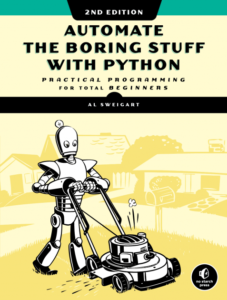
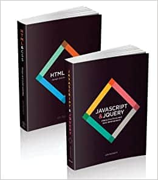
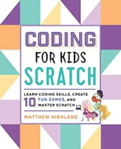

We all have to start somewhere with our coding, whether that's learning a new hobby, or trying to start a new career. While a ton of video resources are available online, there's still a certain advantage to having a book in front of you for reference, whether that's physical or in a window side-by-side your code editor. Let's take a look at a few of my picks for the best coding books for beginners.

## Best Coding Books for Beginners: Who this is For

This list is meant for those of you who are near the start of your coding journey. If you're looking for in-depth dives, this probably isn't the list for you.

When you're first starting out, you need resources that are accessible and encouraging. There should be a lot of reinforcement of concepts with practical, hands-on activities, and results that you can see early on. Many of the most advanced books get too heavy into theory or don't take your background knowledge into account. There might be an abundance of technical language that you just aren't ready for yet. Those books might be appropriate for you when you get to a later part of your journey, but not now.

A good beginner book will also get you to a place where you feel you can experiment on your own. A book shouldn't hold your hand to the point where you complete the exercises, then think, "what was it I was supposed to get from that?"

With that in mind, I'm going to suggest that you do one thing, no matter what book you're reading or what course you're taking. **Stop** after every chapter (or two). Take what you've read, and then code something, from scratch, that uses the same concepts, but is different from the examples in the book. What you're trying to do is to use the concepts in a new context, something very valuable for programming.

You'll undoubtedly run into problems. That's fine. Google your error message, go back through your code, see where you went wrong. It'll take some patience, and maybe some banging your head against the wall, but it's totally worth the effort to see your creations take life and actually _do something._

Let's move on, and take a look at what I think are some of the best coding books for beginners.

## Best Book to Get Started

### [Automate the Boring Stuff with Python](https://amzn.to/2WFTNye)

I feel like I can't recommend this book enough for beginning coders.

First of all, the organizing idea behind the book is in the title: automate the boring stuff. Take the everyday things you do anyway, and get your code to do them for you.

This is a fundamental driving force behind programming. You're not just making widgets as a software developer, you're trying to take a existing process and make it easier and/or faster. If you're not doing that, you're wasting your time. So this book reinforces the reason you would want to be coding anyway.

It also gives you immediate, practical feedback, something essential for reinforcing your learning. You'll complete tasks like:

- Automate downloading web pages and parsing them for information (called _web_ _scraping_), like downloading every image from a webcomic
- Organize the files on your computer, like finding date parts in filenames and re-formatting them
- Manipulate Excel spreadsheets so you don't have to read them
- Programmatically combine pages from many PDFs
- Schedule tasks on your PC and launch programs
- Send reminder emails
- Resize many images with one program

All of the examples are in **python**, one of the most beginner-friendly programming languages. And if you're never done any programming before, ever, the first six chapters run you through everything you need to know to get started. Of course, if you already know some of those concepts, you can just skip right to the Automating Tasks section.

## Best Book to Learn C#

### [C# Player's Guide](https://amzn.to/2RaG3Ir)

I'm primarily a .NET developer, so I work with C# nearly every day. A while back, I wrote [a post on the best book to learn C# for beginners](https://sensibledev.com/best-book-to-learn-csharp-for-beginners/), and chose [The C# Player's Guide](https://amzn.to/2RaG3Ir) as my number one pick. If you want a really in-depth look at why, go check out that post. But here's the summary:

Out of all the books I surveyed that taught C#, this book was the most geared towards the beginner. Its language is clear and the pacing is perfect for someone relatively new to coding. It doesn't introduce topics too quickly, but also doesn't give so many exercises and explanations that you feel overwhelmed.

The book doesn't get you bogged down in the frameworks, like ASP.NET Core. That's exactly what you want for a book about C# the language, instead of the most popular frameworks that use that language.

Programming concepts are explained with simple, effective metaphors, like this one: "A _variable_ is a place in memory where you can store information. It’s like a little box or bucket to put stuff in."

The tone is just formal enough to avoid "cuteness," but not so formal that it feels like a textbook.

Speaking of textbooks, most of the other books in this space are too technical for the beginner. While there are a ton of great guides out there, like [C# in Depth](https://amzn.to/2wKhmLC), these are better as reference manuals, or as books to read once you've gotten more experience.

Many people recommend the Head Start series of books, like [Head First C#.](https://amzn.to/2wOeWM1) However, I personally think the massive amount of annotations and scribbly drawings are too distracting. There are tons of people who love this style, but I'm not one of them.

## Best Book to Learn Web Design

### [Web Design with HTML, CSS, JavaScript and jQuery Set](https://amzn.to/33Z6rKf)

If you want to transition into web development, you'll need to learn HTML, CSS, and Javascript. My favorite book on the topic is actually a bundle of two books: [HTML & CSS: Design and Build Great Websites](https://amzn.to/2Upuyi2) and [JavaScript and JQuery: Interactive Front-End Web Development](https://amzn.to/3dymrrb).

Most of the time, you can get away with the e-version of a book. In fact, I'd wager that many books could be converted to markdown and not much would be lost.

Not so with these books. They are in full color, and beautifully designed. The layout isn't just for show, either. Each page looks like it was painstakingly labored over in order to present the information in the best possible light.

For example, when describing HTML tags for the first time, the book opts for a full-page blow-up of a paragraph element to leave room for annotations. The annotations and diagrams are the exact opposite of busy. There's an abundance of breathing room, so you're never confused. Examples are short and direct, with boxes explaining what you'll be typing, and what the web browser will generate (in the case of HTML and CSS).

These are two of the best visually designed coding books I've ever seen, and a set that you'll definitely want in physical form.

The first volume covers basic HTML structure and elements, all the way up to process and design considerations. Reviews praised this book for being an "excellent start" to learning HTML and CSS, as well as having a "colorful and detailed design" with no "junk" cluttering it up.

The second volume is similarly praised, with one reviewer calling it "by far the best visual learning experience" out of many JavaScript books. This one covers basic functions and decision-making through form validation.

The only criticisms of the books are that they do have some outdated information. You won't be needing the information on Flash videos, for instance, since Flash development has stopped and the technology will be disabled in Chrome starting later this year. Overall, though, this is a solid foundation for the basics.

## Best Coding Book for Kids

### [Coding for Kids: Scratch](https://amzn.to/2WTf7Ag)

Coding programs for kids are all the rage. We've seen the initiatives to get kids coding earlier, like the Hour of Code. Schools are pushing for coding curricula. And I've even seen toys, [like this](https://amzn.to/2wDkNE9), that are for _4 year olds_ and are supposed to teach coding skills. Looks like a plastic dog and little book to me, not that there's anything wrong with that.

Kids need to learn how to think logically, how to problem-solve, and how to apply algorithms. Coding _can_ do that. But I'm going to say something that's a little controversial:

**Kids do not _need_ to learn how to code.** A lot of kids aren't going to be coders, and that's fine. There are tons of other ways you can build up their logic skills if coding isn't there thing. How weird would it sound if I said that, because electricity is everywhere, that every child needs to learn basic electrician skills? There's tons of problem-solving in electrical projects (not that you'd want a six-year-old installing your power lines). Or what if the argument was, since food consumption is a daily necessity, every child needs to have extensive cooking curricula in schools?

You're not a bad parent if you don't teach your kids to code. Teach them _read_, to _ask questions_, and follow through on their curiosity.

But if you want to try coding with your kids, I would really recommend [Scratch](https://scratch.mit.edu/), a free visual programming language designed specifically for younger coders. You create programs by moving literal blocks around on the screen, and create cute games or animations.

With that in mind, my favorite book for learning Scratch is [Coding for Kids: Scratch](https://amzn.to/2WTf7Ag). The book walks you through the basics of the language, and contains 10 games for you and your kid to work through. Each one introduces increasingly-complicated concepts at a reasonable rate.

Kids 6-8 can probably use the book _with your help_. In fact, reviews of the books recommend going through it and doing the exercises yourself before helping your child at that age. I wouldn't expect a child to be able to use this by themselves until at least 9 or 10.

## Coding Books for Beginners: Conclusion

These are just some of the books you could use to start your coding journey. (Or someone else's!) While there are a ton of video resources out there, some of us really benefit from having a physical copy of the learning material in our hands as we work on the screen. If you're interested in other educational resources, I've put together a special report on learning web development called [The Ultimate Guide to Learning ASP.NET Web Development](https://sensibledev.com/ultimate-guide-to-learning-asp-net-web-development/).

Happy Coding!
