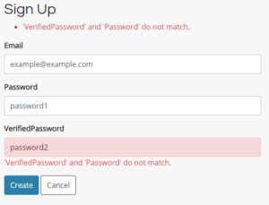
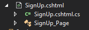
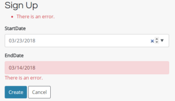
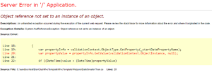
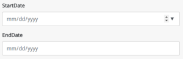
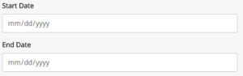
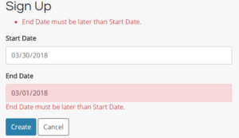

When we're building forms into our web applications, it's essential to validate our users' data. Sometimes it's bad, sometimes it's nonsensical, and other times the user data is even malicious. Every version of .NET has its own way of validating user data. One of the ways to validate that's a little less common is the CompareValidator. We'll go over different ways to use this in the different .NET ecosystems, starting with WebForms and moving to how to implement the Compare Validator in MVC.

## CompareValidator in WebForms

You may be thinking: why are we starting with WebForms? Isn't that a dead technology?

Well, for one, you may encounter a legacy project with this kind of validator in it. I also think it's educational to see the evolution of a technology. We'll see what the built-in controls do in WebForms, and then see what we gain (and lose) by switching over to .NET MVC and .NET Core.

So what is a CompareValidator? CompareValidator is a user control that will evaluate one input against another, comparing them to make sure they have the relationship you want.

Let's look at an example. Pretend you have two dates on in a form, a Start Date and an End Date. You want to make sure that the Start Date comes before the End Date, so you add this to the page:

<asp:TextBox runat="server" ID="txtStartDate"></asp:TextBox>
<asp:TextBox runat="server" ID="txtEndDate"></asp:TextBox>

<asp:CompareValidator 
    runat="server"
    ControlToCompare="txtStartDate"
    ControlToValidate="txtEndDate"
    Display="Dynamic"
    EnableClientScript="true"
    Type="Date"
    SetFocusOnError="true"
    Operator="GreaterThan"
    Text="Start Date must be earlier than End Date.">
</asp:CompareValidator>

If you try to submit the form and the value in `txtEndDate` is not greater than the value in `txtStartDate`, the form won't submit and the error text will display.

The CompareValidator actually has a lot of really varied functionality. The `Operator` parameter lets you define how to compare the two form fields. You have these options for the `Operator`:

- Equal
- NotEqual
- GreaterThan
- GreaterThanEqual
- LessThan
- LessThanEqual
- DataTypeCheck

You can imagine the uses for this. You could make sure that the integer in one field is smaller than the integer of another, like if you were setting a Min/Max range. You could ensure that two fields were the same, like if a user was required to verify a bank routing number by typing it twice.

Of course, for new projects, WebForms has been all but abandoned, and, frankly, for good reason. While it's possible to implement modern MVC patterns in WebForms, it often feels like trying to fit a round peg in a square hole. It's too easy to have really tight coupling in WebForms between the front and back end, and it feels this way by design. Whenever I have to dive into an older project, I'm constantly fighting my spaghetti code, whereas I don't feel nearly as much that way with MVC. If you're stuck using WebForms, I'd recommend [checking out a Pluralsight subscription](https://sensibledev.com/recommends/pluralsight-free-trial/ "Pluralsight Free Trial") (affiliate link). Pluralsight has the biggest catalog of quality ASP.NET content that I've seen, and you'll be able to move forward with your web development skills.

\[maxbutton id="1" \]

For now, let's look at how to implement CompareValidator in MVC.

## Compare Validator in MVC

We'll pretend we have a login page where the user types their password twice to verify it. We don't have a CompareValidator control to put in the form. Controls don't exist in MVC, and validation doesn't work that way in MVC anyway. Instead, we create models to represent the data and add DataAnnotations to indicate how the model should be validated. Here's our model, in a file called _SignUp.cs_, which also includes a field for the user to enter an email:

public class SignUp
{
  public string Email { get; set; }
  public string Password { get; set; }
  public string VerifiedPassword { get; set; }
}

This model will represent the data submitted in the form. Now, in order to validate whether the `VerifiedPassword` is the same as the `Password` , we need to add the Compare DataAnnotation, like this:

using System.ComponentModel.DataAnnotations;

namespace Project.Models
{
    public class SignUp
    {
        public string Email { get; set; }

        public string Password { get; set; }

        \[Compare("Password")\]
        public string VerifiedPassword { get; set; }
    }
}

Pretty straightforward, right? The DataAnnoation `[Compare("Password")]` will compare `VerifiedPassword` to `Password`.

There's nothing left to do in the model. Now let's take a look at the view and the controller. If you create the Controller and Views using the built-in Visual Studio scaffolding, you'll get something very similar to the code below. Since the scaffolding only creates CRUD views, I took the scaffolded code and adapted it to our example. Here's the View markup:

@model Project.Models.SignUp
@{
  ViewBag.Title = "Sign Up";
}

<h2>Sign Up</h2>

@using (Html.BeginForm())
{
  @Html.AntiForgeryToken()
  @Html.ValidationSummary(false, "", new { @class = "text-danger" })

  

    @Html.LabelFor(model => model.Email, new { @class = "font-weight-bold d-block" })
    @Html.EditorFor(model => model.Email, new { htmlAttributes = new { @class = "form-control col-md-6" } })
    @Html.ValidationMessageFor(model => model.Email, "", new { @class = "text-danger" })
  

  

    @Html.LabelFor(model => model.Password, new { @class = "font-weight-bold d-block" })
    @Html.EditorFor(model => model.Password, new { htmlAttributes = new { @class = "form-control col-md-6" } })
    @Html.ValidationMessageFor(model => model.Password, "", new { @class = "text-danger" })
  

  

    @Html.LabelFor(model => model.VerifiedPassword, new { @class = "font-weight-bold d-block" })
    @Html.EditorFor(model => model.VerifiedPassword, new { htmlAttributes = new { @class = "form-control col-md-6" } })
    @Html.ValidationMessageFor(model => model.VerifiedPassword, "", new { @class = "text-danger" })
  

  <input type="submit" value="Create" class="btn btn-primary" />
  <a href="@Url.Action("Index")" class="btn btn-outline-dark">Cancel</a>

}

@Scripts.Render("~/bundles/jquery")
@Scripts.Render("~/bundles/jqueryval")

In terms of validation, here are the important things to notice. The `Html.ValidationSummary` helper will create a list of all the form errors, if there are any.  `Html.ValidationMessageFor` renders an appropriate message beneath the form field if the error applies to that field. Also notice the script bundle  `@Scripts.Render("~/bundles/jqueryval")`, which will render the JavaScript code that will validate the fields on the client.

None of our validation rules are defined here, in the view. They all exist on the model in the form of DataAnnotations. This is a great advantage, because when we're working with the view, we're only concerned with how the form displays. We can change the validation rules and not have to touch the view whatsoever. `Html.ValidationMessageFor` will display any errors that apply to that form field, regardless of what kind of error it is.

The controller code is a little less interesting, but necessary nonetheless. Here it is:

public class SignUpController : Controller
{
  // GET: SignUp
  public ActionResult SignUp()
  {
      return View();
  }
  // POST: Signup
  \[HttpPost\]
  \[ValidateAntiForgeryToken\]
  public ActionResult SignUp(\[Bind(Include = "Email,Password,VerifiedPassword")\] SignUp signUp)
  {
    if (ModelState.IsValid)
    {
      //sign up logic goes here

      return RedirectToAction("Index");
    }

    return View(signUp);
  }
}

When we post the form, we check the `ModelState` to see if there are any errors, as defined by the rules in the DataAnnotations. If there are no errors, we sign the user up, and redirect to the homepage. Otherwise, we re-render the view and allow the user to correct the errors.

We included the jQuery Unobtrusive Validation in the View with the markup `@Scripts.Render("~/bundles/jqueryval")`. If our users haven't disabled JavaScript, this will validate the form client-side, so, most of the time, we won't even get to the server-side code if there's a form error. However, as we know, it's best to validate client _and_ server-side, so that's what we're doing here.

The really neat thing about MVC is that we defined our validation rules once, on the model, but the client-side and server-side can both access those rules. We don't have to maintain two different sets of rules.

In any case, let's see what happens when we try to submit two passwords that are different on our form:

There are actually a lot of neat things happening here. MVC has default error messages that will display based on your DataAnnotation validation rules. If you have the client-side validation enabled, it'll dynamically check the inputs as you change the text, so the error message will disappear once you correct them.

You can also change the error message by adding the `ErrorMessage`property to the DataAnnotation in the model, like this:

`[Compare("Password", ErrorMessage = "Both passwords need to be the same.")]`

## Compare Validator in ASP.NET Core Razor Pages

As a point of comparison, let's look at the same view and controller code (now called a page model) in [Razor Pages](https://docs.microsoft.com/en-us/aspnet/core/mvc/razor-pages/?tabs=visual-studio), the newest way of making web apps in .NET Core. Here's the code for the Razor view:

@page
@model Project.Pages.SignUpModel
@{
  ViewData\["Title"\] = "Sign Up";
}

<h2>Sign Up</h2>

  

    <form method="post">
      

      

        <label asp-for="SignUp.Email" class="control-label"></label>
        <input asp-for="SignUp.Email" class="form-control" />
        
      

      

        <label asp-for="SignUp.Password" class="control-label"></label>
        <input asp-for="SignUp.Password" class="form-control" />
        
      

      

        <label asp-for="SignUp.VerifiedPassword" class="control-label"></label>
        <input asp-for="SignUp.VerifiedPassword" class="form-control" />
        
      

      

        <input type="submit" value="Sign Up" class="btn btn-default" />
      

    </form>
  

  <a asp-page="Index">Back to List</a>

@section Scripts {
  @{await Html.RenderPartialAsync("\_ValidationScriptsPartial");}
}

.NET Core introduces [Tag Helpers](https://docs.microsoft.com/en-us/aspnet/core/mvc/views/tag-helpers/intro) instead of the HTML Helpers in MVC. However, the basic parts are still here: a validation summary, and validation messages underneath the form inputs.

Even more of a departure is the introduction of the PageModel, which (to be frank), reminders me a bit of the code-behind files from WebForms. Instead of being in a separate _Controllers_ folder, the PageModel lives "attached" to the view file:

Here's the relevant PageModel code for our example:

using System.Threading.Tasks;
using Dropdownlist.Models;
using Microsoft.AspNetCore.Mvc;
using Microsoft.AspNetCore.Mvc.RazorPages;

namespace Project.Pages
{
  public class SignUpModel : PageModel
  {
    public void OnGet()
    {

    }

    \[BindProperty\]
    public SignUp SignUp { get; set; }

    public async Task<IActionResult> OnPostAsync()
    {
      if (!ModelState.IsValid)
      {
          return Page();
      }

      //sign the user up

      return RedirectToPage("./Index");
    }
  }
}

Though the syntax is different, the code does the same thing as in the MVC Controller. After POSTing the form, we check to make sure that the `ModelState` is valid. If it is, we sign the user up, and then redirect. If not, we re-display the form with an error message.

## Limitations of the Compare DataAnnotation

If you think back to the CompareValidator in WebForms, we had many different ways to compare two fields, like GreaterThan or LessThan.

The Compare DataAnnotation has none of these. Its only function is to see whether two fields are equal. That's it.

Bummer.

But we're not stuck. We're going to write our own custom Validation Attribute.

## Custom Validation in MVC

Let's pretend we have the same StartDate / EndDate requirement at the beginning of this article. We want to make sure that the EndDate is later than the StartDate. So, let's write a custom validation that checks if one date is greater than another, and we'll call it DateGreaterThan.

We begin by creating a class that inherits from the `ValidationAttribute` class.

public class DateGreaterThan : ValidationAttribute
{
}

We then need to override the `IsValid` method, which will determine, like the name indicates, whether the validation passed or not. The bare minimum we need to make this work looks like this:

protected override ValidationResult IsValid(object value, ValidationContext validationContext)
{
  bool someCondition = true;

  if(someCondition)
  {
    return ValidationResult.Success;
  }
  else
  {
    return new ValidationResult("There is an error.");
  }
}

If the validation passes, we need to return  `ValidationResult.Success`. If it doesn't, we return a new `ValidationResult` and we pass in the error message via the constructor.

Obviously we need to code a bit more for our attribute to work. We need the EndDate, and that's just the value object passed into the `IsValid` method as the first parameter. To get the StartDate, we'll have the user pass in the property name, and use that property name to grab the actual value of StartDate.

Once we have those two values, all we have to do is cast those objects to `DateTime`s and compare them.

public class DateGreaterThan : ValidationAttribute
{
  private string \_startDatePropertyName;
  public DateGreaterThan(string startDatePropertyName)
  {
    \_startDatePropertyName = startDatePropertyName;
  }

  protected override ValidationResult IsValid(object value, ValidationContext validationContext)
  {
    var propertyInfo = validationContext.ObjectType.GetProperty(\_startDatePropertyName);
    var propertyValue = propertyInfo.GetValue(validationContext.ObjectInstance, null);

    if ((DateTime)value > (DateTime)propertyValue)
    {
      return ValidationResult.Success;
    }
    else
    {
      return new ValidationResult("There is an error.");
    }
  }
}

Then, over in the model, we put the DateGreaterThan attribute on the EndDate. Notice also the DataType annotation. Setting this to Date will set the type attribute on the HTML input to type="date" so that our form will display correctly.

public class DateRange
{
  \[DataType(DataType.Date)\]
  public DateTime StartDate { get; set; }

  \[DataType(DataType.Date)\]
  \[DateGreaterThan("StartDate")\]
  public DateTime EndDate { get; set; }
}

 

And it works!

## Improving the Custom Validation Attribute

Let's improve this a little. What happens if a developer mistypes the name of the property?

\[DataType(DataType.Date)\]
\[DateGreaterThan("StartDate!!!!MonkeyMonkey")\]
public DateTime EndDate { get; set; }

Grr.

So let's add a null check to our `IsValid` method:

var propertyInfo = validationContext.ObjectType.GetProperty(\_startDatePropertyName);

if (propertyInfo == null)
{
  return new ValidationResult(string.Format("Unknown property {0}", \_startDatePropertyName));
}

var propertyValue = propertyInfo.GetValue(validationContext.ObjectInstance, null);

Great! Now, what about that ugly error message, "There is an error." Let's make that better.

It would be nice if we could make the error message more specific, and tell the user which fields are actually the problem, something like "The End Date should be later than the Start Date."

To do this, we'll need to add another data annotation to our properties: DisplayName. Add this to your properties:

\[Display(Name = "Start Date")\]
public DateTime StartDate { get; set; }

The DisplayName attribute will do a number of things. The most obvious is that, when you use `Html.LabelFor` in the view, the label text will equal the DisplayName instead of the property name. In other words, instead of seeing this on the page:

We'll see this:

This is much more readable for the user. In addition, we can now use the DisplayName in our custom validation class to create a better-looking error message.

Getting the DisplayName for the EndDate is simple: we just need to access  `valiationContext.DisplayName`. As the name implies, this is the DisplayName of the property being validated.

To get the DisplayName for the StartDate, we need to do a little more work, involving reflection. Here's the code for that process:

var startDateDisplayName = propertyInfo
  .GetCustomAttributes(typeof(DisplayAttribute), true)
  .Cast<DisplayAttribute>()
  .Single()
  .Name;

Putting that all together, we get this for our final custom validator class:

public class DateGreaterThan : ValidationAttribute
{
  private string \_startDatePropertyName;
  public DateGreaterThan(string startDatePropertyName)
  {
    \_startDatePropertyName = startDatePropertyName;
  }

  protected override ValidationResult IsValid(object value, ValidationContext validationContext)
  {
    var propertyInfo = validationContext.ObjectType.GetProperty(\_startDatePropertyName);

    if (propertyInfo == null)
    {
        return new ValidationResult(string.Format("Unknown property {0}", \_startDatePropertyName));
    }

    var propertyValue = propertyInfo.GetValue(validationContext.ObjectInstance, null);

    if ((DateTime)value > (DateTime)propertyValue)
    {
        return ValidationResult.Success;
    }
    else
    {
        var startDateDisplayName = propertyInfo
            .GetCustomAttributes(typeof(DisplayAttribute), true)
            .Cast<DisplayAttribute>()
            .Single()
            .Name;

        return new ValidationResult(validationContext.DisplayName + " must be later than " + startDateDisplayName + ".");
    }
  }
}

Finally, we put the custom validator into our model:

public class DateRange
{
  \[DataType(DataType.Date)\]
  \[Display(Name = "Start Date")\]
  public DateTime StartDate { get; set; }

  \[DataType(DataType.Date)\]
  \[DateGreaterThan("StartDate")\]
  \[Display(Name = "End Date")\]
  public DateTime EndDate { get; set; }
}

Now, when we put some incorrect dates into our form, we get this:

Sweet! It worked. Man, though, that was a lot of work. If you want to add more functionality, like LessThan or NotEqual, you're going to have to write more custom validators, which is going to (probably) induce a lot of headaches.

If your models require a lot of custom validation, I would recommend checking out a useful library that'll do the work for you.

## FluentValidation and ASP.NET

[FluentValidation](https://github.com/JeremySkinner/FluentValidation) is a library that lets you define lambda expressions for building validation rules. This makes it really easy to replicate the functionality of the old CompareValidator in MVC, as well as a number of other ways to validate models, such as:

- NotNull
- NotEqual
- MaxLength
- LessThan
- LessThanOrEqual
- Email
- Credit Card

Start by installing the library via Nuget. Simply follow the instructions [here](https://github.com/JeremySkinner/FluentValidation).

Then, either set up the provider in _Application\_Start_ (MVC 5) or configure the service in _StartUp.cs_ (.NET Core). You can find the directions here:

[FluentValidation ASP.NET MVC 5 Integration](https://github.com/JeremySkinner/FluentValidation/wiki/h.-ASP.NET-MVC-5-integration)

[FluentValidation ASP.NET Core Integration](https://github.com/JeremySkinner/FluentValidation/wiki/i.-ASP.NET-Core-integration)

The only thing left to do is to change our `DateRange` class:

\[Validator(typeof(DateRangeValidator))\]
public class DateRange
{
  \[DataType(DataType.Date)\]
  \[Display(Name = "Start Date")\]
  public DateTime StartDate { get; set; }

  \[DataType(DataType.Date)\]
  \[Display(Name = "End Date")\]
  public DateTime EndDate { get; set; }
}

public class DateRangeValidator : AbstractValidator<DateRange>
{
  public DateRangeValidator()
  {
    RuleFor(x => x.EndDate).GreaterThan(x => x.StartDate);
  }
}

Much simpler, and much more readable. There's also no need to change anything in your controllers, as these new rules will just be checked in `ModelState.IsValid`.

## Compare Validator in MVC: Summary

As we've seen, when we upgrade from older technologies to newer ones, sometimes we lose functionality to get other advantages. While, on the whole, MVC is much better than WebForms, there are times when it seems like we have to work harder than we need to just to get the same behavior out of our web apps. Hopefully this tutorial has aided you in migrating to MVC, and understanding the options for custom validation.

If you liked this article, I'd really recommending furthering your knowledge by checking out the Pluralsight course "[Best Practices in ASP.NET: Entities, Validation, and View Models](https://sensibledev.com/recommends/pluralsight-best-practices-in-asp-net-entities-validation-and-view-models/ "Pluralsight - Best Practices in ASP.NET: Entities, Validation, and View Models")" (affiliate link). There's a great section on model validation that builds on what we've discussed here. Once you're done with that, there's an awesome selection of ASP.NET web development courses to keep your technical skills up-to-date.

\[maxbutton id="1" \]
