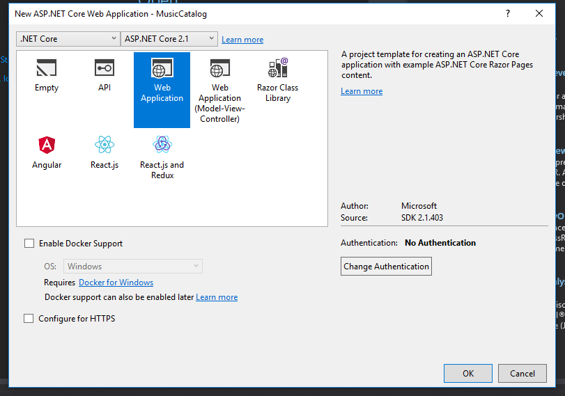

Most of the beginning MVC and .NET Core tutorials will focus on your tables as entities. This is great, and should be the foundation of learning ASP.NET. However, a common question often comes up once developers start making real-world applications: How can I display data from multiple tables in a single MVC view?

In this article we'll look at a scenario where you might have this problem, and learn the solution. The short answer is that you want to use a **view model**, which we'll discuss in a moment.

Let's pretend that you're creating a music catalog app. A common requirement for such a site would be to store information about the musical artist, as well as the songs available by that artist.

We'll begin by creating an MVC 5 app, and talk about how we might implement this. Then we'll go over an equivalent solution in ASP.NET Core.

## Setting up Your MVC 5 Project

Open up Visual Studio, and create a new project. Since this is just a demonstration, you don't need to bother with setting up any authentication.

Next, create a few model classes in the _Models_ folder. We'll also create a DbContext to interface with Entity Framework.

_Artist.cs_

public class Artist
{
    public int ID { get; set; }
    public string Name { get; set; }

    public virtual ICollection<Song> Songs { get; set; }
}

_Song.cs_

public class Song
{
    public int ID { get; set; }
    public string Name { get; set; }
    public int ArtistID { get; set; }
    public int Length { get; set; }

    public virtual Artist Artist { get; set; }
}

_ProjectContext.cs_

using System.Data.Entity;

public class ProjectContext : DbContext
{
    public ProjectContext() : base("name=default")
    { }
    public DbSet<Artist> Artists { get; set; }
    public DbSet<Song> Songs { get; set; }
}

In Visual Studio 2015, Entity Framework isn't installed by default, so you'll have to do that yourself. Run the following command into the Package Manager Console:

Install-Package EntityFramework

For our project, we'll use a local database. Add the following connection string in _Web.config_.

<connectionStrings>
  <add name="default" connectionString="Server=(localdb)\\mssqllocaldb;Database=TestDb;Trusted\_Connection=True;ConnectRetryCount=0" providerName="System.Data.SqlClient" />
</connectionStrings>

### Seed Data and Creating the Database

Let's use Entity Framework to create our database. Run this command in the Package Manager Console:

Enable-Migrations

This should create the _Migrations_ folder, along with the file _Configuration.cs_.

When we create our database, let's put in some test data. In _Configuration.cs_, add this to the `Seed` method:

protected override void Seed(MusicCatalog.Models.ProjectContext context)
{
    //  This method will be called after migrating to the latest version.

    //  You can use the DbSet<T>.AddOrUpdate() helper extension method 
    //  to avoid creating duplicate seed data.

    context.Artists.AddOrUpdate(x => x.ID,
        new Artist { ID = 1, Name = "We Lost the Sea" },
        new Artist { ID = 2, Name = "Slint" }
    );

    context.Songs.AddOrUpdate(x => x.ID,
        new Song { ID = 1, ArtistID = 1, Name = "A Gallant Gentleman", Length = 364 },
        new Song { ID = 2, ArtistID = 1, Name = "Bogatyri", Length = 700 },
        new Song { ID = 3, ArtistID = 1, Name = "The Last Dive of David Shaw", Length = 1016 },
        new Song { ID = 4, ArtistID = 2, Name = "Breadcrumb Trail", Length = 354 },
        new Song { ID = 5, ArtistID = 2, Name = "Nosferatu Man", Length = 334},
        new Song { ID = 6, ArtistID = 2, Name = "Good Morning, Captain", Length = 461 },
        new Song { ID = 7, ArtistID = 2, Name = "Glenn", Length = 371 }
    );
}

Next, run the following two commands to actually create the tables:

Add-Migration initial
Update-Database

All right! Let's get into the code.

## Displaying Data From a Single Table

Let's start with what you're probably already familiar with: creating views of data from a single table.

Right-click on the _Controllers_ folder and select _Add -> Controller..._

On the next screen, choose _MVC 5 Controller with views, using Entity Framework._

Then, choose the _Artist_ model in order to make a controller for that entity.

Click on _Add,_ and Visual Studio should generate your controller and views.

## How to Display Multiple Tables the Wrong Way

Now that we have our model, views, and controllers for our Artists, let's look at the details page.

Head to _Views/Artists/Details.cshtml_. This is the standard Details view that Visual Studio generates for models. Let's imagine that we also wanted to display all of the artist's songs on this page.

The _wrong_ way to do this is to just use the navigation properties of the model. Make the following changes to the main div on the page:

    <h4>Artist</h4>
    

    <dl class="dl-horizontal">
        <dt>
            @Html.DisplayNameFor(model => model.Name)
        </dt>

        <dd>
            @Html.DisplayFor(model => model.Name)
        </dd>
    </dl>
    <h4>Songs</h4>
    

    <dl class="dl-horizontal">
        @foreach (var item in Model.Songs)
        {
            <dt>
                @Html.DisplayNameFor(modelItem => item.Name)
            </dt>

            <dd>
                @Html.DisplayFor(modelItem => item.Name)
            </dd>
        }
    </dl>

Since we've set up the navigation properties, we can just use the `Songs` property in our model to get the information in the Songs table.

This will absolutely work, and if you run the project, then head out to `http://localhost:YOURPORT/Artists/Details/2`, you'll see all of the songs:

But you really don't want to do this. With this simple example, you could probably get by. But as your views become more complex, the code in the view turns into more and more spaghetti. You'll also have to repeat this for every view that you have. Mixing display/presentation logic and business logic (i.e., pulling rows from the database) is generally a bad idea, and results in tight coupling.

So how do we do it the right way?

We make a view model.

## Display Data from Multiple Tables in a Single MVC View

A **view model** is a class that contains only the properties needed for a view. This data could come from a single table, multiple tables, or be derived from the existing properties. In creating a view model, we separate the data retrieval logic from the presentation logic. This helps keep our code cleaner, and makes our application easier to reason about.

Create a folder in the root of the project called _ViewModels_. Create a class file within that folder named _ArtistDetailView.cs._

_ArtistDetailView.cs_

public class ArtistDetailView
{
    public int ID { get; set; }
    public string Name { get; set; }
    public List<Song> Songs { get; set; }
    public int TotalTime
    {
        get
        {
            return Songs.Select(s => s.Length).Sum();
        }
    }
}

In this view, I've added a collection of `Song` objects, as well as the property `TotalTime` to illustrate a derived property.

In the controller, we'll want to write the code to map our database entity to our view model. Change the `Details` action to this:

public ActionResult Details(int? id)
{
    if (id == null)
    {
        return new HttpStatusCodeResult(HttpStatusCode.BadRequest);
    }

    Artist artist = db.Artists
        .Include(a => a.Songs)
        .Where(a => a.ID == id)
        .SingleOrDefault();

    if (artist == null)
    {
        return HttpNotFound();
    }

    var view = new ArtistDetailView
    {
        ID = artist.ID,
        Name = artist.Name,
        Songs = artist.Songs.ToList()
    };

    return View(view);
}

Then, change the Details view (in _Views/Artists/Details.cshtml_) to accommodate our new view model.

@model MusicCatalog.ViewModels.ArtistDetailView

@{
    ViewBag.Title = "Details";
}

<h2>Details</h2>

    <h4>Artist</h4>
    

    <dl class="dl-horizontal">
        <dt>
            @Html.DisplayNameFor(model => model.Name)
        </dt>

        <dd>
            @Html.DisplayFor(model => model.Name)
        </dd>
    </dl>
    <h4>Songs</h4>
    

    <dl class="dl-horizontal">
        @foreach (var item in Model.Songs)
        {
            <dt>
                @Html.DisplayNameFor(modelItem => item.Name)
            </dt>

            <dd>
                @Html.DisplayFor(modelItem => item.Name)
            </dd>
        }
    </dl>
    

    <h4>Total Runtime: @Model.TotalTime</h4>

    @Html.ActionLink("Edit", "Edit", new { id = Model.ID }) |
    @Html.ActionLink("Back to List", "Index")

Once you've done this, re-run the project, and you ought to see our full details page working, along with the total runtime (in seconds):

Great! You can then start to add on to your view model in whatever way you want.

It would be great practice, though, to abstract out the mapping code a little bit. For example, if you used this view model in a few different places, it would be helpful to just make one method call and not duplicate our code. You could abstract it out yourself and make a helper class, which would do the trick.

Or, if you find yourself doing a lot of tedious mapping (which happens once your view models become more complicated), you can use a library designed just for this purpose: AutoMapper.

## Using AutoMapper with MVC 5

Just to make it clear, here's the problem we're trying to solve.

Every time you transform your model to a view model, you'll have to write code like this:

Artist artist = db.Artists.Find(id);

var view = new ArtistDetailView
{
    ID = artist.ID,
    Name = artist.Name,
    Songs = artist.Songs.ToList(),
    //more properties here...
};

With only two or three properties in your view model, this isn't bad, but imagine writing this mapping code with ten or more properties, and doing it multiple times in your app. In addition to being tedious, you increase the change of accidentally missing one of the properties.

On the other hand, Automapper will let you define this mapping once, and then you can reuse it.

Start by installing AutoMapper. Run the following command in the Package Manager Console:

install-package automapper

Next, we need to create an AutoMapper `Profile` where we will define our mappings.

Create a file named _MappingProfile.cs_ in the _Models_ folder. Add the following code:

using AutoMapper;
using MusicCatalog.ViewModels;

public class MappingProfile : Profile
{
    public MappingProfile()
    {
        CreateMap<Artist, ArtistDetailView>();
    }
}

This basically tells AutoMapper that it's possible to take an `Artist` object and transform it into an `ArtistDetailView` object.

By default, it tries to match the names of the properties, and if they match up, all is well. It's also smart enough to infer some mappings even without an exact name match, like `GetName` to `Name`.

If the names of the properties don't match, you'll need to add what AutoMapper calls Projections or, in some cases, Value Resolvers. [Check out the official documentation](https://automapper.readthedocs.io/) for more on that.

Next, we need to make sure the AutoMapper profile initializes when the application starts.

In the root of your project, open _Global.asax_ and add this code:

protected void Application\_Start()
{
    AreaRegistration.RegisterAllAreas();
    FilterConfig.RegisterGlobalFilters(GlobalFilters.Filters);
    RouteConfig.RegisterRoutes(RouteTable.Routes);
    BundleConfig.RegisterBundles(BundleTable.Bundles);
    
    //this line is new:
    Mapper.Initialize(cfg =>
    {
        cfg.AddProfile(new MappingProfile());
    });
}

Finally, back in the Artists controller, change your old mapping code to this:

var view = Mapper.Map<ArtistDetailView>(artist);

And that's it! Again, with only a few properties, this setup would be overkill. But once your view models grow to a point where the automapping code is tedious, you'll be thankful for AutoMapper.

## Setting Up Your .NET Core Project

Now, for clarity, let's see how you would set this up in .NET Core.

Create a new .NET Core web application.

I'm choosing No Authentication and disabling HTTPS, since this is a demonstration project.

Add folders for _Models_ and _ViewModels_. In the folders, add the same class definitions as before (with one small difference).

_Artist.cs_

public class Artist
{
    public int ID { get; set; }
    public string Name { get; set; }

    public ICollection<Song> Songs { get; set; }
}

_Song.cs_

public class Song
{
    public int ID { get; set; }
    public string Name { get; set; }
    public int ArtistID { get; set; }
    public int Length { get; set; }

    public Artist Artist { get; set; }
}

You'll notice I didn't mark the navigation properties as `virtual`. For whatever reason, lazy-loading isn't really "encouraged" in .NET Core. Without [some extra setup to enable it](https://docs.microsoft.com/en-us/ef/core/querying/related-data#lazy-loading), lazy-loading doesn't even exist, so the `virtual` keyword does nothing.

_ArtistDetailView.cs_

public class ArtistDetailView
{
    public int ID { get; set; }
    public string Name { get; set; }
    public List<Song> Songs { get; set; }
    public int TotalTime
    {
        get
        {
            return Songs.Select(s => s.Length).Sum();
        }
    }
}

Nothing's different here.

Next, add the DbContext.

_ProjectContext.cs_

public class ProjectContext : DbContext
{
    public ProjectContext(DbContextOptions<ProjectContext> options)
        : base(options)
    { }

    public DbSet<Artist> Artists { get; set; }
    public DbSet<Song> Songs { get; set; }
}

And add the DbContext to the `ConfigureServices` method.

public void ConfigureServices(IServiceCollection services)
{
    services.Configure<CookiePolicyOptions>(options =>
    {
        // This lambda determines whether user consent for non-essential cookies is needed for a given request.
        options.CheckConsentNeeded = context => true;
        options.MinimumSameSitePolicy = SameSiteMode.None;
    });
    //these two lines are new
    var connection = @"Server=(localdb)\\mssqllocaldb;Database=TestDb;Trusted\_Connection=True;ConnectRetryCount=0";
    services.AddDbContext<ProjectContext>(options => options.UseSqlServer(connection));

    services.AddMvc().SetCompatibilityVersion(CompatibilityVersion.Version\_2\_1);
}

All right, time to scaffold the database. Run these two commands:

Add-Migration initial
Update-Database

And finally, let's make some default views. In the _Pages_ folder, add a folder called _Artists._

Right-click on the _Artists_ folder and choose _Add -> Razor Page..._

Choose the _Razor Pages using Entity Framework (CRUD)_ option.

All right! We've got a project going.

## Displaying Data from Multiple Tables in ASP.NET Core

Let's start by replicating our multi-table data view. In the details Page Model (_Details.cshtml.cs_), change the code to this:

public class DetailsModel : PageModel
    {
        private readonly MusicCatalog.Models.ProjectContext \_context;

        public DetailsModel(MusicCatalog.Models.ProjectContext context)
        {
            \_context = context;
        }

        public ArtistDetailView ArtistView { get; set; }

        public async Task<IActionResult> OnGetAsync(int? id)
        {
            if (id == null)
            {
                return NotFound();
            }

            var artist = await \_context.Artists
                .Include(a => a.Songs)
                .FirstOrDefaultAsync(m => m.ID == id);

            if (artist == null)
            {
                return NotFound();
            }

            ArtistView = new ArtistDetailView
            {
                ID = artist.ID,
                Name = artist.Name,
                Songs = artist.Songs.ToList()
            };

            return Page();
        }
    }

You can see the same sort of mapping code here, just before the return statement.

In the Details Razor markup, we'll do something similar to our MVC 5 example. We'll add the displays for the songs, as well as the total runtime.

@page "{id?}"
@model MusicCatalog.Pages.Artists.DetailsModel

@{
    ViewData\["Title"\] = "Details";
}

<h2>Details</h2>

    <h4>Artist</h4>
    

    <dl class="dl-horizontal">
        <dt>
            @Html.DisplayNameFor(model => model.ArtistView.Name)
        </dt>
        <dd>
            @Html.DisplayFor(model => model.ArtistView.Name)
        </dd>
    </dl>
    <h4>Songs</h4>
    

    <dl class="dl-horizontal">
        @foreach (var item in Model.ArtistView.Songs)
        {
            <dt>
                @Html.DisplayNameFor(modelItem => item.Name)
            </dt>

            <dd>
                @Html.DisplayFor(modelItem => item.Name)
            </dd>
        }
    </dl>
    

    <h4>Total Runtime: @Model.ArtistView.TotalTime</h4>

    <a asp-page="./Edit" asp-route-id="@Model.ArtistView.ID">Edit</a> |
    <a asp-page="./Index">Back to List</a>

Aside from the .NET Core Tag Helpers, most of the markup is the same here.

## ASP.NET Core and AutoMapper

As with our MVC 5 example, we can absolutely use AutoMapper to make that mapping code less tedious. I've actually written [a full-length article about setting up .NET Core and AutoMapper](https://sensibledev.com/asp-net-core-automapper/), so I encourage you to check that out if you're interested.

## Conclusion

While it's tempting to just use the navigation properties to get your related table data, it's just much cleaner to use a view model. You can also use AutoMapper to make the conversion from model to view model even cleaner.

Happy, sensible coding!
