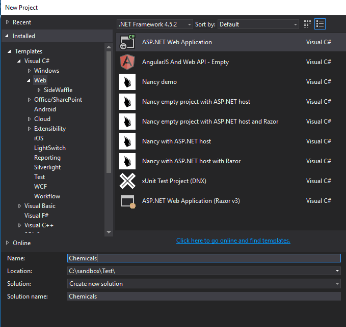
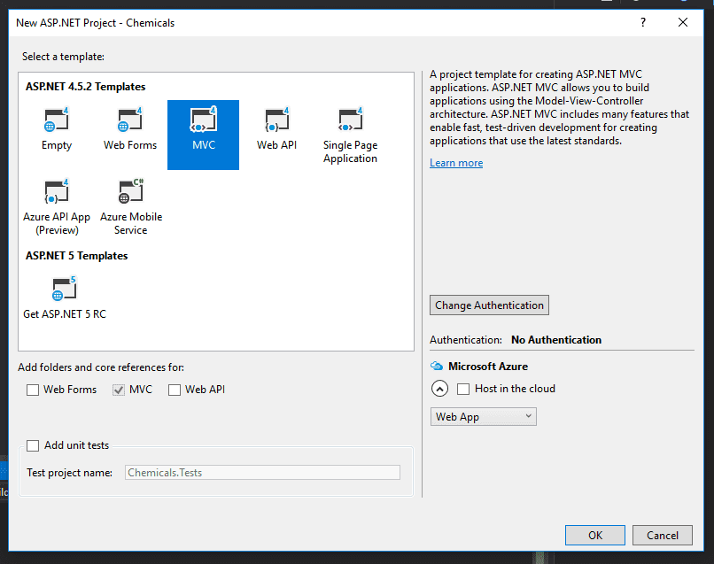
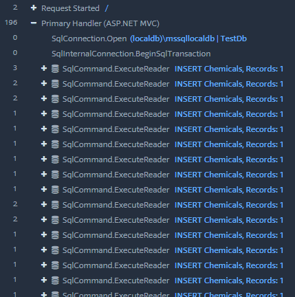

When you're first starting out with Entity Framework, you likely won't need to thinking about inserting records in bulk. The examples you'll start with only worry about inserting one row at a time. This is actually just fine, since your early, smaller applications won't need to save any more than that. However, as you continue to develop your skills, you may find that you'll need to insert many rows at one. In this post, we'll look at how to implement an Entity Framework bulk insert.

Let's imagine that we're making an application for an industrial chemical company. This company needs to keep track of when bottles of chemicals enter the system and when they expire. Expired chemicals can often be very dangerous (or even deadly), so we want to get those expired chemicals out of there. Let's also imagine that we're going to be inserting a number of these records at once, like a few hundred or thousand every shipment. This would necessitate us taking a look at the performance of our bulk inserts.

## Entity Framework Bulk Inserts in MVC 5

Begin by creating a new project. We won't bother with any authentication.

Once you create the project, you'll need to install Entity Framework by running the following command in the Package Manager Console:

Install-Package EntityFramework

Next, we'll create a simple model to represent our chemicals. We'll also create our DbContext, and add a line in the webconfig for our local database.

_Chemical.cs_

public class Chemical
{
    public int ID { get; set; }
    public string Name { get; set; }
    public DateTime ExpirationDate { get; set; }
}

_ApplicationContext.cs_

public class ApplicationContext : DbContext
{
  public ApplicationContext() : base("name=default")
  {
  }
  public DbSet<Chemical> Chemicals { get; set; }
}

_Web.config_

...
<connectionStrings>
  <add name="default" connectionString="Server=(localdb)\\mssqllocaldb;Database=TestDb;Trusted\_Connection=True;ConnectRetryCount=0" providerName="System.Data.SqlClient" />
</connectionStrings>
...

To make things easier, we'll use code first migrations. Run the following commands in the Package Manager Console, and Entity Framework will create your tables.

Enable-Migrations

Add-Migration initial

Update-Database

Finally, we're ready to test out the different methods for inserting bulk records with Entity Framework. I'm going to create a few methods to generate random chemicals. For simplicity's sake, I'm adding this to my HomeController.

_HomeController.cs_

public List<Chemical> GetChemicals(int length)
{
  var chemicals = new List<Chemical>();

  for (int i = 1; i <= length; i++)
  {
    var chemical = new Chemical { ID = i, Name = GetRandomString(), ExpirationDate = GetRandomDate() };
    chemicals.Add(chemical);
  }

  return chemicals;
}

private string GetRandomString()
{
  string path = Path.GetRandomFileName();
  path = path.Replace(".", ""); // Remove period.
  return path;
}

static Random rand = new Random();

DateTime GetRandomDate()
{
  int year = rand.Next(1900, 2000);
  int month = rand.Next(1, 12);
  int day = DateTime.DaysInMonth(year, month);

  int Day = rand.Next(1, day);

  DateTime dt = new DateTime(year, month, Day);
  return dt;
}

The first method, GetChemicals, generates a list of chemicals. The number of chemicals is specified by the length parameter. GetRandomString will generate a fake chemical name, and GetRandomDate will work similarly with our ExpirationDate property.

There's probably a better way of doing this, but this seems to work pretty well. I'd love to hear in the comments about ways to better generate test data for experiments like this.

Now, at last, we can start looking at the different techniques to insert multiple records.

### Bad Solution #1: Add()

Our first thought might be to simply loop through the List and add each one, saving as we go along.

var chemicals = GetChemicals(1000);

using (var db = new ApplicationContext())
{
    foreach (var chemical in chemicals)
    {
        db.Chemicals.Add(chemical);
        db.SaveChanges();
    }
}

This results in extremely slow performance. For every row, Entity Framework opens a new connection, executes the command, and commits the transaction. It then begins another transaction and starts the process over again.

Another reason that this is slow is that the Add method calls DetectChanges after every record is added. DetectChanges compares the entities (and their properties) in the context to the original values from the database. If there's a difference, then Entity Framework knows that it needs to update those records in the database. (For a more thorough discussion of DetectChanges, check out [this blog post](https://blog.oneunicorn.com/2012/03/10/secrets-of-detectchanges-part-1-what-does-detectchanges-do/).) Doing this after _every insert_ creates a performance drag.

You can see this if you use a profiler. Here, I'm using Stackify's [Prefix](https://stackify.com/prefix/).

Here are the results of this operation, measured using Prefix. I know that there are probably more precise ways of measuring SQL performance, but this was quick and got the job done.

\[table id=16 /\]

\*Apparently, Prefix bugs out when the data from the request is too large. I couldn't get the profiler to actually report the time of this operation, so I just used the total time it took the page to load. This is probably inaccurate, but the time is still significant. This is not an experience you want to force on your users.

### Better Solution #2: AddRange()

One improvement we can make is to use AddRange instead of Add. This method creates the SqlTransaction, executes the insert commands, and then closes the transaction after _all_ of the inserts are done. DetectChanges is also only called _once,_ at the end, instead of after every insert.

var chemicals = GetChemicals(1000);

using (var db = new ApplicationContext())
{
    db.Chemicals.AddRange(chemicals);
    db.SaveChanges();
}

Here you can see this behavior in the profiler.

And the transaction gets committed at the end:

This results in a pretty nice performance increase over Add.

\[table id=17 /\]

### Solution #3: Set AutoDetectChangesEnabled to False

One of the common methods for speeding up bulk inserts is to turn DetectChanges off. Remember earlier, how we discovered that Entity Framework calling DetectChanges can result in big performance decreases? Setting the AutoDetectChangesEnabled flag to false will result in bumping up your Add performance to something similar to AddRange.

using (var db = new ApplicationContext())
{
  db.Configuration.AutoDetectChangesEnabled = false;

  foreach(var chemical in chemicals)
  {
      db.Chemicals.Add(chemical);
  }

  db.SaveChanges();
}

\[table id=18 /\]

If you're already using AddRange, though, you're not going to see much of a difference in performance, as AddRange already only calls DetectChanges once anyway.

using (var db = new ApplicationContext())
{
    db.Configuration.AutoDetectChangesEnabled = false;

    db.Chemicals.AddRange(chemicals);
    db.SaveChanges();
}

In my tests, I didn't see much of a difference with this flag on or off. This might make a difference once your dataset becomes much bigger than the 4000 rows I was inserting, but I didn't see any significant change.

### Solution #4: EntityFramework Extensions' Bulk SaveChanges

The organization zzzprojects has created an extension to Entity Framework that upgrades SaveChanges.

Be aware that this library is not free, and as of this writing comes with a free 30-day trial. If you're interested in using this solution, you'll of course want to do your due diligence to see whether it provides enough value to your organization. You should also be aware that it comes with many more features than just bulk inserts, so you'll want to check those out as you make your decision.

To install, go to [the EFE homepage](http://entityframework-extensions.net/) and click on download. Choose your version of Entity Framework, and the link will take you to the nuget gallery.

In my case, I had to run this command in the Package Manager Console:

Install-Package Z.EntityFramework.Extensions -Version 3.15.4

With that installed, we just need to call BulkSaveChanges instead of SaveChanges.

var chemicals = GetChemicals(4000);

using (var db = new ApplicationContext())
{
    db.Chemicals.AddRange(chemicals);
    db.BulkSaveChanges();
}

The results are pretty astounding. Here are the performance results.

\[table id=19 /\]

That's a _lot_ better than any of the techniques we've seen so far. This library was easy to install, and easy to use. It also comes with bulk methods for other operations, like updating, deleting, and merging.

The only thing that may put you off is the price: $599 for an individual developer, and more for larger teams. If you're just toying with bulk inserts, or your organization is small, this may not be the solution for you. If you're developing this as a business, however, you may be able to stomach the cost.

### Solution #5: SqlBulkCopy

If you want blazing fast performance, don't want to shell out money for a solution, and don't mind a bit of extra coding, then SqlBulkCopy is what we want to use.

This is cheating a bit, because we're no longer using Entity Framework. However, if you're doing many bulk operations, this is a solution worth considering.

First, we have to understand that SqlBulkCopy will only accept a DataTable, and not a List or other data source. You'll need to write a method to change your source data into a DataTable with appropriate column names that match your destination table. Here's one method taken from StackOverflow:

//https://stackoverflow.com/a/1253737
public DataTable ToDataTable<T>(List<T> items)
{
  DataTable dataTable = new DataTable(typeof(T).Name);

  //Get all the properties
  PropertyInfo\[\] Props = typeof(T).GetProperties(BindingFlags.Public | BindingFlags.Instance);
  foreach (PropertyInfo prop in Props)
  {
    //Setting column names as Property names
    dataTable.Columns.Add(prop.Name);
  }
  foreach (T item in items)
  {
    var values = new object\[Props.Length\];
    for (int i = 0; i < Props.Length; i++)
    {
        //inserting property values to datatable rows
        values\[i\] = Props\[i\].GetValue(item, null);
    }
    dataTable.Rows.Add(values);
  }
  //put a breakpoint here and check datatable
  return dataTable;
}

The general method is to create a SqlConnection, open it, and begin a SqlTransaction. Then, we create an instance of SqlBulkCopy, giving it the connection, options, and the transaction as parameters. At minimum, you need to set the destination table name. Then you write to the server, commit the transaction, and close the connection.

Here's how it plays out.

var chemicals = GetChemicals(4000);

var datatable = ToDataTable<Chemical>(chemicals);

using (var conn = new SqlConnection(ConfigurationManager.ConnectionStrings\["default"\].ConnectionString))
{
  conn.Open();
  var transaction = conn.BeginTransaction();

  using (var bulkCopy = new SqlBulkCopy(conn, SqlBulkCopyOptions.Default, transaction))
  {
    bulkCopy.DestinationTableName = "Chemicals";
    bulkCopy.WriteToServer(datatable);
  }

  transaction.Commit();
}

There are other options and tweaks you can make. [An article over at Programming with Mosh](https://programmingwithmosh.com/csharp/using-sqlbulkcopy-for-fast-inserts/) does a great job of going into more detail.

But how does it perform? Marvelously.

\[table id=20 /\]

## Entity Framework Bulk Inserts in .NET Core

Quickly, we can summarize how to use these techniques in .NET Core.

Add and AddRange work in the same way, so you can take the same advice as in MVC 5.

Entity Framework Extensions is also available for .NET Core, so you can use BulkSaveChanges here as well.

Performance-wise, I was actually really surprised to find that .NET Core ran much faster than MVC 5. I was able to insert 4000 records using AddRange in under 2 seconds. Unfortunately, I couldn't get Prefix to work with .NET Core. I'd love to come back later and give exact numbers, but anecdotally, this is much faster.

## Entity Framework Bulk Insert: Summary

Here's a performance summary for all the techniques we've discussed:

\[table id=21 /\]

_Data is represented in milliseconds. As noted above, the entry for 4000 entities using Add is probably an overestimate._

Hopefully, this article has allowed you to make an informed decision about how to use Entity Framework bulk inserts. I would also recommend [this blog post](https://www.djamseed.com/2015/08/31/improving-bulk-insert-performance-with-entity-framework/) for further reading, and I'd like to thank the author for helping me understand the topic more deeply. Happy coding!
