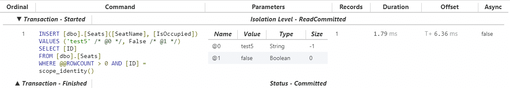

If you've read any tutorial about learning ASP.NET MVC or ASP.NET Core, you've come across Entity Framework, the ORM. Entity Framework is an easy way to make queries against database tables without having to write SQL. The advantages of abstracting away the SQL can, unfortunately, cause unforeseen problems. Without knowing the underlying SQL commands that Entity Framework generates, your application can become slow and buggy. In this article, we'll learn about Entity Framework logging and how to understand what's really happening under the hood.

## Creating a New MVC Project

For the purposes of our demonstration, we're going to pretend we're creating a seating application for a local restaurant. It'll keep track of the seat number and whether it's occupied or not.

We'll start by creating a new project with no authentication.

Next, we'll install Entity Framework by running the following in the Package Manager Console:

Install-Package EntityFramework

Then, I'll add my model class and `DbContext` class to the _Models_ folder.

_Seat.cs_

public class Seat
{
    public int ID { get; set; }
    public string SeatName { get; set; }
    public bool IsOccupied { get; set; }
}

_ApplicationContext.cs_

public class ApplicationContext : DbContext
{
    public ApplicationContext() : base("name=default")
    {
    }
    public DbSet<Seat> Seats { get; set; }
}

We'll need to connect to a database, of course, so I'll just add a connection string to my Web.config file. For our purposes, I'm content with using the local database.

<connectionStrings>
  <add name="default" connectionString="Server=(localdb)\\mssqllocaldb;Database=TestDb;Trusted\_Connection=True;ConnectRetryCount=0" providerName="System.Data.SqlClient" />
</connectionStrings>

Finally, in order to create our table, I'll run the following commands in the Package Manager Console:

Enable-Migrations
Add-Migration initial
Update-Database

## Adding the Seats Controller

Right-click on the _Controllers_ folder in the Solution Explorer. Choose _Add -> Controller..._

Then select _MVC 5 Controller with views, using Entity Framework_.

Select the appropriate _Seat_ model class and the _ApplicationContext_ data context class.

Visual Studio will scaffold your controller and views.

Now it's time to get logging!

## Entity Framework Logging in MVC 5

### Logging to the Output Window

The quickest way to log activity from Entity Framework is to write to the Output window in Visual Studio.

Go to _SeatsController.cs_ and add this to the Index controller.

public ActionResult Index()
{
    db.Database.Log = s => System.Diagnostics.Debug.WriteLine(s);

    return View(db.Seats.ToList());
}

Then run the project locally and navigate, in your browser, to `http://localhost:YOURPORT/Seats`.

Back in Visual Studio, we need to check the Output window. If you don't see this, then either press Ctrl-Alt-O or use the menus to click on _View -> Output_.

You may want to pop out the Output window to see the results better.

Now that we can see it, we find, among other things, the following logs and (ta-da!) the SQL query we've been looking for.

Opened connection at 7/23/2018 3:55:57 PM -07:00

SELECT 
    \[Extent1\].\[ID\] AS \[ID\], 
    \[Extent1\].\[SeatName\] AS \[SeatName\], 
    \[Extent1\].\[IsOccupied\] AS \[IsOccupied\]
    FROM \[dbo\].\[Seats\] AS \[Extent1\]

-- Executing at 7/23/2018 3:55:57 PM -07:00

-- Completed in 2 ms with result: SqlDataReader

Closed connection at 7/23/2018 3:55:57 PM -07:00

### Logging to a File

If we want our logs to be more permanent, we ought to log to a file. In our application folder, navigate to the _App\_Data_ folder and create a new folder called _Logs_. Inside the _Logs_ folder, create a text file called _EntityFramework.txt._ This is where our logs will be appended.

Back in our project, let's create a utility class to take care of our logging. Create a folder in the solution called _Helpers_ and create a C# class called _Logger.cs_.

For the file path of the log, I used the the server's relative current path, so that I don't have to redefine it when I move a project to a different location (like debugging locally vs. a shared development server). You could, of course, hard-code this to whatever you want.

using System.IO;
    
public class Logger
{
  public static void Log(string logLine)
  {
    var path = System.Web.HttpContext.Current.Server.MapPath("~/App\_Data/Logs/EntityFramework.txt");
    File.AppendAllText(path, logLine);
  }
}

Then, back in our controller, let's add these lines of code to both our Index and Create methods.

public ActionResult Index()
{
    db.Database.Log = s => Helpers.Logger.Log(s);

    return View(db.Seats.ToList());
}

\[HttpPost\]
\[ValidateAntiForgeryToken\]
public ActionResult Create(\[Bind(Include = "ID,SeatName,IsOccupied")\] Seat seat)
{
    db.Database.Log = s => Helpers.Logger.Log(s);

    if (ModelState.IsValid)
    {
        db.Seats.Add(seat);
        db.SaveChanges();
        return RedirectToAction("Index");
    }

    return View(seat);
}

Now, try running the project. Navigate to the _Seats_ index, then click on "Create New" and create a new Seat.

If you open up _EntityFramework.txt_, you'll see the output of your SQL queries near the bottom:

Opened connection at 7/23/2018 4:31:33 PM -07:00
SELECT 
    \[Extent1\].\[ID\] AS \[ID\], 
    \[Extent1\].\[SeatName\] AS \[SeatName\], 
    \[Extent1\].\[IsOccupied\] AS \[IsOccupied\]
    FROM \[dbo\].\[Seats\] AS \[Extent1\]
-- Executing at 7/23/2018 4:31:33 PM -07:00
-- Completed in 3 ms with result: SqlDataReader

Closed connection at 7/23/2018 4:31:33 PM -07:00
Opened connection at 7/23/2018 4:31:39 PM -07:00
Started transaction at 7/23/2018 4:31:39 PM -07:00
INSERT \[dbo\].\[Seats\](\[SeatName\], \[IsOccupied\])
VALUES (@0, @1)
SELECT \[ID\]
FROM \[dbo\].\[Seats\]
WHERE @@ROWCOUNT > 0 AND \[ID\] = scope\_identity()
-- @0: 'test' (Type = String, Size = -1)
-- @1: 'True' (Type = Boolean)
-- Executing at 7/23/2018 4:31:39 PM -07:00
-- Completed in 2 ms with result: SqlDataReader

Committed transaction at 7/23/2018 4:31:39 PM -07:00
Closed connection at 7/23/2018 4:31:39 PM -07:00

### Logging using IDbCommandInterceptor

You might decide to log every query in the app. There's an easier method than just adding the code above into every controller. We can implement the `IDbCommandInterceptor` interface to log the Entity Framework queries for our entire application.

Let's talk a little bit about the interface first. `IDbCommandInterceptor` requires that you implement methods for the three types of SQL commands:

- **NonQuery.** These are your commands that don't return data, like INSERT, UPDATE, and DELETE.
- **Reader.** These queries create a SqlDataReader, and are uses to return data sets, like SELECT.
- **Scalar.** Scalars return a single value, like an aggregate. They don't require a SqlDataReader to be built.

You can learn more about the differences in [this excellent StackOverflow post](https://stackoverflow.com/questions/2974154/what-is-the-difference-between-executescalar-executereader-and-executenonquery).

For each of the three types, `IDbCommandInterceptor` needs a version for **executing** (when the command starts) and **executed** (when the command ends). For example, you'll need to implement both NonQueryExecuting and NonQueryExecuted.

We'll also need to implement some logic for determining the run time of each command. This isn't built in to any of the classes.

In the _Helpers_ folder, create a class called _CustomEFInterceptor.cs_.

I used [this StackOverflow post](https://stackoverflow.com/a/27365855) as a starting point, and modified the formatting a little bit. Here's our code:

using System.Collections.Concurrent;
using System.Data.Entity.Infrastructure.Interception;
using System.IO;
using System.Text;

public class CustomEFInterceptor : IDbCommandInterceptor
{
    static readonly ConcurrentDictionary<DbCommand, DateTime> m\_StartTime = new ConcurrentDictionary<DbCommand, DateTime>();

    void IDbCommandInterceptor.NonQueryExecuted(DbCommand command, DbCommandInterceptionContext<int> interceptionContext)
    {
        Log(command, interceptionContext);
    }

    void IDbCommandInterceptor.NonQueryExecuting(DbCommand command, DbCommandInterceptionContext<int> interceptionContext)
    {
        OnStart(command);
    }

    void IDbCommandInterceptor.ReaderExecuted(DbCommand command, DbCommandInterceptionContext<DbDataReader> interceptionContext)
    {
        Log(command, interceptionContext);
    }

    void IDbCommandInterceptor.ReaderExecuting(DbCommand command, DbCommandInterceptionContext<DbDataReader> interceptionContext)
    {
        OnStart(command);
    }

    void IDbCommandInterceptor.ScalarExecuted(DbCommand command, DbCommandInterceptionContext<object> interceptionContext)
    {
        Log(command, interceptionContext);
    }

    void IDbCommandInterceptor.ScalarExecuting(DbCommand command, DbCommandInterceptionContext<object> interceptionContext)
    {
        OnStart(command);
    }

    private static void OnStart(DbCommand command)
    {
        m\_StartTime.TryAdd(command, DateTime.Now);
    }

    public static void Log<T>(DbCommand command, DbCommandInterceptionContext<T> interceptionContext)
    {
        DateTime startTime;
        TimeSpan duration;

        m\_StartTime.TryRemove(command, out startTime);
        if( startTime != default(DateTime))
        {
            duration = DateTime.Now - startTime;
        }
        else
        {
            duration = TimeSpan.Zero;
        }

        string message;

        var parameters = new StringBuilder();
        foreach (DbParameter param in command.Parameters)
        {
            parameters.AppendLine(param.ParameterName + " " + param.DbType + " = " + param.Value);
        }
        
        if (interceptionContext.Exception == null)
        {
            message = string.Format("\\r\\nDatabase call took {0} ms. \\r\\nCommand:\\r\\n{1}\\r\\n", duration.TotalMilliseconds.ToString(), parameters.ToString() + command.CommandText);
        }
        else
        {
            message = string.Format("\\r\\nEF Database call failed after {0} ms. \\r\\nCommand:\\r\\n{1}\\r\\nError:{2} ", duration.TotalMilliseconds.ToString(), parameters.ToString() + command.CommandText, interceptionContext.Exception);
        }

        var path = System.Web.HttpContext.Current.Server.MapPath("~/App\_Data/Logs/EntityFramework.txt");
        File.AppendAllText(path, message);
    }
}

Now, all that's left to do is to register our interceptor. To do this globally, the best place to put it is in _Global.asax_, in the ApplicationStart method.

protected void Application\_Start()
{
    AreaRegistration.RegisterAllAreas();
    FilterConfig.RegisterGlobalFilters(GlobalFilters.Filters);
    RouteConfig.RegisterRoutes(RouteTable.Routes);
    BundleConfig.RegisterBundles(BundleTable.Bundles);
    DbInterception.Add(new CustomEFInterceptor());
}

If you wanted to use this code, but not have it work globally, you could also add this anywhere:

DbInterception.Add(new CustomEFInterceptor());

Once that's completed, run the project. Then navigate back to the Seats controller, create a new seat, or do other SQL-y things. Open up your _EntityFramework.txt_ log file, and you'll see logs like this:

Database call took 3.3682 ms. 
Command:
SELECT 
    \[Extent1\].\[ID\] AS \[ID\], 
    \[Extent1\].\[SeatName\] AS \[SeatName\], 
    \[Extent1\].\[IsOccupied\] AS \[IsOccupied\]
    FROM \[dbo\].\[Seats\] AS \[Extent1\]

Database call took 2.0017 ms. 
Command:
p0 Int32 = 2
SELECT TOP (2) 
    \[Extent1\].\[ID\] AS \[ID\], 
    \[Extent1\].\[SeatName\] AS \[SeatName\], 
    \[Extent1\].\[IsOccupied\] AS \[IsOccupied\]
    FROM \[dbo\].\[Seats\] AS \[Extent1\]
    WHERE \[Extent1\].\[ID\] = @p0

Perfect!

## Third-Party Entity Framework Logging Solutions

If you don't want to write the logging code yourself, and possibly have some cash to spare, there are plenty of third-party solutions that will profile your SQL queries. Here are a two of the most popular.

### [Stackify Prefix](https://stackify.com/prefix/)

Prefix offers .NET and Java web request tracing. Prefix is free, but it does ask for you to provide your email address. I've used Prefix personally, and I don't even remember the last time I received an email, so they don't seem to abuse this too much.

After downloading and installing Prefix, you'll run the program and it'll show up as a tray icon.

Select "Enable .NET Profiler" and then "Open in browser". You may get a notification saying that you need to restart Visual Studio.

Once you open the Profiler in the browser, you'll see a slick interface with two columns. On the left side, you'll see a list of the web requests, along with how many database calls were made, and the amount of time it took.

Clicking on any one of those rows will reveal the request details on the right hand side.

Here, you can expand the details to find any of the SQL commands that Entity Framework has generated. In the example above, you can see the SELECT query for the Details action.

If you want a profiler with a graphical interface, Prefix offers a lot of details and works very well during development. There's also a paid version which offers code improvement suggestions and the ability to save old traces, among other things. Stackify also offers Retrace, which is designed for production environments.

As a free product, Prefix does insert ads into the trace list, but these aren't too obtrusive and are (mostly) cutesy. There are also occasional upsell popups.

The only other downside I've found with Prefix is that it breaks when there are a large number of details in the trace details. I've had an error message pop up when executing over 4000 SQL commands in a single web request, for example. (See my post on [Entity Framework Bulk Insert](https://sensibledev.com/entity-framework-bulk-insert/) performance.)

Overall, I can really recommend this software for tracing Entity Framework queries.

### [Glimpse](https://docs.microsoft.com/en-us/aspnet/mvc/overview/performance/profile-and-debug-your-aspnet-mvc-app-with-glimpse)

Think of Glimpse as Chome Dev Tools, but for your ASP.NET server. This is a super-awesome package to track your Entity Framework queries, among many other attributes, like your model bindings and load times.

To install, you'll want to run the correct commands for the versions of MVC and EntityFramework that you're using. In my case, I have MVC 5 and EF6 installed. The commands to install the appropriate Glimpse packages are:

Install-Package Glimpse.MVC5

Install-Package Glimpse.EF6

After the packages are installed, run your project. You won't see anything initially, and that's because you need to turn Glimpse on. Navigate to `localhost:YOURPORT/glimpse.axd`. Click on the big button that reads "Turn Glimpse On," and you'll be good to go.

Like the screen says, it wouldn't be a bad idea to drag those links to your Favorites Bar. That way, you won't have to come back to this page again in order to turn Glimpse on and off.

Now let's navigate back to our Seats controller at `http://localhost:YOURPORT/Seats`. You should now have a toolbar at the bottom of your screen. We can see the total HTTP request time, the time it took to process the code in both the Action and the View, the number and completion time of our DB queries, and a count of any AJAX requests.

Hovering over the sections will give you a more detailed look at the stats.

But we want to get even deeper than this. Click on the "G" icon on the far right side of the toolbar. You'll get an expanded view with tabs. Click on the "SQL" tab, and you'll find the Entity Framework query that we've been looking for all along. I like that, along with the command text and parameters, you also get the number of records retrieved.

This tab will only show the SQL for the current request. This is fine for Index and Details pages. But what if we want to see one of our Inserts? Try creating a new Seat. You'll won't see the INSERT SQL command after doing so.  That's because this tab will show the SQL query for the Index page _after the redirect_.

What we need to do is look into the history. Click on the "History" tab on the far right and find the row with the POST method.

Clicking on "Inspect" in that row will turn the row green. Now we're examining our logs in the context of the POST request.

Now, when we click on the SQL tab, we'll see our INSERT command.

To get back into the "present," go to the History tab and click on the link that reads "Reset context back to starting page".

Overall, Glimpse is an awesome tool for profiling and logging your Entity Framework operations. I found it ridiculously easy to get started, and I'm seriously considering using it as a default in my future projects.

## Entity Framework Logging in .NET Core

Let's take a look at how we might implement the same kind of functionality in .NET Core. We'll begin by making a new project with the same goal of tracking seats in a restaurant.

Next, create a folder called _Models_ and create the _Seat_ model along with the _ApplicationContext_.

_Seat.cs_

public class Seat
{
  public int ID { get; set; }
  public string SeatName { get; set; }
  public bool IsOccupied { get; set; }
}

_ApplicationContext.cs_

using Microsoft.EntityFrameworkCore;

public class ApplicationContext : DbContext
{
    public ApplicationContext(DbContextOptions<ApplicationContext> options)
        : base(options)
    { }

    public DbSet<Seat> Seats { get; set; }
}

Now, we'll just add the following lines to _Startup.cs_ so that we can inject the DbContext into our Razor pages:

public void ConfigureServices(IServiceCollection services)
{
  services.AddMvc();

  var connection = @"Server=(localdb)\\mssqllocaldb;Database=TestDb;Trusted\_Connection=True;ConnectRetryCount=0";
  services.AddDbContext<ApplicationContext>(options => options.UseSqlServer(connection));
}

Create the database tables (if you didn't already do so) by running the following commands in the Package Manager Console.

Add-Migration initial
Update-Database

Finally, we need to create Razor pages for our _Seats_ model.

Make a new folder under _Pages_ called _Seats_. Right-click on the _Seats_ folder and choose _Add -> Razor Page..._

Then, in the _Add Scaffold_ window, choose _Razor Pages using Entity Framework (CRUD)_.

Select the appropriate model and data classes, then click _Add_.

Great! Now we're ready to roll.

### The No-Config, Output Window Log

Start running the project, and navigate to `http://localhost:YOURPORT/Seats`. Back in Visual Studio, open up the Output window. You may need to go to _View -> Output_ in order to see it, and it may be helpful to pop the window out. If you look closely (or hit Ctrl-F and type "SELECT"), you'll see your SQL command buried in the logs.

Microsoft.EntityFrameworkCore.Database.Command:Information: Executed DbCommand (50ms) \[Parameters=\[\], CommandType='Text', CommandTimeout='30'\]
SELECT \[s\].\[ID\], \[s\].\[IsOccupied\], \[s\].\[SeatName\]
FROM \[Seats\] AS \[s\]

So, if you don't mind digging through the output window, you don't need to do any configuration at all to know what your Entity Framework queries are generating. But we probably want to dig a little to find a more robust solution.

### Logging to a File with ILogger

.NET Core has excellent support for logging with the ILogger interface. Here's one way that you could set up your .NET core app to log everything that happens in Entity Framework to a file.

First, we need to implement ILoggerProvider and ILogger.

**ILogger** does the actual logging, whether that be to the console, file, database, or something else.

**ILoggerProvider** determines which logger to use, and at which times. You could have multiple types of logging set up to fire under different circumstances.

In the following _MyLoggerProvider.cs_ file, I've put the classes for both the ILoggerProvider and ILogger. I'm heavily indebted to [this article](https://ef.readthedocs.io/en/staging/miscellaneous/logging.html) for providing the basis of the code.

_MyLoggerProvider.cs_

public class MyLoggerProvider : ILoggerProvider
{

    public ILogger CreateLogger(string categoryName)
    {
        if (categoryName.Contains("Microsoft.EntityFrameworkCore"))
        {
            return new MyLogger();
        }

        return new NullLogger();
    }

    public void Dispose()
    { }

    private class MyLogger : ILogger
    {
        public bool IsEnabled(LogLevel logLevel)
        {
            return true;
        }

        public void Log<TState>(LogLevel logLevel, EventId eventId, TState state, Exception exception, Func<TState, Exception, string> formatter)
        {
            File.AppendAllText(@"C:\\temp\\eflog.txt", formatter(state, exception) + "\\r\\n");
            Console.WriteLine(formatter(state, exception));
        }

        public IDisposable BeginScope<TState>(TState state)
        {
            return null;
        }
    }

    private class NullLogger : ILogger
    {
        public bool IsEnabled(LogLevel logLevel)
        {
            return false;
        }

        public void Log<TState>(LogLevel logLevel, EventId eventId, TState state, Exception exception, Func<TState, Exception, string> formatter)
        { }

        public IDisposable BeginScope<TState>(TState state)
        {
            return null;
        }
    }
}

In this example, the ILoggerProvider looks at the category name and creates a new logger if the event has anything to do with Entity Framework Core. Examples of these kinds of events include "Microsoft.EntityFrameworkCore.Database.Connection" and "Microsoft.EntityFrameworkCore.Query". If you wanted to log other kinds of events, you would need to check for those, or just forego the filtering altogether. Keep in mind that this would just log _everything,_ though.

In the MyLogger class, notice that the Log method contains the call to File.AppendAllText. I've added a line return to the content to make the log easier to read.

Once you've created this class, we just need to make some modifications to _Startup.cs_.

You'll need to add the ILoggerFactory parameter to the method signature, and add our provider to the logging system.

public void Configure(IApplicationBuilder app, IHostingEnvironment env, ILoggerFactory loggerFactory)
{
    if (env.IsDevelopment())
    {

        app.UseBrowserLink();
        app.UseDeveloperExceptionPage();
    }
    else
    {
        app.UseExceptionHandler("/Error");
    }

    app.UseStaticFiles();
    loggerFactory.AddProvider(new MyLoggerProvider());
    app.UseMvc();
}

Now you just need to start your application, navigate to some pages that use Entity Framework, and check out the log. You'll see lines like this:

Entity Framework Core 2.0.2-rtm-10011 initialized 'ApplicationContext' using provider 'Microsoft.EntityFrameworkCore.SqlServer' with options: None
Executed DbCommand (32ms) \[Parameters=\[\], CommandType='Text', CommandTimeout='30'\]
SELECT \[s\].\[ID\], \[s\].\[IsOccupied\], \[s\].\[SeatName\]
FROM \[Seats\] AS \[s\]
Entity Framework Core 2.0.2-rtm-10011 initialized 'ApplicationContext' using provider 'Microsoft.EntityFrameworkCore.SqlServer' with options: None
Executed DbCommand (26ms) \[Parameters=\[@\_\_id\_0='?'\], CommandType='Text', CommandTimeout='30'\]
SELECT TOP(2) \[m\].\[ID\], \[m\].\[IsOccupied\], \[m\].\[SeatName\]
FROM \[Seats\] AS \[m\]
WHERE \[m\].\[ID\] = @\_\_id\_0

Adjust the Log method in the MyLogger class if you want this to be in a different format. As mentioned, you could easily change this method to output to a database or some other logging provider.

### [Glimpse](https://docs.microsoft.com/en-us/aspnet/mvc/overview/performance/profile-and-debug-your-aspnet-mvc-app-with-glimpse)

Much as I would like to use Glimpse in .NET Core, it doesn't look like it's supported yet. Either that or I was completely not following the directions correctly. In any case, I could not get it to work. Bummer.

I've personally found it very difficult to find third-party logging solutions for .NET Core that are ready for production and easy to get up and running. I'll be keeping and eye out for this, and update this section as needed. If you can recommend one, let me know in the comments.

## Entity Framework Logging: Conclusion

We've looked at a variety of ways to log the SQL queries generated by Entity Framework. This is possible in both ASP.NET MVC 5, as well as .NET Core. There are a number of third-party logging solutions available for MVC 5, but less so for .NET Core. Thankfully, the ILogger class is easy enough to implement, though it doesn't provide you with a slick GUI. Hopefully you've found this tutorial helpful, and you ought to feel confident logging your SQL commands in the future. Happy coding!
