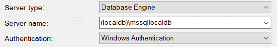
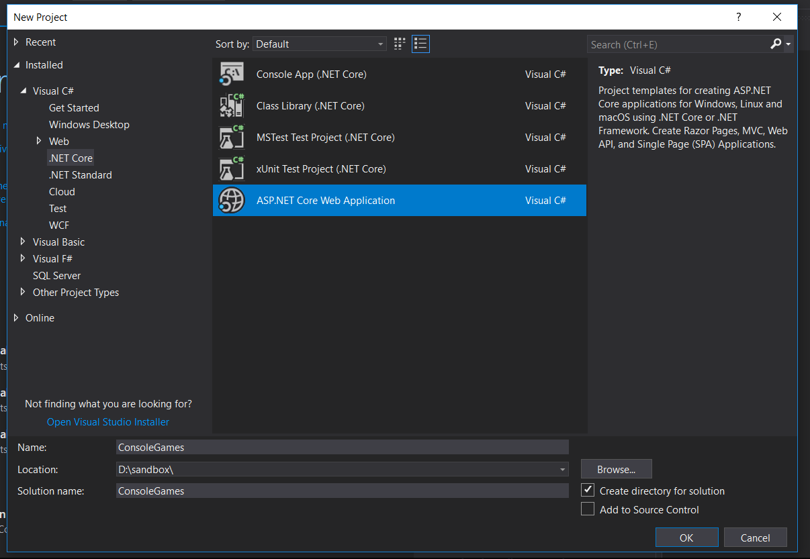

Most of the ASP.NET tutorials out there about Entity Framework will use Code First Migrations in their examples. This makes sense, because code first is an easy way to create a new database directly from Visual Studio. I even do the same in my tutorials, like this one about setting up Bootstrap 4 in a .NET environment. But sometimes, you want to move in the opposite direction, and set up Entity Framework migrations from an existing database.

Imagine that you're given a brand new project, but you have to use an already-existing database, maybe even with weird naming conventions like "CustNo." (Gross.)

You still want to use Entity Framework Core's awesome features, and you'd rather not have to write all your model classes by hand. Don't despair! There's a way to do that.

## Setting Up the Database

Obviously, if you're here, you want to use a database that already exists. But just so we're on the same page, or you want to practice, I'm going to walk us through creating a database in SQL Server Management Studio.

Start by connecting to the server named `(localdb)\mssqllocaldb`. Use Windows Authentication.

I already have `TestDb` in my local databases from past projects, so you'll want to create one yourself. Right-click on **Databases**, then choose **New Database…** and name it **TestDb**.

Right-click on **TestDb** and choose **New Query**.

Next, you're going to copy and paste some code in the query window. This will create a few databases and seed it with data.

IF OBJECT\_ID('GameConsoles') IS NOT NULL DROP TABLE GameConsoles
CREATE TABLE GameConsoles
(
    ID int identity(1,1) primary key,
    Name varchar(500) NOT NULL,
    ReleaseDate datetime NOT NULL
)

INSERT INTO GameConsoles VALUES ('Sega 32X', '1994-11-21')
INSERT INTO GameConsoles VALUES ('Nintendo 64', '1996-9-26')
INSERT INTO GameConsoles VALUES ('IQue Player', '2003-11-17')

IF OBJECT\_ID('Games') IS NOT NULL DROP TABLE Games
CREATE TABLE Games
(
    ID int identity(1,1) primary key,
    GameConsoleID int NOT NULL,
    Name varchar(500) NOT NULL,
    ReleaseDate datetime NOT NULL
)

INSERT INTO Games VALUES (1, 'Doom', '1994-11-21')
INSERT INTO Games VALUES (1, 'Virtua Fighter', '1995-10-10')
INSERT INTO Games VALUES (2, 'Goldeneye 007', '1997-8-25')
INSERT INTO Games VALUES (2, 'Rugrats: Scavenger Hunt', '1999-6-29')
INSERT INTO Games VALUES (3, 'Wave Race 64', '2003-11-17')
INSERT INTO Games VALUES (3, 'Animal Crossing', '2006-06-01')

Next, we need to make a new project. In this project, we'll use the existing tables to create our models.

Let's scaffold the models now. Navigate to the package manager console and enter the following:

Scaffold-DbContext "Server=(localdb)\\mssqllocaldb;Database=TestDb;Trusted\_Connection=True;" Microsoft.EntityFrameworkCore.SqlServer -OutputDir Models

As you can see, this takes the connection string you specify, and will put the models into the directory specified by the `OutputDir` flag. This will generate all of the model files, as well as the `DbContext`. This will be named after the database name, so the context file is called `TestDbContext.cs`.

Sometimes you'll be working with a database that houses tables from multiple projects, and you don't want to pull in all of the tables.

You can specify the tables you want with the `Tables` flag:

\-Tables Games,GameConsoles

## Changing the Column Names

Let's say that your original database has column names that aren't to your liking. Here's a way to fix that.

Pretend that the original column names in the \`Games\` database were a bit more obfuscated, and you ended up with a model like this:

public partial class Games
{
  public int Id { get; set; }
  public int GmConsId { get; set; }
  public string GmName { get; set; }
  public DateTime GmReleaseDate { get; set; }
}

After tracking down the person who created the table and strangling them, here's what we need to do. Change the columns in the model to what we want:

public partial class Games
{
  public int Id { get; set; }
  public int GameConsoleId { get; set; }
  public string Name { get; set; }
  public DateTime ReleaseDate { get; set; }
}

Head over to _TestDbContext.cs_ and find the `OnConfiguring` method. Scroll down a bit to this code:

modelBuilder.Entity<Games>(entity =>
{
  entity.Property(e => e.Id).HasColumnName("ID");

  entity.Property(e => e.GameConsoleId).HasColumnName("GameConsoleID");

  entity.Property(e => e.Name)
    .IsRequired()
    .HasMaxLength(500)
    .IsUnicode(false);

  entity.Property(e => e.ReleaseDate).HasColumnType("datetime");
});

This code tells Entity Framework how to map the column names to your model. (The third line also describes how to validate the property.)

Simply change the property names and column names as needed. In our hypothetical example, we'd need something like this:

modelBuilder.Entity<Games>(entity =>
{
  entity.Property(e => e.Id).HasColumnName("ID");

  entity.Property(e => e.GameConsoleId).HasColumnName("GmConsID");

  entity.Property(e => e.Name)
  .HasColumnName("GmName")
    .IsRequired()
    .HasMaxLength(500)
    .IsUnicode(false);

  entity.Property(e => e.ReleaseDate)
  .HasColumnName("GmReleaseDate")
  .HasColumnType("datetime");
});

So, while it's a bit of a pain to correct the mistakes of your predecessors (or your _own_ mistakes, if we're being honest), it's certainly not something that's incredibly hard to fix.

## Updating the Models

Obviously you're going to be changing the tables as you develop your app (unless you're in a rare situation where you're just building the application over a rigid, existing table structure).

If you make a change to the table, you can just run the scaffolding command again. However, this will wipe out any changes that you made to the **TestDbContext** class. The other option, is unfortunately, to simply change your class models every time that you add a column to the database.

## Entity Framework Migrations from an Existing Database

As you can see, there's a fairly simple way of getting your existing SQL Server database tables into .NET Core entity models. I hope this article helped make the process a bit easier. Happy sensible coding!
