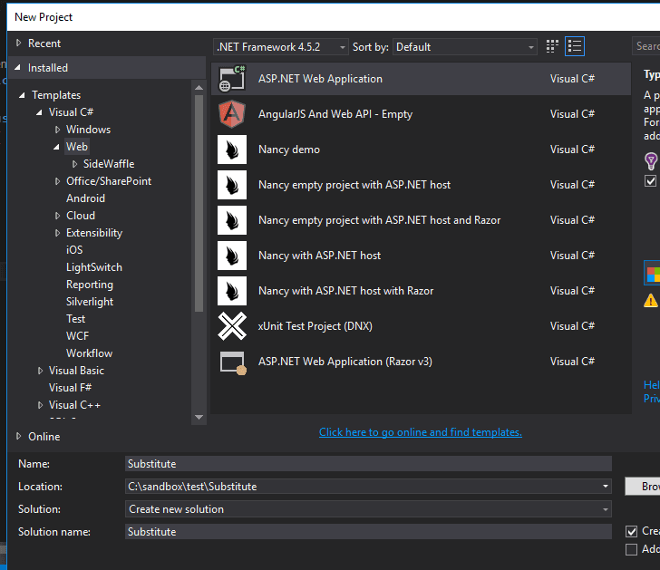
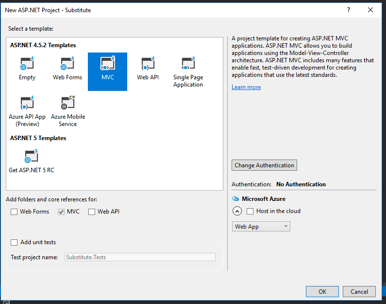
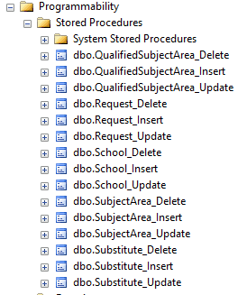
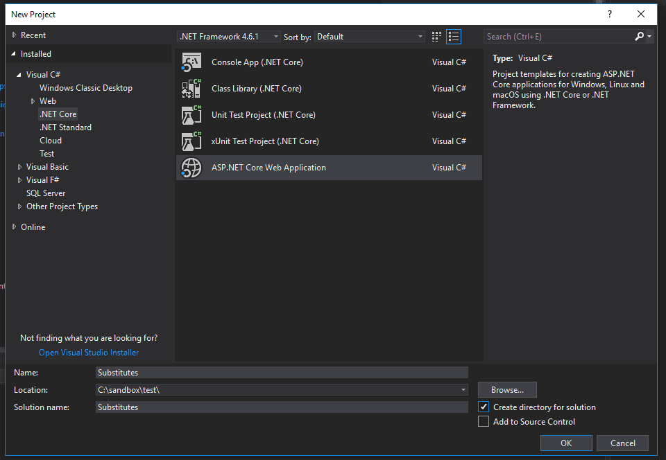
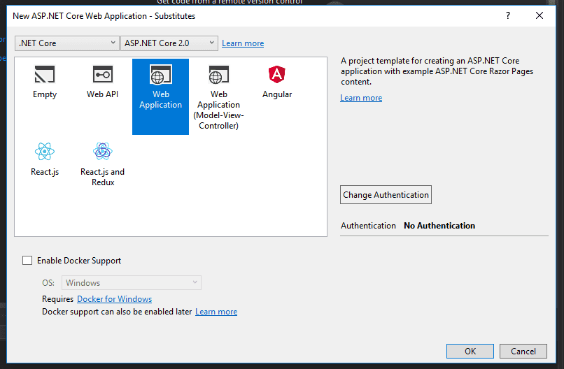
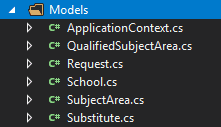

By default, Entity Framework renders your CRUD operations as standard SQL Insert, Update, and Delete statements. However, it's perfectly possible to rig up the framework to work with stored procedures, instead. In this article, we'll explore Entity Framework stored procedure mapping, as well as how to call stored procedures manually. We'll do this with both MVC 5 and .NET Core, and explore the advantages and disadvantages of both.

For the sake of our examples, we'll imagine that a school district has hired us to schedule substitute teachers that are qualified in a particular subject area. We'll need to keep track of schools, subject areas, substitutes, subject area qualifications, and substitute teacher requests.

## Code First Stored Procedure Mapping in MVC 5

For the first part of this article, we'll look at how to achieve Entity Framework stored procedure mapping in MVC 5. Let's start by making a new project.

We'll move on to creating the models for our data. Create the following files in a folder called _Models_.

### Substitutes.cs

public class Substitute
{
  public int ID { get; set; }
  public string Name { get; set; }

  public virtual ICollection<Request> Requests { get; set; }
  public virtual ICollection<QualifiedSubjectArea> QualifiedSubjectAreas { get; set; }
}

### SubjectArea.cs

public class SubjectArea
{
  public int ID { get; set; }
  public string Name { get; set; }

  public virtual ICollection<Request> Requests { get; set; }
}

### School.cs

public class School
{
  public int ID { get; set; }
  public string Name { get; set; }

  public virtual ICollection<Request> Requests { get; set; }
}

### Request.cs

public class Request
{
  public int ID { get; set; }
  public int SchoolID { get; set; }
  public int SubjectAreaID { get; set; }
  public DateTime Date { get; set; }
  public int? SubstituteID { get; set; }

  public virtual School School { get; set; }
  public virtual SubjectArea SubjectArea { get; set; }
  public virtual Substitute Substitute { get; set; }
}

### QualifiedSubjectArea.cs

public class QualifiedSubjectArea
{
  \[Key\]
  \[Column(Order=1)\]
  public int SubstituteID { get; set; }
  \[Key\]
  \[Column(Order = 2)\]
  public int SubjectAreaID { get; set; }

  public virtual Substitute Substitute { get; set; }
  public virtual SubjectArea SubjectArea { get; set; }
}

The QualifiedSubjectArea table represents the subject areas that substitutes are qualified in. For example, a teacher may be qualified to teach both English and Art. Looking at the model, you may be unfamiliar with the `Key` and `Column` data annotations. These are necessary because the table has a **composite key**, a way of having two primary keys. This table has a composite key because it merely connects the substitutes and their subject areas; there's no need for a separate, unique primary key.

As mentioned, I've told Entity Framework that this table has a composite key by using [data annotations](https://msdn.microsoft.com/en-us/library/jj591583(v=vs.113).aspx). You can also set up a composite key [by using the fluent API](https://msdn.microsoft.com/en-us/data/jj591617#1.2) in the `DbContext` class.

Now that our tables are created, install Entity Framework by running the following command in the Package Manager Console:

Install-Package EntityFramework

Next, create the DbContext class.

public class ApplicationContext : DbContext
{
  public ApplicationContext() : base("name=default")
  {
  }

  protected override void OnModelCreating(DbModelBuilder modelBuilder)
  {
    modelBuilder.Entity<QualifiedSubjectArea>()
        .MapToStoredProcedures();

    modelBuilder.Entity<Request>()
        .MapToStoredProcedures();

    modelBuilder.Entity<School>()
        .MapToStoredProcedures();

    modelBuilder.Entity<SubjectArea>()
        .MapToStoredProcedures();

    modelBuilder.Entity<Substitute>()
        .MapToStoredProcedures();
  }

  public DbSet<QualifiedSubjectArea> QualifiedSubjectAreas { get; set; }
  public DbSet<Request> Requests { get; set; }
  public DbSet<School> Schools { get; set; }
  public DbSet<SubjectArea> SubjectAreas { get; set; }
  public DbSet<Substitute> Substitutes { get; set; }
}

The collections of DbSets should look familiar if you've used Entity Framework before. The `OnModelCreating` method might not be as familiar, however. In this method, we can use the `modelBuilder` object to change the way that Entity Framework treats our entities. We can set custom options for this process, including (in this case) mapping to stored procedures.

If you just want to generate stored procedures for a few of your models, but not all of them, use this syntax:

protected override void OnModelCreating(DbModelBuilder modelBuilder)
{
  modelBuilder.Entity<QualifiedSubjectArea>()
      .MapToStoredProcedures();

  modelBuilder.Entity<Request>()
      .MapToStoredProcedures();

  //repeat for all of your entities
}

If you're sure that you want _all_ of your models to have default stored procedures, just use this one-liner:

protected override void OnModelCreating(DbModelBuilder modelBuilder)
{
    modelBuilder.Types().Configure(t => t.MapToStoredProcedures());
}

Run the initial migrations by inputting these commands into the Package Manager Console:

enable-migrations
add-migration initial
update-database

This will create the tables, as we would expect. But it will also create stored procedures for inserting, updating, and deleting.

Entity Framework will _not_ generate a procedure for reading the data. If you really need to do that, best practice is create a SQL view instead of a stored procedure.

Here's an example of a method to create a stored procedure in the migration class. It includes the name of the stored procedure, the parameters, and the body of the procedure.

CreateStoredProcedure(
  "dbo.QualifiedSubjectArea\_Insert",
  p => new
    {
      SubstituteID = p.Int(),
      SubjectAreaID = p.Int(),
    },
  body:
    @"INSERT \[dbo\].\[QualifiedSubjectAreas\](\[SubstituteID\], \[SubjectAreaID\])
      VALUES (@SubstituteID, @SubjectAreaID)"
);

From now on, Entity Framework is set up to use your stored procedures instead of the standard Create, Insert, and Delete SQL commands.

Imagine that we're in our Create controller method, and we code our standard create method.

db.Schools.Add(school);
db.SaveChanges();

You might think that you need to adjust the code here, but you actually don't. That was the whole point of our endeavor. Inspecting the SQL via a profiler (I'm using [Stackify Prefix](https://stackify.com/prefix/)), reveals this rendered procedure call:

EXEC \[dbo\].\[School\_insert\]
@Name = 'Paradise Valley High School'

Perfect! Entity Framework is using our stored procedure as we would want it to.

## Database First Stored Procedure in Entity Framework

Let's imagine that you (or someone before you) already wrote the stored procedures for your project. Also imagine that the procedures are named something different from Entity Framework's default naming conventions, and that you can't change the names. Maybe you're working on a legacy project, and / or those stored procedures are used by other processes in your organization. Sounds like a mess to me, and I don't envy you. Honestly, it's hard for me to imagine a situation like this, but, hey, apparently it happens. So let's help you out. Lord knows you're going to need it.

Remember how we can set mapping options with the `ModelBuilder` class in your DbContext's `OnModelCreating` method? We can use that class to specify a different naming convention. By contrast, here are the stored procedures automatically generated by Entity Framework when you use code first development:

Let's pretend that someone named the stored procedures according to a different naming convention, like "sp\_InsertSchool", "sp\_UpdateSchool", and so on. Here's how you would modify the `modelBuilder` object in `OnModelCreating`:

protected override void OnModelCreating(DbModelBuilder modelBuilder)
{
  modelBuilder.Entity<School>()
    .MapToStoredProcedures(p => 
        p.Insert(sp => sp.HasName("sp\_InsertSchool").Parameter(pm => pm.Name, "Name").Result(rs => rs.ID, "ID"))
        .Update(sp => sp.HasName("sp\_UpdateSchool").Parameter(pm => pm.Name, "Name").Parameter(pm => pm.ID, "ID"))
        .Delete(sp => sp.HasName("sp\_DeleteSchool").Parameter(pm => pm.ID, "ID"))
    );
}

Notice that, for each stored procedure, we specify the type (Insert, Update, or Delete), the name of the procedure, the parameters, and any return result. After you've configured this, Entity Framework will use your custom stored procedures in the same way that I described in the code first method. There's no need to call the stored procedures again by name, and we can just use the standard `Add` and `SaveChanges` Entity Framework methods.

## How to Call a Stored Procedure in Entity Framework Manually

If you want to call a stored procedure manually, you could do that as well. Perhaps you don't want to use stored procedures for the entirety of the CUD operations, but there's one business situation where you need to call a stored procedure. Maybe the entity needs to be written to the database, and then a result set based on that entity needs to be written to a different table. Who knows, maybe you have something weird going on. In any case, here's the syntax for executing a stored procedure:

context.Database.ExecuteSqlCommand("EXECUTE doStuff");

If you need to add parameters, you can do that as well. Just add as many `SqlParameter` objects as you need to the method call.

context.Database.ExecuteSqlCommand("EXECUTE doStuff @id", new SqlParameter("id", 1));

If you need to get a return value, use the `SqlQuery` method instead. It accepts a generic where you can specify which type to map to. This could be an entity object or a value type, depending on what the return value from the stored procedure is.

List<SubjectArea> subjectAreaList = db.Database.SqlQuery<SubjectArea>
  ("EXECUTE sp\_GetSubjectAreasBySubstituteID @id", new SqlParameter("id", 1))
  .ToList();

## Stored Procedure Mapping in .NET Core

Now let's turn to .NET Core. In this example, we'll assume that you have no stored procedures created and want to take a code first approach. We'll begin by creating a new project for our Substitute Teacher request tracker. I'm opting to not using any authentication in this example, because it's not needed to understand the stored procedure mapping.

Next, we'll create the classes to represent our data. These are the same classes as in the MVC 5 example above.

Apparently, Entity Framework doesn't allow you to define composite keys with data annotations. You'll have to do it with the Fluent API in the DbContext (which you'll see in just a second).

Entity Framework Core is already installed by default, so you don't need to install it via nuget, like we did for MVC 5.

Unfortunately, at this point, if you were hoping to map your entities to stored procedures, you're out of luck. .NET Core does not support the same functionality as MVC 5. The best that we can do is to use either  `FromSql` or  `ExecuteSqlCommand` to run stored procedures. So, in our DbContext, we'd have this:

public class ApplicationContext : DbContext
{
  public ApplicationContext(DbContextOptions<ApplicationContext> options)
      : base(options)
  { }

  protected override void OnModelCreating(ModelBuilder modelBuilder)
  {
    modelBuilder.Entity<QualifiedSubjectArea>()
        .HasKey(s => new { s.SubjectAreaID, s.SubstituteID });
  }

  public DbSet<QualifiedSubjectArea> QualifiedSubjectAreas { get; set; }
  public DbSet<Request> Requests { get; set; }
  public DbSet<School> Schools { get; set; }
  public DbSet<SubjectArea> SubjectAreas { get; set; }
  public DbSet<Substitute> Substitutes { get; set; }
}

And this in our _Startup.cs_ class:

public void ConfigureServices(IServiceCollection services)
{
  services.AddMvc();

  var connection = @"Server=(localdb)\\mssqllocaldb;Database=TestDb;Trusted\_Connection=True;ConnectRetryCount=0";
  services.AddDbContext<ApplicationContext>(options => options.UseSqlServer(connection));
}

So how do we run those stored procedures? Let's take the insert stored procedure on our Create PageModel, for example:

public class CreateModel : PageModel
{
  private readonly Substitutes.Models.ApplicationContext \_context;

  public CreateModel(Substitutes.Models.ApplicationContext context)
  {
      \_context = context;
  }

  public IActionResult OnGet()
  {
  ViewData\["SchoolID"\] = new SelectList(\_context.Schools, "ID", "Name");
  ViewData\["SubjectAreaID"\] = new SelectList(\_context.SubjectAreas, "ID", "Name");
  ViewData\["SubstituteID"\] = new SelectList(\_context.Substitutes, "ID", "Name");
      return Page();
  }

  \[BindProperty\]
  public Request Request { get; set; }

  public async Task<IActionResult> OnPostAsync()
  {
    if (!ModelState.IsValid)
    {
        return Page();
    }

    await \_context.Database.ExecuteSqlCommandAsync("Request\_Insert @SchoolID, @SubjectAreaID, @Date, @SubstituteID", 
        new SqlParameter("SchoolID", Request.SchoolID),
        new SqlParameter("SubjectAreaID", Request.SubjectAreaID),
        new SqlParameter("Date", Request.Date),
        new SqlParameter("SubstituteID", Request.SubstituteID)
    );

    return RedirectToPage("./Index");
  }
}

This is very similar to how we used  `ExecuteSqlCommand` in MVC 5. Notice how we've used the equivalent asynchronous method here.

Obviously, this has some limitations. We'll have to define each property of the entity as its own `SqlParameter`, which is more cumbersome than the syntax we're used to. We also can't defer execution like we would in a normal Entity Framework operation, by calling `Add` first and then `SaveChanges` some time later. `SaveChanges` no longer exists.

We can also retrieve entities from stored procedures by using `FromSql`, like this:

var requests = await \_context.Requests.FromSql<Request>("EXECUTE spGetRequests").ToListAsync();

Be aware that this will _not_ load related data. For example, you couldn't access the related `Substitute` objects from the list of Requests above.

## Entity Framework Stored Procedure Mapping: Conclusion

In this article, we've looked at how to use Entity Framework and stored procedures in a variety of ways. You can use Entity Framework to map your stored procedures, or you can call them manually. Sadly, Entity Framework stored procedure functionality is more limited in .NET Core. This would be just another reason to reconsider using stored procedures this way in your project at all. Happy coding!
