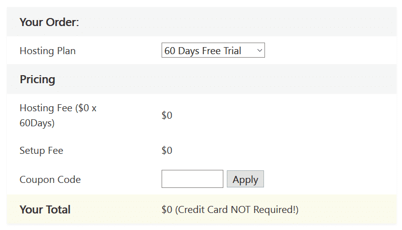
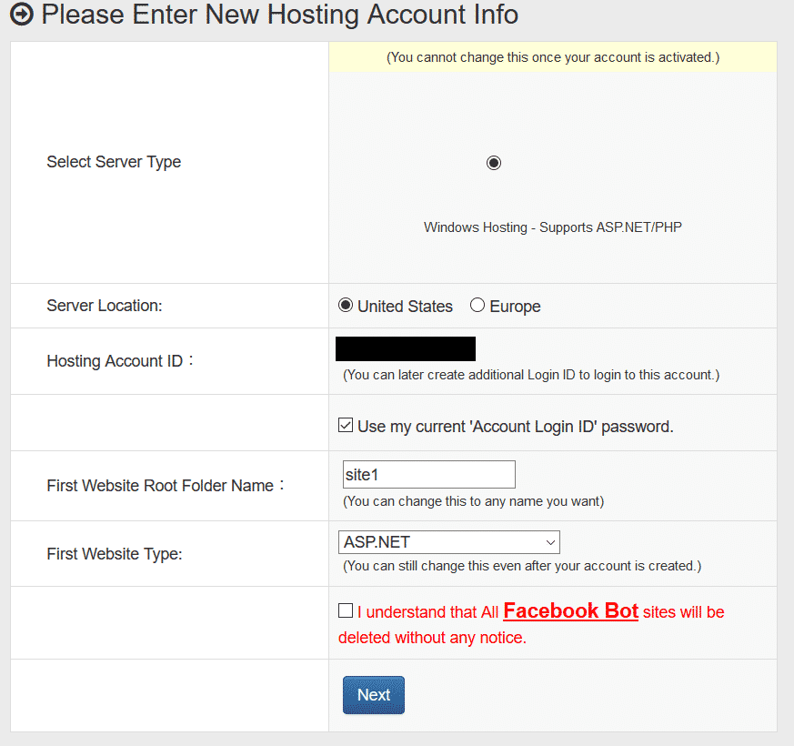
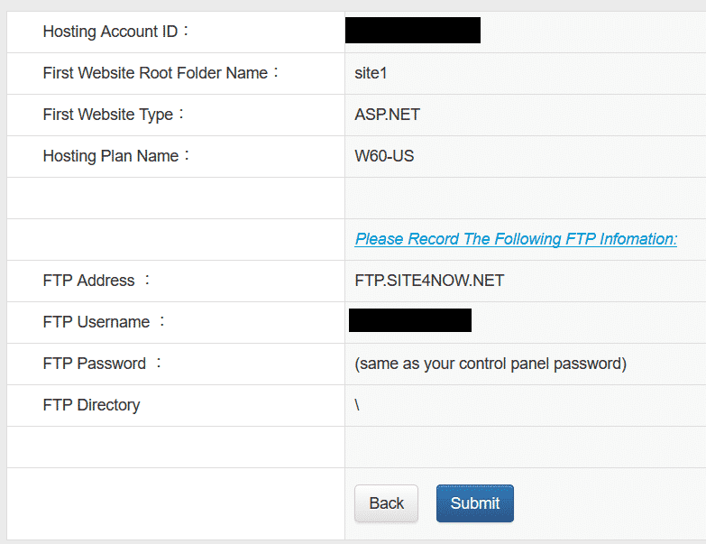
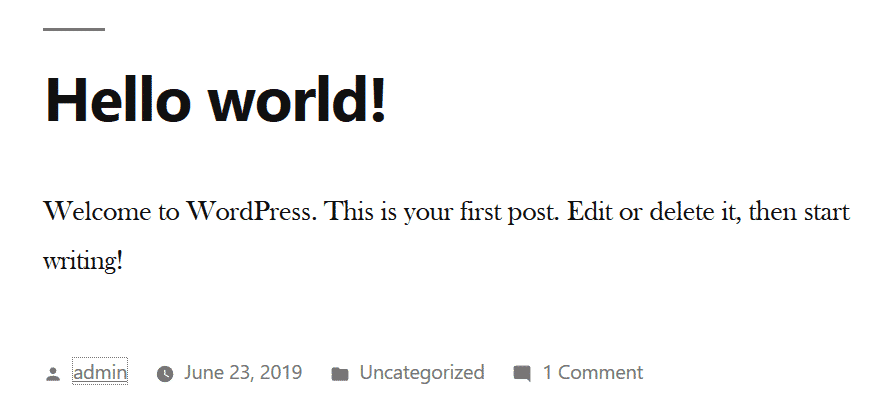
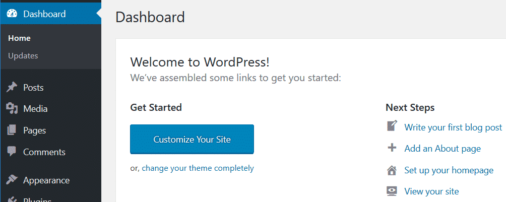
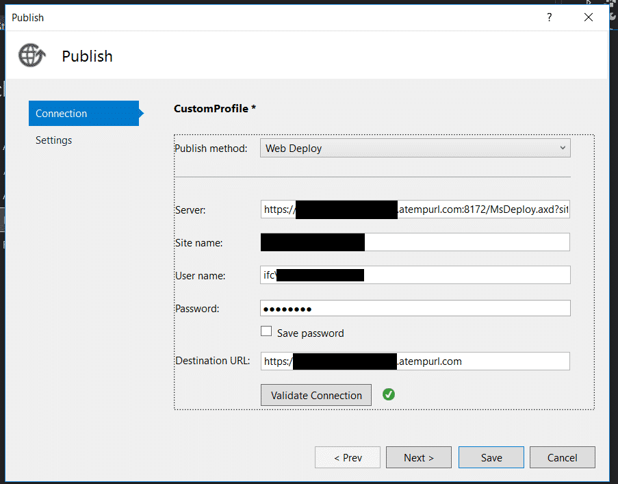
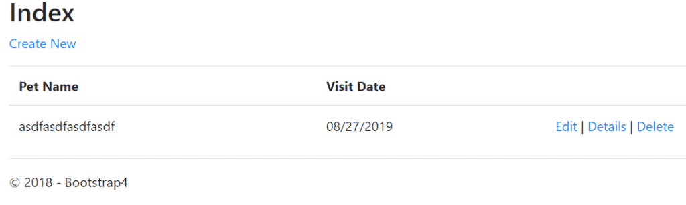

As a web developer and blogger, I've had the opportunity to research many web hosts. Whether you want to start a blog like the one you're reading now, or you're looking to host a personal web dev project, or create a home for your business, making the right decision for web hosting is really important. In this post, we'll examine your options for free 60 day trial web hosting.

While the industry-standard is a 30-day money-back guarantee, the following hosts give you extra time to make one of the most important decisions for your web project.

## [Smarter ASP.NET: The Free 60 Day Trial Web Hosting Winner](https://sensibledev.com/recommends/smarter-asp-3/)

[SmarterAsp](https://sensibledev.com/recommends/smarter-asp-2/) offers a 60 day web hosting trial, also with no credit card required. Despite the name, it's not _just_ for ASP.NET projects. SmarterAsp also has one-click installs for WordPress sites, Orchard, Joomla, and a number of other content management systems.

The hosting provider is well-regarded among people who use it, and the specs provided in the free trial should be more than enough for you to determine whether SmarterAsp is right for you.

Want more details? [Jump to the in-depth review](#smarter-asp-review).

## [No 60 Day Trial, But Still Good Web Hosting (And Even Better)](https://www.siteground.com/index.htm?afcode=c5cc41e025500c0cae3c318a5716593f&campaign=60DayTrial)

  For what most people need in a webhost, SiteGround is the name that keeps coming up. Speed and uptime are better than its competitors (see, for example, [this test](https://www.websitetooltester.com/en/blog/siteground-vs-bluehost/) and [this one](https://wpshout.com/siteground-vs-bluehost/)). SiteGround also comes out ahead in customer service reports when it comes to support. They also offer free site transfers, while others (such as Bluehost) charge a good amount of cash.

SiteGround is well-regarded on social media, as reflected in this reddit post:

"i always recommend Siteground. They are really easy to setup, have great support, solid uptime/servers, and are affordable!" - [ThisOnlineWorldBlog](https://www.reddit.com/r/Blogging/comments/84wye0/im_seeing_a_lot_about_self_hosting_is_siteground/dvt48tm?utm_source=share&utm_medium=web2x)

And these Tweets:

<blockquote class="twitter-tweet" data-lang="en">
I’ve just moved to siteground for speed purposes and I signed up for an offer for two years so I could lock in a good price!! It’s expensive up front but my old host were shocking 🤯
— Sophie ❥ Third Eye Traveller (@thirdeyetravelr) <a href="https://twitter.com/thirdeyetravelr/status/1159380080214364160?ref_src=twsrc%5Etfw">August 8, 2019</a></blockquote>

<blockquote class="twitter-tweet" data-lang="en">
I’ve always used SiteGround. Never any problems. Had my site speed below 1.5 secs at one point. Changed theme recently though so may have gone up.
— Owen Vachell (@OwenVachell) <a href="https://twitter.com/OwenVachell/status/1155931240270192641?ref_src=twsrc%5Etfw">July 29, 2019</a></blockquote>

If you're using WordPress in any capacity, SiteGround is a great choice.

[DigitalOcean](https://www.digitalocean.com/)

If you're a developer, and want a server environment to play around with, DigitalOcean has you covered. While you _can_ host WordPress on DO, you're required to do some server configuration. Not for the faint of heart if you're casually building a blog, but if you're a developer and want to get your technical hands dirty, DO is reliable and well-reviewed. You can try it out with [a $50, 30-day credit](https://try.digitalocean.com/performance) (the credit expires after a month, whether you've used it or not).

## How I Chose the Web Hosting Trials

To research this article, I scoured through dozens reviews of web hosts on authority sites and in social media, like Reddit and Quora. One of the things I immediately discovered was that it's _hard_ to find a web host that offers more than 30 days of a money-back guarantee, let alone those who don't require a credit card.

Why is that? Hard to tell, but my guess is that it's better for web hosting companies to have your payment information to begin with, and that 30-day trials convert better. I don't blame them; that's just good business.

In any case, I threw out any companies that didn't have _at least_ a 60 day free trial for web hosting.

If you're here looking for a free trial that long, I'm also assuming that you're on a tight budget. Those with hundreds or thousands of dollars to throw around probably don't care about an extra month of a free trial. That's why I excluded a result that comes highly recommended, but is most likely above a price point you're interested in. More on that later

I also wanted to exclude results that looked sketchy or outdated. Again, more details to come.

## [SmarterAsp: Best 60-Day Hosting Trial](https://sensibledev.com/recommends/smarter-asp-2/ "Smarter ASP 2")

So let's get the basic info out of the way. SmarterAsp offers a free 60-day trial for the web hosting, no credit card required.

It supports the latest versions of the .NET Framework, as well as .NET Core. Node.js is supported as well, along with standard web hosting features like email and cpanel one-click installers.

As far as SSL is concerned, it supports free certs through Let's Encrypt.

In short, it has all the standard features you need for ASP.NET hosting, as well as standard WordPress fare.

What do people have to say about SmarterAsp? It's generally well-regarded.

Here's a short sampling of reddit comments about the hosting provider:

"I've had my site on them for a while now and they have been great." - [Insight54](https://www.reddit.com/r/csharp/comments/30qf7s/smarteraspnet_web_hosting/cputpz6?utm_source=share&utm_medium=web2x)

"I've only been using them for a few months, but no complaints so far. Admin console is pretty easy to use, and prices are fair." - [JasonAtSBWP](https://www.reddit.com/r/webhosting/comments/4javfg/is_smarteraspnet_hosting_any_legit_they_seems_to/d3a3um9?utm_source=share&utm_medium=web2x)

"I like smarterasp for simple sites. Only drawback is a 3gb database limit. But they are very stable and cheap and have a nice gui." - [Source](https://www.reddit.com/r/dotnet/comments/4eolt7/good_net_host/d23oqhx?utm_source=share&utm_medium=web2x)

Speaking of that 3GB database limit, let's look at some specs.

## SmarterAsp Free Trial Details

The free trial comes with 1GB of webspace, 1 site, and 10GB of bandwidth. You also get 1 MSSQL database with a max size of 1GB.

This should be perfectly acceptable for testing purposes.

There are obviously different tiers once you convert to a paying member. SmarterAsp offers what it calls Basic, Advance, and Premium. These cost, per month, $2.95, $4.95, and $7.95 respectively.

All the paid plans claim unlimited webspace and bandwidth. Advance offers up to 6 sites, while Premium can host an "unlimited" number.

As far as the database options go, you'll get 1GB, 3GB, and 10GB across the three different tiers.

## Signing Up for SmarterAsp's Trial

Since the trial period is so long, I felt there was no harm in setting up a test account and taking all of you along for the ride.

Well, they weren't lying. You don't need a credit card, and it is free to sign up.

Signing up was pretty easy, just needed to pick a username and put in my email. You get this screen afterwards, which I thought was pretty funny:

Guess they _really_ want to spread the word about this trial.

After clicking the activation link and logging in, I was ready to start. But wait! What is this?

You're kidding me. In order to get the full 60 days, I have to share this on Facebook? What?

Not really happy about the bait and switch, SmarterAsp.

Since I left Facebook a long time ago, I'm going to skip that step and just live with a 30 day free trial.

Next, I need to add my phone number for two-factor authentication, I suppose.

And they are also picky about the phone number format. (You're seeing the max number of characters in the image.)

Okay, then.

The next screen tells me some info about the hosting account I'm setting up. I suppose they've been having problems with Facebook bots.

One final screen, and we're off.

But wait, a previous screen told me I was signing up for W30 _unless_ I shared something on Facebook. Now this screen tells me I'm signed up for W60, so did I not _actually_ have to share on FB? So confused.

Uh, yeah, actually. I'm happy you don't have to go on evil social media, but the interface has been misleading so far, to be sure.

So my account has been created. Now what? Let's try clicking on the big blue button that reads "Control Panel."

Why don't we try creating a new WordPress site. I'll click on "Apps Installer"...

And select the first option, WordPress.

After clicking next a few times, opting for default settings, and waiting around 4 minutes, I head over to my temporary url:

Hey, look! A default Wordpress site. Can I log into the admin area and edit stuff?

Yes! Yes, I can.

Okay, let's see if I can nuke the WordPress site and install a .NET app.

First, I'm going to head to the file manager. From this series of icons that came out of 2007, I'm assuming I need to select all the files and click the big red X?

Okay, that worked.

Next, I'm going to take an existing .NET Core web app and try publishing it. The app I'll publish is a toy app I made for [my book about .NET and Bootstrap 4](https://sensibledev.com/bootstrap-for-dot-net-devs/), designed to illustrate the concepts in the chapters.

I had to look up some things in the SmarterASP knowledge base, but here's what we should do.

1. Click on "Websites" from the main menu.
2. Click on Show Webdeploy info
3. Click VS Status to on.
4. Copy the webdeploy info into the deploy settings of our app.

In the .NET Core app, I right-click the name of the app, the click on "Publish." I need to select "IIS, FTP, etc.", and then fill in the appropriate information.

After validating the connection and heading out to my temporary url, hey! The site's there.

Troubleshooting tip: Visual Studio may open your site in a new browser tab automatically. It will try to reach the "https" version of the site by default. But if you don't have SSL configured yet, you'll get an error. Just drop the "s" and use "http".

If you're looking for more detailed setup instructions, look at [this SmarterAsp knowledge base article](https://www.smarterasp.net/support/kb/a1910/how-to-publish-asp_net-core-web-application-via-visual-studio-2017.aspx?KBSearchID=603352).

So how was my overall experience with SmarterAsp? Not too bad. Everything worked, and my project was up and running within a few minutes. My biggest complaint is that the interface feels outdated and clunky. The UI can be a little unintuitive, and clicking around the site can be _slow_. There was a few seconds of delay between each WordPress install setup page, for instance. Nothing about the UI feels unified, as if they built the control panel, then tacked on things as they needed it.

Despite that, SmarterAsp worked without too many headaches, and I can definitely recommend it if you're looking for cheap .NET web hosting without too many bells and whistles.

## The Others

**Accuweb**

[AccuWeb](https://www.accuwebhosting.com/web-hosting/windows-web-hosting/free-hosting) _used_ to provide an almost-unheard-of 90 day web hosting trial, with no credit card required for Windows hosting. However, this offer is currently listed as "out of stock" on the company's website. I'll keep an eye on this and give you updates if it surfaces again.

AccuWeb also provides free WordPress hosting. To my knowledge, it's the _only_ web host that provides free WordPress hosting which also allows custom domain names. That means you can have \`yoursite.com\` instead of \`wordpress.yoursite.com\`.

**WPEngine**

[WPEngine](https://wpengine.com/plans/) provides a 60-day money back guarantee, but, of course, you need to pay up front. So, it isn't completely free, but you could potentially use that 60 days to try it out regardless.

Looking through WPEngine's features, this platform is awesome. It's strictly a WordPress platform, so if you're looking to host a custom web app, or you're a hobbyist programmer looking for a home for your project, this isn't going to be for you.

You would choose WPEngine if you're a small or medium business looking for WordPress hosting with all the bells and whistles. Instead of trying to be everything to everyone, it focuses on optimizing WordPress sites for speed, outperforming hosts like Bluehost and Hostgater \[[source](https://blogging.com/wordpress-hosting/wp-engine/)\]. The platform includes tons of analytic data, free access to premium themes, and multiple staging environments.

The biggest reason I didn't make it my top choice is the price: $35 a **month** for the cheapest plan, on up to $290 a month for large-scale operations.

If you've already got the traffic, migrating to WPEngine might make sense to you.

But if you're concerned with getting an extra 30 days of free hosting compared to the industry standard, I hope it's okay that I assume you don't have a lot of cash to throw around.

And that's fine! Not all of us need to have the best, most premium web hosting experience.

Regardless, if it sounds like something you're interested in, give this one a click.

That's not something I'm going to tell you about HostBuddy, the only other host I could find with a truly free 60-day trial.

**HostBuddy**

[HostBuddy](https://www.hostbuddy.com/) provides ASP.NET hosting with a storage capacity of 1000MB, a monthly transfer limit of 10GB a month, and you're limited to 1 site.

It also comes with MS SQL and MySQL databases.

If you're not an ASP.NET developer, you can use the standard cpanel 1-click installs, like WordPress, Drupal, and others.

There's nothing necessarily _wrong_ about HostBuddy, but I can't really find anything to recommend about it either. The website looks like something out of 2008, and the few sparse reviews online are very polarizing: either 5-star or 1-star, with a number of complaints about poor customer service.

I can't find any mention of them on Reddit or Quora (aside from one person asking about them, with no responses).

In fact, though I've put a link to their site above, I'm not even going to make it an affiliate link, because I just don't feel comfortable recommending them.

Again, I really don't want to rag on this site too much, I just don't understand why you would trust your site there when much better, higher-reviewed hosting sites exist.

Speaking of which…

## Why Do you Need a 60-Day Web Hosting Trial?

I know you came here probably searching for something cheap. And how could I blame you? Especially when you're building something and are unsure of the idea. When I started this blog, I didn't know how long I would stick with it, or whether my vision would pan out.

But I can't tell you how happy I am to go with a trusted, reliable hosting provider instead of trying to save a few dollars.

If you skimp in this area, there's going to come a day when you find your host is wrong for your needs, and I can tell you that the time and money it will take to migrate your site isn't going to be worth saving a month's hosting costs. This is especially true when monthly hosting costs aren't typically over $10-$15.

Years ago, I had an account with a no-name hosting provider. (I won't name it because there's no need to rag on it.) The _only_ reason I chose it was that it was priced the lowest out of everything I could find.

I no longer have any sites on that provider, and don't intend on going back.

Why not research what it is that you _actually_ need, and be satisfied with the 30-day money back guarantee that most hosts offer? Now, I'm not trying to dissuade you from [choosing SmarterAsp](https://sensibledev.com/recommends/smarter-asp-2/ "Smarter ASP 2"). If you have a small to medium sized .NET web app, it's actually not a bad choice.

But if you want a WordPress site, top-tier speed, and highly-reviewed customer service, I would take a hard look at [SiteGround](https://www.siteground.com/index.htm?afcode=c5cc41e025500c0cae3c318a5716593f&campaign=60DayTrial).
