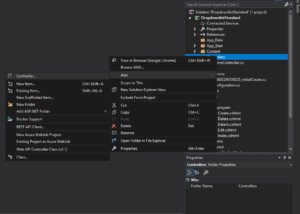
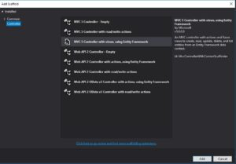
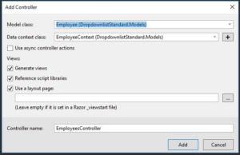

There are many times when we'll need to have HTML Select elements in our forms. ASP.NET gives us lots of options with the `DropDownList` and the `DropDownListFor` HTML helpers. This can make things easy for us, but the variety of options can make the process confusing for an MVC beginner. Let's demystify this process a bit with some simple, practical examples of how to bind DropDownList in MVC, both in ASP.NET and ASP.NET Core.

Let's pretend that we have a web application where we're trying to track employees and their worksites. We can represent these two entities with some simple models, like this:

public class Employee
{
    public int ID { get; set; }
    public string Name { get; set; }

    \[ForeignKey("Worksite")\]
    public int WorksiteID { get; set; }

    public Worksite Worksite { get; set; }
}

public class Worksite
{
    public int ID { get; set; }
    public string Name { get; set; }
}

When we create or update an Employee, we'll want the `WorksiteID` to be set from a select element. The basic form will look like the following:

<form action="/Employees/Create" method="post">

  <label for="Name">Name</label>
  <input id="Name" name="Name" type="text" />
  
  <label for="WorksiteID">Worksite</label>
  <select id="WorksiteID" name="WorksiteID">
    <option value="1">Corporate Office</option>
    <option value="2">Warehouse</option>
    <option value="3">Satellite Office #1</option>
    <option value="4">Satellite Office #2</option>
  </select>

  <input type="submit" value="Create" />
</form>

For simplicity's sake, I've removed a lot of things that really _should_ be in your final markup, like the AntiForgeryToken and form validation messages. However, this is the bare minimum that we need: a form that will POST to the Create action in the Employees controller, which will then insert a new employee into the database.

Let's start with how we would accomplish this in .NET Standard.

## DropDownList Examples in .NET Standard

When I'm learning something new in .NET, I like to take a look at how the .NET devs would have me do things. That doesn't mean I'll always take their advice, but, hey, they built the thing, so I might as well examine their examples.

To that end, I'm going to scaffold a new controller with views, using the Entity framework. If you're new to MVC, do this:

Right click on the Controllers folder in your project, then select "Add," followed by "Controller..."

From there, choose "MVC 5 Controller with views, using Entity Framework" from the dialog:

Finally, select the appropriate Model class (Employee in our case) and Data context class. You can leave the view options and controller name alone, as the defaults are what we want anyway:

Click on "Add." Visual Studio will create our Controller class in the _Controllers_ folder and CRUD views in a nested _Employees_ folder under _Views_. Awesome.

### DropDownList Razor Syntax

Let's check out what Visual Studio automatically generated for the Create view, so we can see an example of DropDownList in action.

@model DropdownlistStandard.Models.Employee

@{
  ViewBag.Title = "Create";
}

<h2>Create</h2>

@using (Html.BeginForm()) 
{
  @Html.AntiForgeryToken()
    
  

    <h4>Employee</h4>
    

    @Html.ValidationSummary(true, "", new { @class = "text-danger" })
    

      @Html.LabelFor(model => model.Name, htmlAttributes: new { @class = "control-label col-md-2" })
      

          @Html.EditorFor(model => model.Name, new { htmlAttributes = new { @class = "form-control" } })
          @Html.ValidationMessageFor(model => model.Name, "", new { @class = "text-danger" })
      

    

    

      @Html.LabelFor(model => model.WorksiteID, "WorksiteID", htmlAttributes: new { @class = "control-label col-md-2" })
      

          @Html.DropDownList("WorksiteID", null, htmlAttributes: new { @class = "form-control" })
          @Html.ValidationMessageFor(model => model.WorksiteID, "", new { @class = "text-danger" })
      

    

    

      

          <input type="submit" value="Create" class="btn btn-default" />
      

    

  

}

  @Html.ActionLink("Back to List", "Index")

@section Scripts {
  @Scripts.Render("~/bundles/jqueryval")
}

Okay, then! There's a _lot_ going on here, but what we're most concerned with is this line, the one that generates our select element:

`@Html.DropDownList("WorksiteID", null, htmlAttributes: new { @class = "form-control" })`

And if we hover over `DropDownList` we get this signature:

`DropDownList(string name, IEnumerable<SelectListItem> selectList, Object htmlAttributes)`

The first parameter will set the `name` and `id` attributes of the HTML select element. If the second parameter is null, then Razor will also look for an `IEnumerable<SelectListItem>`in the ViewData with a key matching that name. In other words, if the `name` parameter is "WorksiteID," Razor is expecting an `IEnumerable<SelectListItem>`in `ViewData["WorksiteID"]`or `ViewBag.WorksiteID` (which are two different ways of expressing the same thing). We'll discuss how to set this when we get to the controller.

The second parameter becomes useful when we want to bind our DropDownList with data from a Model or ViewModel. More on that later.

The final parameter accepts a generic object that we can use to set HTML attributes. In this example, we're using the parameter to set the `class` attribute to a Bootstrap CSS class. You could add properties to the object to set other attributes as well.

So that's one way of specifying a DropDownList using Razor syntax. You should also know that, if we don't care about the Bootstrap class, we can omit the second and third parameters altogether, like this:

`@Html.DropDownList("WorksiteID")`

This will give us the exact same select element, but without the `class` attribute.

### ASP.NET Controller Code for DropDownList

Now let's switch our focus to the back end, and take a look at our Controller file, _EmployeesController.cs_ in the _Controllers_ folder. Here are the relevant methods for creating a new Employee:

public class EmployeesController : Controller
{
  private EmployeeContext db = new EmployeeContext();

  // GET: Employees/Create
  public ActionResult Create()
  {
    ViewBag.WorksiteID = new SelectList(db.Worksites, "ID", "Name");
    return View();
  }

  // POST: Employees/Create
  // To protect from overposting attacks, please enable the specific properties you want to bind to, for 
  // more details see https://go.microsoft.com/fwlink/?LinkId=317598.
  \[HttpPost\]
  \[ValidateAntiForgeryToken\]
  public ActionResult Create(\[Bind(Include = "ID,Name,WorksiteID")\] Employee employee)
  {
    if (ModelState.IsValid)
    {
      db.Employees.Add(employee);
      db.SaveChanges();
      return RedirectToAction("Index");
    }

    ViewBag.WorksiteID = new SelectList(db.Worksites, "ID", "Name", employee.WorksiteID);
    return View(employee);
  }    

  protected override void Dispose(bool disposing)
  {
    if (disposing)
    {
      db.Dispose();
    }
    base.Dispose(disposing);
  }
}

I've taken out the rest of the controller methods like Edit and Delete so we can just focus on the Create process. In the GET action, there's only one line that's interesting, so it should jump right out at you:

`ViewBag.WorksiteID = new SelectList(db.Worksites, "ID", "Name");`

We need an `IEnumerable<SelectListItem>` in our Razor view, and creating a new instance of the SelectList class does exactly this. The first parameter uses Entity Framework to get every row in the Worksites table. We use the second parameter to specify which database field to use for the SelectListItem Value, and the third parameter to specify which field to use for the SelectListItem Text. This will then render as the `value` and `text` attributes on the select element.

The only counter-intuitive part here is the naming of the ViewBag key. If we were striving for clarity, we would probably name this something like `ViewBag.Worksites`, and not `ViewBag.WorksiteID`, since the variable type is an `IEnumerable` and not an `int`. However, we need the select element to have a `name` attribute of "WorksiteID" so that our model will bind properly when we POST.

Since the DropDownList name parameter is used to render the name of the HTML element _and_ to specify the ViewData key we're looking for, we're stuck with this weird naming convention for now.

Here's something else to notice that can be a sticking point. Take a look at the POST method. If the Model is valid, we'll add the Employee to the database, then redirect to the `Index` action. However, if the Model isn't valid, **we need to rebind the DropDownList** by setting `ViewBag.WorksiteID` again. This is because the ViewData values don't persist across requests. If you don't grab the Worksite values again, your users will get an error instead of being able to see their form.

### DropDownListFor and a Strongly-Typed ViewModel

The approach so far will certainly work, and you shouldn't feel too bad for using it, but it does have some shortcomings. Despite the way it looks, the ViewBag isn't strongly typed. Go ahead, try getting Intellisense to autocomplete your ViewBag keys in the Razor view. It won't work. `ViewBag.WorksiteID` is the exact same thing as `ViewData["WorksiteID"]`.

"WorksiteID" is just a magic string. Thus, you open yourself to typing mistakes, and if you ever have to refactor, you'll need to hunt down every instance instead of having Visual Studio assist you.

Having a strongly-typed ViewModel makes your code more robust. Let's take a look at how we would do that. Here's our ViewModel class:

public class EmployeeViewModel
{
  public int ID { get; set; }
  public string Name { get; set; }
  public int WorksiteID { get; set; }

  public IEnumerable<Worksite> Worksites { get; set; }
}

In the controller, we'll want to populate the Worksites property with the Worksites from the database.

// GET: Employees/Create
public ActionResult Create()
{
  var viewModel = new EmployeeViewModel();
  viewModel.Worksites = db.Worksites;

  return View(viewModel);
}

Finally, in the view, we'll want to change the model type from `Employee` to `EmployeeViewModel` at the top of the file. Then, we'll change the line with `@Html.DropDownList` to this:

`@Html.DropDownListFor(model => model.WorksiteID, new SelectList(Model.Worksites, "ID", "Name"))`

The first parameter is a lambda expression that identifies which property in the model we're going to bind to. This will set the `name` and `id` attributes to "WorksiteID". The second parameter is an `IEnumerable<SelectListItem>` that comes from our ViewModel.

### Setting the Selected Value of the Dropdown

When we started looking at our controller methods, we began with Create methods. In the Edit methods, you'll need a way to set the selected value, so the user's previous choice can show up in the form as expected.

When you create the `IEnumerable<SelectListItem>`, just add the selected value as an extra parameter, like this:

public ActionResult Edit(int? id)
{
  if (id == null)
  {
      return new HttpStatusCodeResult(HttpStatusCode.BadRequest);
  }
  Employee employee = db.Employees.Find(id);
  if (employee == null)
  {
      return HttpNotFound();
  }
  ViewBag.WorksiteID = new SelectList(db.Worksites, "ID", "Name", employee.WorksiteID);
  return View(employee);
}

If you're using a ViewModel, you would use the same exact same syntax to set the selected value when you create the SelectList, like this:

`@Html.DropDownListFor(model => model.WorksiteID, new SelectList(Model.Worksites, "ID", "Name", Model.WorksiteID))`

### Adding an Extra Option at the Beginning of the Select Element

Let's say we wanted to add an extra option to the select, maybe a blank item or a helpful message, like "Please choose a worksite..." With a ViewModel and `DropDownListFor`, we would just add the text of the message as a third parameter:

`@Html.DropDownListFor(model => model.WorksiteID, new SelectList(Model.Worksites, "ID", "Name"), "Please select a worksite...")`

If you're using `DropDownList` instead, the parameter for the `optionLabel` comes third:

`@Html.DropDownList("WorksiteID", null, "Please select a worksite...", htmlAttributes: new { @class = "form-control" })`

## Bind DropDownList in ASP.NET Core

Now we switch gears to .NET Core. Here, I'm using [Razor Pages](https://docs.microsoft.com/en-us/aspnet/core/mvc/razor-pages/?tabs=visual-studio), so there's a bit of a difference in the controller syntax. However, as far as binding the dropdown data, there isn't much difference at all, except that `ViewBag` is no longer available. Here's the `PageModel` for creating a new Employee:

public class CreateModel : PageModel
{
  private readonly Dropdownlist.DAL.ProjectContext \_context;

  public CreateModel(Dropdownlist.DAL.ProjectContext context)
  {
    \_context = context;
  }

  public IActionResult OnGet()
  {
    ViewData\["WorksiteID"\] = new SelectList(\_context.Worksites, "ID", "Name");
    return Page();
  }

  \[BindProperty\]
  public Employee Employee { get; set; }

  public async Task<IActionResult> OnPostAsync()
  {
    if (!ModelState.IsValid)
    {
      ViewData\["WorksiteID"\] = new SelectList(\_context.Worksites, "ID", "Name");

      return Page();
    }

    \_context.Employees.Add(Employee);
    await \_context.SaveChangesAsync();

    return RedirectToPage("./Index");
  }
}

Like before, we're grabbing the Worksites from the database, creating an `IEnumerable<SelectListItem>`, and then stuffing that into the ViewData.

You could, alternatively, create a ViewModel and assign the `IEnumerable<SelectListItem>`into a property, in the same way that we did with .NET Standard earlier.

One glitch that I ran across when automatically scaffolding was that, in the POST method, line 23 was missing. This is the line that re-binds the dropdown if there's a model error, and we need to reload the page. Without that line, my select element no longer had any options. Bear in mind that .NET Core is newer than .NET Standard, and there are still issues to be solved. I've actually found a number of other (small) glitches in the scaffolding, like inconsistent alignment, so keep an eye out.

### Using Tag Helpers in the .NET Core View

The view in .NET Core gets a little more interesting. Tag Helpers are an alternative to HTML Helpers, and keep the markup a bit closer to HTML. Here's the select element in the view, using Tag Helpers:

`<select asp-for="Employee.WorksiteID" class="form-control" asp-items="ViewBag.WorksiteID"></select>`

The `asp-for` tag sets the `name` and `id` attributes to "WorksiteID". The `asp-items` tag specifies the  `IEnumerable<SelectListItem>`with our worksite data.

Personally, I find that this makes the code a bit easier to read in the context of the HTML document. You can see [Microsoft's own documentation about the difference between Tag Helpers and HTML Helpers](https://docs.microsoft.com/en-us/aspnet/core/mvc/views/tag-helpers/intro#tag-helpers-compared-to-html-helpers), but overall, I like the Tag Helpers better.

If you don't agree, however, _you can still use_ the `DropDownList` and  `DropDownListFor` HTML helpers, since this is still a Razor document.

One last curiosity: even though `ViewBag`is no longer supported in the controller, you can still use `ViewBag` in the Razor view. In fact, even though you _can_ use `ViewData` for the `asp-items` tag_,_ the `ViewBag` syntax is cleaner. With `ViewData` , you'd have to do some uglier casting, like this:

`asp-items="(SelectList)@ViewData["CourseID"]"`

## How to Bind DropDownList in MVC: A Summary

Here's a quick cheat sheet of the strategies used in this guide:

### Using DropDownList and ViewData in ASP.NET MVC

In the Controller:

`ViewBag.WorksiteID = new SelectList(db.Worksites, "ID", "Name");`

In the Razor view:

`@Html.DropDownList("WorksiteID", null, htmlAttributes: new { @class = "form-control" })`

### Using DropDownListFor and a ViewModel in ASP.NET MVC

In the Controller, assuming we have a ViewModel with an IEnumerable of Worksite objects:

var viewModel = new EmployeeViewModel(); 
viewModel.Worksites = db.Worksites;

In the Razor view:

`@Html.DropDownListFor(model => model.WorksiteID, new SelectList(Model.Worksites, "ID", "Name"))`

### Using Tag Helpers in ASP.NET Core

In the controller:

`ViewData["WorksiteID"] = new SelectList(db.Worksites, "ID", "Name");`

In the Razor view:

`<select asp-for="Employee.WorksiteID" class="form-control" asp-items="ViewBag.WorksiteID"></select>`

Alternatively, you could make a ViewModel and use the Tag Helper in the same way, just assign the appropriate ViewModel property to asp-items.

Hopefully you've found this guide helpful and binding your DropDownLists will be a bit easier in the future.
