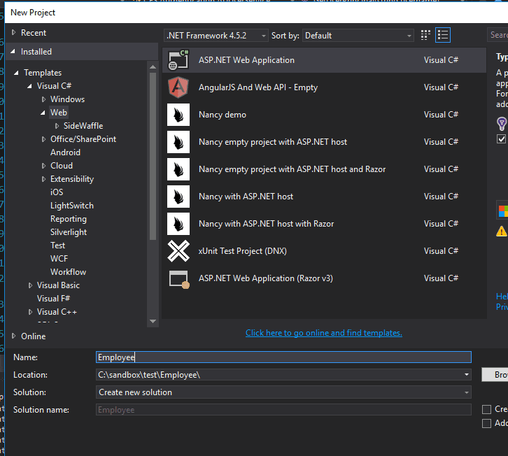
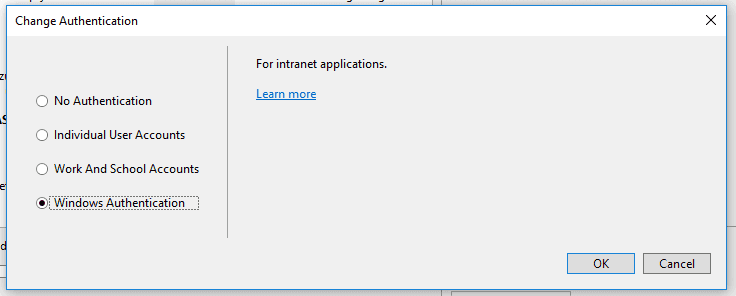
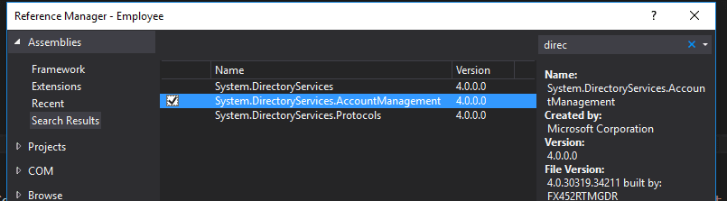
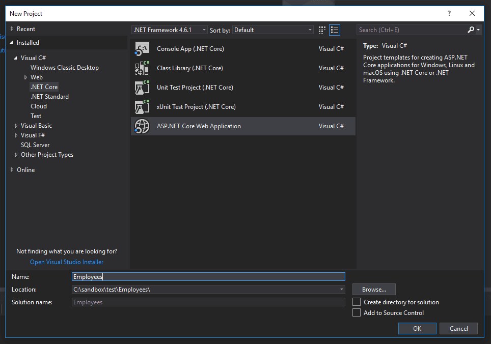
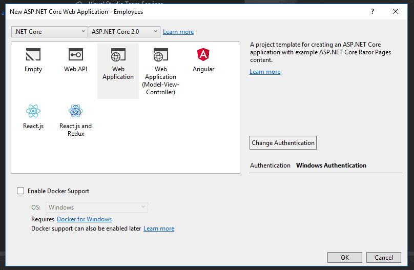
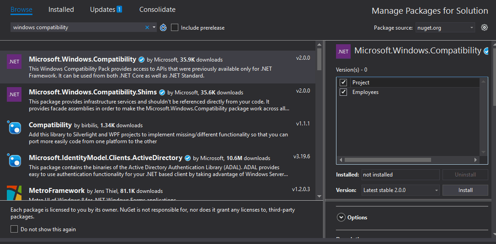

In my day-to-day work, I operate in a Windows environment. Most of the applications I create are intranet applications designed by used only by our employees. Because of this, a good deal of our authentication process comes from Active Directory properties. When I first started, I learned how to traverse Active Directory with DirectorySearcher, which, in hindsight, was an incredible pain. Now, in order to grab AD properties, I use the PrincipalContext class, which is much easier. What I'd like to demonstrate in this article is how to get user details from Active Directory in both MVC 5 and .NET Core.

## Active Directory and MVC 5

Let's begin by creating a new MVC 5 project. We'll use this project to test out our Active Directory access.

Make sure that you set the authentication type to Windows.

Once you've created the project, head over to the Index view at _Views/Home/Index.cshtml._ Change the markup to this:

@{
    ViewBag.Title = "Home Page";
}

@ViewBag.UserName

We'll use this (very naive) implementation to display our AD attributes. We could also simply set a debugging breakpoint and inspect the variables as they are assigned values. We're really just concerned with the method of retrieving Active Directory values at this point.

Navigate to _Controllers/HomeControllers.cs_. Add this to the Index action:

public ActionResult Index()
{
  ViewBag.UserName = User.Identity.Name;
  return View();
}

Since we're using Windows authentication, the MVC Identity system stores the logon name as the user name. If we run our project, our home page has this to show us:

DOMAIN\\Matthew.Sinex

Great! That's a good start. However, if we want to get any additional AD details, we'll have to do something different. You'll have to add a reference to the `System.DirectoryServices.AccountManagement` assembly.

Once that's done, we can use a `PrincipalContext` to find our user and get our Active Directory information. You'll still need to grab the username from the user's Identity in order to get the user in the first place. The username is then used to create a UserPrincipal. In the controller, change the code to this:

using System.DirectoryServices.AccountManagement;

public ActionResult Index()
{
  var username = User.Identity.Name;

  //depending on your environment, you may need to specify a container along with the domain
  //ex: new PrincipalContext(ContextType.Domain, "yourdomain", "OU=abc,DC=xyz")
  using (var context = new PrincipalContext(ContextType.Domain, "yourdomain"))
  {
    var user = UserPrincipal.FindByIdentity(context, username);
    if(user != null)
    {
      ViewBag.UserName = user.Name;
      ViewBag.EmailAddress = user.EmailAddress;
    }
  }

  return View();
}

From the UserPrincipal object, we can get our Active Directory information. The naming of this type of object confused me for a while, and I'm still not sure that I understand the reason behind it.

A **Principal object** needs to return an Identity object, and has to implement the `IsInRole` method. In that sense, a Principal object is a holder for the user's Identity and Roles, and you can think of it as a context for user security.

This method works really well. However, the list of Active Directory properties on the UserPrincipal is not complete. This isn't surprising, given that there are hundreds of potential properties. If you need an attribute that isn't part of the UserPrincipal, you'll have to add a reference to the `System.DirectoryServices` assembly and use this code:

using System.DirectoryServices;
using System.DirectoryServices.AccountManagement;

public ActionResult Index()
{
  var username = User.Identity.Name;

  using (var context = new PrincipalContext(ContextType.Domain, "yourdomain"))
  {
    var user = UserPrincipal.FindByIdentity(context, username);

    DirectoryEntry directoryEntry = user.GetUnderlyingObject() as DirectoryEntry;
    ViewBag.Department = directoryEntry.Properties\["department"\].Value.ToString();
  }

  return View();
}

If you're doing this multiple times in different areas, you could also consider writing an extension method. [This StackOverflow post](https://stackoverflow.com/a/1788786) is a great example of what you could do. Here's some sample code, where we also add some error checking in cases where the property doesn't exist:

using System;
using System.Collections.Generic;
using System.Linq;
using System.Text;

using System.DirectoryServices;
using System.DirectoryServices.AccountManagement;

namespace MyExtensions
{
  public static class AccountManagementExtensions
  {

    public static String GetProperty(this Principal principal, String property)
    {
      DirectoryEntry directoryEntry = principal.GetUnderlyingObject() as DirectoryEntry;
      if (directoryEntry.Properties.Contains(property))
          return directoryEntry.Properties\[property\].Value.ToString();
      else
          return String.Empty;
    }

    public static String GetDepartment(this Principal principal)
    {
      return principal.GetProperty("department");
    }

  }
}

You would then keep adding the static methods for whichever properties you needed. You could implement that in your controller by including the extension namespace, and then simply calling the appropriate method on the UserPrincipal.

using System.DirectoryServices.AccountManagement;
using Employee.MyExtensions;

public ActionResult Index()
{
  var username = User.Identity.Name;

  using (var context = new PrincipalContext(ContextType.Domain, "yourdomain"))
  {
    var user = UserPrincipal.FindByIdentity(context, username);

    ViewBag.Department = user.GetDepartment();
  }

  return View();
}

## Active Directory in .NET Core

Let's turn our attention now to .NET Core. We'll create a new project in Visual Studio 2017.

On the next screen, again, make sure to change the authentication type to _Windows Authentication_.

We'll follow the same steps as before, starting with a simple way of grabbing the username from the user's Identity. Change the razor markup in _Pages/__Index.cshtml_ to this:

@page
@model IndexModel
@{
    ViewData\["Title"\] = "Home page";
}

@ViewData\["EmployeeName"\]

Then, in the PageModel for the same page, add this to the `OnGet` method.

public class IndexModel : PageModel
{
  public void OnGet()
  {
    ViewData\["EmployeeName"\] = User.Identity.Name;
  }
}

Which gives you this:

DOMAIN\\Matthew.Sinex

As with our MVC 5 example, if we wanted just the name, then we would be fine. Otherwise, we'll need to use the `DirectoryServices` assembly. Unfortunately, this assembly isn't included by default in .NET Core. Until somewhat recently, .NET Core did not have any native support for Active Directory at all. However, Microsoft has released the Windows Compatibility Pack for .NET Core. Installing this via Nuget will install the references that we need.

We can then use the same techniques we used earlier to grab attributes from Active Directory.

using System.DirectoryServices.AccountManagement;

public void OnGet()
{
  var username = User.Identity.Name;

  using (var context = new PrincipalContext(ContextType.Domain, "yourdomain"))
  {
    var user = UserPrincipal.FindByIdentity(context, username);
    if (user != null)
    {
        ViewData\["UserName"\] = user.Name;
        ViewData\["EmailAddress"\] = user.EmailAddress;
    }
  }
}

And, similarly, we can create extension methods if we want to access the complete set of Active Directory attributes.

One caveat here is that the Windows Compatibility Pack will not be available to those of you who are running Linux environment. If that's your case, then the standard way of using Active Directory from .NET Core seems to be to use Novell's LDAP libraries. Here are a few guides to that to get you started:

[.NET Standard LDAP client library](https://github.com/dsbenghe/Novell.Directory.Ldap.NETStandard)

[.NET Core LDAP](https://long2know.com/2017/06/net-core-ldap/)

## Using Active Directory User Details in Authorization Policies

Thinking about how we could use these techniques further, let's discuss how you might use the AD user details in an authorization policy. [**Policy-based authorization**](https://docs.microsoft.com/en-us/aspnet/core/security/authorization/policies?view=aspnetcore-2.1) is a way to use requirements in .NET Core to authorize users. It's more flexible than role-based authorization, because you can create your own logic around the user's properties.

Let's say that we want a policy regarding the "department" Active Directory attribute where we only want employees from the Information Technology department to access certain pages.

Start by creating two classes: a class for a requirement, and a class for an authorization handler. The requirement is a collection of properties that we can use to evaluate the policy. In our case, we only care about the user's department, so our requirement class will only have one property.

using Microsoft.AspNetCore.Authorization;

public class DepartmentRequirement : IAuthorizationRequirement
{
  public string Department { get; set; }

  public DepartmentRequirement(string department)
  {
    Department = department;
  }
}

Next, we create the authorization handler, which contains the logic for evaluating the user's department.

using Microsoft.AspNetCore.Authorization;
using System.DirectoryServices;
using System.DirectoryServices.AccountManagement;

public class DepartmentHandler : AuthorizationHandler<DepartmentRequirement>
{
  protected override Task HandleRequirementAsync(AuthorizationHandlerContext context, DepartmentRequirement requirement)
  {
    var username = context.User.Identity.Name;

    using (var ctx = new PrincipalContext(ContextType.Domain, "yourdomain"))
    {
      var user = UserPrincipal.FindByIdentity(ctx, username);
      if (user == null)
      {
        return Task.CompletedTask;
      }
      else
      {
        DirectoryEntry directoryEntry = user.GetUnderlyingObject() as DirectoryEntry;
        var userDepartment = directoryEntry.Properties\["department"\].Value.ToString();
        if(requirement.Department == userDepartment)
        {
          context.Succeed(requirement);
        }
      }
    }
    return Task.CompletedTask;
  }
}

We retrieve the user's department from Active Directory, and compare it to the department in the requirement. If they're the same, the user is authorized.

Finally, we need to add these lines to the ConfigureServices method in _Startup.cs_:

public void ConfigureServices(IServiceCollection services)
{
  services.AddMvc();

  services.AddAuthorization(options =>
  {
    options.AddPolicy("WorksInIT", policy => policy.Requirements.Add(new DepartmentRequirement("Information Technology")));
  });
  services.AddSingleton<IAuthorizationHandler, DepartmentHandler>();

  services.AddAuthentication(IISDefaults.AuthenticationScheme);
}

Here, we've added a new policy and called it "WorksInIT." In our constructor for the `DepartmentRequirement`, we've specified the department we're checking for as "Information Technology." Following our logic, if the user's Active Directory department matches "Information Technology," then they'll be authorized.

The last line is added in order to handle unauthenticated results. Without this, you'll get a run-time error when the user fails the authorization check. With the `IISDefaults.AuthenticationScheme` line added, our application will throw a 403 Forbidden response, as expected.

In order to use this on a Razor page or controller action, we would add this to the code:

namespace Employees.Pages
{
  \[Authorize(Policy = "WorksInIT")\]
  public class IndexModel : PageModel
  {
    public void OnGet()
    {
      //do IT only stuff
    }
  }
}

## How to Get User Details from Active Directory: Summary

In this article, we've looked at how to get user details from Active Directory, even those properties that might be obscure. The approaches here have several advantages over older methods, like readability and brevity. I hope you've found this helpful, and that accessing AD details is now easier for you. Happy coding!
