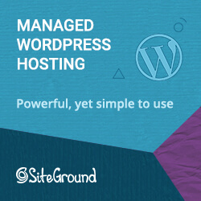

Starting a blog can seem like a scary thing, but if someone like me can do it, just about anyone can. This post is geared especially towards developers wanting to put their coding thoughts down in digital ink. In order to commemorate the two-year anniversary of this very blog, I think it might be interesting to pull back the curtain for a minute. If you give me a few minutes, I'll guide you through the step-by-step of how to start a programming blog.

## Why Start a Programming Blog

Why might you want to start a developer blog in the first place?

### Track Your Progress

Keeping a programming blog is a great way to track your progress as a developer. Sometimes it's easy to get caught up in "imposter syndrome" and doubt ourselves and abilities. Growth is gradual, and you really don't feel that different from the person you were the day before.

If you have a record of what you've done, you can look back to definite proof that you've grown in your skills. I look back at some of my earlier posts here where I was writing about ASP.NET Web Forms... because I was still using them at work. (Yes, just a few years ago. Thankfully, I since convinced them to make the switch to MVC. I'm in the process of just now updating to .NET Core.)

I can proudly say that I'm getting better at what I do, even when I'm tempted to not feel that way.

### Create a Personal Coding Repository

And no, I don't mean, like, a GitHub repository (though those are important too).

How many times have you stared at your screen and thought, "How do I do X? And didn't I just Google this last week for the dozenth time?"

Blogging can help with that.

For instance, my blog post on [How to Get the Base URL in ASP.NET](https://sensibledev.com/how-to-get-the-base-url-in-asp-net/) is an answer to question I could just never remember, but I needed to answer frequently.

Creating a blog can be a good way to keep track of questions and answers like these. The advantage over a mere code repository is that you're including context and explanation on a blog. I know, you could add comments to your code snippets on GitHub, but... do you?

Blogging encourages discussion, and explaining something to someone else (including future you) is a great way to _learn_ as well.

### Become Part of a Community

One of the best feelings is when someone comments on one of my posts telling me that it helped them solve a problem. I know when I read a blog post and it provides the answer to something I've been struggling with in a clear and simple way, I'm extremely grateful to the poster. I know this doesn't make a "community" in the formal sense of the world, but if you want to work at it, you could definitely find people to collaborate worth or call friends.

But even if it doesn't get that formal, providing something useful to other people is, you know, part of the point of living. Now, that doesn't mean you have to write from a place of ego, or that the comments on your blog should determine your comment.

Doing good in the world, even in small ways, is the way we ought to orient ourselves anyway. In my case, if a handful of people save some time because I'm sharing my web dev experience, I think that's great.

### Monetize your Writing (Eventually)

Ah, yes: money. Maybe that's why you clicked on the link, and I don't blame you.

I'll share a secret with you: I started this blog originally because I wanted to make some side income. I'll be perfectly honest, though. It's been a long time and a lot of work, and Sensible Dev still doesn't make much money.

Part of that's my fault. There was a period where the work got tough and I wasn't seeing the returns I really wanted. One thing I've seen over and over from other, much more successful bloggers, is that consistency is key, and I'm just not there yet. (But I'm trying.)

What I will share with you in the rest of post isn't a quick, easy path to passive income. Such a thing _simply doesn't exist_.

However, if you follow the steps here, I will promise you two things. First, if you _do_ decide to monetize, you'll have a solid foundation. Second, if you don't, you'll at least have a blogging system that's simple and will provide you the support you need to keep writing and sharing.

At the end of this post, I'll share some next steps on how begin thinking about making money. But for now, let's look at how to set up your website.

## Choose a Domain Name

I recommend choosing and buying a domain name first. This will be the name your readers search for and type in to visit your site.

So how do we choose a name? Pick a domain that's:

- **Easy to remember and say.** You should be able to say it to someone and not have to spell it out. _That means no hyphens or special characters._ E.g. "SensibleDev.com," not "Sensible-Dev.com". No one is going to remember to type your hyphen.
- **Short, no more than a word or two.** Same idea as above. You don't want your audience to have to remember an entire sentence just to get your content.
- **Make it a .com site.** While _.io_ or _.dev_ could work if this is a purely personal blog, consider sticking to .com if you want a wider audience. It'll be easier for people to remember.
- **Related to what you'll write about, but not incredibly narrow.** The first part of this advice is obvious: your domain name should relate to your content. But you also want to pick a name that isn't just about one subtopic. That's going to limit you and your blog. For instance, I was considering the name "DotNetNuggets" for this site, but then I would feel reluctant to write about web dev beyond .NET technologies. It would have been too limiting.

Here are a few sites to help you brainstorm:

[Name Mesh](https://www.namemesh.com/)

Enter a few keywords and Name Mesh will give you available suggestions. Some of them are novel or a bit bizarre, but the results might get you thinking.

[Lean Domain Search](https://leandomainsearch.com/)

Enter a keyword and this site will generate .com name suggestions with the keyword in it. Very useful to get quick list of ideas.

Now that you've chosen a name for your site, it's time to register it.

For every site I've owned in the past, I've used a name registrar that's _different_ from the web host. It is _possible_ to bundle the two and buy your domain name directly from your web host. However, I've found this is typically more expensive than buying the two services separately.

Others have often mentioned that having the domain name and host separately gives them peace of mind.

Let's say you get really fed up with your web host, their customer service starts sucking, and they're impossible to work with. In that case, you can just migrate your content over to a new web host, and your domain name isn't "held hostage" by a crappy company.

I think these fears are not nearly as big a concern as some people claim, but I've always kept them separate anyway.

I've always used NameCheap to buy domain names, and don't have much to complain about.

[**NameCheap**](https://www.namecheap.com/)

The only complaint I have is that the dashboard UI feels a little clunky. But I very rarely have to use that anyway, so I don't really care too much.

Now that we have our domain name in hand, it's time to find a place to host our insightful posts.

## [Choose a Web Host:](https://www.siteground.com/index.htm?afcode=c5cc41e025500c0cae3c318a5716593f) [SiteGround](https://www.siteground.com/index.htm?afcode=c5cc41e025500c0cae3c318a5716593f)

[SiteGround Web Hosting](https://www.siteground.com/index.htm?afcode=c5cc41e025500c0cae3c318a5716593f)

If I were going to start over, today, I would go with SiteGround as my web host.

Why SiteGround? Every report I've seen places it above other webhosts on metrics like page load speed and customer service. I go into more detail in my page on [Free 60 Day Trial Web Hosting.](https://sensibledev.com/free-60-day-trial-web-hosting/)

There are very few complaints, and a lot of people who really love using it.

Now, there are a lot of options out there to create and manage your posts. Some use GitHub pages, along with a static site generator like Jekyll. You might also be tempted to roll your own solution and just write the HTML and CSS by hand.

Honestly, seriously: **save yourself time by just going with WordPress.** The longer it takes you to see concrete results, the less motivated you're going to be to stick with it.

I know, you're a dev, and you love tinkering and building. That's what makes you a great developer! But in this case, building your blog from scratch without a CMS is just going to slow you down.

That goes _doubly, triply_ if you eventually want to monetize your blog_._

I know you want to be in control. I feel the same way.

But there's _already a solution_ to the million little things you'll want to do with your blog: theming, contact forms, SEO, analytics, syntax highlighting, affiliate links. WordPress has an entire ecosystem in place to take care of all of this, and more.

So just go with WordPress and stop worrying. You can be up and running in minutes instead of days or weeks.

## Select a Simple Theme

You're likely going to feel a lot of pressure to get your theme perfect. Hey, you can change the color scheme, add custom CSS, so why not make it "right" to begin with?

Because that takes too much time, and it's **_not going to make a difference_**.

Not for SEO. Not for finding readers.

All you need is something that works for now. And if you really want to make it prettier later, you can.

Your enemy right now is spending too much time on stuff that doesn't matter. A graphically stunning theme simply does not matter at this point.

What you need is **digestible, valuable content.** Provide something valuable to your readers that helps them solve a problem.

The only criteria for your blog theme right now is: does it look simple and uncluttered? Do you not _hate_ it? Find the first one of those that you like, and go with it, even if it's the default WordPress theme.

Or, find a blog you like, and run in through [What WordPress Theme is That?](https://whatwpthemeisthat.com/)

If you go there and type in this site's name, for instance, you'll get the following result:

Then, just go back into your WordPress dashboard and search for that theme. Presto! Done!

(Psst: I did something similar to find my theme in the first place.)

## Enlighter: Add a Syntax Highlighter

Since you're starting a programming blog, I'm assuming you'll want to put code samples in your posts. I suggest that you set up a syntax highlighter.

The one I use is called **Enlighter**.

In your WordPress dashboard, head to Plugins -> Add New, and search for "Enlighter."

Click on "Install Now," and then "Activate."

Scroll down on the WordPress dashboard until you get to the "Enlighter" icon, and then click it to go to the Settings page. (You can also click on "Plugins," then "Settings" next to Enlighter.)

You should see settings that look like this:

I'm perfectly happy with the default Enlighter theme, so you can keep that the way it is. I'd highly recommend changing the default language to whatever it is you work the most in.

Now, let's say you're making a post and want to insert a code snippet.

There are two ways (related to apparent) you might want to do this: **inline** or **block.**

Let's tackle **block** first.

Once you get to the point where you want to insert code, click on the **Code Insert** button:

Next, you'll get a popup where you can type in your code:

Next, let's tackle **inline**. This is appropriate for very short code snippets, the kind you would put inside a paragraph of text.

Get the the point in your sentence where you want to put code, and then click the **Code Insert** button again. Change the **Mode** drop-down to **Inline-Code** and type what you want.

Click **OK** and then finish typing. You'll see something like this:

So what does this look like on your rendered post? Like this:

One last tip. Sometimes your code is going to get long, horizontally. Ideally, you don't want to do this. It makes it harder for readers. However, we all know it happens, and sometimes it's difficult to avoid. Depending on your theme, you _may_ not get the scrollbars to move right and see the rest of the code.

To fix this, click on **Appearance** in your WordPress dashboard, then **Additional CSS**. Add the following styles:

.EnlighterJS{
   width: auto !important;
   overflow-x: scroll !important;
   word-wrap: normal !important;
}
.EnlighterJS li{
  white-space: pre !important;
}

Save it, and you'll be good to go. Again, you may or may not need this depending on your theme's styling.

_Update 04/16/2020:_

The actual way to achieve horizontal scrollbars is now to simply enable it in the plugin settings. In your WordPress admin, go to **Plugins**, then find **Enlighter** and click on _Settings_.

The third item on the settings page is a drop-down where you can tell Englighter to either break long code lines or have a scrollbar.

## How to Start a Programming Blog: Write, and Stick to a Schedule

This is the hardest one for me, honestly. But sooner or later, you're just going to have to get started, and keep going.

One of the things that helps is to clarify why you're doing this in the first place so you have clear goals in place. Maybe it's one that I listed in the beginning of the post, or maybe it's something else. Whatever the reason, keep that in mind during your writing journey as a guiding force.

Something that can help is to sit down and brainstorm around 10 or so topics that could be your next set of blog posts.

That could be something new you've tried at work or in a personal project. Maybe you've seen people talking about a new feature in your language and want to try it out.

Finally, set a schedule and try your best to stick to it. Put due dates for your posts on a calendar, or in an organizational tool like Trello.

But be honest, and be kind to yourself. If you don't have twenty hours a week to write blog posts, don't assume you're going to write that much.

## Extra Step: Continue Your Education with FIMP

Many of the lessons I brought to you in this post were gleaned from the _excellent_ Free Internet Marketing Project.

Want more advice on SEO, monetization, and the right mindset needed to make a success out of your blog. Maybe you don't care about making money on your blog, but you do care about growing your audience and really helping people out. FIMP has you covered there, too.

https://stoppingscams.com/FIMP/courses/free-internet-marketing-project/

I can't recommend it enough. And like the name says, it's completely free. There's no BS, no hard up sell, and no promises of instant riches. I also am _not_ an affiliate of the project, and do _not_ get compensated if you click the above link. It's just great information.

Keep coding, keep writing, and never stop learning.
