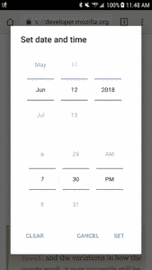

Bootstrap ships with ASP.NET projects by default, and it's a nice way to get modern styling into your web application easily. Sometimes web developers look for a datepicker plugin, as Bootstrap does not include one. Therefore, if you want your datepickers to be styled like Bootstrap, you'll need to turn to a third-party solution. In this article, we'll look at how to use Bootstrap datepicker in MVC. You may be surprised to know that there are _many_ datepicker options to use with Bootstrap. I'll describe how to use three of them, and then try to render a verdict on which one is the best.

## Setting up our MVC 5 Project

Let's pretend that we're making an application for employees to submit vacation requests. They'll need to select a date and submit a form.

### Initial Setup

We'll start by creating a new MVC project. We won't bother with authentication for the purposes of a demo. Ideally, in production, we'd set up authentication for managers and employees.

Next, create a simple VacationRequest model to track an employee's request for time off. Create a class in the Models folder with this code.

_VacationRequest.cs_

using System.ComponentModel.DataAnnotations;

public class VacationRequest
{
    public int ID { get; set; }
    \[Required\]
    public int EmployeeID { get; set; }
    \[Required\]
    public DateTime RequestDate { get; set; }
    public bool IsApproved { get; set; }
}

I'll use Entity Framework and a code first approach for database creation and queries. Run the following in the Package Manager Console to install Entity Framework:

Install-Package EntityFramework

Now, we need to create our database context for our Entity Framework queries.

_ApplicationContext.cs_

public class ApplicationContext : DbContext
{
  public ApplicationContext() : base("name=default")
  {
  }
  public DbSet<VacationRequest> VacationRequest { get; set; }
}

For testing purposes, I really only care about using a local database, so I'll add that connection string to my Web.config.

...
<connectionStrings>
  <add name="default" connectionString="Server=(localdb)\\mssqllocaldb;Database=TestDb;Trusted\_Connection=True;ConnectRetryCount=0" providerName="System.Data.SqlClient" />
</connectionStrings>
...

Finally, we'll create our initial migration and use Entity Framework to create our tables. Run these commands in the Package Manager Console.

Enable-Migrations

Add-Migration initial

Update-Database

Now we have the basic structure of our app ready, with our model in place and our database table created.

 

* * *

## Wait!

We're about to dive into setting up Bootstrap 4. Want to make your life a little easier?

Sometimes it helps to see code in context, with detailed explanations. You can get the upgrade instructions, and much more, right now in my work-in-progress book. It includes complete Visual Studio solutions in both MVC and .NET Core. Check out the sample chapters of [Bootstrap for .NET Devs](https://sensibledev.com/recommends/bootstrap-for-dot-net-datepicker-1/) instantly, for free. And, while it's still in beta, you can get it at a reduced price.

\[maxbutton id="4" url="https://sensibledev.com/recommends/bootstrap-for-dot-net-datepicker-1/" \]

* * *

 

### Installing Bootstrap 4

I'm going to assume that you're using the latest version of Bootstrap. I personally think that it has a lot of improvements over Bootstrap 3, including using flexbox for the column layout and some really neat utility classes, among other things.

If you're using an earlier version of Bootstrap, then the rest of the examples should still work, though I can't guarantee it. Any discrepancies should be fairly easy to debug.

I go into very extensive detail on how to install Bootstrap 4 in [a previous post about Bootstrap forms](https://sensibledev.com/mvc-bootstrap-form-example/). I'll summarize here, but you should probably follow along in the other post, especially if you're having trouble or questions.

Start by running this in the Package Manager Console:

Install-Package bootstrap -Version 4.1.1

Exclude the _index.d.ts_ file in the _Scripts_ folder. (For me, this throws an error unless you do some more setup. Your environment may not have this problem.)

Navigate to the _\_Layout.cshtml_ file in _Views/Shared_. Replace the div with the class `navbar` with this:

<nav class="navbar navbar-expand-lg navbar-dark bg-dark">
  

    @Html.ActionLink("Application name", "Index", "Home", new { area = "" }, new { @class = "navbar-brand" })
    <button type="button" class="navbar-toggler" data-toggle="collapse" data-target=".navbar-collapse" aria-expanded="false" aria-label="Toggle navigation">
      
    </button>
    

      <ul class="nav navbar-nav mr-auto">
        <li class="nav-item">@Html.ActionLink("Home", "Index", "Home", null, new { @class = "nav-link" })</li>
        <li class="nav-item">@Html.ActionLink("About", "About", "Home", null, new { @class = "nav-link" })</li>
        <li class="nav-item">@Html.ActionLink("Contact", "Contact", "Home", null, new { @class = "nav-link" })</li>
      </ul>
    

  

</nav>

You'll also want to add the Styles section to the head:

<head>
    <meta charset="utf-8" />
    <meta name="viewport" content="width=device-width, initial-scale=1.0">
    <title>@ViewBag.Title - My ASP.NET Application</title>
    @Styles.Render("~/Content/css")
    @Scripts.Render("~/bundles/modernizr")
    @RenderSection("styles", required: false)
</head

Navigate to _Content/Site.css_, and delete all of the CSS rules there.

Now we have a Bootstrap layout that, while not impressive, doesn't look broken.

## Creating a Controller and Views

Now, quickly, we're going to create a controller and views for our vacation requests. That way, we can test our Bootstrap datepicker in an actual, functional MVC form.

In the Solution Explorer, right click on the _Controllers_ folder and select _Add -> Controller..._

Choose _MVC 5 Controller with views, using Entity Framework_.

Then select the appropriate model and context.

Finally, let's set up our Create view to use the new Bootstrap 4 classes. We'll use this view to test out our Bootstrap datepicker.

Navigate to _Views/VacationRequests/Create.cshtml_ and replace the code there with this:

@model Vacation.Models.VacationRequest
@section Styles {
    
}
@{
    ViewBag.Title = "Create Vacation Request";
}

<h2>Create Vacation Request</h2>

@using (Html.BeginForm())
{
    @Html.AntiForgeryToken()
    @Html.ValidationSummary(true, "", new { @class = "text-danger" })

    

        

            @Html.LabelFor(model => model.EmployeeID)
            @Html.EditorFor(model => model.EmployeeID, new { htmlAttributes = new { @class = "form-control" } })
            @Html.ValidationMessageFor(model => model.EmployeeID, "", new { @class = "text-danger" })
        

    

    

        

            @Html.LabelFor(model => model.RequestDate)
            @Html.EditorFor(model => model.RequestDate, new { htmlAttributes = new { @class = "form-control" } })
            @Html.ValidationMessageFor(model => model.RequestDate, "", new { @class = "text-danger" })
        

    

    

        

            <input type="submit" value="Create" class="btn btn-primary" />
        

    

}

    @Html.ActionLink("Back to List", "Index")

@section Scripts {
    @Scripts.Render("~/bundles/jqueryval")
}

Now, run the project. If you navigate in your web browser to `http://localhost:YOURPORT/VacationRequests/Create`, you should see a very basic, but still functional, form.

Awesome. Now, we have a template that we can use to demonstrate how to use the Bootstrap datepicker in MVC.

* * *

## Do More With Bootstrap and .NET

Enjoying the article so far? If you want even more expert knowledge about merging Bootstrap with .NET web development, [_Bootstrap for .NET Devs_](https://sensibledev.com/recommends/bootstrap-for-dot-net-mvc-forms-1/) has you covered.

\[maxbutton id="4" url="[https://sensibledev.com/recommends/bootstrap-for-dot-net-mvc-forms-1](https://sensibledev.com/recommends/bootstrap-for-dot-net-instant-access/)/"  text="Give Me the eBook Now"\]

* * *

## How to Use Bootstrap Datepicker in MVC

As mentioned before, there are a number of different datepicker options to use with Bootstrap. I'll discuss the best ones, and rate them based on the following criteria:

- Looks
- Accessibility
- API

For the code samples in this section, I'm just going to include the new lines of code and enough context to figure out where to place it on the form. For example, I'll be putting Javascript code into the Scripts section, and omit the call to the jqueryval bundle. I'm assuming that you can figure out that you need to keep that there if you want to still use Unobtrustive jQuery Validation.

Speaking of jQuery, the default MVC project renders jQuery through the script bundle in the _\_Layout.cshtml_ file. For that reason, none of the examples below contain a reference to jQuery, even though the library will be rendered on the page.

All of these libraries are dependent on jQuery, though that shouldn't matter much to you, since Bootstrap requires jQuery anyway.

### [Gijgo: Bootstrap 4 DatePicker](http://gijgo.com/datepicker/example/bootstrap-4)

Size: 769kb

Size minified: 213kb

In order to install this version of the Bootstrap 4 datepicker, you just need to add the style sheet and Javascript to your page.  Then make a simple jQuery call.

@section Styles {
    <link href="https://cdn.jsdelivr.net/npm/gijgo@1.9.6/css/gijgo.min.css" rel="stylesheet" type="text/css" />
}

@section Scripts {
     @\* @Scripts.Render("~/bundles/bootstrap") \*@
     @\* Render the Bootstrap bundle here if you took it out of the main layout \*@
    
    
}

The style integrates well with Bootstrap, with border-radius edges and a generally "flat" look. The calendar icon is a nice touch, though it comes from Gijgo's own icon font. There's no easy way to change the icon out to something from, say, FontAwesome or Iconic's font set.

Another possible con is that the CSS and Javascript files include code for _all_ of the Gijgo widgets, including a datagrid, timepicker, and slider, among others. If you aren't going to use those components, this is unnecessary bloat.

The Gijgo datepicker also seems built with accessibility in mind, with role attributes defined on its elements.

There isn't much to this datepicker's API, and no options to speak of other than making it look like a Bootstrap 4 component.

### [Tempus Dominus](https://tempusdominus.github.io/bootstrap-4/)

Size: 120kb

Size minified: 63kb

There are many ways to install this version of the Bootstrap datepicker, including npm if you have that installed already. These and additional installation options can be found on the [installation page](https://tempusdominus.github.io/bootstrap-4/Installing/). For our purposes, we'll use the CDN.

Tempus Dominus requires [Moment.js](https://momentjs.com/), a date manipulation library. It also requires [Font Awesome](https://fontawesome.com/) for the icons, a requirement which is curiously absent from the documentation. This datepicker uses the class names from Font Awesome 4. If you want to use Font Awesome 5, the latest version, you'll need to override the defaults for some of the icons.

For the most basic setup, our form will need to look like this:

@model Vacation.Models.VacationRequest
@section Styles {
    <link rel="stylesheet" href="https://use.fontawesome.com/releases/v5.1.0/css/all.css" integrity="sha384-lKuwvrZot6UHsBSfcMvOkWwlCMgc0TaWr+30HWe3a4ltaBwTZhyTEggF5tJv8tbt" crossorigin="anonymous">
    <link rel="stylesheet" href="https://cdnjs.cloudflare.com/ajax/libs/tempusdominus-bootstrap-4/5.0.0-alpha14/css/tempusdominus-bootstrap-4.min.css" />
}

@using (Html.BeginForm())
{
  @\* ...omitted markup... \*@

  

    

      @Html.LabelFor(model => model.RequestDate)
      

        @Html.EditorFor(model => model.RequestDate, new { htmlAttributes = new { @class = "form-control datetimepicker-input", data\_target = "#requestDateTimePicker" } })
        

          
<i class="fa fa-calendar"></i>

        

      

      @Html.ValidationMessageFor(model => model.RequestDate, "", new { @class = "text-danger" })
    

  

  @\* ...omitted markup... \*@
}

@section Scripts {
  @\*@Scripts.Render("~/bundles/bootstrap")\*@
  @\* Render the Bootstrap bundle here if you took it out of the main layout \*@
  @Scripts.Render("~/bundles/jqueryval")
  
  

  
}

Note that while [the documentation](https://tempusdominus.github.io/bootstrap-4/Usage/) features a wrapper div with the `container` class, this wrapper div is already included in the default project's layout. That's why you don't see it here.

Tempus Dominus looks great, integrating very well into the Bootstrap 4 style. The default setup separates out the date and time picking into the same widget, with a slick animation to move between the two modes. Overall, I'd give this full marks for looks.

Initializing the library is a little unintuitive. For example, I would expect to call the `datetimepicker` function on the input, not on the wrapper div. The documentation also seems to be a little spotty at times, and the installation page even comes with the message "This guide still needs a lot of work" at the top.

However, I really like the extensive functionality of this plugin. Depending on your layout and options, you can specify time only, date only, no icon, enabled / disabled dates, disabled days of the week, and linked pickers.

My only criticism is that, at least on the usage page, Multidate and Setting options seem to be broken. (Either that, or I didn't understand how to use them).

Overall, I really like Tempus Dominus, and I'd like to see more work done with it to iron out the quirks in documentation.

### [bootstrap-datepicker](https://github.com/uxsolutions/bootstrap-datepicker)

Size: 73Kb

Size minified: 48Kb

After including the styles and scripts via the CDN, you can simply call the datepicker from Javascript.

@section Styles {
  <link href="https://cdnjs.cloudflare.com/ajax/libs/bootstrap-datepicker/1.8.0/css/bootstrap-datepicker.min.css" rel="stylesheet" type="text/css" />
}
@section Scripts {
  
  
}

You can also omit the Javascript call by including a `data-provide="date-picker"` attribute on the date input.

@Html.EditorFor(model => model.RequestDate, new { htmlAttributes = new { @class = "form-control", data\_provide="datepicker" } })

In terms of appearance, this version of the Bootstrap datepicker, by default, is still using the Bootstrap 2 styles. Notice the shadow on the selected date. This also applies to the selected month button. Starting with version 3, Bootstrap started to move away from skeuomorphic styles and towards flat design.

Something that isn't covered explicitly by the docs is that there's a version of the styles for Bootstrap 3. Just change the CDN url to:

https://cdnjs.cloudflare.com/ajax/libs/bootstrap-datepicker/1.8.0/css/bootstrap-datepicker3.min.cs

And you'll get a flatter look on the buttons:

The available options for this datepicker are quite extensive. You can set autoclose (something that I was really looking for in the other plugins), disabled dates, end dates, a today button, and many more. One option I really liked were the **beforeShow\[X\]** functions, like beforeShowDay and beforeShowMonth. These allow you to alter the content to display in the cell. These features are only the beginning of a very lengthy API.

On the accessibility front, I didn't see any roles defined that would help screenreaders parse the datepicker. If these are necessary in your environment, you'll want to look elsewhere.

### A Non-Bootstrap Option: Native Datepickers, or Do you really need a Bootstrap Datepicker?

Size: 0Kb

Size minified: 0Kb

Using native datepickers requires no extra libraries or Javascript calls. Simply specify the type of the input to either `date`, `time`, or `datetime-local`, like this:

@Html.EditorFor(model => model.RequestDate, new { htmlAttributes = new { @class = "form-control", type = "datetime-local" } })

You can also use data annotations in the model class, such as `[DataType(DataType.Date)]`. For more detailed instructions on this, see my post on [Bootstrap 4 Forms in MVC](https://sensibledev.com/mvc-bootstrap-form-example/).

If you want to add an icon (like my example above), just use this markup with normal Bootstrap classes:

  @Html.EditorFor(model => model.RequestDate, new { htmlAttributes = new { @class = "form-control", type = "datetime-local" } })
  

    
<i class="fa fa-calendar"></i>

  

This has the advantage of being the easiest datepicker to implement, with the smallest file size (of nothing). Its API is not as extensive as some of the other solutions, however. You can set minimum and maximum dates by using the `min` and `max` attributes, but that's about it.

Each browser renders this input in its own style. While this doesn't exactly match the Bootstrap style, I don't see that it clashes too much, and your users may be used to the native style anyway.

Perhaps the biggest argument for using the native datepicker is the mobile display. Here's what a datetime-local input looks like in Android's Chrome browser:

This interface is simple, clear, and makes excellent use of the screen real estate. You change the date by scrolling, a movement familiar on mobile devices.

The mobile displays of the third-party datepickers, on the other hand, range from awkward to broken.

_Gijgo: Keyboard takes up half the screen_

_Tempus Dominus: Pops above the input, calendar cut off_

_bootstrap-datepicker: tiny calendar_

For the mobile display alone, you may be better off sticking with the native implementation.

## How to Use Bootstrap Datepicker in MVC: Summary

We've looked at three different jQuery datepicker plugins to use with Bootstrap 4 and MVC. My favorite of the bunch is [Tempus Dominus](https://tempusdominus.github.io/bootstrap-4/) for its clean-looking interface, extensive API, and the fact that it's been updated to the Bootstrap 4 styles. However, before you use _any_ datepicker library, I would seriously consider simply using the native browser implementation.

 

If you're using MVC 5, you'll want to know how to get around the HTML5 date format specifications. There are some inconsistencies in the way that MVC renders the date value and the format that the browser expects. To solve this problem, I'd recommend checking out my book, [_Bootstrap for .NET_ _Devs_](https://sensibledev.com/recommends/bootstrap-for-dot-net-datepicker-2/).

\[maxbutton id="4" url="https://sensibledev.com/recommends/bootstrap-for-dot-net-datepicker-2/" \]

 

Happy coding!
