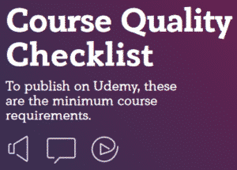
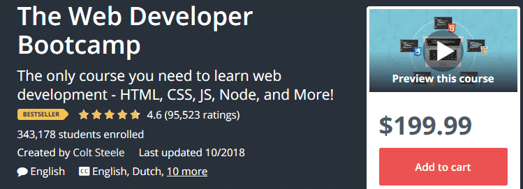
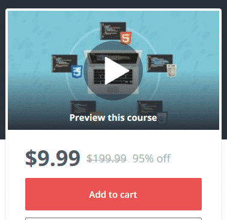

You've seen the ads. Udemy seems like it's everywhere, and I bet you've wondered about whether its courses are any good. Is Udemy legit? As a web developer always looking to improve my skills, I've wondered this myself.

In this article, I want to take a look at what Udemy is, how good it is, and how to avoid the bad courses. We'll also look at some reasons why you might want to look elsewhere for your online learning, and what the alternatives are.

Since I'm a .NET web developer, I have a special interest in evaluating learning platforms from a web dev angle. So don't be surprised when I use examples from that field.

That being said, most of my points about Udemy will apply to all of the categories on the site.

Let's dig in!

## Is [Udemy](https://sensibledev.com/recommends/udemy/ "Udemy") Legit?

The question that you're probably asking is something like this: **Can I find high-quality courses on Udemy that are worth the money?**

The answer is **yes**, but with the understanding that you have to be really scrupulous about which courses to take, and you ought to wait for a sale to buy them.

Udemy functions on a marketplace model, where just about anyone can submit a course. Students pay for the courses they want, and the good ones rise to the top while the bad ones drop off the radar. This puts the burden on you to look at the course reviews very carefully.

So are the courses good? For the highest-ranked courses, absolutely. If video courses are your thing, you can find hundreds of hours of quality content on Udemy.

Udemy courses sell anywhere from free to around $200. However, the site has frequent deep discounts that bring most courses down to around $10.

Udemy offers a 30-day money-back guarantee. If you don't like a course within the first month, you can get a full refund.

Once you buy a course, you have access to it for life, along with any updates that the instructor might push out. You can view the video lectures as often as you'd like.

## A Short Udemy Overview

Udemy offers online video courses in a wide variety of subject areas. You can take classes in:

- Software Development
- Business
- IT
- Office Productivity
- Personal Development
- Design
- Marketing
- Photography
- Music
- And more...

Udemy began as a project by Turkish developers Eren Bali and Oktay Caglar. They brought to project to silicon valley and launched Udemy, now with third co-founder Gagan Biyani, in 2010.

Today, Udemy is based in San Francisco, California with additional offices in Brazil, Ireland, and Turkey.

After eight years of growth and rounds of investor funding, Udemy boasts 80 thousands courses created by 35 thousand instructors and taken by 24 million students ([source](https://about.udemy.com/)).

That's a lot of courses for lots of students with varying skill levels and interests!

## What are Udemy Courses Like?

Udemy does have standards for the courses it offers. At minimum, a Udemy course must have:

- At least 30 minutes of video content
- At least 5 separate lectures
- Valuable educational content (course material should be designed with student learning in mind, not personal promotion)
- HD video quality (720p or 1080p)
- Audio that comes out of both channels and is synced to video
- Audio quality that is not distracting to students

You can read more about this at the [Course Quality Checklist](https://s3.amazonaws.com/udemy-images/support/Course+Quality+Checklist+EN.pdf) and the [Course Material page](https://teach.udemy.com/course-material/).

## Can Udemy Courses Be Downloaded?

Yes, with some restrictions.

On mobile devices, you can save complete courses for offline viewing.

You cannot download a complete course on a computer. However, if an instructor has allowed it, you can download individual lectures.

You can find instructions on how to do this [here](https://support.udemy.com/hc/en-us/articles/229231167-Downloading-Courses).

## Are Udemy Instructors Qualified?

Anyone can post a course on Udemy, as long as you have course material that meets the minimum guidelines. This means that while many Udemy instructors may be experts, the company certainly doesn't screen for any special expertise.

You'll want to really look into who's teaching the course you're thinking of buying, as well as the user feedback on the class to make an informed decision.

## Are Udemy Classes Accredited?

Udemy is **not** an accredited institution. You cannot earn any degrees on the site, and there are no course pathways to really speak of (unless you count a series of related courses by an instructor).

Udemy classes do offer a certificate of completion, but you shouldn't expect these to hold the same weight as college credit. No Udemy course is going to get you a job on its own. But you can certainly use the knowledge you've gained from a Udemy course to build something and demonstrate your skills to a prospective employer.

## Does Udemy Always Have Sales?

If you've ever been to Udemy before, you'll notice that most of the courses are very deeply discounted. $200 courses will be on sale for $11.99. Great deal, right? And, oh, there's a ticking clock on the top of the screen. Better grab that course before the sale ends!

This is, however, a bit misleading, as Udemy sales happen so often that you may as well consider the sales price the "real" price. While instructors can opt out of these promotions, most of the more successful ones will slash their prices in order to get students.

If the course you want _isn't_ on sale, you can try a few things. You could just wait a few weeks, as Udemy runs sales at some point every month.

You could also clear the cookies in your browser or use an Incognito tab. Udemy uses these sales mostly to drive new students, so acting like you haven't been to the site before might help.

You can also visit [my Udemy sales page](https://sensibledev.com/udemy-discount-coupons/), where I have the latest Udemy coupons.

So, while technically Udemy doesn't _always_ have sales, it happens so frequently that it certainly feels that way. Personally, I've never paid any more than $15 for a Udemy course, no matter what the "normal" price is.

## When Will Udemy Have Sales?

While it's impossible to predict exactly when Udemy sales will happen, the site typically runs them at some point during every month.

You can find the current Udemy promotions on [my online learning discounts page](https://sensibledev.com/udemy-discount-coupons/).

## How to Pick a Udemy Course

Let's look at an example.

I'm going to go to Udemy and look in the [web development category](https://sensibledev.com/recommends/web-developer-category/).

The top result is [The Web Developer Bootcamp](https://sensibledev.com/recommends/the-web-developer-bootcamp/), by Colt Steele.

When I'm evaluating courses to take for myself, these are the criteria I look for, and the ones I'd recommend that you use too.

### 1\. Overall Rating Higher than 4.0

I try to avoid courses below a 4.0 rating. This class has a 4.6, so we're good there.

### 2\. High Number of Ratings

Courses can have a high average rating, but without a large pool of ratings, you're only looking at the opinions of a handful of people. Web Developer Bootcamp has 95K total ratings, so I'm pretty confident on this aspect.

### 3\. High Number of Students Enrolled

As with the number of ratings, you want to know that a lot of people have taken the class. The more people who've taken it, the more you can trust that rating.

### 4\. Recently Updated Material

Especially in the technology sector, information gets old fast. In this case, the class was last updated just a month ago, so I'm happy about that.

### 5\. Discounted Price

As you can see, the class is listed at full price: $199. For a single course, that's unacceptable. You could spend $299 at Pluralsight, for example, and get a year's worth of _unlimited_ video courses. $199 for a single course just doesn't make any sense for your wallet.

But we'll fix that.

Every month, Udemy has promotions to deeply discount many of its courses. I can use this link:

**Web Development Made Easy! Top Courses From $9.99** 

(_This link is now expired. But you can get the latest Udemy deals [here, on my Udemy coupon page](https://sensibledev.com/udemy-discount-coupons/)._)

And look at what happens to the price:

Great!

If you're interested in more great Udemy deals, I keep this page updated with the latest promotions.

Keep in mind that Udemy doesn't have deals _every_ week of the month, but it happens often enough that you shouldn't have to wait long.

### 6\. Social Media Reviews

I like to check Reddit for an extra gut check.

[This in-depth review](https://www.reddit.com/r/learnprogramming/comments/7jttqw/colt_steeles_web_developer_bootcamp_an_indepth/) provides a glowing recommendation, stating that "the curriculum is well structured to give a dose of full stack development to a beginner… Completing this course has boosted my confidence and I have found my peace in JS development."

Other comments are additionally positive:

"Worth every cent of the $10 I paid for it. It's a great intro to full-stack development and you build some pretty cool stuff." - [/u/cofonseca](https://www.reddit.com/r/webdev/comments/7e5hpm/what_are_your_thoughts_on_colt_steeles_web/dq3aamb)

"Definitely worth the investment for some one looking to get into web dev. Don't expect to be a webdev master after finishing." - [/u/LookSearcher](https://www.reddit.com/r/webdev/comments/7e5hpm/what_are_your_thoughts_on_colt_steeles_web/dq2vjqy)

Looks good to me! Most of the negative comments seem to be about the hyperbolic ad copy and the fact that you'll need more resources to become a truly well-rounded, professional web dev. If I was just looking for an intro to the topic, this wouldn't bother me a bit.

## Other Recommended Web Dev Udemy Courses

 You should, of course, use the checklist I provided above to help you make up your own mind about courses. That being said, here are some additional web development courses that I recommend you check out:

### Overall Web Dev

[The Complete Web Developer in 2018: Zero to Mastery](https://sensibledev.com/recommends/the-complete-web-developer-in-2018/). A beginner course, covering the basics of HTML, CSS, Javascript, Git, React, Node, Express, and SQL. You'll need to supplement your learning with other courses, but this is a great introduction.

### Javascript

[The Modern JavaScript Bootcamp](https://sensibledev.com/recommends/the-modern-javascript-bootcamp/)

[Modern JavaScript From The Beginning](https://sensibledev.com/recommends/modern-javascript-from-the-beginning/)

### ASP.NET and .NET Core

These courses are some of the better ones for development on the Microsoft stack of technologies.

[The Complete ASP.NET MVC 5 Course](https://sensibledev.com/recommends/the-complete-asp-net-mvc-5-course/ "The Complete ASP.NET MVC 5 Course")

[Build a Real-world App with ASP.NET Core and Angular 2 (4+)](https://sensibledev.com/recommends/build-a-real-world-app-with-asp-net-core-and-angular-2/)

## Is Udemy Good for Course Creators?

If you're just interested in taking courses on Udemy, you might not care about how Udemy treats its instructors. However, you may be thinking about creating a course yourself. Or maybe you'd sleep better knowing that your money isn't going to a platform that exploits its course creators.

Now, if you're not one of those people, I'm not going to judge. But we're going to take a close examination behind the scenes and find out how these courses are made and Udemy's role in the process.

### How Much do Udemy Instructors Get Paid?

There's no cost to become an instructor on Udemy. The way that Udemy makes its money is through a revenue sharing model, where they take a cut of the net course proceeds.

\[table id=24 /\]

If a student purchases a course through an instructor coupon, the instructor will receive 97% of the of the sale. However, this is _only_ if the student buys directly from the instructor via the coupon.

If the student goes to Udemy.com, searches for the course, and buys that way, the creator will only receive 50%. Udemy calls these **organic sales**.

Finally, an instructor will receive only 25% if the course is bought through paid advertising (like Facebook ads) or through an affiliate link (like [this one!](https://sensibledev.com/recommends/udemy/ "Udemy")).

Now, if you think about how much advertising Udemy does, and how you'd actually have to be on an instructor's mailing list or website to get the coupon, you can easily see that _most_ of the time, the instructor isn't going to get that 97%. I couldn't find any published statistics to get exact numbers, but I'd hazard to guess that most of Udemy's traffic is actually brought in by those ads, which nets the instructor the least amount of profit.

### How Much Does an Average Udemy Instructor Make?

Finding up-to-date and reliable numbers is a little difficult, but here's what I've found.

According to [this 2015 FastCompany article](https://www.fastcompany.com/3047592/this-online-school-for-developers-pays-teachers-millions-of-dollars), the average Udemy instructor makes $7,000 annually. In contrast, the average Pluralsight instructor earns $14,000, with that number climbing to $43,000 if your courses have been live for over a year.

Of course, that's a little bit of an apples to oranges comparison. Anyone can sign up to be a Udemy instructor, whereas Pluralsight requires instructors to audition. I'm sure the Udemy average is being brought down quite a bit by the hundreds (thousands?) of courses that don't make any money at all.

Most of the testimonials I've read from higher earners is that marketing is a must. If you're not actively promoting your own courses, you're not going to be making any bank. That makes sense given the revenue sharing percentages.

There's also a wide range of instructor earnings. [Rob Percival, for example](https://www.businessinsider.com/rob-percival-online-coding-courses-2015-2), managed to make over a million dollars in less than a year. On the other hand, this Quora response explains the frustrations of many would-be instructors:

_"My experience as an instructor at Udemy is very bad. I have spent months building quality course\[s\] about topic\[s\] in demand, I am highly knowledgeable about topic, yet after 5 month\[s\] I have sold exactly zero courses, with close to zero visitors." - [Dane Bezmane](https://www.quora.com/How-much-money-can-a-new-instructor-make-on-Udemy/answer/Dane-Bezmane)_

A lot of the variability also depends on the quality of your courses, how in-demand the topic is, and the competition for the topic. And probably a fair bit of luck.

### Udemy and Stolen Content

One of the criticisms of Udemy by some content creators is stolen content. Since there's no vetting process for courses, some "inventive" Udemy users have been stealing content from other course platforms and presenting it as their own.

Wait, there's no vetting process for courses? That's right. Here's the text of a Facebook comment by a Udemy rep:

_"Because we are a platform, not a producer of content, we do rely on people submitting copyright infringement claims \[to remove content\]." - [Eliza Davidson](https://medium.com/@robconery/how-udemy-is-profiting-from-piracy-5638b929ffca)_

So, what's the big deal? If you find your course on Udemy, just submit a claim and be done with it.

However, that requires creators to constantly police the site.

Also, [as this YouTube video from Harrison Kinsley points out](https://www.youtube.com/watch?v=X7jf70dNrUo), you have to be able to prove that the content is yours. However, most of a paid course is hidden behind a paywall. While sometimes the content thieves are lazy and just put up an entire video series unedited, it wouldn't be that hard to have some "dummy" content in the free preview areas. It would then be difficult, if not impossible, to prove theft.

So where do I stand on this? I wish Udemy did a better job of policing its content. With as much money as they're making, I have a hard time believing they can't at least put in some kind of more automated measures.

On the other hand, if I have a buddy who really wants to learn web development, but has a really limited budget, I don't have any problem with sending him to something like [The Web Developer Bootcamp](https://sensibledev.com/recommends/the-web-developer-bootcamp/ "The Web Developer Bootcamp") (affiliate link). I want to help people learn, and sometimes the best options have some rough edges.

## Best Udemy Alternatives

If you're looking at Udemy to learn web development, I'd also suggest looking at these two alternatives. Both of these are on a subscription model.

Depending on how fast you move through course material, either might end up costing you less than what you pay at Udemy.

### [Pluralsight](https://sensibledev.com/recommends/pluralsight-free-trial/ "Pluralsight Free Trial")

\[maxbutton id="1" \]

Pluralsight is my pick for the best online platform to learn .NET web development. It has a wide variety of high quality courses taught by professional instructors. A lot of the instructors are actually Microsoft MVPs.

Unlike Udemy, courses and instructors are carefully vetted to ensure educational quality.

Pluralsight currently costs $35 a month, or $299 a year. You would save 28% with the annual plan.

### [Treehouse](https://sensibledev.com/recommends/treehouse/)

Treehouse focuses on beginning web development and programming. It has a great UI and comes highly recommended. Like Pluralsight, Treehouse's courses and instructors are vetted for educational quality.

A Treehouse monthly subscription would run you $25 a month.

## Is Udemy Legit? Summary

[Udemy](https://sensibledev.com/recommends/udemy/ "Udemy") is a great place to find courses on a wide variety of subjects. However, you're going to have to do some legwork to find the gems, and be sure to use the [course coupons](https://sensibledev.com/udemy-discount-coupons/) whenever possible.
