Setting up a new ASP.NET MVC project with controllers and views is pretty straightforward, with comprehensive examples on the official site. Once you get your mind wrapped around the Model-View-Controller pattern, working with those areas in the application feels comfortable. AJAX provides the option of updating parts of your web page without reloading the entire page. While this is attractive in some applications, adding AJAX functionality adds an additional layer of complexity that ends up getting some new (and old) developers stuck. Furthermore, .NET has some quirks that aren't really obvious. Let's take a look at how to make a jQuery AJAX call to an MVC Controller with parameters.

What follows is a detailed explained of what you need to do to make the AJAX requests work. If you're just looking for a quick reference, [jump to the summary](#summary).

## Setting Up our MVC Project: Swear Jar

When I'm trying to learn something, I try to work with examples that are as close to real-life as possible, without being too complicated. A simple AJAX-infused app might be something like a to-do list, grocery list, or a list of social media posts.

I think those are boring.

So we're going to make a swear jar app.

In this application, we need to have a button that the user would press whenever someone uses a curse word. We'll have an input to set the amount of money to be added to the jar each time. And we'll have a display that shows the total.

Start by creating a new ASP.NET Web application with no authentication.

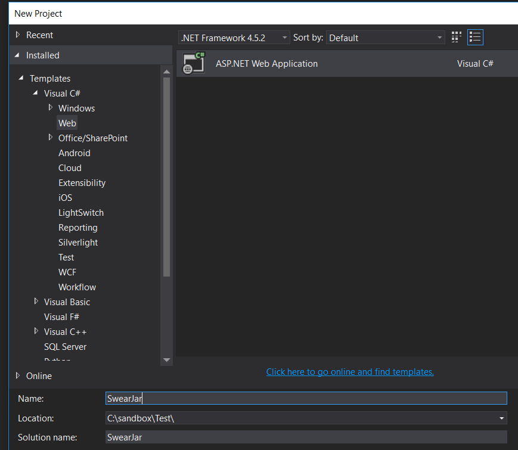

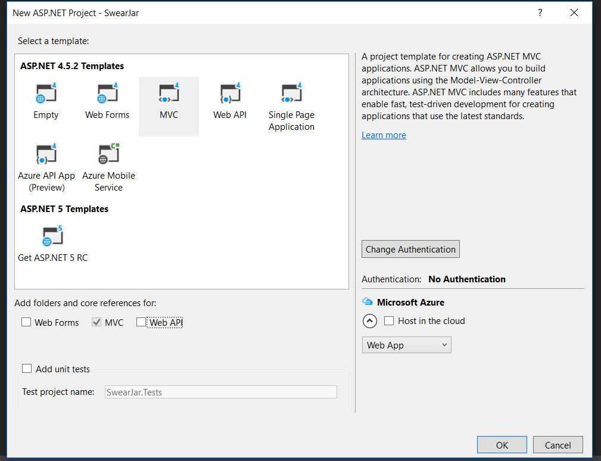

Next, once the project has been created, add a new controller by right-clicking on the Controllers folder and selecting _Add -> Controller..._

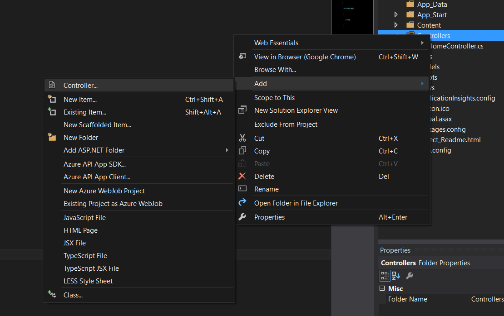

Select the _MVC 5 Controller - Empty_ option, and call this controller _SwearJar_.

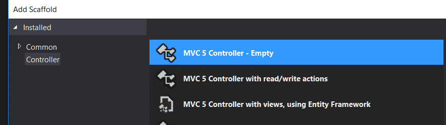

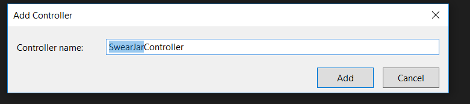

Now that we have our controller, we just need to create an Index view to house our client-side markup and JavaScript.

Inside the _Views_ folder, Right-click on the _SwearJar_ folder. Select _Add -> View_ and make the Index view.

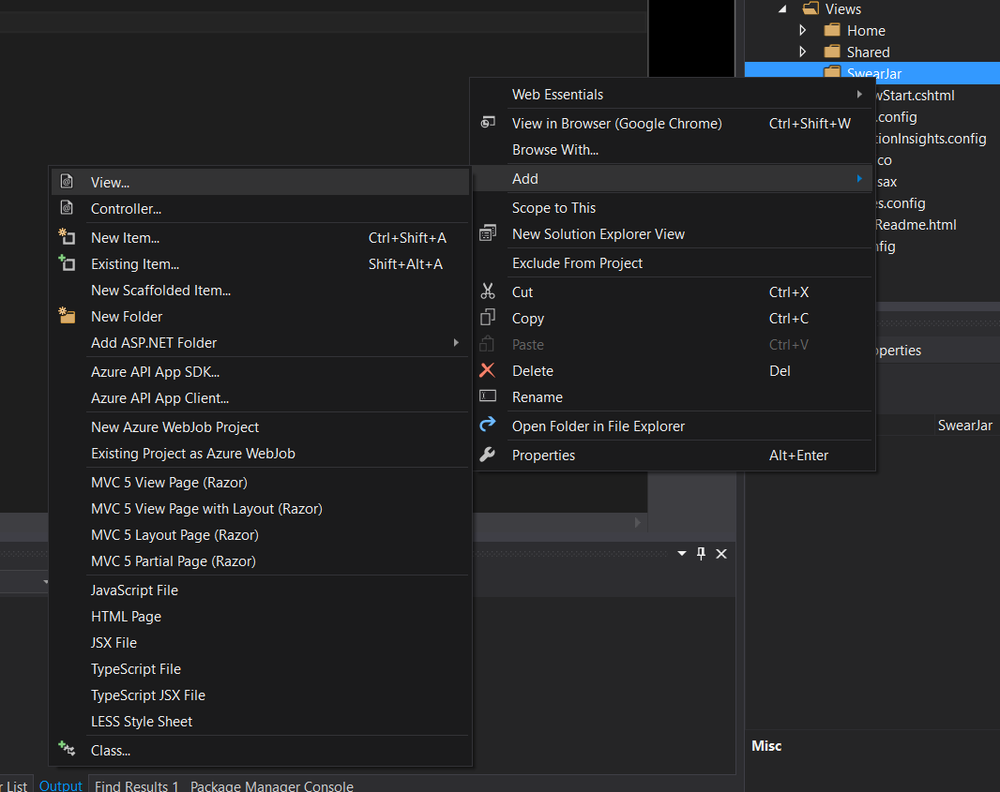

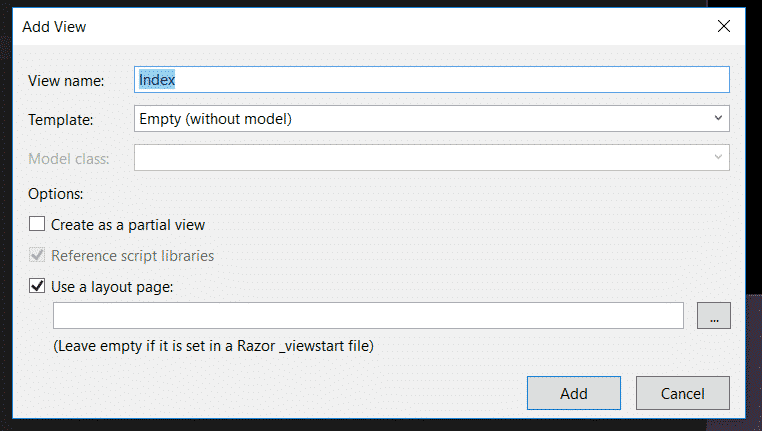

Run your application to test it out. If you navigate to `http://localhost:YOURPORT/SwearJar` you should see something like the following:

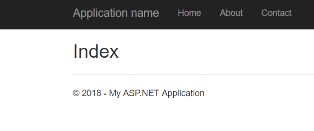

Awesome! Boring, but awesome.

Let's make it a little less boring and get it ready to make AJAX calls.

Since we're using jQuery to make these AJAX requests, we'll obviously need to include jQuery. Visual Studio automatically includes jQuery on the _Shared/\_Layout.cshtml_ page, so every View ought to be able to access it already. Otherwise, we would need to do that ourselves, like this:

Next, I'm going to set up the view with our HTML elements. We'll start with something stupidly simple. We'll click a button, and our page will tell us how much money is in the swear jar.

In your project, go to _Views -> SwearJar -> Index.cshtml_. Clear out the existing Razor markup, and replace it with this.

<h2>Swear Jar</h2>

    <button class="btn" id="btnHowMuch">How much is in the jar?</button>

@section Scripts {
    
}

Now we're ready to begin.

## jQuery AJAX Call to MVC Controller

We'll begin simply, by creating a method in the controller to return the amount that's in the swear jar. This will be a good way to see how simple data types are used in AJAX controller methods.

### Simple Data Types

In the _SwearJar_ controller, add this method:

public double GetAmount()
{
    return 1.45;
}

Then, over in your _Index.cshtml_ file, add this Javascript code inside the `script` tags.

function getAmount() {
    var url = "@Url.Action("GetAmount")";

    $.get(url, function (data) {
        $("#swearJar").html('$' + data);
    });
}

$("#btnHowMuch").on("click", getAmount);

Here, I've attached an event handler to the button so that, when clicked, the `getAmount` function gets fired.

Inside of `getAmount`, we retrieve the URL of our controller method by using the Url.Action HTML helper. It's also possible to just hard-code this as "/SwearJar/GetAmount", which is what gets rendered to the page anyway.

Next, we use jQuery to call the controller method. You may have seen more verbose GET syntax for jQuery before, using $.ajax(), like this:

$.ajax({
   type: "GET",
   contentType: "application/json; charset=utf-8",
   url: "/SwearJar/GetAmount",
   success: function (data) { successCallback(data); },
   error: function (data) { failureCallback(data); }
  });

There's nothing stopping you from using this, but $.get() abstracts a lot of the configuration away. As long as it's working, I prefer to use $.get().

Once the data is returned from the controller, we'll display it in the swearJar div. Let's try it out. Run the project, and click on the button.

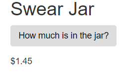

Great!

If you noticed, we made the return type of our method a double. We have no problems returning a variety of data types in the same way, like strings and integers. But look at what happens when we try to return a List of strings:

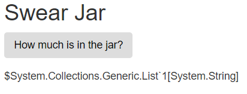

Oops. For something like this, we'll need to return our data as JSON. To make this happen in our controller, we need to make some adjustments to the Action method. The return type needs to be `JsonResult` and we need to serialize our data to the JSON format.

Here's our new controller:

public JsonResult GetAmount()
{
    var list = new List<string> { "5 quarters", "2 nickels", "8 pennies" };
    return Json(list, JsonRequestBehavior.AllowGet);
}

Notice **especially** the second parameter in the return line, `JsonRequestBehavior.AllowGet`. By default, this is set to deny get requests. If you're getting a 500 error when you try to query your action, make sure you have that flag set. As a test, you can actually navigate to `http://localhost:YOURPORT/SwearJar/GetAmount`. If you see this error, it means you're missing the `JsonRequestBehavior` parameter:

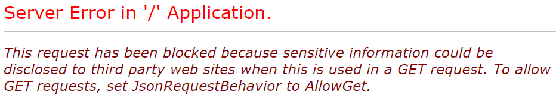

Once you add it back in, you'll be able to see your data just fine.

Let's now turn to the Javascript code in our view. To make our output look a little better, change the line inside the jQuery $.get callback to:

$("#swearJar").html(data.join(', '));

Then try running the project again and clicking on the button. You should see something similar to this:

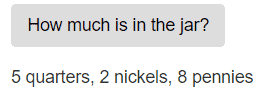

## jQuery AJAX Call with a Single Parameter

Now let's get a little fancier and add parameters to our AJAX call. Let's say that we're going to keep track of multiple people, and that they each have their own swear jar.

Either in the controller file, or in a separate file (which is a better practice), create the following _Person_ class to represent our people.

public class Person
{
    public int ID { get; set; }
    public string Name { get; set; }
    public double Amount { get; set; }
}

Next, add the following two controller action methods. The first will create a List of people. (This would normally be done with a database). The second will be the AJAX method to find a person by his or her ID.

private List<Person> GetPeople()
{
    List<Person> people = new List<Person>
    {
        new Person { ID = 1, Name = "Ernest Ruslan", Amount = 20.85 },
        new Person { ID = 2, Name = "Zygmunt Delores", Amount = 3.25 },
        new Person { ID = 3, Name = "Kama Nilofer", Amount = 8.10 },
    };

    return people;
}

public JsonResult GetPerson(int id)
{
    var person = GetPeople().Where(p => p.ID == id).SingleOrDefault();
    return Json(person, JsonRequestBehavior.AllowGet);
}

Now let's change up our front-end code. Change the Razor markup and Javascript in the View to this:

    <label for="personID">Person ID</label>
    <input type="number" id="personID" class="form-control" />
    <button class="btn" id="btnSearch">Search</button>

@section Scripts {
    
}

Pay particular attention to the object I'm passing into the $.get function. Instinctively, you might have tried something like this:

$.get(url, id, function (data) {
                
});

But this will give you an error. You'll pass in the value of `id`, but not its name. The server won't know what to do with this, and it won't bind to the `id` variable in the back end.

(**Binding** just means that the ASP.NET action can convert form values to variables or objects.)

So, instead of passing the value in jQuery, you need to create an object with the name of the form value:

$.get(url, { id: id }, function (data) {
    
});

Test it out! Run the project and try putting an ID in the textbox.

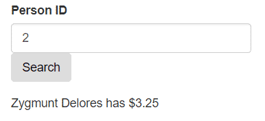

Great! It works.

## jQuery AJAX Call with Multiple Parameters

If we wanted to make a GET call with more than one parameter, that's as easy as adding parameters to the method signature.

public JsonResult GetPerson(int ID, string name)
{
  var retrievedPerson = GetPeople()
      .Where(p => p.ID == ID && p.Name == name)
      .SingleOrDefault();
  return Json(retrievedPerson, JsonRequestBehavior.AllowGet);
}

You could also use an object as the single parameter in the method signature. This is really helpful if you already have the class written and are using it elsewhere. The following example is functionally equivalent to the example we just looked at.

public JsonResult GetPerson(Person person)
{
  var retrievedPerson = GetPeople()
      .Where(p => p.ID == person.ID && p.Name == person.Name)
      .SingleOrDefault();
  return Json(retrievedPerson, JsonRequestBehavior.AllowGet);
}

## jQuery POST with a Single Parameter

In this section, let's tell our MVC Controller action how much we're putting into the jar, and have the button represent the action of putting the money in. Since we're sending data to the server and updating our total, POST is appropriate, whereas GET is not.

In our controller, add the following two methods:

\[HttpPost\]
public JsonResult AddMoney(double amount)
{
    double currentAmount = GetCurrentAmount();
    //in a real application, you'd save the amount to a database here
    double newAmount = currentAmount + amount;
    return Json(new { newAmount = newAmount });
}

private double GetCurrentAmount()
{
    //in a real application, you'd get the current amount from a database
    return 1.75;
}

Notice the `HttpPost` attribute, as well as the `amount` parameter in the method signature. This will accept a double and add it to the current amount, returning the new amount of money in the swear jar. As mentioned in the comments, you'd want to persist this to a database in a real application.

For the front-end, we'll need to make a few changes. Replace your current markup and Javascript with this:

<h2>Swear Jar</h2>

    <label for="amount">Amount</label>
    <input type="number" id="amount" class="form-control" />
    <button class="btn" id="btnAddMoney">Add Money</button>

@section Scripts {
    
}

We've added an input to take the amount we're putting into the swear jar. We've also changed the jQuery `$.get` method to `$.post`.

As with the $.get method, notice that I'm passing a data **object** to the $.post method. The following code doesn't work, and will result in an error:

var amount = $("#amount).val();
$.post(url, amount, function (data) {

});

This won't bind to the variable in the back end. I can't tell you how many times I've had this be the tiny error that makes me waste half an hour. Or more. Make sure you actually create an object with the name of the form value:

var amount = $("#amount").val();

$.post(url, { amount: amount }, function (data) {
    
});

All right, once we've done all that, run the project, type an amount in the textbox, and click the button.

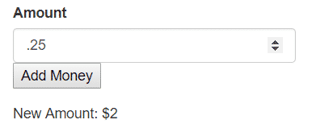

Awesome! It works.

## jQuery POST with Multiple Parameters

Just as with the GET methods, creating POST methods with multiple parameters is easy. Add the parameters to the method signature, like this:

\[HttpPost\]
public JsonResult CreatePerson(string name, double amount)
{
    var person = new Person { Name = name, Amount = amount };
    //if we had an Entity Framework database, we'd create the user like this
    //db.Person.Add(person);
    //db.SaveChanges();
    return Json(person);
}

You could also use a class as the single parameter for the method.

\[HttpPost\]
public JsonResult CreatePerson(Person person)
{
    //if we had an Entity Framework database, we'd create the user like this
    //db.Person.Add(person);
    //db.SaveChanges();
    return Json(person);
}

On the front end, all you'd have to do is create the form fields and add the form values to the data object when you make the AJAX call.

## MVC Controller vs. Web API

AJAX controller methods are great for one-of-a-kind functionalities and one-off use cases. There's nothing "wrong" or "bad" about using them. If you only have occasional AJAX methods, stick with putting that code in the MVC controller.

But if you find yourself creating AJAX methods to Create, Read, Update, and Delete entities in your database, you should consider moving that code to a Web API. What you're probably looking for is a RESTful API.

Among other things, Web API helps to simplify some of the coding. These two examples are equivalent:

#### MVC Controller

public JsonResult GetAllPeople()
{
    return Json(GetPeople(), JsonRequestBehavior.AllowGet);
}

#### Web API

public List<Person> GetAllPeople()
{
    return GetPeople();
}

I personally find the Web API syntax to be more concise and readable.

If you're interested in learning more about Web API, Microsoft has [a great tutorial](https://docs.microsoft.com/en-us/aspnet/web-api/overview/getting-started-with-aspnet-web-api/tutorial-your-first-web-api) describing the basics.

## Fetch: The Native Alternative

Since you're here, I thought I'd also mention one more technique that you might find helpful.

By default, jQuery comes bundled with new ASP.NET projects. Bootstrap also requires the library.

But if you're not using jQuery or Bootstrap, you might want to consider using Fetch, the native Javascript implementation of HTTP requests, no libraries needed.

The syntax is very simple. Imagine that we're calling our controller method to return all people. With Fetch, a GET request looks like this:

var url = "@Url.Action("GetAllPeople")";

fetch(url)
.then(function (response) {
    return response.json();
})
.then(function (data) {
    console.log(data);
})

Here's a POST request:

var url = "@Url.Action("CreatePerson")";

var person = {
    name: 'Sawyer Miskavich',
    amount: '4.25'
};

fetch(url, {
    method: "POST",
    body: JSON.stringify(person),
    headers: {
        "Content-Type": "application/json; charset=utf-8",
    }
})
.then(function (response) {
    return response.json();
})
.then(function (data) {
    console.log(data);
})

Using Fetch is not absolutely necessary, but should be something that you consider, especially if you're not using jQuery elsewhere in your project.

You can learn more about how to use the Fetch API at [Mozilla's Developer Network article](https://developer.mozilla.org/en-US/docs/Web/API/Fetch_API/Using_Fetch).

## jQuery AJAX Call to MVC Controller with Parameters: Summary

Here's a quick reference for all the techniques we've discussed in this article. First, the client side code.

### Client-Side jQuery Code

#### GET without parameters

var url = '/Controller/Action';

$.get(url, function(data) {

})

GET with parameters

var url = '/Controller/Action';

//the data object should contain any form values
$.get(url, { id: 1 }, function (data) {

});

#### POST

var url = '/Controller/Action';

//create an object with the form values and names
var formValues = {
  name: 'John Smith',
  officeNumber: 124
}

$.post(url, formValues, function (data) {

});

And now for our controllers.

### Server-Side Controller Code

#### GET without parameters, simple type

public double GetDouble()
{
    return 1.24;
}

#### GET without parameters, complex return type

For complex types, we need to return JSON.

public JsonResult GetList()
{
    var list = new List<string> { "5 quarters", "2 nickels", "8 pennies" };
    return Json(list, JsonRequestBehavior.AllowGet);
}

#### GET with parameter

public JsonResult GetItem(int id)
{
    var item = GetItems().Where(p => p.ID == id).SingleOrDefault();
    return Json(item, JsonRequestBehavior.AllowGet);
}

#### GET with multiple parameters

//you can add as many parameters as you want
public JsonResult GetPerson(int id, string name)
{
    var person = GetPersonByIdAndName(id, name);
    return Json(person, JsonRequestBehavior.AllowGet);
}

#### GET with object as parameter

//you can also create an object instead of writing all the parameters out
public class Person
{
    public int ID { get; set; }
    public string Name { get; set; }
    public double Amount { get; set; }
}

public JsonResult GetPerson(Person person)
{
    var retrievedPerson = GetPeople().Where(p => p.ID == person.ID).SingleOrDefault();
    return Json(retrievedPerson, JsonRequestBehavior.AllowGet);
}

#### POST, simple type

\[HttpPost\]
public JsonResult AddAmount(double amount)
{
    double currentAmount = GetCurrentAmount();
    //in a real application, you'd save the amount to a database here
    double newAmount = currentAmount + amount;
    return Json(new { newAmount = newAmount });
}

#### POST, multiple parameters

\[HttpPost\]
public JsonResult CreatePerson(string name, double amount)
{
    var person = new Person { Name = name, Amount = amount };
    //if we had an Entity Framework database, we'd create the user like this
    //db.Person.Add(person);
    //db.SaveChanges();
    return Json(person);
}

#### POST, multiple parameters as a single object

public class Person
{
    public int ID { get; set; }
    public string Name { get; set; }
    public double Amount { get; set; }
}

\[HttpPost\]
public JsonResult CreatePerson(Person person)
{
    //if we had an Entity Framework database, we'd create the user like this
    //db.Person.Add(person);
    //db.SaveChanges();
    return Json(person);
}
