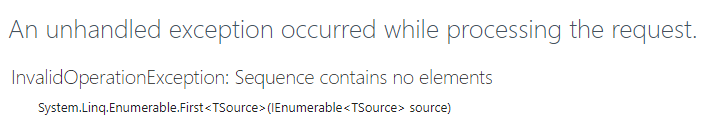
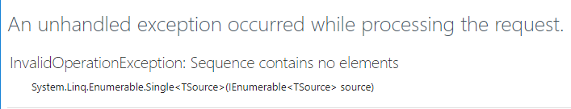
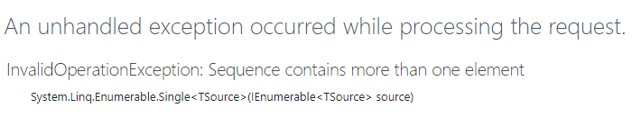

Many beginners to ASP.NET MVC spin up a new project, follow the tutorial, and have questions about the LINQ SingleOrDefault methods in the controllers. Once you start looking at examples, you'll also start seeing reference to FirstOrDefault, and First, which are related, but not quite the same thing. The differences between all of these methods can be very confusing. What I hope to do in this article is to outline the differences between all of these related methods, and give examples to clear up any confusion when you're using LINQ FirstOrDefault, First, SingleOrDefault, Single, and Find.

For the purposes of these examples, let's imagine that we're creating a web application for a local college textbook exchange. We'll need to represent users, textbooks, and offers to either buy or sell textbooks.

Here are the models we'll use to represent our data:

public class User
{
  public int ID { get; set; }
  public string Email { get; set; }

  public ICollection<Offer> Offers { get; set; }
}

public class Textbook
{
  public int ID { get; set; }
  public double ISBN { get; set; }
  public string Title { get; set; }

  public ICollection<Offer> Offers { get; set; }
}

public class Offer
{
  public int ID { get; set; }
  public int TextbookID { get; set; }
  public int UserID { get; set; }
  public int OfferTypeID { get; set; }
  public decimal Price { get; set; }

  public Textbook Textbooks { get; set; }
  public User Users { get; set; }
  public OfferType OfferType { get; set; }
}

public class OfferType
{
  public int ID { get; set; }
  public string Type { get; set; }
}

And here's the data we'll put into our tables for the purposes of testing:

#### Users

\[table id=8 /\]

#### Textbooks

\[table id=9 /\]

#### OfferType

\[table id=10 /\]

#### Offers

\[table id=11 /\]

With our data in our tables, let's start taking a look at the differences between all of these ways to grab the first record from a dataset in LINQ.

## LINQ First

The `First` method will return the first element of a sequence.

Imagine that we want to find the first offer that lillie.pena19@example.com made. We might make this call to our database using EntityFramework like this:

int userID = 2;
var offer = \_context.Offers.Where(o => o.UserID == userID).First();

The `offer` variable will now have the data from the table with the ID of 3, for the book _Web Development and Design Foundations with HTML5 (8th Edition)._ This is the first offer in the database with the UserID of 2. There could be an additional hundred results, or this could be the only result, but since this is the first entity to meet our query criteria, this is what we retrieve.

If there are no elements in the result, or if the result is null, `First` will throw an error.

Let's try to find an offer that doesn't exist.

int textbookID = 5;
var offer = \_context.Offers.Where(o => o.TextbookID == textbookID).First();

There are no textbooks with an ID of 5, so the application throws an error.

You should use the `First` method when you're expecting more than one element in the result, but you only want the first element.

## LINQ FirstOrDefault

`FirstOrDefault`, on the other hand, will not throw an error if there are no results. `FirstOrDefault` will return the first element of a sequence, or the default value if no elements are found.

The default for a reference type, like a class, is null. The default for value types varies, but includes 0 for integers and false for booleans.

Let's look at another example. This time, we'll try to find offers that Melvin has made to buy textbooks.

int userID = 1;
int offerTypeID = 1;
var offer = \_context.Offers
  .Where(o => o.UserID == userID && o.OfferTypeID == offerTypeID)
  .FirstOrDefault();

Melvin has not made any offers to buy textbooks. (All of his offers are to _sell_ textbooks.) This time, `offer` contains a null value instead of the application throwing an error.

In cases where you're going to use `FirstOrDefault`, you'll want to handle errors by checking for null.

if(offer == null)
{
  //do some error handling
}
else
{
  //success!
}

Keep in mind that if you're working with a value type instead of reference type, you'll want to check for the default value instead of null. In this example, we're looking at a collection of textbook IDs, and finding the ID that equals 8. Not an exciting example, but it'll illustrate the point.

List<int> textbookIDs = \_context.Offers.Select(o => o.TextbookID).ToList();
int result = textbookIDs.Where(t => t == 8).FirstOrDefault();
//value of result: 0;

When you're considering using `FirstOrDefault`, you'll want to think about whether you want (or need) to implement error handling. If you're not sure that your query is going to return any results, `FirstOrDefault` is the way to go.

## LINQ Single

We have another option for grabbing the first result from a sequence: `Single`. This is similar to `First`, but with an important difference. `Single` is used to retrieve the first _and only_ result in a list.

Let's imagine that we want to find textbooks that have offers over $100.

var offersOver100 = \_context.Offers.Where(o => o.Price > 100).Single();

Oops! There are no offers for textbooks over $100, so we get an error. `Single` is expecting to find, like the name implies, a single result.

What if we try to find the offer that our user, Lillie, has made?

int userID = 2;
var userOffer = \_context.Offers.Where(o => o.UserID == userID).Single();

Oops, again! Lillie has more than one offer in the table, so our query throws an exception. `Single` will only work when the result set has exactly one element in it.

Take the following example, where we retrieve the OfferType with an ID of 1:

var offerType = \_context.OfferTypes.Where(o => o.ID == 1).Single();

This won't return an error because the ID is our primary key and is unique. We know that there will be only one OfferType with any given ID. We also know that there will be a single result (and not _zero_ results), because we pre-populated this table and designed it to not change.

While I can imagine a few instances where `Single` might be helpful, its uses are limited. If you have any experience building web applications in ASP.NET (and especially .NET Core), you're probably much more familiar with its sibling, `SingleOrDefault`.

## LINQ SingleOrDefault

`SingleOrDefault` is very similar to  `Single`, in that it expects one element, and will throw an error if there is more than one element in a sequence. Let's say that we want to find the textbook with a particular ISBN. Since ISBNs are supposed to be unique, you're only going to get one result at most.

var textbook = \_context.Textbooks.Where(t => t.ISBN == 0133760065).SingleOrDefault();

What happens if we don't have a textbook with that ISBN in our database? Instead of throwing an error, `SingleOrDefault` will return the default value when the collection contains no results.

Because of this, you'll want to handle the default values whenever you use `SingleOrDefault`.

var textbook = \_context.Textbooks.Where(t => t.ISBN == 0133760065).SingleOrDefault();

if(textbook == null)
{
  //handle the error
}
else
{
  //do something with the textbook
}

This pattern of grabbing a record in the database, and then checking it for a null value, is very common in a web application. Let's take a look at some typical controller methods in both ASP.NET MVC and ASP.NET Core, and we'll learn about a few other LINQ methods to get a single result from a database.

## LINQ SingleOrDefault with Predicates

Here, I've made a new ASP.NET Core project with our models, and then used the built-in scaffolding to generate Razor Pages for the textbooks. Let's take a look at the code for the Details page.

public class DetailsModel : PageModel
{
  private readonly TestProject.Models.ProjectContext \_context;

  public DetailsModel(TestProject.Models.ProjectContext context)
  {
    \_context = context;
  }

  public Textbook Textbook { get; set; }

  public async Task<IActionResult> OnGetAsync(int? id)
  {
    if (id == null)
    {
      return NotFound();
    }

    Textbook = await \_context.Textbooks.SingleOrDefaultAsync(m => m.ID == id);

    if (Textbook == null)
    {
      return NotFound();
    }
    return Page();
  }
}

The logic here should be pretty easy to follow. We're expecting an `id` parameter, in a route like `/Textbooks/Details/1`. If the requested url doesn't have an `id` parameter, there's not much we can really do with the request. So, we null check the `id` parameter, and if it is null, we return the `NotFound()`ActionResult (which then gets translated to a 404 response).

Next, we try to get the textbook from the database where the ID of the textbook matches the `id` parameter. If no textbook is found, we return a 404 response. Otherwise, we let the view display the data in the Textbook object.

One thing to notice is that the default code uses asynchronous methods instead of synchronous ones. In fact, all of the methods discussed so far have asynchronous versions:

- FirstAsync
- FirstOrDefaultAsync
- SingleAsync
- SingleOrDefaultAsync

Other than being asynchronous, the methods behave exactly as their synchronous counterparts.

Another thing to notice is that each of these methods can take an optional predicate. What this means is that you can include a lambda expression to filter the results in the `SingleOrDefault` method instead of adding a `Where` method. In other words, these two lines are equivalent:

Textbook = await \_context.Textbooks.Where(m => m.ID == id).SingleOrDefaultAsync();
Textbook = await \_context.Textbooks.SingleOrDefaultAsync(m => m.ID == id);

All of the other non-asynchronous methods discussed so far will also take predicates. Which style you decide to use comes mostly down to preference. If you understand what the version with the predicate is doing, I could see that being more easily understood at a glance. However, the version with the `Where` method reads a bit more like natural language, and indicates a little more clearly what's happening.

In any case, my suggestion is to use the version that's clearest to you and your organization, and to be consistent in the style you use across your application.

## Find Method

Now let's do something similar with ASP.NET MVC 5. Again, I've made a new project (this time in Visual Studio 2015), added the models, and scaffolded a new set of views and controller methods for the textbooks. Here's the controller method for the Details action:

public ActionResult Details(int? id)
{
  if (id == null)
  {
    return new HttpStatusCodeResult(HttpStatusCode.BadRequest);
  }
  Textbook textbook = db.Textbooks.Find(id);
  if (textbook == null)
  {
    return HttpNotFound();
  }
  return View(textbook);
}

Overall, we have much of the same process. We check the `id` parameter for a null value. One difference here is that the code returns a 400 error (Bad Request) instead of a 404. This doesn't result in any difference for the LINQ method we're about to see, but it's an interesting architectural dissimilarity. After looking around at different forum and blog posts, it looks like the "appropriate" response is in some debate. People are very passionate about their response codes, it seems. Perhaps that's a discussion for another time, though. My advice, again, is to be consistent in your coding.

In any case, we then try to grab our textbook from the database. Here, we find yet another method: `Find`. This method is not actually part of LINQ, but is a method of System.Data.Entity's DbSet.  `Find` will search the database and find the entity with the given primary key value. It returns null if no records are found with that primary key.

## LINQ FirstOrDefault Summary: Ways to Find a Record

All of these techniques will find a single record from a result set, but with different caveats and peculiarities. Here's a handy summary of the methods we've discussed.

- First
    - Returns the first element
    - Throws an error where there are no elements
    - Use when there could be more than one element, but you only want the first
- FirstOrDefault
    - Returns the first element or...
    - When there are no elements, returns either null or the default value
    - Use when there could be zero or more elements, but you only want the first
- Single
    - Returns exactly one element
    - Throws an error when there are no elements **or** more than one element
    - Use when you want to find the only element of a sequence
- SingleOrDefault
    - Returns exactly one element, or...
    - When there are no elements, returns either null or the default value
    - Throws an error when there is more than one element
    - Use when there could be zero or one element
- Find
    - Returns the entity with a given primary key value

All of these, except for `Find`, can take a predicate as an argument.
