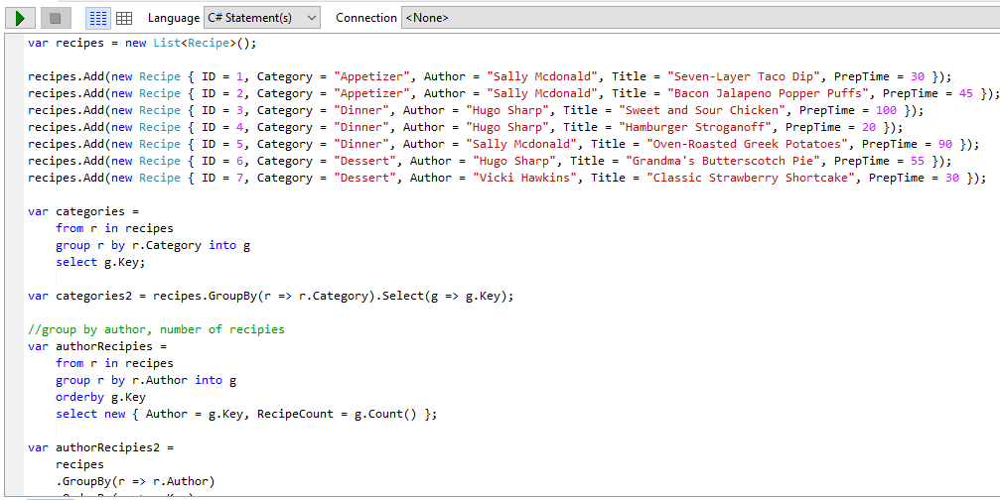
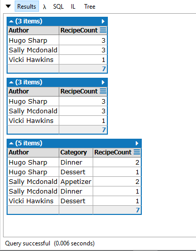

If you've used ASP.NET MVC for any amount of time, you've already encountered LINQ in the form of Entity Framework. EF uses LINQ syntax when you send queries to the database. While most of the basic database calls in Entity Framework are straightforward, there are some parts of LINQ syntax that are more confusing, like LINQ Group By multiple columns.

When I was first learning MVC, I was coming from a background where I used raw SQL queries exclusively in my work flow. This caused me a few hurdles. One of the particularly difficult stumbling blocks I had in translating the SQL in my head to LINQ was the `Group By` statement. What I'd like to do now is to share what I've learned about `Group By` , especially using LINQ to Group By multiple columns, which seems to give some people a lot of trouble. We'll walk through what LINQ is, and follow up with multiple examples of how to use Group By.

## What is LINQ?

LINQ stands for Language Integrated Query, which, admittedly, doesn't explain too much about what it is. The acronym is pretty cool, though, and is easy to say, which goes in its favor.

The simplest summary is that LINQ lets you write SQL-style queries in .NET languages, like C# and VB. If you're coming from a web development background, you're probably familiar with LINQ syntax as it applies to the Entity Framework. As a quick example, here's a standard SQL select statement:

SELECT \* FROM Table

And here's the equivalent statement in LINQ:

ProjectContext db = new ProjectContext();
var tableData = db.Table.ToList();

The example above uses to LINQ to query from a database, which is a very common use case. However, you could also query other data sources, like an XML document or a .NET collection. The beauty of LINQ is that it doesn't matter what the underlying datastore is, the LINQ syntax is the same. This can cause some unexpected behavior, but for the most part, this LINQ's strong point.

## Query vs. Method Syntax in LINQ

There are two different types of syntax that you can use to query with LINQ: query syntax and method syntax. Query syntax looks similar to SQL, while method syntax involves making method calls with lambdas as parameters (much of the time).

Imagine we have this SQL query to get records from a table containing recipe data:

SELECT \* FROM Recipes WHERE Category = 'Appetizer'

Here's the equivalent in query syntax:

var recipe = from r in db.Recipes
             where r.Category == "Appetizer"
             select r;

You can see that it looks very similar to SQL syntax, with a few differences. The position of the `SELECT` statement is reversed from the top to the bottom of the statement. You can also easily see the C# comparison operator.

Here's the same query in method syntax:

var recipe = db.Recipes.Where(r => r.Category == "Appetizer");

Which syntax you decide to use comes mostly down to personal preference, although some features of LINQ can only be expressed in method syntax. There are also some types of queries that are simply easier to write in one version vs. another. For the rest of this article, I'll be showing how to use `Group By` in both versions.

## Group By in SQL

Before we look at the LINQ queries, let's image a scenario that will form the basis of our examples. We'll pretend that we're creating an application to house recipes, and we have this table:

CREATE TABLE Recipes
(
  ID int identity(1,1) primary key,
  Category varchar(50),
  Author varchar(100),
  Title varchar(100),
  PrepTime int
)

We have a `Category` to keep track of what type of recipe we're dealing with, as well as a `Title` for the recipe and a column to store the amount of time to make the recipe, in minutes. We also want to keep track of who submitted the recipe, so we have an `Author` column.

In a real-world application, we'd want to normalize our database structure by adding a `Categories` table and an `Authors` table. That way, we could just refer to the `CategoryID` and `AuthorID` in the Recipe table. However, I've kept it denormalized to keep our examples simpler. Just keep in mind that you could take any of the following examples and use the foreign keys to group by instead of a text field.

Let's also imagine that we have the following data in the `Recipes` table:

\[table id=1 /\]

Now, let's say we want to find out which of our authors have been most productive. We want to count the number of recipes, and group by the author's name.

SELECT
  Author,
  COUNT(ID) As RecipeCount
FROM
  Recipes
GROUP BY
  Author

Running this provides the following data:

\[table id=3 /\]

What we've done is to create groups out of the authors, which has the effect of getting rid of duplicate data. I mention this, even though you might know it already, because of the conceptual difference between SQL and LINQ. I think that, in my own head, I always thought of `GROUP BY` as the "magical get rid of the duplicate rows" command. What I slowly forgot, over time, was the first part of the definition. We're actually creating _groups_ out of the author names. Keep this in mind as we move forward.

## LINQ Group By a Single Column

Before we use `Group By` with multiple columns, let's start with something simpler. Let's say that we just want to group by the names of the Categories, so that we can get a list of them.

The SQL would look like this:

SELECT Category FROM Recipes GROUP BY Category

In LINQ query syntax, the same query would read this way:

var categories =
    from r in db.Recipes
    group r by r.Category into g
    select g.Key;

If you're like me, this looks a little bizarre. Remember, though, `Group By` doesn't just get rid of the duplicate rows. You're creating _groups_ out of the Categories. In LINQ, you need to create these groups explicitly. The line `group r by r.Category into g` means that we're creating a new grouping, and we're grouping by the Category. ('g' is just a variable name; we could have named it whatever we wanted.) You can then reference whatever it is you're grouping by with the `Key` property of the grouping.

The same query in method syntax looks like this:

var categories = db.Recipes.GroupBy(r => r.Category).Select(g => g.Key);

Now, let's imagine that we wanted to find our most prolific authors, like we did in the SQL query in the last section. We'll count the number of recipes, and group by the `Author` . We'll also order the groups by the author's name. Here's the LINQ in query syntax:

var authorRecipies =
    from r in db.Recipes
    group r by r.Author into g
    orderby g.Key
    select new { Author = g.Key, RecipeCount = g.Count() };

In our new anonymous object, we've added the `RecipeCount` property, and assigned the count to it. We could have also created a strongly-typed object, like a view model, and created a new instance of that. This would, of course, be the better practice for something you're passing to a view.

Now for the same example in method syntax:

var authorRecipies =
    db.Recipes
    .GroupBy(r => r.Author)
    .OrderBy(g => g.Key)
    .Select(g => new { Author = g.Key, RecipeCount = g.Count() });

## LINQ Group By Multiple Columns

Finally, we get to our original question. Let's now group by multiple columns. We'll imagine that we want to find not just the number of recipes per author, but also the number of recipes an author has per the different categories. Here's the SQL we want to duplicate in LINQ:

SELECT 
  Author,
  Category,
  COUNT(ID) As RecipeCount 
FROM 
  Recipes 
GROUP BY 
 Author, Category

This will create the following output:

\[table id=4 /\]

In order to group by multiple columns, the structure of our queries is basically the same as before. However, instead of grouping by one property, we need to create **a new anonymous object** and group by that object. Here's the code:

var authorCategoryRecipies =
  from r in db.Recipes
  group r by new { r.Author, r.Category } into g
  orderby g.Key.Author
  select new { Author = g.Key.Author, Category = g.Key.Category, RecipeCount = g.Count() };

And the same example in method syntax:

var authorCategoryRecipes =
  db.Recipes
  .GroupBy(r => new { r.Author, r.Category })
  .OrderBy(g => g.Key.Author)
  .Select(g => new { Author = g.Key, RecipeCount = g.Count() });

Also notice that we had to change the `OrderBy` parameter from `g.Key` to `g.Key.Author`. Since our grouping now contains Author _and_ Category, we need to tell the query which property to order by.

## LINQPad: The Scratchpad for C# and LINQ

I think I'd be remiss if I didn't mention one more thing before wrapping up. If you want to be able to test your LINQ syntax without having to build and re-build your project, check out [LINQPad](http://www.linqpad.net/). It lets you try out LINQ queries outside of Visual Studio. You can make quick changes to your code and get instant feedback on the results of that LINQ query. Think of it like JSFiddle, but for C#. I used it in this article in order to test out a number of my queries. Here's some example code and output:

There's a free and paid version. The biggest thing I can see missing from the free version is AutoComplete syntax, but the tool is still useful without that. Hopefully you find that to be the case as well.

## LINQ Group By Multiple Columns: Conclusion

To be perfectly honest, whenever I have to use Group By in a query, I'm tempted to return back to raw SQL. I find the SQL syntax terser, and more readable than the LINQ syntax with having to explicitly define the groupings. In an example like those above, it's not too bad keeping everything in the query straight. However, once I start to add in more complex features, like table joins, ordering, a bunch of conditionals, and maybe even a few other things, I typically find SQL easier to reason about. Once I get to the point where I'm using LINQ to group by multiple columns, my instinct is to back out of LINQ altogether. However, I recognize that this is just my personal opinion. If you're struggling with grouping by multiple columns, just remember that you need to group by an anonymous object.
