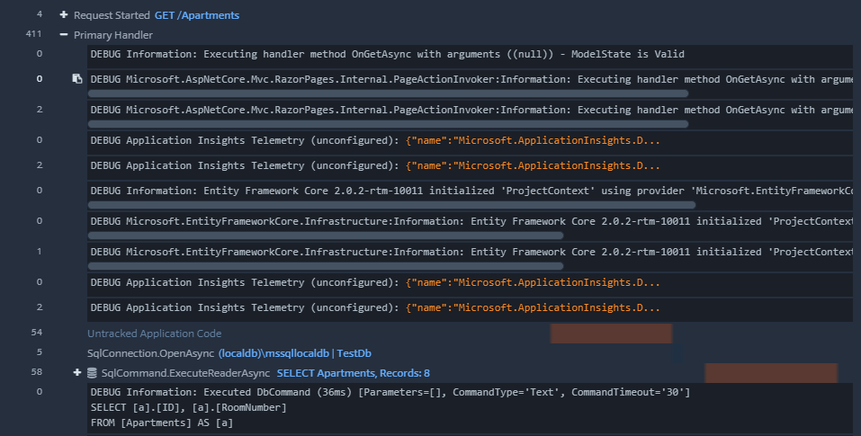
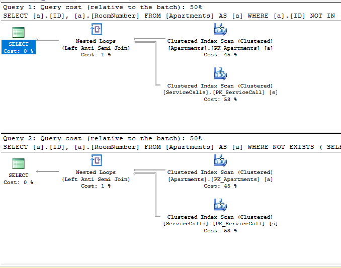

A lot of LINQ statements, like Select statements and Where clauses, are pretty straightforward and have direct analogues to SQL. Some SQL commands, however, don't have a simple implementation. One of those is the "NOT IN" SQL statement. In this guide, we'll look at LINQ NOT IN, as well as some related SQL queries, like NOT EXISTS and LEFT JOIN / IS NULL.

## What is LINQ?

LINQ stands for _Language Integrated Query,_ but it essentially means that you can write SQL-style queries in C#. It's a bit more robust than that, as you can use LINQ to query more than just databases. For a broader overview, see my post about [Grouping By Multiple Columns in LINQ](https://sensibledev.com/linq-group-by-multiple-columns/). Like in that post, I'll be using examples in both query syntax and method syntax. Sometimes, the only way to express a command in LINQ is to use the method syntax. I'll make a good faith attempt to create these examples as clearly as possible.

## What does the SQL NOT IN Operator do?

In SQL, when we want to exclude a record, it's pretty trivial to do with a WHERE clause:

`SELECT * FROM Animals WHERE Name != 'Elephant'`

However, when we have multiple conditions in the WHERE clause, the query can get quite long:

SELECT
  \*
FROM
  Animals
WHERE
  Name != 'Elephant' AND
  Name != 'Aardvark' AND
  Name != 'Emu' AND
  Name != 'Hedgehog' AND
  Name != 'Zebra'

The NOT IN operator is shorthand for those multiple conditions. This query is equivalent to the example I just gave:

SELECT
  \*
FROM
  Animals
WHERE
  Name NOT IN ('Elephant', 'Aardvark', 'Emu', 'Hedgehog', 'Zebra')

As you can see, the query is terser and much more readable. This especially works well with a defined list of values, like we have here for our animals. You can also put SELECT queries inside of the NOT IN operator. We'll create a concrete example of this shortly.

Now let's look at a situation that's a little more applicable to web development where we might use LINQ NOT IN. Let's imagine that we're running a web application to facilitate operations in an apartment complex. For this part of the application, we want to keep track of the service calls to each apartment.

Here are the models we'll use to represent the apartments and the service calls:

public class Apartment
{
    public int ID { get; set; }
    public string RoomNumber { get; set; }

    public ICollection<ServiceCall> ServiceCalls { get; set; }
}

public class ServiceCall
{
    public int ID { get; set; }
    public int ApartmentID { get; set; }
    public DateTime Date { get; set; }

    public virtual Apartment Apartment { get; set; }
}

If we're using Code First migrations, EntityFramework will generate the tables and foreign key relationships automatically.

We'll also put some test data into the tables so that our examples will generate something useful.

#### Apartments

\[table id=5 /\]

#### Service Calls

\[table id=6 /\]

Next, we'll take a look at how to duplicate the SQL NOT IN operator with the LINQ equivalent.

## Not Contains in LINQ

Let's start with a simple example. Say we want to see a list of apartments eligible for service calls. We want to exclude the vacant apartments from this list, so we check it against a hard-coded list of vacant apartments. (I know, I know, you never want to actually hard-code a list like that. Bear with me, it's just an example.)

In SQL, we would write the query something like this:

SELECT \* FROM Apartments WHERE ID NOT IN (4, 6, 7, 8)

LINQ doesn't have a NOT IN operator. Instead, we'll use the `Contains` method to see if the ID of the apartment is contained in our hard-coded List. We'll want to negate those results with the `!` operator, essentially saying, "Give me all of the apartments where the ID is not contained in the list of vacant apartment IDs." Here's the code:

List<int> vacantApartmentIDs = new List<int> { 4, 6, 7, 8 };

var result = from a in \_context.Apartments
  where !vacantApartmentIDs.Contains(a.ID)
  select a;

And, as expected, here are the results of that operation:

\[table id=7 /\]

Let's turn to an example where we're not using a hard-coded list, but information from our database.

Now, let's say that we want to get a list of all apartments that have not had a service call. The process is similar, the idea being: "Give me all of the apartments where the ID is not contained in the list of service calls." The list of service calls comes from our database, and we use the same `Contains` method, like this:

var noServiceCalls = 
  from a in \_context.Apartments
  where !(from s in \_context.ServiceCalls select s.ApartmentID).Contains(a.ID)
  select a;

As you can see, we've done the same thing as before, but we've just used a SELECT query instead of a hard-coded list.

Something that you might want to do when you're using some new LINQ syntax is to look at the generated SQL from your LINQ query. That way, you can double-check that you're duplicating the same functionality, and you can benchmark the SQL by looking at the execution plan (which we'll do later in this article).

There are a lot of ways to do this, (including using the [Log property](https://docs.microsoft.com/en-us/dotnet/framework/data/adonet/sql/linq/how-to-display-generated-sql)) but my current preferred way is to use Stackify's [Prefix](https://stackify.com/prefix/) tool. Prefix is a code profiler that will give you a lot of information, like HTTP requests and errors, as well as the SQL for any queries made to your database.

After installing the tool and starting it in your web browser, all you have to do is click on the trace you want to see, and the application will give you the details of that request.

If we look at the query we made above to find apartments without service calls, we find that Entity Framework takes your LINQ query and generates this SQL:

SELECT \[a\].\[ID\], \[a\].\[RoomNumber\]
FROM \[Apartments\] AS \[a\]
WHERE \[a\].\[ID\] NOT IN (
    SELECT \[s\].\[ApartmentID\]
    FROM \[ServiceCalls\] AS \[s\]
)

Great! This is exactly what we wanted. Good LINQ.

This, alone, is enough to get you going with a solution. However, it's also worth taking a look at a few other ways to exclude records from result sets. Let's take a look at a few more options, and also consider the performance implications of these methods.

## LINQ Except

Another option you can use to exclude records is the `Exclude` method. `Exclude`, [as the documentation states](https://msdn.microsoft.com/en-us/library/bb300779(v=vs.110).aspx), will generate the differences between two sequences.

If we think back to our early example about excluding certain animals from a list, here's some similar logic, but using `Exclude`. We've created a `List` of strings containing animal names we want to exclude. We'll exclude those names on a list of all the animal names from the database.

List<string> animalNames = 
  from a in \_context.Animals
  select a.Name;

List<string> excludedAnimals = 
  new List<string> { "Elephant", "Aardvark", "Emu", "Hedgehog", "Zebra" };

List<string> animalList = animalNames.Except(excludedAnimals);

Like the code implies, `animalList` now contains all of the animal names, but without the animals in `excludedAnimals`.

You can use the same keyword to manipulate records from your database. Be careful, though, when doing so. Imagine we have this code:

var apartmentsWithServiceCalls = 
  from s in \_context.ServiceCalls
  select s.Apartment;

var noServiceCalls = 
  \_context.Apartments
  .Except(apartmentsWithServiceCalls);

This will work, and return the apartments without service calls. But it will also generate and execute two separate SQL queries:

SELECT \[s.Apartment\].\[ID\], \[s.Apartment\].\[RoomNumber\]
FROM \[ServiceCalls\] AS \[s\]
INNER JOIN \[Apartments\] AS \[s.Apartment\] ON \[s\].\[ApartmentID\] = \[s.Apartment\].\[ID\]

SELECT \[a\].\[ID\], \[a\].\[RoomNumber\]
FROM \[Apartments\] AS \[a\]

You'll want to evaluate the cost of these database calls on your system. Maybe this isn't a big deal, but maybe it'll result in a performance hit. You'll definitely want to look at this and make an informed decision.

## LINQ Any: Generating SQL's NOT EXISTS

A similar SQL operator to `NOT IN` is `NOT EXISTS`. The `EXISTS` operator requires a subquery. It'll test the subquery for the existence of any record, and return true if any records exist.

For our "apartments without service calls" example, here's what the SQL looks like using `NOT EXISTS`:

SELECT
  A.ID,
  A.RoomNumber
FROM
  Apartments A
WHERE
  NOT EXISTS
  (
    SELECT 1 FROM ServiceCalls WHERE ApartmentID = A.ID
  )

Here, we're selecting apartments where there are no existing records in the subquery. As you can see, the subquery finds any service calls where the ApartmentID equals the ID in the main query. The `SELECT 1` is a convention used to show that you're not really concerned with retrieving any data from the subquery. You're only using it to exclude records.

Like `NOT IN`, LINQ doesn't have a `NOT EXISTS` method. It does, however, have an `Any` method, which accomplishes the same thing. Here's the code for excluding records with LINQ's `Any` method:

var noServiceCalls = 
  from a in \_context.Apartments
  where !\_context.ServiceCalls.Any(s => s.ApartmentID == a.ID)
  select a;

You can see the direct connection between this and our SQL. Our query finds any apartments where there are not any service calls with a matching ApartmentID. Here's the same query in method syntax:

var noServiceCalls = 
  \_context.Apartments
  .Where(a => !\_context.ServiceCalls.Any(s => a.ID == s.ApartmentID));

If we use a code profiler, we find that both LINQ queries generate the same SQL, as follows:

SELECT \[a\].\[ID\], \[a\].\[RoomNumber\]
FROM \[Apartments\] AS \[a\]
WHERE NOT EXISTS (
    SELECT 1
    FROM \[ServiceCalls\] AS \[s\]
    WHERE \[s\].\[ApartmentID\] = \[a\].\[ID\])

Great! This is exactly what we were looking for. Let's take a look at one last option for excluding records, and then compare all of these methods for performance.

## LINQ Left Join

The last method that we'll examine is using a left outer join to exclude records. This time, we'll left join on the ServiceCalls table, and only get Apartments where the ServiceCall's ID is null. Here's the SQL we're looking to duplicate:

SELECT
  A.\*
FROM
  Apartments A
  LEFT JOIN ServiceCalls S ON A.ID = S.ApartmentID
WHERE
  S.ID IS NULL

And here's the code we'll need to do so.

var noServiceCalls =
  from a in \_context.Apartments
  join s in \_context.ServiceCalls on a.ID equals s.ApartmentID into gj
  from s in gj.DefaultIfEmpty()
  where s == null
  select a;

Like the [LINQ Group By](https://sensibledev.com/linq-group-by-multiple-columns/) implementation, there are some things going on here that aren't intuitive (at least to me). To left join on the ServiceCalls table, you need to join "into" a range variable, called "gj." gj stands for "Group Join." This naming is a convention that you'll see sometimes in online guides. You can name the variable anything you want. You'll also need to use the `DefaultIfEmpty` method to return the null values, otherwise it won't work.

If you leave out the group join and `DefaultIfEmpty`, Entity Framework will generate an INNER JOIN instead of a LEFT JOIN. As it is, our code above will create the following query:

SELECT \[a\].\[ID\], \[a\].\[RoomNumber\]
FROM \[Apartments\] AS \[a\]
LEFT JOIN \[ServiceCalls\] AS \[s\] ON \[a\].\[ID\] = \[s\].\[ApartmentID\]
WHERE \[s\].\[ID\] IS NULL

Nice.

## Not In, Not Exists, and Left Join Performance

So which of these three methods should you choose? If we take a look at the execution plan, we see that Not In and Not Exists look identical:

However, there's [evidence](https://stackoverflow.com/questions/173041/not-in-vs-not-exists) that, when your tables have nullable columns, "[NOT IN performs significantly worse than NOT EXISTS](https://www.sqlinthewild.co.za/index.php/2010/02/18/not-exists-vs-not-in/)." If your tables aren't going to have NULLs, and you set the columns to Not Nullable, then the performance is the same. But when you do have the possibility of null values, you should be using NOT EXISTS.

What about the LEFT JOIN? Once again, there's [evidence](https://dba.stackexchange.com/questions/121034/best-practice-between-using-left-join-or-not-exists) to suggest that [NOT EXISTS outperforms](https://www.sqlinthewild.co.za/index.php/2010/03/23/left-outer-join-vs-not-exists/). Here's [another article to the same effect](https://sqlperformance.com/2012/12/t-sql-queries/left-anti-semi-join).

## LINQ NOT IN: Conclusion

Over the course of this article, we've looked at how to implement SQL's `NOT IN` operator by using LINQ's `Contains` method. We also looked at other methods of excluding records from your queries, like `Except` , `!Any`, and Left Joins.

After taking a brief look at the performance of each of these, we found that, **in most cases, using `!Any`** **to generate a `NOT EXISTS` operator results in a performance boost** over the other methods.

You'll still want to evaluate the performance of each of these and consider your personal situation, like the presence of null values and indexes, as well as considerations regarding code style and readability. If in doubt, go ahead and test each method yourself.

You may have begun reading this article thinking that you wanted to use NOT IN, and you may have been surprised at where we ended up. If nothing else, I hope that this article has given you additional options and ways of thinking about creating your LINQ queries.

Keep your coding sensible!
