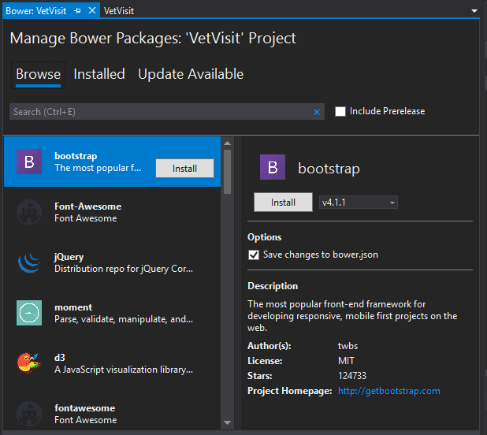

Personally, I don't consider myself to be much of a designer, which is why I turn to front-end frameworks when developing my projects. Bootstrap is, of course, one of the most popular front-end frameworks, and integrates well with the .NET ecosystem. However, by default, new .NET projects ship with Bootstrap 3 instead of the recently updated Bootstrap 4. In this guide, I'd like to take a look at how to update a project from Bootstrap 3 to Bootstrap 4. We'll then examine several MVC Bootstrap form examples in both MVC 5 and .NET Core.

Let's imagine that we're building an app for a veterinarian's office to keep track of pet appointments. We'll start with a simple model, and add onto it as we look at more complicated examples.

public class Visit
{
  public int ID { get; set; }

  public string PetName { get; set; }

  \[DataType(DataType.Date)\]
  public DateTime VisitDate { get; set; }
}

## ASP.NET MVC 5 Bootstrap 4

Let's begin with MVC 5 before moving on to .NET Core. Many of you may be using Core (and if you haven't tried it, I would suggest you do!). However, a lot of us are still operating in MVC 5, which is still a perfectly viable solution for web development.

Start by creating a new project.

By default, the project is set up with Bootstrap 3. We'll need to change the CSS and JavaScript references from Bootstrap 3 to Bootstrap 4.

One easy option is to install Bootstrap 4 from the Package Manager Console. Simply type this into the console:

Install-Package bootstrap -Version 4.1.1

Alternatively, you could click on _Tools -> Nuget Package Manager -> Manage Nuget Packages for Solution..._

Then, click on _Browse_ and search for "bootstrap".

Whichever way you do it, you'll install the Bootstrap 4 nuget package. Installing that package will overwrite the _bootstrap.js_ file in the _Scripts_ folder and the _bootstrap.css_ file in the _Content_ folder. It will also add a number of other files to those two folders, most of which you don't need to worry about.

Here's one snag you might run into. When I tried to run the project locally at this point, Intellisense detected errors in the TypeScript file _index.d.ts_, found in the _Scripts_ folder.

It has something to do with _popper.js_, which is included with Bootstrap 4. I couldn't figure out what exactly was going on here, so I simply excluded it from my project and everything compiled fine. If you have a suggestion as to how to fix this, please let me know in the comments. Popper.js is a neat library, but it's not essential for creating forms in Bootstrap 4.

In any case, let's run our project and see what happens.

All right, we have a home page. As you can probably notice, that navigation bar doesn't look right. That's because Bootstrap 4 made some changes to how the navbar works, so we'll need to change our layout.

 

* * *

## Wait!

Before you dive in to the next section, where you'll be seeing a lot of code, I want to tell you about something that might make your day easier.

Sometimes it really helps to see code in context. Want to get the complete Visual Studio solution for every example in this post? You can get it, right now, in my book [_Bootstrap for .NET Devs_](https://sensibledev.com/recommends/bootstrap-for-dot-net-mvc-forms-1/). Check out the sample chapters instantly, for free.

\[maxbutton id="4" url="https://sensibledev.com/recommends/bootstrap-for-dot-net-mvc-forms-1/" \]

* * *

 

Navigate to the layout file in _Views ->_ _Shared -> \_Layout.cshtml_. We need to remove the `div` with the class of `navbar` (the first element in the HTML body). Replace it with this:

<nav class="navbar navbar-expand-lg navbar-dark bg-dark">
  

    @Html.ActionLink("Application name", "Index", "Home", new { area = "" }, new { @class = "navbar-brand" })
    <button type="button" class="navbar-toggler" data-toggle="collapse" data-target=".navbar-collapse" aria-expanded="false" aria-label="Toggle navigation">
      
    </button>

    

      <ul class="nav navbar-nav mr-auto">
          <li class="nav-item">@Html.ActionLink("Home", "Index", "Home", null, new { @class = "nav-link" })</li>
          <li class="nav-item">@Html.ActionLink("About", "About", "Home", null, new { @class = "nav-link" })</li>
          <li class="nav-item">@Html.ActionLink("Contact", "Contact", "Home", null, new { @class = "nav-link" })</li>
      </ul>
      @Html.Partial("\_LoginPartial")
    

  

</nav>

If you don't use the Login partial, feel free to remove it. Otherwise, you'll need to change the _\_LoginPartial.cshtml_ code to:

@using Microsoft.AspNet.Identity
@if (Request.IsAuthenticated)
{
  using (Html.BeginForm("LogOff", "Account", FormMethod.Post, new { id = "logoutForm" }))
  {
  @Html.AntiForgeryToken()

  <ul class="nav navbar-nav">
    <li class="nav-item">
        @Html.ActionLink("Hello " + User.Identity.GetUserName() + "!", "Index", "Manage", routeValues: null, htmlAttributes: new { title = "Manage", @class = "nav-link" })
    </li>
    <li class="nav-item"><a class="nav-link" href="javascript:document.getElementById('logoutForm').submit()">Log off</a></li>
  </ul>
  }
}
else
{
  <ul class="nav navbar-nav">
    <li class="nav-item">@Html.ActionLink("Register", "Register", "Account", routeValues: null, htmlAttributes: new { id = "registerLink", @class = "nav-link" })</li>
    <li class="nav-item">@Html.ActionLink("Log in", "Login", "Account", routeValues: null, htmlAttributes: new { id = "loginLink", @class = "nav-link" })</li>
  </ul>
}

Now, let's take a look at our homepage. If you run the project, you should notice an ugly white bar on top of your navigation. This is because the default template used a fixed navbar, and the default styles are pushing the main content down. Otherwise, the main content would be _underneath_ the navbar.

Since we're not using a fixed navbar, we should get rid of that styling. Go to _Content/Site.css_ and remove these lines:

/\*delete this\*/
body {
    padding-top: 50px;
    padding-bottom: 20px;
}

You can actually remove all of the default styles if you want (though you don't have to).

Now you can run the project again, head back to the homepage, and see our adjustments in all their glory:

Sweet. Adjusting the navbar to your exact taste is beyond the scope of this article, but what we've coded will be enough to make your application, as a whole, not look broken.

## Bootstrap 4 Basic Form

Scaffold a new controller with views, using the _Visit.cs_ class from earlier, and take a look at the _Create.cshtml_ file. Now we have a form to play with. In order to make this compliant with Bootstrap 4, replace the code in that file with this:

@model VetVisit.Models.Visit

@{
  ViewBag.Title = "Create Visit";
}

<h2>Create Visit</h2>

@using (Html.BeginForm())
{
  @Html.AntiForgeryToken()
  @Html.ValidationSummary(true, "", new { @class = "text-danger" })
  

      @Html.LabelFor(model => model.PetName)
      @Html.EditorFor(model => model.PetName, new { htmlAttributes = new { @class = "form-control" } })
      @Html.ValidationMessageFor(model => model.PetName, "", new { @class = "text-danger" })
  

  

      @Html.LabelFor(model => model.VisitDate)
      @Html.EditorFor(model => model.VisitDate, new { htmlAttributes = new { @class = "form-control" } })
      @Html.ValidationMessageFor(model => model.VisitDate, "", new { @class = "text-danger" })
  

  
  <input type="submit" value="Create" class="btn btn-default" />
}

  @Html.ActionLink("Back to List", "Index")

@section Scripts {
  @Scripts.Render("~/bundles/jqueryval")
}

This will give us a very basic, but still functional, form. Labels and inputs are wrapped in a div with the `form-group` class, and inputs need to have the `form-control` class.

Bootstrap does have classes for validation, like `invalid-feedback`. However, for these to work, you need to add the `needs-validation` and `was-validated` classes to the form element, and you need to do this when the form is validated. This doesn't mesh too well with the jQuery Unobtrusive Validation framework that ASP.NET uses. I find it much easier to use the built-in validation, and simply use the `text-danger` class to color the validation message red.

Here's what our form looks like:

Let's improve this a little. If you want to make those labels more human-readable, add the DisplayName data annotations to your class.

public class Visit
{
  public int ID { get; set; }

  \[Required\]
  \[Display(Name = "Pet Name")\]
  public string PetName { get; set; }

  \[DataType(DataType.Date)\]
  \[Display(Name = "Visit Date")\]
  public DateTime VisitDate { get; set; }
}

Also, you may have noticed that the inputs are rather short. This is because the default project has a _Site.css_ file that sets all inputs, selects, and textareas to a max-width of 280px.

If you're okay with this, feel free to keep it this way. However, I would recommend deleting it and using Bootstrap's responsive grid system instead.

If you've deleted the CSS above and added the DisplayName attributes to the model, your form should now look like this:

Great! We'll look at adding the grid system later to make those inputs not look so ridiculously long. For now, let's just run through examples of some of the other HTML inputs. We'll add the following types of inputs to our model and view, with the appropriate Bootstrap classes:

- Checkbox
- Textarea
- Radio button
- Number
- Range
- Tel

Here are the properties we'll add to our model class:

//Single checkbox
\[Display(Name = "Is this an emergency visit?")\]
public bool IsEmergencyVisit { get; set; }

//Textarea
\[DataType(DataType.MultilineText)\]
public string Notes { get; set; }

//Radio button
//could also be string, bool, or double, depending on value type
\[Display(Name = "Veterinarian")\]
public int VeterinarianID { get; set; }

//Number
public int Cost { get; set; }

//Range
\[Display(Name = "Pet Weight")\]
public double PetWeight { get; set; }

//Tel
\[Phone\]
public string CustomerPhone { get; set; }

And here are the form fields we add to our Razor view:

  @Html.EditorFor(model => model.IsEmergencyVisit, new { htmlAttributes = new { @class = "form-check-input" } })
  @Html.LabelFor(model => model.IsEmergencyVisit)
  @Html.ValidationMessageFor(model => model.IsEmergencyVisit, "", new { @class = "text-danger" })

  @Html.LabelFor(model => model.Notes)
  @Html.EditorFor(model => model.Notes, new { htmlAttributes = new { @class = "form-control" } })
  @Html.ValidationMessageFor(model => model.Notes, "", new { @class = "text-danger" })

  @Html.LabelFor(model => model.VeterinarianID)
  

    <input class="form-check-input" type="radio" name="VeterinarianID" id="veterinarian1" value="1" checked>
    <label class="form-check-label" for="veterinarian1">
      Daniel Lewis
    </label>
  

  

    <input class="form-check-input" type="radio" name="VeterinarianID" id="veterinarian2" value="2">
    <label class="form-check-label" for="veterinarian2">
      Gina Reynolds
    </label>
  

  @Html.LabelFor(model => model.Cost)
  @Html.EditorFor(model => model.Cost, new { htmlAttributes = new { @class = "form-control", type = "number" } })
  @Html.ValidationMessageFor(model => model.Cost, "", new { @class = "text-danger" })

  @Html.LabelFor(model => model.PetWeight)
  @Html.EditorFor(model => model.PetWeight, new { htmlAttributes = new { @class = "form-control", type = "range", step = ".1" } })
  @Html.ValidationMessageFor(model => model.PetWeight, "", new { @class = "text-danger" })

  @Html.LabelFor(model => model.CustomerPhone)
  @Html.EditorFor(model => model.CustomerPhone, new { htmlAttributes = new { @class = "form-control" } })
  @Html.ValidationMessageFor(model => model.CustomerPhone, "", new { @class = "text-danger" })

From this, the new fields on our form look as follows:

The checkbox uses a few different classes than a standard text input, and has a bit of a different HTML structure. If you want to make a list of checkboxes, where the user could select one _or more_ values, that's a more complicated process. I would also consider it outside of the scope of this post, since there are many options to make it work, and it requires more footwork in the controller. I would suggest taking a look at [this Stack Overflow post](https://stackoverflow.com/questions/17037446/get-multiple-selected-checkboxes-in-mvc) as a place to start looking for a solution.

For the radio buttons, we have a similar structure to the checkboxes, but with the type set to "radio" instead.

The textarea is rendered as such due to the multiline text DataType data annotation in the model. The number and range types, on the other hand, can't be set in the model, so we need to add the types manually in the `htmlAttributes`.  (Also, keep in mind that for a real currency value, you'd want to use a decimal instead of an integer. I've used this only as a simple example.)

The telephone type has its own special data annotation, `[Phone]`, which will put the correct input type on the HTML element, as well as validate the phone number with an appropriate regular expression. You can read more about this in [my post about validating phone numbers in MVC](https://sensibledev.com/phone-number-validation-in-asp-net/).

### Date Input: A Gotcha and a Solution

Try creating a new Visit, which will insert a row in the table. Then, navigate over to the _Edit_ view for that visit. The url should look something like `http://localhost:YOURPORT/Visits/Edit/1`. You should notice something funny about the `VisitDate` input.

What happened to our visit date? If we take a look at the developer console, we can see a warning that explains why.

ASP.NET is rendering the field value in a format that isn't to the HTML5 date specifications. One way to change this is to add a string format annotation to our model, like this:

\[DataType(DataType.Date)\]
\[Display(Name = "Visit Date")\]
\[DisplayFormat(DataFormatString = "{0:yyyy-MM-dd}", ApplyFormatInEditMode = true)\]
public DateTime VisitDate { get; set; }

This will set the input value in the correct format. However, now the date will be in this format **wherever we use the model**, like our index of visits.

If you don't want your date to look like this _everywhere_, we have a problem. One solution, though one that I don't recommend, is to put the format string manually in every view. Here's an example for the index:

@foreach (var item in Model) {
  <tr>
    <td>
      @Html.DisplayFor(modelItem => item.PetName)
    </td>
    <td>
      @item.VisitDate.ToString("MM/dd/yyyy")
    </td>
    <td>
      @Html.ActionLink("Edit", "Edit", new { id=item.ID }) |
      @Html.ActionLink("Details", "Details", new { id=item.ID }) |
      @Html.ActionLink("Delete", "Delete", new { id=item.ID })
    </td>
  </tr>
}

Of course, this means that we need to set the date format manually in _every_ view, which makes maintaining the application much more difficult. My recommended solution is to use different ViewModels to represent the views you need in each format. That way, you just have to define the different displays once. You can read more about what ViewModels are and how to create them in [my post about AutoMapper](https://sensibledev.com/asp-net-core-automapper/). The part about using AutoMapper is tied specifically to .NET Core, but the explanation about ViewModels is applicable to any flavor of web development.

### Bootstrap 4 Advanced Responsive Form Layouts

With Bootstrap's responsive grid system, you can make all sorts of layouts for your forms. Here's a simple one to constrain the width of the form inputs. The inputs will be half-width at medium screen widths and above, and full-width below that:

  

    

      @Html.LabelFor(model => model.PetName)
      @Html.EditorFor(model => model.PetName, new { htmlAttributes = new { @class = "form-control" } })
      @Html.ValidationMessageFor(model => model.PetName, "", new { @class = "text-danger" })
    

    

      @Html.LabelFor(model => model.VisitDate)
      @Html.EditorFor(model => model.VisitDate, new { htmlAttributes = new { @class = "form-control" } })
      @Html.ValidationMessageFor(model => model.VisitDate, "", new { @class = "text-danger" })
    

    <input type="submit" value="Create" class="btn btn-default" />
  

### Form Grid

We can also use the grid system to make more complicated layouts.

  

    

      @Html.LabelFor(model => model.PetName)
      @Html.EditorFor(model => model.PetName, new { htmlAttributes = new { @class = "form-control" } })
      @Html.ValidationMessageFor(model => model.PetName, "", new { @class = "text-danger" })
    

  

  

    

      @Html.LabelFor(model => model.VisitDate)
      @Html.EditorFor(model => model.VisitDate, new { htmlAttributes = new { @class = "form-control" } })
      @Html.ValidationMessageFor(model => model.VisitDate, "", new { @class = "text-danger" })
    

  

  

    

      @Html.LabelFor(model => model.Cost)
      @Html.EditorFor(model => model.Cost, new { htmlAttributes = new { @class = "form-control" } })
      @Html.ValidationMessageFor(model => model.Cost, "", new { @class = "text-danger" })
    

  

  

    

      @Html.LabelFor(model => model.PetWeight)
      @Html.EditorFor(model => model.PetWeight, new { htmlAttributes = new { @class = "form-control", type = "range", step = ".1" } })
      @Html.ValidationMessageFor(model => model.PetWeight, "", new { @class = "text-danger" })
    

  

  

    

      @Html.LabelFor(model => model.CustomerPhone)
      @Html.EditorFor(model => model.CustomerPhone, new { htmlAttributes = new { @class = "form-control" } })
      @Html.ValidationMessageFor(model => model.CustomerPhone, "", new { @class = "text-danger" })
    

  

 

### Form Row

If you change the `row` CSS class to `form-row`, you'll get columns with tighter gutters. You can be the judge of whether this looks better or not.

### Horizontal Forms

You can also create horizontal forms. To do so, you'll need to add the `row` class to the form groups. Then, you'll need to add a column class to the labels, and add a column wrapper around the input and validation message. That might look something like this:

  @Html.LabelFor(model => model.PetName, htmlAttributes: new { @class = "col-form-label col-md-2" })
  

    @Html.EditorFor(model => model.PetName, new { htmlAttributes = new { @class = "form-control" } })
    @Html.ValidationMessageFor(model => model.PetName, "", new { @class = "text-danger" })
  

  @Html.LabelFor(model => model.VisitDate, htmlAttributes: new { @class = "col-form-label col-md-2" })
  

    @Html.EditorFor(model => model.VisitDate, new { htmlAttributes = new { @class = "form-control" } })
    @Html.ValidationMessageFor(model => model.VisitDate, "", new { @class = "text-danger" })
  

This should be enough examples to get you started on your forms for ASP.NET MVC 5. Let's turn our attention to .NET Core, and see how Bootstrap 4 works there.

## ASP.NET Core Bootstrap 4

<iframe src="https://www.youtube.com/embed/Q_YzViSDQLw" width="560" height="315" frameborder="0" allowfullscreen="allowfullscreen"></iframe>

 I was hoping that installing Bootstrap 4 to a Core project would be easy. Unfortunately, knowing the _best_ way to do this is neither straightforward or clear. The built-in way to manage front-end packages is to use [Bower](https://bower.io/). However, this has its own issues. I'll first describe how to use Bower, and then talk about a few of the alternatives.

Start by creating a new project in ASP.NET Core. You can use just about any options you want here.

After you've created the project, we need to create a _bower.json_ file. Right click on your project in the solution explorer, then _Add New Item..._ Add a new Bower Configuration file.

If you don't see this type in your templates, then just create a file in the root of your solution and call it _bower.json_. Then add the following text to it:

{
  "name": "asp.net",
  "private": true,
  "dependencies": {
  }
}

Now that we have our configuration file, we need to add Bootstrap 4. From the menus, choose _Project -> Manage Bower packages..._

Then, click on _Browse_. Bootstrap 4 should be the first item in the list, but if it's not, go ahead and search for it. Then, click on install.

Once you've done this, the bower configuration file will be updated to include Bootstrap 4.1.1 (or whatever version you've installed). You'll also find that Boostrap has been installed to _wwwroot/lib/bootstrap_. This is where we'll reference the library in our layout.

Now for the problems. Even though this works fine, it appears that Bower is on the way out. Even the Bower homepage recommends migrating to Yarn and Webpack to accomplish the same thing. Another option is to use npm for managing your packages. Migrating to any of these takes a bit more effort than using, say, Nuget, and I'm personally still researching these alternatives. If you want to try out Yarn or npm, here's one place to get you started:

[Moving away from Bower (discontinued) to use Yarn/Npm instead (.Net Core MVC) VS2017](https://stackoverflow.com/questions/44844048/moving-away-from-bower-discontinued-to-use-yarn-npm-instead-net-core-mvc-vs)

In any case, you'll need to get the correct Bootstrap 4.0 style sheet to _/lib/bootstrap/dist/css/bootstrap.css_ and the Javascript to _/lib/bootstrap/dist/js/bootstrap.js_. You could always download the files directly from the [Bootstrap 4 website](https://getbootstrap.com/) and copy the files over manually.

* * *

### An Even Better Option

Another option, and the best, in my opinion, is to use Gulp and npm. I outline how to do this in [_Bootstrap for .NET Devs_](https://sensibledev.com/recommends/bootstrap-for-dot-net-mvc-forms-2/), the book I'm working on. That particular section is in the sample chapters, which are free. If you like what you see, you can also lock in your price now and get free updates for life.

\[maxbutton id="4" url="https://sensibledev.com/recommends/bootstrap-for-dot-net-mvc-forms-2/" text="Instant Access to Gulp Tutorial"\]

* * *

Now, let's turn our attention to the _\_Layout.cshtml_ file in the _Pages_ folder.

### .NET Core Site Layout

Notice that .NET Core makes use of different environments, like "Development" and "Production." The layout file includes several tags to specify which script and style files to use in each environment. As is, the local files are used in development, with the CDNs used in production (with the local files listed as a fallback). Our local copies of Bootstrap have been updated to version 4 already. We'll just want to update the URL of our CDNs. The exact link will differ depending on which version is current when you're creating the project. As of this writing, the current version is 4.1.1. You can find the URLs in a number of different places, but you should be able to find them easily enough on the Bootstrap home page in the "Getting Started" section.

In our example, you'll want to change the stylesheet references in the head to this:

<environment include="Development">
  <link rel="stylesheet" href="~/lib/bootstrap/dist/css/bootstrap.css" />
  <link rel="stylesheet" href="~/css/site.css" />
</environment>
<environment exclude="Development">
  <link rel="stylesheet" href="https://stackpath.bootstrapcdn.com/bootstrap/4.1.1/css/bootstrap.min.css"
    asp-fallback-href="~/lib/bootstrap/dist/css/bootstrap.min.css"
    asp-fallback-test-class="sr-only" asp-fallback-test-property="position" asp-fallback-test-value="absolute" 
    integrity="sha384-WskhaSGFgHYWDcbwN70/dfYBj47jz9qbsMId/iRN3ewGhXQFZCSftd1LZCfmhktB" crossorigin="anonymous"/>
  <link rel="stylesheet" href="~/css/site.min.css" asp-append-version="true" />
</environment>

And the script references to this:

<environment include="Development">
  
  
  
</environment>
<environment exclude="Development">
  
  
  
</environment>

If you want to use _popper.js_, you'll need to add those references as well.

Let's fix the navbar. Like in the MVC 5 example, you'll want to change the `nav` element that appears as the first child of the `body` tag. Change it to this:

<nav class="navbar navbar-expand-lg navbar-dark bg-dark">
  

    <a asp-page="/Index" class="navbar-brand">VetVisit</a>
    <button type="button" class="navbar-toggler" data-toggle="collapse" data-target=".navbar-collapse" aria-expanded="false" aria-label="Toggle navigation">
      
    </button>

    

      <ul class="nav navbar-nav mr-auto">
        <li class="nav-item"><a asp-page="/Index" class="nav-link">Home</a></li>
        <li class="nav-item"><a asp-page="/About" class="nav-link">About</a></li>
        <li class="nav-item"><a asp-page="/Contact" class="nav-link">Contact</a></li>
      </ul>
      @await Html.PartialAsync("\_LoginPartial")
    

  

</nav>

If you use the _\_LoginPartial_, change its markup to:

@if (SignInManager.IsSignedIn(User))
{
  <form asp-controller="Account" asp-action="Logout" method="post" id="logoutForm" class="navbar-right">
    <ul class="nav navbar-nav">
      <li class="nav-item">
        <a asp-page="/Account/Manage/Index" title="Manage" class="nav-link">Hello @UserManager.GetUserName(User)!</a>
      </li>
      <li class="nav-item">
        <button type="submit" class="btn btn-link navbar-btn navbar-link">Log out</button>
      </li>
    </ul>
  </form>
}
else
{
  <ul class="nav navbar-nav">
    <li class="nav-item"><a asp-page="/Account/Register" class="nav-link">Register</a></li>
    <li class="nav-item"><a asp-page="/Account/Login" class="nav-link">Log in</a></li>
  </ul>
}

Also, as in the earlier example, you'll want to remove the following lines from _wwwroot/css/site.css_:

body {
  padding-top: 50px;
  padding-bottom: 20px;
}

Once you delete those lines, the home page should look something like this:

If you scroll down a bit, you'll notice that the carousel styles are now messed up, and the page looks a bit ugly. Don't worry about this. You're not going to be using Microsoft's default home page, and [you shouldn't be using a carousel anyway](http://shouldiuseacarousel.com/).

### Bootstrap 4 and .NET Core: Basic Form

Create a _Visit.cs_ file in the _Models_ folder with the same properties as our MVC 5 example. Then, create a _Visits_ folder nested under the _Pages_ folder. Finally, right click on _Visits_, choose _Add -> Razor Page..._ and select _Razor Pages using Entity Framework (CRUD)_. Once you click on the _Add_  button, you should see a series of Razor Pages based on the `Visit` class.

Navigate to the _Create.cshtml_ file.

Now let's update our form layout to account for the Bootstrap 4 classes. In this first example, we'll just make a basic form that stretches to 100% width across the screen. Again, this is based off of the same completed `Visit` class that we used above in the MVC 5 example.

<form method="post">
    

    

        <label asp-for="Visit.PetName" class="control-label"></label>
        <input asp-for="Visit.PetName" class="form-control" />
        
    

    

        <label asp-for="Visit.VisitDate" class="control-label"></label>
        <input asp-for="Visit.VisitDate" class="form-control" />
        
    

    

        <input asp-for="Visit.IsEmergencyVisit" class="form-check-input" />
        <label asp-for="Visit.IsEmergencyVisit" class="form-check-label"></label>
        
    

    

        <label asp-for="Visit.Notes" class="control-label"></label>
        <textarea asp-for="Visit.Notes" class="form-control"></textarea>
        
    

    

        <label asp-for="Visit.VeterinarianID" class="control-label"></label>
        

            <input class="form-check-input" type="radio" name="VeterinarianID" id="veterinarian1" value="1" checked>
            <label class="form-check-label" for="veterinarian1"> Daniel Lewis </label>
        

        

            <input class="form-check-input" type="radio" name="VeterinarianID" id="veterinarian2" value="2">
            <label class="form-check-label" for="veterinarian2"> Gina Reynolds </label>
        

        
    

    

        <label asp-for="Visit.Cost" class="control-label"></label>
        <input asp-for="Visit.Cost" class="form-control" type="number" />
        
    

    

        <label asp-for="Visit.PetWeight" class="control-label"></label>
        <input asp-for="Visit.PetWeight" class="form-control" type="range" step=".1" />
        
    

    

        <label asp-for="Visit.CustomerPhone" class="control-label"></label>
        <input asp-for="Visit.CustomerPhone" class="form-control" />
        
    

    

        <input type="submit" value="Create" class="btn btn-default" />
    

</form>

You'll notice that we're using Tag Helpers now instead of Html Helpers. I personally prefer the Tag Helpers, as I find them less verbose and more like standard HTML. Aside from this change, there are only two other aspects to note that are different from our previous example.

Our textarea field has to be defined as a textarea in the HTML markup (as opposed to letting the EditorFor method determine the tag type). Because of this, we can delete the `[DataType(DataType.MultilineText)]` data annotation from the `Notes` field on our model. The data annotation doesn't change the rendered element anymore, so we can get rid of it.

We also no longer have to worry about inconsistent DateTime formatting in our date fields. If you copy the layout above into the _Edit.cshtml_ file and test it out, you'll notice that .NET Core automatically formats the date into yyyy-MM-dd format to play nice with Chrome. This is awesome. We don't _have_ to create a ViewModel to deal solve this problem anymore (though you might want to create a ViewModel for other reasons). This means that we could put this data annotation on our date field:

\[DisplayFormat(DataFormatString = "{0:MM/dd/yyyy}")\]
public DateTime VisitDate { get; set; }

This would display the date in that format on, for example, the Index and Details views, while maintaining the yyyy-MM-dd format in the _Edit_ view.

### ASP.NET Form Grid

The same form grid classes would apply to .NET Core if you wanted a more complicated grid layout.

<form method="post">
    

    

        

            

                <label asp-for="Visit.PetName" class="control-label"></label>
                <input asp-for="Visit.PetName" class="form-control" />
                
            

        

        

            

                <label asp-for="Visit.VisitDate" class="control-label"></label>
                <input asp-for="Visit.VisitDate" class="form-control" />
                
            

        

    

    

        

            

                <label asp-for="Visit.Cost" class="control-label"></label>
                <input asp-for="Visit.Cost" class="form-control" type="number" />
                
            

        

        

            

                <label asp-for="Visit.PetWeight" class="control-label"></label>
                <input asp-for="Visit.PetWeight" class="form-control" type="range" step=".1" />
                
            

        

        

            

                <label asp-for="Visit.CustomerPhone" class="control-label"></label>
                <input asp-for="Visit.CustomerPhone" class="form-control" />
                
            

        

    

    

        <input type="submit" value="Create" class="btn btn-default" />
    

</form>

Creating horizontal forms with the grid classes also works in the same way as it does in MVC 5, so you'll want to check out my example above if you want to achieve that effect.

## MVC Bootstrap Form Example: Expanding Your Horizons

I've covered all of the ASP.NET and .NET Core specifics in this tutorial. If you want to dive even deeper into Bootstrap's grid system, I would recommend checking out [Bootstrap's grid documentation](https://getbootstrap.com/docs/4.1/layout/grid/) and [form examples](https://getbootstrap.com/docs/4.1/components/forms/). If you want to make your number and phone inputs even snazzier, I would recommend adding input masks. I go into detail on input masks in [my article about phone number validation](https://sensibledev.com/phone-number-validation-in-asp-net/). I hope this guide has been helpful, and that you now have a solid start to creating Boostrap 4 forms in ASP.NET.

* * *

## [What's Next?](https://sensibledev.com/recommends/bootstrap-for-dot-net-mvc-forms-3/)

I'm currently working on [a book about Bootstrap 4](https://sensibledev.com/recommends/bootstrap-for-dot-net-mvc-forms-3/) and all the ways you can integrate it into your ASP.NET workflow. The sample chapters are free, so if you liked this post, the book would be a great next step. Best of all, you can lock in your price today and get all the updates as they come out, with no additional cost.

\[maxbutton id="4" url="https://sensibledev.com/recommends/bootstrap-for-dot-net-mvc-forms-3/" text="Lock in Your Low Price Today" \]

