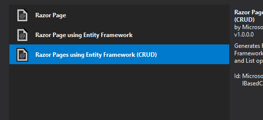

ASP.NET MVC and .NET Core make it easy to produce a wide variety of form elements. One of these that often gives people trouble, however, is the humble checkbox. In this tutorial, we'll look at how to use Razor to produce an MVC Checkbox and CheckBoxList.

First, I'll go over how to produce this effect in VS 2017 and .NET Core. Then we'll improve on the process, moving from a single checkbox to multiple checkboxes. Finally, we'll highlight the differences between MVC 5 and Core in creating a list of checkboxes in your Razor forms.

## Project Setup in Visual Studio 2017

I'm using Visual Studio 2017 and .NET Core to set up this project. I've gone over how to set up a project in older versions of Visual Studio in a number of other articles, [like this one on Bootstrap datepickers](https://sensibledev.com/how-to-use-bootstrap-datepicker-in-mvc/). If you're still using VS 2015, the steps will be almost identical, but you may want to look at that article for some small differences.

For our project, let's imagine a scenario where we might want to use a checkbox. Let's pretend that we're working for a video production company, and we want to keep track of which video files have been backed up, and which haven't. Our checkbox, in the interface, will represent whether the file has been backed up or not.

Create a new ASP.NET Core solution and call it _CheckBox_.

Leave the authentication type as "No Authentication." I've also chosen to uncheck the "Configure for HTTPS" checkbox, because I'm not planning on deploying this example project later. Leave yours checked if you want to.

Now that we've got a mostly empty project created, let's make our VideoFile model and scaffold the database.

Begin by creating a _Models_ folder in your project. Then, create these two C# class files in the folder:

_VideoFile.cs_

public class VideoFile
{
    public int ID { get; set; }
    public string FileName { get; set; }
    public bool IsBackedUp { get; set; }
}

_ProjectContext.cs_

public class ProjectContext : DbContext
{
    public ProjectContext(DbContextOptions<ProjectContext> options)
        : base(options)
            { }

    public DbSet<VideoFile> VideoFiles { get; set; }
}

Next, in _Startup.cs_, add the DbContext to the `ConfigureServices` method.

using Microsoft.EntityFrameworkCore;

public void ConfigureServices(IServiceCollection services)
{
    services.Configure<CookiePolicyOptions>(options =>
    {
        // This lambda determines whether user consent for non-essential cookies is needed for a given request.
        options.CheckConsentNeeded = context => true;
        options.MinimumSameSitePolicy = SameSiteMode.None;
    });

    services.AddDbContext<ProjectContext>(options =>
        options.UseSqlServer(Configuration.GetConnectionString("DefaultConnection")));

    services.AddMvc().SetCompatibilityVersion(CompatibilityVersion.Version\_2\_1);
}

Add the default connection string to _appsettings.json_. We'll use a local SQL server database.

{
  "ConnectionStrings": {
    "DefaultConnection": "Server=(localdb)\\\\mssqllocaldb;Database=TestDb;Trusted\_Connection=True;ConnectRetryCount=0"
  },
  "Logging": {
    "LogLevel": {
      "Default": "Warning"
    }
  },
  "AllowedHosts": "\*"
}

Now, let's scaffold our database. In the Package Manager Console, run the following commands:

Add-Migration initial
Update-Database

At this point, you should have a working database and a basic project laid out. Finally, before we start working on our checkboxes, let's create a new set of Razor pages so we can handle our CRUD actions.

Create a new folder under _Pages_ and call it _VideoFiles._ Right-click on this new folder, and select _Add -> Razor Page..._

Select _Razor Pages using Entity Framework (CRUD)_.

On the next screen, select the appropriate model file and database context.

Clicking "Add" will then scaffold your Razor pages.

Now it's time to check out these Razor pages and see how to handle checkboxes.

## Razor Pages Checkboxes

Head to _Pages/VideoFiles/Create.cshtml._ You'll see that, by default, our scaffolding process has given us this markup for the checkbox:

    

        <label>
            <input asp-for="VideoFile.IsBackedUp" /> @Html.DisplayNameFor(model => model.IsBackedUp))
        </label>
    

Here, we have the Bootstrap markup for a checkbox. The `asp-for` is a Razor Tag Helper that uses the model property type to render the right type of input. Basically, it detects that `IsBackedUp` is a boolean, so it renders a checkbox.

Try running your project. You'll notice that there are build errors. For whatever reason, the default scaffolding for checkboxes in .NET Core is wrong. Take a look at the markup. Do you see it?

This HtmlHelper:

@Html.DisplayNameFor(model => model.IsBackedUp)

Should actually be:

@Html.DisplayNameFor(model => model.VideoFile.IsBackedUp)

Razor pages uses what's called a PageModel, which is essentially a ViewModel for the page. Apparently, the scaffolding template hasn't been adjusted to account for the fact that your model (VideoFile) is a property of the PageModel.

In any case, change that line in the _Create_ and _Edit_ views. Then run the project again, and you should see a form like this:

Not exactly pretty, but it works. If you inspect the page, you'll see the rendered HTML of the checkbox element:

    

        <label>
            <input type="checkbox" data-val="true" data-val-required="The IsBackedUp field is required." id="VideoFile\_IsBackedUp" name="VideoFile.IsBackedUp" value="true"> IsBackedUp
        </label>
    

There are some added data attributes for client-side validation, but other than that, this should be pretty straightforward.

Try creating a new Video File and selecting the checkbox. After the record is saved to the database, you'll be redirected to the Index and you should see something like this:

All right, great! We have a checkbox and it's clear that the model-binding is working correctly.

## Small Improvements to the MVC Checkbox

Let's make some small improvements to what we've got already. First, our project is using Bootstrap 3 by default, and I want to update to Bootstrap 4.

I have [a really extensive guide on how to upgrade from Bootstrap 3 to 4](https://sensibledev.com/mvc-bootstrap-form-example/), including how to change the navbar and almost all the form elements.

If you just want a quick fix, though, [download the Boostrap files](https://getbootstrap.com/) and use them to replace the files in _wwwroot/lib/bootstrap/dist_.

At this point, you'll see that the forms and navbar look broken. Again, if you want to fix this, follow [my Bootstrap 4 Form guide](https://sensibledev.com/mvc-bootstrap-form-example/), but I'll just be focusing on the checkbox styles in this tutorial.

You'll want to change the markup in the Razor page for our checkbox, because the structure for checkboxes and labels has changed in Boostrap 4. Change it to this:

    <input asp-for="VideoFile.IsBackedUp" class="form-check-input" />
    <label asp-for="VideoFile.IsBackedUp" class="form-check-label"></label>

Next, let's add a data annotation to our model so that our label is more helpful and human-reader friendly.

Add the data annotation to the _VideoFile.cs_ file like this:

using System.ComponentModel.DataAnnotations;
   
\[Display(Name = "Backed Up")\]
public bool IsBackedUp { get; set; }

Now our forms look like this:

And our index displays as:

Now, I'm really not liking that checkbox on the Index page. It's a disabled checkbox, but I think it's confusing to have an input on a page where there isn't a form. It makes me think, as a user, that there could be some state where I could click on that checkbox and have it do something. In reality, I'll never be able to interact with that checkbox.

Instead, let's make it so that we display some helpful text, like "Yes" or "No".

In the _VideoFile.cs_ model class, add this property at the bottom of the class definition:

\[Display(Name = "Backed Up")\]
public string IsBackedUpDisplay
{
    get
    {
        if (IsBackedUp)
        {
            return "Yes";
        }
        else
        {
            return "No";
        }
    }
}

Now, if we were really going to build this project out, best practice would be to start building a separate ViewModel class with this property in it. I'm not going to bother to do that with this demonstration, but just keep in mind that it's best to separate your Data Transfer Objects from any kind of view logic.

Then, just be sure to change the HTML helpers on the Index page to the appropriate property.

@Html.DisplayNameFor(model => model.VideoFile\[0\].IsBackedUpDisplay)

@Html.DisplayFor(modelItem => item.IsBackedUpDisplay)

We'll then have something much more useful than a grayed-out checkbox on our Index page: a "Yes" or "No" text message.

## MVC CheckBoxList

So we've got one checkbox down and working. But what if you want to have a list of checkboxes, and want to bind that to your model? You could, of course, just make a different boolean property for each checkbox. That'll work just fine.

But what if you really wanted to store that in a list, like a list of video categories, and the video could belong to one _or more_ categories? Let's look at how you could implement that.

If any of you were around in the WebForms era, you'll remember that we had a handy CheckBoxList user control that looked something like this:

<asp:CheckBoxList id="checkboxlist1" runat="server">
   <asp:ListItem>Item 1</asp:ListItem>
   <asp:ListItem>Item 2</asp:ListItem>
   <asp:ListItem>Item 3</asp:ListItem>
   <asp:ListItem>Item 4</asp:ListItem>
   <asp:ListItem>Item 5</asp:ListItem>
   <asp:ListItem>Item 6</asp:ListItem>
</asp:CheckBoxList>

Alas, such a structure does not exist in .NET Core. Instead, let's begin by creating a `List` of SelectListItems in the PageModel file. This is where we'll store our categories. In a live application, you would put these in a database table. (And, in fact, that's what we'll do, later. For now, let's keep things simple.)

public IActionResult OnGet()
{
    Categories = new List<SelectListItem>()
    {
        new SelectListItem { Text = "Nature", Value = "Nature", Selected = false },
        new SelectListItem { Text = "Comedy", Value = "Comedy", Selected = false },
        new SelectListItem { Text = "Education", Value = "Education", Selected = false }
    };

    return Page();
}

\[BindProperty\]
public VideoFile VideoFile { get; set; }
\[BindProperty\]
public List<SelectListItem> Categories { get; set; }

Don't forget to add the `BindProperty` attribute to the List. Otherwise, when your user submits the form, you won't be able to access the values.

Next, in the _Create.cshtml_ file_,_ we need to render our list of checkboxes. You might think to use `foreach` to loop through the list. But there's a problem with that.

You see, in order bind a list of complex objects, you need to provide an index for each item in the list. This index needs to begin at zero, and must be contiguous. (You can't post an object with index zero, and then an object with index 2, skipping index 1. This won't work.)

In order words, if we wanted our list of checkboxes to bind correctly to the PageModel, the rendered HTML would have to look something like this (I've taken out a lot of the attributes to make it easier to read):

    <input class="form-check-input" type="checkbox" name="Categories\[0\].Selected">
    <label class="form-check-label">Nature</label>
    <input type="hidden" name="Categories\[0\].Value" value="Nature">
    <input type="hidden" name="Categories\[0\].Text" value="Nature">

    <input class="form-check-input" type="checkbox" name="Categories\[1\].Selected">
    <label class="form-check-label">Comedy</label>
    <input type="hidden" name="Categories\[1\].Value" value="Comedy">
    <input type="hidden" name="Categories\[1\].Text" value="Comedy">

    <input class="form-check-input" type="checkbox" name="Categories\[2\].Selected">
    <label class="form-check-label">Education</label>
    <input type="hidden" name="Categories\[2\].Value" value="Education">
    <input type="hidden" name="Categories\[2\].Text" value="Education">

Really take care to notice how each of the `SelectListItem` objects are indexed, and there are inputs for each of the properties.

In order to produce this markup, here's what we need to do in our view:

@for(var i = 0; i < Model.Categories.Count(); i++)
{

    <input asp-for="@Model.Categories\[i\].Selected" class="form-check-input" />
    <label asp-for="@Model.Categories\[i\].Selected">@Model.Categories\[i\].Text</label>
    <input type="hidden" asp-for="@Model.Categories\[i\].Value" />
    <input type="hidden" asp-for="@Model.Categories\[i\].Text" />

}

Funnily enough, this is one of the few times that I still use the humble `for` loop. `Foreach` has spoiled me.

Anyway, once you do that, run the project and you ought to see our checkboxes in all their cute little glory:

## Adding the CheckBoxList to the Database

Instead of hard-coding our categories into the PageModel, let's do the sensible thing and put them into our database.

We're going to want a model for the video categories, of course.

Because each video can have many categories, and each category can have many videos, we need to model a **many-to-many** relationship. So, we're also going to add collection properties to the videos and categories. Finally, we need to create an entity to represent the join table (sometimes called an interstitial table) to join the two together.

Think about it this way: without a third table to store which categories are connected to which videos, you can't, well... _connect_ the two.

So here are the three models that we'll need, including the changes to the existing models:

_VideoCategory.cs_

public class VideoCategory
{
    public int ID { get; set; }
    public string Category { get; set; }

    public ICollection<VideoFileVideoCategory> VideoFileVideoCategory { get; set; }
}

_VideoFile.cs_

public class VideoFile
{
    public int ID { get; set; }
    public string FileName { get; set; }
    \[Display(Name = "Backed Up")\]
    public bool IsBackedUp { get; set; }

    \[Display(Name = "Backed Up")\]
    public string IsBackedUpDisplay
    {
        get
        {
            if (IsBackedUp)
            {
                return "Yes";
            }
            else
            {
                return "No";
            }
        }
    }

    public ICollection<VideoFileVideoCategory> VideoFileVideoCategories { get; set; }
}

_VideoFileVideoCategory.cs_

public class VideoFileVideoCategory
{
    public int VideoFileID { get; set; }
    public VideoFile VideoFile { get; set; }
    public int VideoCategoryID { get; set; }
    public VideoCategory VideoCategory { get; set; }
}

Finally, we need to tell Entity Framework _how_ to connect this two. We'll use something called the FluentApi, but it's basically just a way of setting values, like primary and foreign keys, _explicitly._

Add the `OnModelCreating` method to the class in the _ProjectContext.cs_ file, as well as a `DbSet` for our join table.

protected override void OnModelCreating(ModelBuilder modelBuilder)
{
  modelBuilder.Entity<VideoFileVideoCategory>()
        .HasKey(fc => new { fc.VideoFileID, fc.VideoCategoryID });

    modelBuilder.Entity<VideoFileVideoCategory>()
        .HasOne(fc => fc.VideoFile)
        .WithMany(f => f.VideoFileVideoCategories)
        .HasForeignKey(fc => fc.VideoFileID);

    modelBuilder.Entity<VideoFileVideoCategory>()
        .HasOne(fc => fc.VideoCategory)
        .WithMany(c => c.VideoFileVideoCategory)
        .HasForeignKey(fc => fc.VideoCategoryID);
}

public DbSet<VideoFile> VideoFiles { get; set; }        
public DbSet<VideoCategory> VideoCategories { get; set; }        
public DbSet<VideoFileVideoCategory> VideoFileVideoCategory { get; set; }

Whew, that's a lot for something that seems so simple! But, again, we're just setting our foreign keys manually.

Update the database by running the following two commands in the Package Manager Console:

Add-Migration jointable
Update-Database

If you were to open up SQL Server Management Studio and look at the column definitions, you'll see that Entity Framework has set up our key relationships correctly:

This table has what's called a **composite** **key**, which just means that the key is a combination of multiple columns.

All right, now that we have that all done, what can we do?

If you still have SQL Server Management Studio open, you can edit the VideoCategories table directly and add some categories. Otherwise, make a new set of RazorPages and create them using the web interface.

Either way, get some data into the VideoCategories table.

Next, we need to change the code in our Create PageModel so that we can actually save the input from the checkboxes into our table.

Here's what our new class looks like in _Create.cshtml.cs_:

public class CreateModel : PageModel
{
    private readonly CheckBox.Models.ProjectContext \_context;

    public CreateModel(CheckBox.Models.ProjectContext context)
    {
        \_context = context;
    }

    public IActionResult OnGet()
    {
        Categories = \_context.VideoCategories.Select(vc =>
            new SelectListItem
            {
                Text = vc.Category,
                Value = vc.ID.ToString()
            })
            .ToList();

        return Page();
    }

    \[BindProperty\]
    public VideoFile VideoFile { get; set; }
    \[BindProperty\]
    public List<SelectListItem> Categories { get; set; }

    public async Task<IActionResult> OnPostAsync()
    {
        if (!ModelState.IsValid)
        {
            return Page();
        }

        \_context.VideoFiles.Add(VideoFile);
        \_context.SaveChanges();

        foreach (var c in Categories)
        {
            if (c.Selected)
            {
                var videoFileVideoCategory = new VideoFileVideoCategory
                {
                    VideoFileID = VideoFile.ID,
                    VideoCategoryID = Convert.ToInt32(c.Value)
                };

                \_context.VideoFileVideoCategory.Add(videoFileVideoCategory);
            }
        }

        await \_context.SaveChangesAsync();

        return RedirectToPage("./Index");
    }
}

In our `OnGet` method, we're grabbing the video categories from the database. In the post method, we loop through the categories. If the SelectListItem is selected, we're going to write that relationship to the join table.

You would want to edit the rest of your CRUD actions to pull in the video categories, but you should be able to modify the code we produced in the Create action fairly easily.

## MVC CheckBoxList in MVC 5

If you're still using Visual Studio 2015 (or lower), I just want to highlight a few of the differences you'll encounter through this process.

You won't have access to the Tag Helpers, which are a .NET Core only feature. You'll have to use an HTML helper for the inputs, which should look something like this:

@Html.CheckBoxFor(m => m.VideoFile.IsBackedUp,`new { @class = "form-check-input" }`)

MVC 5 is also smart enough to be able to make the many-to-many join table for you, without any additional configuration.

You would just set up your models like this:

_ProjectContext.cs_

public class ProjectContext : DbContext
{
    public ProjectContext() : base("name=default")
    {
    }
    public DbSet<VideoFile> VideoFiles { get; set; }
    public DbSet<VideoCategory> VideoCategories { get; set; }
}

_VideoCategory.cs_

public class VideoCategory
{
    public int ID { get; set; }
    public string Category { get; set; }

    public virtual ICollection<VideoFile> VideoFiles { get; set; }
}

_VideoFile.cs_

public class VideoFile
{
    public int ID { get; set; }
    public string FileName { get; set; }
    public bool IsBackedUp { get; set; }

    public virtual ICollection<VideoCategory> VideoCategories { get; set; }
}

And be sure to add a connection string to your _Web.config_ file.

<connectionStrings>
  <add name="default" connectionString="Server=(localdb)\\mssqllocaldb;Database=TestDb;Trusted\_Connection=True;ConnectRetryCount=0" providerName="System.Data.SqlClient" />
</connectionStrings>

Run your migrations the same way as in .NET Core. You may have to run the `Enable-Migrations` command before the `Add-Migration initial` and `Update-Database` commands.

Again, no need for extra configuration or a model for the join table. Entity Framework just creates it in your database based on the `ICollection` relationships in your models.

The rest of the differences are just standard MVC 5 and .NET Core ones: use Controllers instead of Razor Pages, models instead of PageModels, etc.

## MVC Checkbox and CheckBoxList: Conclusion

We've taken a look at how to implement the checkbox in both MVC 5 and .NET Core. For all its advantages, I have to say I'm somewhat surprised that Entity Framework Core doesn't have the ability to infer interstitial join tables. I really hope that this gets improved in the future.

I hope that this has helped you make your form-building just a little bit easier. Happy, sensible coding!
