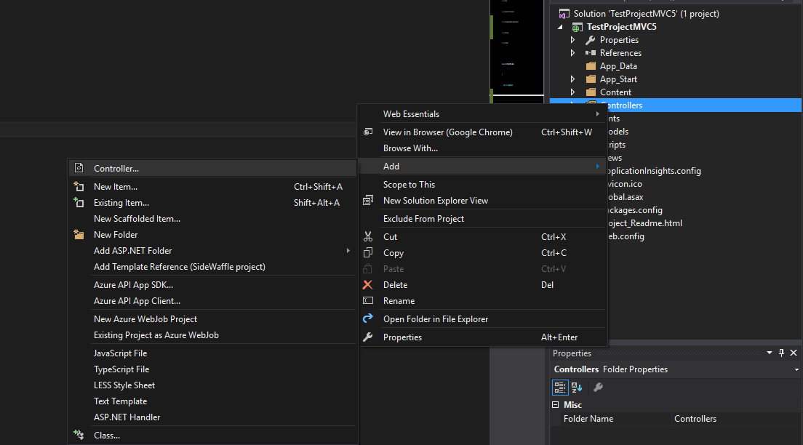
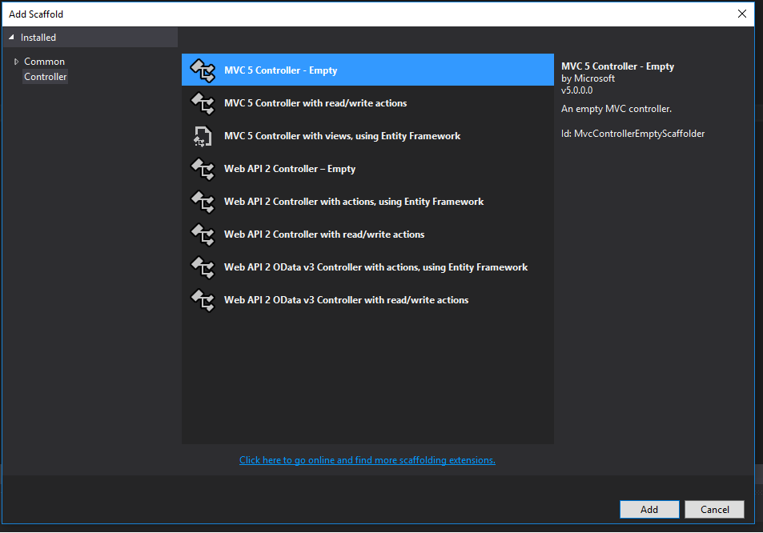
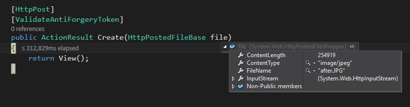

Using ASP.NET MVC's model binding, it's easy to capture text and number fields from forms. One of the things that beginners get stuck on sometimes is adding a file upload to a form. MVC's DataAnnotations allow for a variety of types, like DateTime and Text, but not for a File type. While a file upload isn't as "built-in" as the text and number types, it's perfectly possible to take some simple steps to add a file upload. Let's take a look at how we can accomplish this, taking the process one step at a time, eventually implementing an MVC multiple file upload.

## ASP.NET Single File Upload

When I'm learning something new, I like to understand the simplest possible implementation, and then move on from there. Let's start with a very simple single-file upload.

For the purposes of this project, I'll pretend that I'm building an image-sharing application, like an Imgur clone. Eventually, I'll want users to post an image, or series of images, and give that post a name. For now, let's just allow users to upload a single image. I'll begin by creating an Images controller in my project.

In our controller, we'll code the actions for creating a new image post.

public ActionResult Create()
{
  return View();
}

\[HttpPost\]
\[ValidateAntiForgeryToken\]
public ActionResult Create(HttpPostedFileBase file)
{
  //we'll add some logic here later to process our file
  return View();
}

In our POST method, notice how our method accepts an `HttpPostedFileBase` parameter. This class will allow us to access the uploaded file.

Over in our View, we'll need to create a form with an HTML input that has a type of `file`.

@{
  ViewBag.Title = "Create";
}

<h2>Create</h2>

@using (Html.BeginForm("Create", "Images", FormMethod.Post, new { enctype = "multipart/form-data" }))
{
  @Html.AntiForgeryToken()

  <label for="file">Upload Image:</label>
  <input type="file" name="file" id="file" />
  <input type="submit" value="Upload" />
}

In the `BeginForm` HTML helper, we need to specify the `enctype` (short for "encoding type") for our file to be recognized. If we don't set it to "multipart/form-data", our controller won't recognize the file and we'll get a null value.

Inside of the form, we have our standard label and type input, along with the file input. Make sure the name attribute is "file" so that our controller method will be able to bind it correctly.

If we set a debug breakpoint in our controller method, we'll see that we can successfully upload our file.

That's a great start! Now let's figure out what we can do with it.

Let's do something really naive, and just save the file to our server. This code will accomplish that:

using System.IO;

\[HttpPost\]
\[ValidateAntiForgeryToken\]
public ActionResult Create(HttpPostedFileBase file)
{
  var fileName = Path.GetFileName(file.FileName);
  var path = Path.Combine(Server.MapPath("~/App\_Data/uploads"), fileName);
  file.SaveAs(path);

  return View();
}

The steps here are pretty straightforward. We get the file's name, then combine that with the path of a folder in App\_Data. Finally, we save the file to that folder.

Of course, there are improvements to be made. What if the user clicks the Upload button without uploading a file? What if the file isn't an image? We need to implement some error checking and validation to our form.

## ASP.NET File Upload Validation

We want to make sure that the user actually uploaded a file, and also that the file isn't empty. We can do a simple conditional check to accomplish this.

if (file != null && file.ContentLength > 0)
{
    var fileName = Path.GetFileName(file.FileName);
    var path = Path.Combine(Server.MapPath("~/App\_Data/uploads"), fileName);
    file.SaveAs(path);
}

You could also use the `ContentLength` property to validate for _maximum_ file lengths. Also keep in mind that, by default, the maximum size of a file upload is 4MB. If you need to allow for larger sizes, you'll need to adjust the [MaxRequestLength](https://msdn.microsoft.com/en-us/library/system.web.configuration.httpruntimesection.maxrequestlength.aspx) property in the web.config.

<system.web>
  <httpRuntime maxRequestLength="1048576" />
</system.web>

What if we want to make sure that the user has actually uploaded an image, and not, for example, an executable or a pdf? Here's how we would check the file extension:

List<string> allowedExtensions = 
    new List<string>() { ".png", ".jpeg", ".jpg", ".gif" };
string fileExtension = Path.GetExtension(file.FileName).ToLower();
bool isAllowed = allowedExtensions.Contains(fileExtension);

Here, we're maintaining a list of allowed file extensions, then checking the extension of the uploaded file against that list. Note the call to `ToLower`, which is necessary in case users have named their files in upper or mixed-case.

But we should also check the actual file type that's been uploaded, as a user could manually rename the file extension. Don't trust your users, much as you might want to. Here's how you do it:

List<string> allowedFileTypes =
    new List<string>() { "image/png", "image/jpeg", "image/jpg", "image/gif" };
string fileType = file.ContentType.ToLower();
bool isAllowedType = allowedFileTypes.Contains(fileType);

So, now we know how to validate for some basic properties of our file upload. How would we go about allowing for multiple file uploads?

## MVC Multiple File Upload

First, we need to add the `multiple` property to our file upload input on our form in the view. Also, we'll want to change the name of the file input to the plural `files`. (Technically, we don't _need_ to do this, but the name change will make our intentions clearer.) This will match a parameter change we'll make in our controller.

@using (Html.BeginForm("Create", "Images", FormMethod.Post, new { enctype = "multipart/form-data" }))
{
    @Html.AntiForgeryToken()

    <label for="file">Upload Image:</label>
    <input type="file" name="files" id="files" multiple/>
    <input type="submit" value="Upload" />
}

In our controller, we just need to change the single `HttpPostedFileBase` parameter to a collection, like this:

\[HttpPost\]
\[ValidateAntiForgeryToken\]
public ActionResult Create(IEnumerable<HttpPostedFileBase> files)
{
  foreach(var file in files)
  {
    if (file != null && file.ContentLength > 0)
    {
      var fileName = Path.GetFileName(file.FileName);
      var path = Path.Combine(Server.MapPath("~/App\_Data/uploads"), fileName);
      file.SaveAs(path);
    }
  }
  return View();
}

As you can see, we only need to loop through the collection of files, and perform the same steps we defined earlier.

So this works, and works just fine. But wouldn't it be nice if we could do some of this validation on our model, like the rest of MVC validation? Wouldn't it be nice if we could use an HTML helper for our input? Let's look at how to make our file uploading a bit more robust with some reusable model code.

## MVC File Upload Model Validation

Instead of doing all of that validation in our controller, let's move that logic to a custom DataAnnotation. I discuss the idea of custom DataAnnoations in MVC back in my post about the [CompareValidator](https://sensibledev.com/compare-validator-in-mvc/). We'll perform the same basic process of inheriting from the `ValidationAttribute` class and overriding `IsValid`. Here are the steps our custom validator needs to follow:

1. If we've put the data annotation on a property type that's _not_ a file, we display an error. For example, if a developer tries to use our custom file validation on a plain text field, we want to let them know.
2. If the property type is `HttpPostedFileBase`, then we just need to validate one file. If it's an `IEnumerable<HttpPostedFileBase>`, we'll want to loop through the files and validate all of them.
3. If the property is set to `Required`, make sure that a file is present. We'll use some reflection to determine if our property has the required attribute attached to it.
4. If the user defines allowable file types, check the file type against that list.

Here's the final code for our custom validation class:

public class FileAttribute : ValidationAttribute
{
  public string\[\] FileTypes { get; set; }
  protected override ValidationResult IsValid(object value, ValidationContext validationContext)
  {
    if (value is HttpPostedFileBase)
    {
        return ValidateSingleFile((HttpPostedFileBase)value);
    }
    else if (value is IEnumerable<HttpPostedFileBase>)
    {
        var propertyInfo = validationContext.ObjectType.GetProperty(validationContext.MemberName);
        var isRequired = propertyInfo.CustomAttributes.Where(x => x.AttributeType == typeof(RequiredAttribute)).FirstOrDefault() != null;

        return ValidateMultipleFiles(value, isRequired);
    }
    else 
    {
        return new ValidationResult("The input type is not a file.");
    }
  }

  private ValidationResult ValidateSingleFile(HttpPostedFileBase file)
  {
    if (!isFileAllowedType(file))
    {
        return DisallowedFileTypeError(file);
    }

    return ValidationResult.Success;
  }

  private ValidationResult ValidateMultipleFiles(object value, bool isRequired)
  {
    IEnumerable<HttpPostedFileBase> files = (IEnumerable<HttpPostedFileBase>)value;

    if (isRequired && files.ToList()\[0\] == null)
    {
        return new ValidationResult("No files found.");
    }

    foreach (var file in files)
    {
        if (!isFileAllowedType(file))
        {
            return DisallowedFileTypeError(file);
        }
    }

    return ValidationResult.Success;
  }

  private bool isFileAllowedType(HttpPostedFileBase file)
  {
    string fileType = file.ContentType.ToLower();
    return FileTypes.Length == 0 || FileTypes.Contains(fileType);
  }

  private ValidationResult DisallowedFileTypeError(HttpPostedFileBase file)
  {
    string fileName = file.FileName;
    return new ValidationResult($"{ fileName } is not an allowed file type.");
  }
}

A few words of explanation are needed here. We want to make sure that, if the `Required` attribute is present, the user actually uploaded a file. With a single `HttpPostedFileBase` required property, this all works automatically. If the user doesn't upload a file, the property will be null. The code behind the `Required` attribute sees that the property is null, and throws a validation error like we want.

If our property is an `IEnumerable<HttpPostedFileBase>`, on the other hand, and the user doesn't upload a file, the property _won't_ be null. The property will be an array of files, with a single null value at index 0. `Required`, in this case, sees that it isn't null, and doesn't return any model validation errors. Therefore, if we have an array of multiple files, we need to check to see if that first value is null and return the error ourselves.

Now that we have our custom model validation class defined, let's actually create a model to use it. In this case, we'll assume that we're creating a multiple file upload.

public class ImageUpload
{
  public string Title { get; set; }

  \[Required\]
  \[File(FileTypes = new string\[\] { "image/png", "image/jpeg", "image/jpg", "image/gif" } )\]
  public IEnumerable<HttpPostedFileBase> Files { get; set; }
}

We've added a field for a user to put in a title for their post. Beyond that, we've added the `Required` attribute, our custom validator with a list of allowed file types, and the actual property.

If we wanted to ensure a single-file only upload, we would just change the property type, and add this to the `Required` data annotation:

\[Required(ErrorMessage = "No files found.")\]

And that's it for the model. In our view, we'll want to add our model. To make things a little more consistent, we'll also change the hard-coded tags to HTML helpers.

@model TestProjectMVC5.Models.ImageUpload
@{
    ViewBag.Title = "Create";
}

<h2>Create</h2>

@using (Html.BeginForm("Create", "Images", FormMethod.Post, new { enctype = "multipart/form-data" }))
{
    @Html.AntiForgeryToken()

    @Html.LabelFor(model => model.Title, htmlAttributes: new { @class = "control-label col-md-2" })
    @Html.EditorFor(model => model.Title, new { htmlAttributes = new { @class = "form-control" } })
    @Html.ValidationMessageFor(model => model.Title, "", new { @class = "text-danger" })

    @Html.LabelFor(model => model.Files, htmlAttributes: new { @class = "control-label col-md-2" })
    @Html.TextBoxFor(model => model.Files, new { type = "file", multiple = "" })
    @Html.ValidationMessageFor(model => model.Files, "", new { @class = "text-danger" })

    <input type="submit" value="Upload" />
}

Notice how we've changed the input element to MVC's TextBoxFor helper. Something that almost tripped me up was adding the multiple attribute. My initial thought was to code it as `multiple="multiple"`, but Razor doesn't know what do with that except to put it literally on the input. This isn't what we want, obviously: we want to add the attribute _without_ a value. Changing the assignment to an empty string does the trick, though, and we're off.

## ASP.NET Core Multiple File Upload

In researching this article, I thought that I would be able to describe the differences in ASP.NET Core succinctly. Actually, there are a number of differences that are distinctly different about uploading files in .NET Core.

First, `HttpPostedFileBase` does not exist in .NET Core. Instead, we need to use the `IFile` interface. Aside from changing a few file types, we'll want to make a change regarding our multiple file upload validation.

Remember that in MVC 5, When a user fails to upload any files, an `IEnumerable<HttpPostedFileBase>` will bind to our model as an array with a null value at index 0. An `IEnumerable<IFile>` will not do that, but will simply be null, like we might expect. Therefore, we can rely only on the `Required` attribute for both single and multiple file uploads. We no longer need to do a null check in our custom validation code.

Here's our updated _FileAttribute.cs_ file for .NET Core:

public class FileAttribute : ValidationAttribute
{
  public string\[\] FileTypes { get; set; }
  protected override ValidationResult IsValid(object value, ValidationContext validationContext)
  {
    if (value is IFormFile)
    {
      return ValidateSingleFile((IFormFile)value);
    }
    else if (value is IEnumerable<IFormFile>)
    {
      return ValidateMultipleFiles(value);
    }
    else
    {
      return new ValidationResult("The input type is not a file.");
    }
  }

  private ValidationResult ValidateSingleFile(IFormFile file)
  {
    if (!isFileAllowedType(file))
    {
      return DisallowedFileTypeError(file);
    }

    return ValidationResult.Success;
  }

  private ValidationResult ValidateMultipleFiles(object value)
  {
    IEnumerable<IFormFile> files = (IEnumerable<IFormFile>)value;

    foreach (var file in files)
    {
        if (!isFileAllowedType(file))
        {
            return DisallowedFileTypeError(file);
        }
    }

    return ValidationResult.Success;
  }

  private bool isFileAllowedType(IFormFile file)
  {
    string fileType = file.ContentType.ToLower();
    return FileTypes.Length == 0 || FileTypes.Contains(fileType);
  }

  private ValidationResult DisallowedFileTypeError(IFormFile file)
  {
    string fileName = file.FileName;
    return new ValidationResult($"{ fileName } is not an allowed file type.");
  }
}

Let's turn now to our view. For this tutorial, I'll be using Razor pages instead of a separate view and controller. ASP.NET Core makes use of helper tags, so here's what we get:

@page
@model TestProject.Pages.Images.CreateModel
@{
    ViewData\["Title"\] = "Create";
}

<h2>Create</h2>
<form method="post" enctype="multipart/form-data">
  

  

    

        <label asp-for="ImageUpload.Title" class="control-label"></label>
        <input asp-for="ImageUpload.Title" class="form-control" />
        
    

  

  

    

        <label asp-for="ImageUpload.Files" class="control-label"></label>
        <input asp-for="ImageUpload.Files" class="form-control" multiple />
        
    

  

  

    

        <input type="submit" value="Upload" />
    

  

</form>

Essentially, it's the same as our example in MVC5, but with the helper tag syntax. Whether you prefer this style to MVC5 is, of course, up for debate. Now let's look at our PageModel.

public class CreateModel : PageModel
{
  private IHostingEnvironment \_env;

  public CreateModel(IHostingEnvironment env)
  {
    \_env = env;
  }

  public void OnGet()
  {

  }

  \[BindProperty\]
  public ImageUpload ImageUpload { get; set; }

  public async Task<IActionResult> OnPostAsync()
  {
    if (!ModelState.IsValid)
    {
      return Page();
    }

    foreach (var file in ImageUpload.Files)
    {
      if (file.Length > 0)
      {
        var fileName = Path.GetFileName(file.FileName);
        var filePath = Path.Combine(\_env.ContentRootPath, "Uploads", fileName);

        using (var stream = new FileStream(filePath, FileMode.Create))
        {
          await file.CopyToAsync(stream);
        }
      }
    }

    return RedirectToPage("./Index");
  }
}

We still loop through the files and write them to disk. (You would also want to write the post title and the file name to a database, but I've left that out here to simplify the code.)

You'll notice that the commands to write to disk are a bit different. Instead of `file.SaveAs()`, we have an async FileStream that we're writing to. ASP.NET Core is big on promoting asynchronous methods.

There are a few peculiarities in writing the file to disk. We no longer have `Server.MapPath` to build our file path. Instead, since .NET Core supports different hosting environments, we need to determine which hosting environment we're in via the dependency injection in the PageModel constructor. We can then get the `ContentRootPath`, and add parameters to define the folder name and the file name. If you would rather have the files go into the _wwwroot_ folder, you would want to use `_env.WebRootPath` instead.

## MVC Multiple File Upload: Conclusion

The main idea with uploading multiple files is pretty simple: change the single file type to a collection, and make sure to add the `multiple` attribute to the file input in the view. The way this is accomplished is different in MVC 5 and .Net Core. MVC 5 uses `HttpPostedFileBase` while .Net Core uses `IFile`. Each version also has a different way of creating a file path if you're saving the files to disk. You can also enhance the validation of your file uploads by creating a custom validation attribute for your model.

I've also put the validation classes into a couple of Github Gists for convenience:

[ASP.NET MVC 5 Multiple File Upload Validation](https://gist.github.com/matthewsinex/d85e2a22ffe5042a47f64ca1556191b7)

[ASP.NET Core Multiple File Upload Validation](https://gist.github.com/matthewsinex/87de5e238042dc015abc7a73bf9f120f)

You could, of course, extend these to add validation for other qualities, like maximum file lengths. I hope that you've found this guide helpful, and that you'll now find uploading multiple files in ASP.NET much easier.
