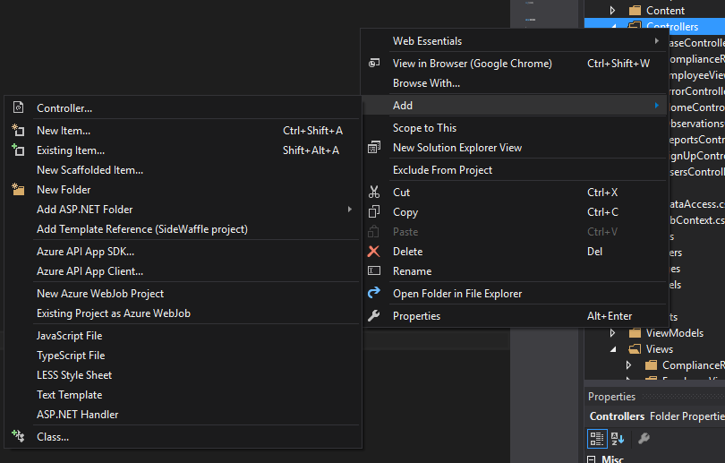

The humble telephone number can cause a lot of headaches for web developers. Those digits can vary from region to region. Maybe your project manager wants the phone numbers in a particular format. Have you considered whether to allow for extensions? What about area codes? International leading digits? You may be tempted to pull your hair out. You might want to just give up, put a plain text input on the form, and let the someone else deal with it later. But before you go to such drastic measures, let's take a look at a few ways that we can accomplish phone number validation in ASP.NET.

## Phone Number Validation in ASP.NET MVC

In ASP.NET Standard and in ASP.NET Core, validation rules are defined on the Model. These rules are then respected by both the server-side validation and the client-side validation (using jQuery Unobtrusive Validation). All of this is built right in to the framework, and I would highly suggest working through some of the basic MVC tutorials ([like this one](https://docs.microsoft.com/en-us/aspnet/mvc/overview/getting-started/introduction/getting-started)) to understand ASP.NET MVC architecture if you don't quite understand the concept yet.

For our purposes, we'll assume that you've already set up a project, and you're looking to add phone number validation. Let's create a class to represent a user. We'll make two properties, one for the user's email and one for the user's phone number.

public class User
{
    public string Email { get; set; }
    public string PhoneNumber { get; set; }
}

To generate the Controller and Views from this Model, we'll use the default scaffolding. Right-click on _Controllers_ in the Solution Explorer, then choose _Add -> Controllers... -> MVC 5 Controller with views, using Entity Framework_. Click _Add_, then choose the `User` class as your Model class.

Our controller and views have been created. If we run our project locally, and head out to `http://localhost:[YOUR PORT]/Users/Create`, we'll see our form.

So, we've got a great start here. However, as you could probably guess, there's no validation here whatsoever. If we put something that's obviously not a phone number, the controller code will simply accept it as is, and then you'll have this stuck in your database:

Not good. However, adding the validation rules to the model using DataAnnotations will help us filter out garbage input.

Back in the User class, let's see what happens when we add the `PhoneNumber` datatype to the `PhoneNumber` property:

using System.ComponentModel.DataAnnotations;

namespace ExampleProject.Models
{
    public class User
    {
        public int ID { get; set; }

        public string Email { get; set; }

        \[DataType(DataType.PhoneNumber)\]
        public string PhoneNumber { get; set; }
    }
}

What will this do? Specifying the DataType annotation will add the `type` HTML attribute with a value of `tel` to the rendered input on the form:

`<input class="form-control text-box single-line" id="PhoneNumber" name="PhoneNumber" type="tel" value="">`

On mobile browsers, this will bring up a special telephone number widget. The change in interface, and its similarity in appearance to a telephone number pad, helps the user understand what they should be inputting.

Unfortunately, this experience only happens on mobile. Chrome and Firefox for desktop won't render the input any differently than a typical textbox. Your users will still be able to enter any string input they want.

So, we're going to change the `DataType` DataAnnotation on the model to the `[Phone]` annotation:

\[Phone\]
public string PhoneNumber { get; set; }

Now, when we try to enter garbage telephone numbers, we'll receive this error:

Awesome! So what's happening here?

The `[Phone]` DataAnnotation does two important things. First, it puts the `type="tel"` attribute on the input, just like the `DataType` Annotation from earlier. Second, it checks the input against a regular expression to see if it matches. Looking at the [source code](https://referencesource.microsoft.com/#System.ComponentModel.DataAnnotations/DataAnnotations/PhoneAttribute.cs), we find that Microsoft has chosen this for the regex:

^(\\+\\s?)?((?<!\\+.\*)\\(\\+?\\d+(\[\\s\\-\\.\]?\\d+)?\\)|\\d+)(\[\\s\\-\\.\]?(\\(\\d+(\[\\s\\-\\.\]?\\d+)?\\)|\\d+))\*(\\s?(x|ext\\.?)\\s?\\d+)?$

So, the `[Phone]` attribute is functionally equivalent to

\[DataType(DataType.PhoneNumber)\]
\[RegularExpression(@"^(\\+\\s?)?((?<!\\+.\*)\\(\\+?\\d+(\[\\s\\-\\.\]?\\d+)?\\)|\\d+)(\[\\s\\-\\.\]?(\\(\\d+(\[\\s\\-\\.\]?\\d+)?\\)|\\d+))\*(\\s?(x|ext\\.?)\\s?\\d+)?$", ErrorMessage = "The PhoneNumber field is not a valid phone number")\]
public string PhoneNumber { get; set; }

Obviously, for most of your basic phone number validation needs in ASP.NET, `[Phone]` will do the job just fine and is much more readable.

Here's something neat you learn by scanning the regex: the default validation allows for extensions on the phone numbers in a number of formats, like `555-1234 ext. 1234` or `555-1234 x1234`.

## Phone Number Validation in ASP.NET Core

Model validation works the same way in Core as it does in the .NET Framework. The only difference is going to be the structure of the backend code if you're using Razor Pages, which is what Microsoft is pushing as a new way to structure your web apps.

The resulting PageModel (analogous to the Controller) for creating users will look like this:

public class CreateModel : PageModel
{
  private readonly ExampleProject.DAL.ProjectContext \_context;

  public CreateModel(ExampleProject.DAL.ProjectContext context)
  {
    \_context = context;
  }

  public IActionResult OnGet()
  {
    return Page();
  }

  \[BindProperty\]
  public User User { get; set; }

  public async Task<IActionResult> OnPostAsync()
  {
    if (!ModelState.IsValid)
    {
      return Page();
    }

    \_context.User.Add(User);
    await \_context.SaveChangesAsync();

    return RedirectToPage("./Index");
  }
}

And the view will look like this:

@page
@model ExampleProject.Pages.Users.CreateModel

@{
  ViewData\["Title"\] = "Create";
}

<h2>Create</h2>

<h4>User</h4>

  

    <form method="post">
      

      

        <label asp-for="User.Email" class="control-label"></label>
        <input asp-for="User.Email" class="form-control" />
        
      

      

        <label asp-for="User.PhoneNumber" class="control-label"></label>
        <input asp-for="User.PhoneNumber" class="form-control" />
        
      

      

        <input type="submit" value="Create" class="btn btn-default" />
      

    </form>
  

  <a asp-page="Index">Back to List</a>

@section Scripts {
  @{await Html.RenderPartialAsync("\_ValidationScriptsPartial");}
}

The model class looks precisely the same, and validation attributes will function the same way it does in MVC 5.

## Adding Custom Phone Number Validation with Regular Expressions

The process we've gone over should be good enough for almost all your uses. However, sometimes you might need to constrain the phone number format even further. I would advise you to think very carefully about this, however. If you don't _need_ to customize this, you really shouldn't.

First, find an appropriate regular expression for your needs. For example, let's imagine that you want your input to conform to North American phone numbers. I found some regex from the [Regular Expressions Cookbook](https://www.safaribooksonline.com/library/view/regular-expressions-cookbook/9781449327453/ch04s02.html):

`^\(?([0-9]{3})\)?[-.●]?([0-9]{3})[-.●]?([0-9]{4})$`

(By the way, if someone tells you "I found some regex..." and your stomach doesn't clench, you haven't been around web developers and regex long enough.)

I'd recommend testing out any regex that you copy/paste from Stack Overflow. (And, let's be honest, that's probably where you found it.) Let's put our pattern into the regex builder at [RegExr](https://regexr.com/):

Once you're satisfied that the pattern matching in the regex is what you want, add it to your model with a `RegularExpression` annotation.

public class User
{
    public int ID { get; set; }

    public string Email { get; set; }

    \[DataType(DataType.PhoneNumber)\]
    \[RegularExpression(@"^\\(?(\[0-9\]{3})\\)?\[-.●\]?(\[0-9\]{3})\[-.●\]?(\[0-9\]{4})$", ErrorMessage = "The PhoneNumber field is not a valid phone number")\]
    public string PhoneNumber { get; set; }
}

## Phone Number Validation in ASP.NET WebForms

If you're working on an older WebForms project and need to add phone number validation, you'll have to use regular expressions in a validation control. These controls go right on to the `.aspx` page. Here's a brief example:

<asp:Label runat="server" AssociatedControlID="txtPhoneNumber">Phone Number</asp:Label>
<asp:RegularExpressionValidator runat="server" 
  ControlToValidate="txtPhoneNumber" 
  ValidationGroup="AllValidators"
  ErrorMessage="Please enter a valid phone number."
  ValidationExpression="^\\(?(\[0-9\]{3})\\)?\[-.●\]?(\[0-9\]{3})\[-.●\]?(\[0-9\]{4})$"
  >
</asp:RegularExpressionValidator>
<asp:TextBox runat="server" ID="txtPhoneNumber"></asp:TextBox>

## Helping Your Users with Input Masks

It can be very frustrating to enter a phone number, fill out the rest of a form, and then be told that your phone number didn't match some magical format you weren't told about. No matter what version of .NET you're using, you can use input masks to guide your users toward entering the right input.

An input mask forces a format on the input as the user types. So, as our user starts entering digits, the input might apply parentheses and hyphens automatically. This gives our user a hint as to what we're expecting him or her to enter. Input masks are especially helpful for types like phone numbers that have a number of possible formats.

There are a variety of input mask libraries out there, but we're going to use [jQuery Mask Plugin](https://igorescobar.github.io/jQuery-Mask-Plugin/) for this article. After downloading the source and adding `jquery.mask.js` to our _Scripts_ folder, let's add the following code to our Create view. The follow code belongs in _Create.cshtml,_ in the scripts section right under the `@Scripts.Render("~/bundles/jqueryval")` script bundle:

The string you pass to the `mask` function defines the pattern you want to impose on the input. The '0' character indicates that the user should type a number. Here's what we get if we run our page now:

I didn't type any of the parentheses or hyphens, and if I try to type more digits beyond our pattern, the input mask won't let me. We have a neatly formatted phone number, and a slick user experience. Pretty cool!

Bear in mind that your input mask should match any regular expressions you're defining on the model. When I was writing this article, I received this error the first time around:

That certainly looks like a valid phone number! I receive the error because the format of the input mask didn't match the regex on the model.

The jQuery Mask Plugin has some other cool features, like changing the mask format if the input goes beyond a certain character count. Here's the example from the plugin documentation:

var options =  {
  onKeyPress: function(cep, e, field, options) {
    var masks = \['00000-000', '0-00-00-00'\];
    var mask = (cep.length>7) ? masks\[1\] : masks\[0\];
    $('.crazy\_cep').mask(mask, options);
}};

$('.crazy\_cep').mask('00000-000', options);

I would highly suggest checking out [the rest of the documentation](https://igorescobar.github.io/jQuery-Mask-Plugin/docs.html) for some neat options, as well as a list of other ways to format the input mask.

## Phone Number Validation in ASP.NET: A Summary

If you want to have strict control over your phone number inputs, you have easy ways of checking the input against a regular expression.

However, unless you absolutely have to, the easiest, cleanest way of validating a phone number is to simply use the `[Phone]` data annotation. Unless your needs are very particular (and they're probably not), my advice is to keep your code more sensible, easier to read, and easier to maintain.

Data validation in ASP.NET can be really confusing, so I hope this article has been helpful. Happy, sensible coding!
