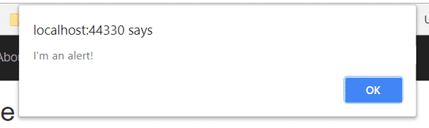

I have a confession to make. Modern Javascript development feels absolutely overwhelming. When I was first learning to program, and even through the first years of my career, using ASP.NET's server-side rendering was more than enough for most applications. If I had to use Javascript at all, it was in small, manageable doses. Now, in looking towards bettering myself in my career, Javascript has taken over the landscape. Today, we'll look at ReactJS Webpack, one of those slices of technology that always scared me until recently. We'll discuss what Webpack is, how to use it with React, and how it might fit in with your ASP.NET Core projects.

You might already be familiar with Webpack, along with things like npm, _package.json_, and Babel. If this is you, and you're just looking for a quick, minimal setup, [jump to the end of the article](#postSummary). There, I've listed code snippets to copy and paste into your project and get going right away.

For the rest of us, don't worry! We'll get there.

But first, you should know I'm going to make a few assumptions.

I'm going to assume that you know the basics of React. Maybe you've played with it, taken a look at the to-do list example, and maybe even written a few simple components into your projects. You don't need to be an expert to understand this, but you should have the fundamentals down.

I'm also going to assume that you know nothing (or next to it) about things like npm, Webpack, Babel, and a whole host of other things regarding modern Javascript. If you _are_ familiar with some of these, just know that I'll be over-explaining. I'm writing this mostly towards someone like me not too long ago: vaguely aware of these different technologies but not sure how they all fit together.

Finally, I like to learn by working from simpler examples to more complicated ones. Some tutorials will start with a completed Webpack config file and then deconstruct it. This is fine, and if you learn well that way, then more power to you.

But personally, when I see stuff like this without a thorough explanation of each piece, my brain goes all wibbly-wobbly:

entry: \[
    './main.js',
    './assets/scss/main.scss',
  \],
  output: {
    filename: 'bundle.js',
    path: resolve(\_\_dirname, 'dist'),
    publicPath: '',
  },
  context: resolve(\_\_dirname, 'app'),
  resolve: {
    extensions: \['.js', '.jsx'\],
  },
  module: {
    rules: \[
      {
        enforce: "pre",
        test: /\\.jsx?$/,
        exclude: /node\_modules/,
        loader: "eslint-loader"
},
//this can go on and on for days

So I'm not going to do that because I don't learn well that way. Instead, we'll start from the ground up and move on once we're comfortable with each piece.

To get started, let's create a new project.

## Creating a New .NET Core Project

Create a new project and call it WebpackReact.

At the second configuration screen, I've set the authentication to Windows, but this really isn't necessary. You should be able to set the authentication to anything for the purposes to this tutorial.

That's it for now. Let's start laying the foundation for understanding Webpack, React, and how they fit together.

## What is npm?

To install Webpack, we're going to use npm, which stands for Node Package Manager. So what the heck is it?

npm is a Javascript **package manager**.

Okay, great. What's a package? A package is just a collection of reusable code. Some of the most popular packages are ones like _request_ that makes HTTP requests, or _moment_ that parses and formats dates.

We'll use npm to install and keep track of the Javascript packages, including Webpack, for our project.

## Installing npm and Creating a New npm Package

Head over to the [npm installation page](https://www.npmjs.com/get-npm) and download the executable. Run it, and you should have npm installed on your system.

Next, we need to create a **package.json** file in our project. This file will list all of the packages we're using, as well as a few other neat features that we'll get to in a moment.

Right-click on your project and select _Add -> New item..._

Search for either _package.json_ or _npm Configuration File._ Click on _Add_.

Next, we need to install Webpack and add it to our package.json file. To do this, we'll need to use the command line. The easiest way, if you still have Visual Studio open, is to just use the Package Manager Console.

By default, the Package Manager Console starts in the solution folder, _not_ the project folder. You can see this yourself by typing `pwd` in the console, which returns this:

Path                                                                                                                                 
---- 
C:\\users\\matthew.sinex\\source\\repos\\WebpackReact

But our package.json is one level deeper, so we need to navigate down one folder in the Package Manager Console:

PM> cd webpackreact

And we should be fine now. All of our commands will run inside the project folder. If you need to go back up a level for whatever reason, use `cd ..`

## Installing Webpack

In the Package Manager Console, type the following:

npm install -D webpack

The words `npm install` indicate that we're installing a package, and the `-D` flag indicates that we're saving this to our package.json file as a **dev dependency**. A dev dependency is a package only to be used during development, and not production. As we learn what Webpack does, you'll see why this is the appropriate choice.

At this point, you may get the following error:

The term 'npm' is not recognized as the name of a cmdlet, function, script file or operable program. Check the spelling of the name or if a path was included, verify that the path is correct and try again.

If you do, restart Visual Studio and try again.

After waiting for a while, the installation will finish and you'll see that a line has been added to package.json:

{
  "version": "1.0.0",
  "name": "asp.net",
  "private": true,
  "devDependencies": {
    "webpack": "^4.17.1"
  }
}

But where are the actual Javascript files? In the project folder, in a sub folder called _node\_modules_. Check it out using Windows File Explorer, and you'll notice that there's not only the files for Webpack, but all the other packages that Webpack itself depends on.

In fact, installing _just Webpack_ created _nearly 3000 files and 608 folders_. Because of this:

**DO NOT include node\_modules in your project,** much as you may be tempted.

The whole reason that you made a package.json file is so you don't have to keep track of the packages inside the project.

Actually, try deleting the _node\_modules_ folder in your project. Now, back in Visual Studio, right-click on _package.json_ and select _Restore Packages__._ Your node packages will be re-installed. Running `npm install` from the command line will accomplish the same thing.

That's part of the magic of package.json.

## What is Webpack?

Webpack is a **module bundler**. In the simplest terms, this means it can take a look at a number of different Javascript files, see which ones depend on which, and bundle them up into a single file. It can also process these in different ways, like minification.

Let's begin with something really simple to illustrate what Webpack can do.

### Simple Webpack Setup

Make two new Javascript files in _wwwroot/js_, one called _app.js_ and one called _alert.js_.

Put the following code into the respective files.

_alert.js_

alert("I'm an alert!");

_app.js_

import './alert.js'

As you can see, _alert.js_ will pop up with an alert message, and _app.js_ imports the first file. **Importing** just means something like, "bring this code from another module over."

Once we have Webpack set up, it will take these two files and bundle them together into one.

This might seem silly for our contrived example, but imagine if you had half a dozen or more Javascript files that need to be used together on a page. Normally, every time you want to use that bundle, you'll need to manually create the script tags. You'll also need to keep the order of the script tags correct yourself, because one file is going to depend on another.

Webpack will take care of that work for you. It'll figure out what depends on what, and spit out _one_ file for you to reference via the script tag.

Let's set Webpack up, then.

Create a new Javascript file in your project and name it `webpack.config.js`. (It's really important that you get the name right.) Then, put the following code in the file:

const path = require('path');

module.exports = {
    mode: 'development',
    entry: './wwwroot/js/app.js',
    output: {
        path: path.resolve(\_\_dirname, './wwwroot/js/dist'),
        filename: 'bundle.js'
    }
};

Let's pull this apart a little.

**mode** can be generally either "development" or "production". In addition to documenting which environment you're working in, setting this flag to "production" will minify the resulting bundle.

**entry** is the file where Webpack will start. Any `import` statements in this file will be followed and those files brought into the bundle.

**output** is where the resulting bundle file will go. **filename** should be obvious. **path** needs the _path_ library to figure out, well, paths, which is why this was defined in the first line of the file.

## Running Webpack for the First Time

We'll want to do a little more setup to run Webpack and bundle our files. In the console, run the following command to install _webpack-cli_.

npm install -D webpack-cli

Next, in _package.json_, add the following object:

"scripts": {
  "build": "webpack"
}

This will make it so we can run commands from npm. Specifically, go back to the console and run this.

npm run build

This will tell npm to run the script called "build" in our _package.json_ file. What that script does is to run webpack. Webpack then looks at the _webpack.config.js_ and does whatever you've set up.

Specifically, it's entered _app.js_, determined that you're pulling in _alert.js_, and bundles those two files together. Then, it creates a file called _bundle.js_ in the _wwwroot/js/dist_ folder.

Check it out now in the Solution Explorer.

Now, we need to use the bundle in our project.

## Using the Webpack Bundle in Your ASP.NET Project

In the _Pages_ folder, add a new Razor Page called _WebpackExample_.

After you've created it, go to _Pages/WebpackExample.cshtml_ and add this script section at the bottom:

@section Scripts {
    
}

Next, run the project and navigate to

https://localhost:YOURPORT/WebpackExample

You ought to see the alert we coded earlier.

Let's take a step back and recap what we've learned so far.

## Webpack Recap: A Summary of the Basics

Here's what we've done so far.

1. **Installed npm**. We use npm to install the Javascript packages we need.
2. **Created a package.json file.** This file will keep track of which npm packages we've installed.
3. **Installed webpack and webpack-cli via npm.** Webpack will bundle the Javascript files that we create.
4. **Created Javascript files that we want to bundle together.**
5. **Created a webpack.config.js.** This will tell webpack where to start bundling, and where to output the bundle.
6. **Created a script in package.json to run webpack**. Although you can run webpack on its own, this script may actually become more complex as you continue, so we've put the script in package.json to begin with.

Moving on, then...

## ReactJs Webpack: Making the Two Play Nice

All right, let's get down to it and actually start coding some React components. Like I mentioned in the introduction, I'm assuming that you know the basics of React, so I'm not going to be covering that here.

We will need to install React and ReactDOM to our project, so do that by running the following in the console:

npm install -D react react-dom

Next, go to your _app__.js_ file and replace the code there with the following "Hello, world" example:

import React from "react";
import ReactDOM from "react-dom";

var app = document.getElementById("app");

ReactDOM.render(
    

        
Hello, world!

    
,
    app
);

Back over in _WebpackExample.cshtml_, we need to create the DOM node where React will render.

Add the following div to the markup:

Great! Let's run `npm run build` from the console again, and everything should work fine.

Oops. It doesn't:

ERROR in ./wwwroot/js/app.js 7:4
Module parse failed: Unexpected token (7:4)
You may need an appropriate loader to handle this file type.

As it happens, vanilla Javascript doesn't know what to do with the JSX HTML tags. The solution, as hinted at in the error message, is to add a **loader** in order to "handle this file type."

Webpack **loaders** transform the code in one way or another. In this case, we need to transform (or _transpile_) the JSX in the ReactDOM.render function into Javascript that the browser can understand. For that, we're going to use the _Babel_ loader.

**Babel** lets you use current Javascript features, even if they aren't supported by your browser yet.

In addition to Babel and the Babel-Loader for Webpack, we'll also need to install some Babel presets. These presets tell Babel which Javascript features to support. We'll only use two of them, **env** and **react**, which is the simplest way to enable the features you're likely to use with React.

Like our other packages, we'll use npm to install all of these Babel related packages. In the console (whether that's the Windows console or the package manager console), make sure you're in the the same folder as _package.json_ and run the following command:

npm install -D babel-loader @babel/core @babel/preset-env @babel/preset-react

After you have those packages installed, it's time to add the following to your _webpack.config.js_ file:

module: {
    rules: \[
        {
            test: /\\.(js|jsx)/,
            exclude: /node\_modules/,
            use: {
                loader: 'babel-loader',
                options: {
                    "presets": \["@babel/preset-env", "@babel/preset-react"\]
                }
            }
        }
    \]
}

Let's break this down a little and look at all of the properties in the object in the `rules` array.

**test** defines the regular expression that Webpack will use to match files to the loader. In this case, any files with the extensions _.js_ or _.jsx_ will be run through the Babel loader.

**exclude** tells Webpack which files _not_ to feed to the loader. In this case, we definitely want to exclude all of the files in _node\_modules_. Otherwise, our build time is going to take a lot longer than it needs to.

The **use** object defines which loader to use, as well as the presets that we discussed earlier. The presets we've chosen are very sensible defaults for Babel to work with React projects.

Whew! Now we can run `npm run build` and, finally, our "Hello, world" example works.

## Adding the Bells and Whistles

Before we end our Webpack journey for today, let's add a few more features that are either common in the Webpack world or are going to make our developing lives a little bit easier.

## Resolve

**Resolving** is the process of finding a module depending on its path. One common webpack resolver option is to set the extensions option, like this:

resolve: {
    extensions: \['\*', '.js', '.jsx'\]
}

Go ahead and add that to your _webpack.config.js_ now. What this means is that we can import Javascript modules without having to write the extension.

In other words, instead of this:

import List from './List.jsx';

We can just write:

import List from './List';

Granted, that's not too much of a time-saver, but it is kind of helpful.

## Hot Module Replacement (Automatic Reloading)

Are you tired of having to manually rebuild your bundle every time you make a change? Hot Module Replacement automatically re-bundles all of your files every time that you save a change to a file. You don't even need to refresh your browser; Webpack will do that for you. This can make development a lot quicker.

Webpack integrates with ASP.NET Core in order to do this, so we'll also make some changes to _Startup.cs_ in your Visual Studio project.

### Installing npm Packages and Updating the Webpack Config

Start by installing **webpack-dev-middleware,** **webpack-hot-middleware,** and **aspnet-webpack** from the command line.

npm install -D webpack-dev-middleware webpack-hot-middleware aspnet-webpack

Next, we need to change a few things in _webpack.config.js_ to make ASP.NET Core happy. We need to change the `entry` object to be a key-value pair, like this:

entry: { main: './wwwroot/js/app.js' },

This is also, incidentally, how you would define multiple entry points in your application. Just add as many key-value pairs as needed.

You'll also need to specify a `publicPath` in the `output` object. **publicPath** is intended to be the folder where you upload your bundles publicly. The different between **publicPath** and **path** is subtle, and you can read a more detailed discussion of that [here](https://stackoverflow.com/questions/28846814/what-does-publicpath-in-webpack-do). The only important part for now is that you need it for hot reloading to work.

In _webpack.config.js_, change the `output` object to the following:

output: {
    path: path.resolve(\_\_dirname, './wwwroot/js/dist'),
    filename: 'bundle.js',
    publicPath: 'dist/'
},

### Updating ASP.NET Core's _Startup.cs_

Next, we're going to change some of the code in _Startup.cs._ In the _Configure_ method, add one line so that the first conditional block reads like this:

if (env.IsDevelopment())
{
    app.UseDeveloperExceptionPage();
    app.UseWebpackDevMiddleware(new Microsoft.AspNetCore.SpaServices.Webpack.WebpackDevMiddlewareOptions { HotModuleReplacement = true });
}

### Changing our Javascript Files

Finally, we need to add a line in _app.js_ in order to enable hot module replacement. Add this at the bottom of the file:

module.hot.accept();

Then, in order to illustrate bundling more clearly, I want you to add a new JSX file to the _js_ folder. Call it _List.jsx_. Your _js_ folder should look like this:

### Testing Hot Module Replacement

Whew! Now it's time to cross our fingers, and run the Visual Studio project. Once it's running, navigate to `https://localhost:YOURPORT/WebpackExample`. You should see the same "Hello, world" example from earlier.

You're going to be changing some of the Javascript files in your bundle in a second. As you do so, save your files, and you'll see your changes in the browser, in real time, without you having to rebuild the bundle or restart local debugging.

In the _List.jsx_ file you just created, add the following code to create a React List component.

import React from "react";

export default class List extends React.Component {
    render() {
        return (
            <ul>
                <li>Item 1</li>
                <li>Item 2</li>
            </ul>
        );
    }
}

Then, change _app.js_ to the following:

import React from "react";
import ReactDOM from "react-dom";
import List from "./List";

var app = document.getElementById("app");
ReactDOM.render(
    <List/>,
    app
);

module.hot.accept();

If all went well, you should now see your list component render in the browser:

If you made any errors, like misspelling the name of the JSX file, .NET Core will be happy to tell you:

This won't catch all errors, just those that would prevent Webpack from bundling. React errors, for example, wouldn't be caught.

## Accessing Server-side Data from the Model

Eventually, you'll want to use data from your ASP.NET Models in your React components. You could set up a Web Api and pull the data from that, but you _still_ might need data from the server (like a user's ID) to create the AJAX request.

By default, you can't access a Webpack method from outside of the bundle. You might think to try moving the Javascript render logic over to the view, like this in _WebpackExample.cshtml:_

//this won't work; you can't access the bundle directly

But you'll get an error if you try this, even if you change the syntax to get rid of the JSX.

What you need to do instead is to output a **library** from Webpack.

### C# Code in _WebpackExample.cshtml.cs_

Let's start by adding some model data to the WebpackExample Razor page in _WebpackExample.cshtml.cs_. Add this line before the `OnGet` method.

public List<string> MyList = 
  new List<string>()
  {
      "This is my first item",
      "This is my second item",
      "And here is the third item"
  };

In a real app, we'd pull this from a database.

Now that we have some server-side data, let's configure _webpack.config.js_ to output a library. This just means we can export functions from our bundled app, and we can call these functions from outside of the bundle.

### Updating the Webpack Configuration

Change the `output` object in _webpack.config.js_ to this:

output: {
    path: path.resolve(\_\_dirname, './wwwroot/js/dist'),
    filename: 'bundle.js',
    publicPath: 'dist/',
    libraryTarget: 'var',
    library: 'EntryPoint'
},

We've named our library _EntryPoint_ and specified that we'll access this library through a variable.

### Updating our Razor Page View

Next, make sure that the scripts section of _WebpackExample.cshtml_ looks like this:

@section Scripts {
    
    
}

As you can see, after importing the bundle, we've called a function on the variable _EntryPoint,_ which is our new library. We'll need to define the `run` function in a moment, and pass it the data from our model.

The call to `Json.Serialize` is necessary to render the data in JSON format. Otherwise, you'll end up with this (and an error):

EntryPoint.run(System.Collections.Generic.List\`1\[System.String\]);

### Updating the app.js Entry Point

Next, head over to _app.js_ and change the Javascript code to the following:

import React from "react";
import ReactDOM from "react-dom";
import List from "./List";

var app = document.getElementById("app");

export function run(myList) {
    ReactDOM.render(
        <List items={myList} />,
        app
    );
}

module.hot.accept();

Here, instead of rendering the React component when the script loads, we've put it inside the exported function `run`. This is the function we called from our Razor Page just a moment ago.

### Updating the React List Component

Finally, let's change our List component (in _List.jsx_) to accept the list items as props.

import React from "react";

export default class List extends React.Component {
    render() {
        const Items = this.props.items.map((item) => {
            return <li>{item}</li>;
        });

        return (
            <ul>
                {Items}
            </ul>
        );
    }
}

You should just have to refresh the page if you have hot module reloading in place. Otherwise, start debugging your project locally again, and you should see this glorious list:

## ReactJs Webpack and ASP.NET Core: Minimal Setup

It's been a long journey, but we've got Webpack working with React and ASP.NET Core. Let's take a look at the complete solution. Now that you understand _why_ we did everything we did, you can just copy and paste these snippets when you start a new project.

_project.json_

{
  "version": "1.0.0",
  "name": "asp.net",
  "private": true,
  "scripts": {
    "build": "webpack"
  },
  "devDependencies": {
    "@babel/core": "^7.0.0",
    "@babel/preset-env": "^7.0.0",
    "@babel/preset-react": "^7.0.0",
    "aspnet-webpack": "^3.0.0",
    "babel-loader": "^8.0.2",
    "react": "^16.4.2",
    "react-dom": "^16.4.2",
    "webpack": "^4.17.1",
    "webpack-cli": "^3.1.0",
    "webpack-dev-middleware": "^3.2.0",
    "webpack-hot-middleware": "^2.23.1"
  }
}

_webpack.config.js_

const path = require('path');

module.exports = {
    mode: 'development',
    entry: { main: './wwwroot/js/app.js' },
    output: {
        path: path.resolve(\_\_dirname, './wwwroot/js/dist'),
        filename: 'bundle.js',
        publicPath: 'dist/'
    },
    resolve: {
        extensions: \['\*', '.js', '.jsx'\]
    },
    module: {
        rules: \[
            {
                test: /\\.(js|jsx)/,
                exclude: /node\_modules/,
                use: {
                    loader: 'babel-loader',
                    options: {
                        "presets": \["@babel/preset-env", "@babel/preset-react"\]
                    }
                }
            }
        \]
    }
};

_Startup.cs_

  public void Configure(IApplicationBuilder app, IHostingEnvironment env)
{
    if (env.IsDevelopment())
    {
        app.UseDeveloperExceptionPage();        
        //the next line is the only new one. The rest of the method may look different depending on your setup
        app.UseWebpackDevMiddleware(new Microsoft.AspNetCore.SpaServices.Webpack.WebpackDevMiddlewareOptions { HotModuleReplacement = true });
    }
    else
    {
        app.UseExceptionHandler("/Error");
        app.UseHsts();
    }

    app.UseHttpsRedirection();
    app.UseStaticFiles();
    app.UseCookiePolicy();

    app.UseMvc();
}

And you can use the following files as kind of a "minimal React project" to test it all out.

_app.js_

import React from "react";
import ReactDOM from "react-dom";
import List from "./List";

var app = document.getElementById("app");
ReactDOM.render(
    <List/>,
    app
);

//the next line is necessary for hot reloading to work
module.hot.accept();

_List.jsx_

import React from "react";

export default class List extends React.Component {
    render() {
        return (
            <ul>
                <li>Item 1</li>
                <li>Item 3</li>
            </ul>
        );
    }
}

Of course, you'll also need to include the bundle in a Razor view somewhere, so don't forget the following markup on the page where you want React to render:

There's no end to the amount of modules and loaders you can add to Webpack to aide in your ReactJs ASP.NET Core development. Hopefully, this article has opened the door to the vast ReactJs ecosystem, and you'll use the setup here as a sensible start to any project.
