In [a previous post](https://sensibledev.com/reactjs-webpack-and-asp-net-core/), I described how to set up Webpack to develop React in ASP.NET Core. In this post, I'd like to briefly describe how to do a similar setup with ReactJS Webpack and ASP.NET Standard for those of you who still haven't migrated over.

While there aren't too many differences, there are a few hidden gotchas that certainly tripped me up when trying to introduce Webpack into an older project. If you've read [my article about .NET Core and Webpack](https://sensibledev.com/reactjs-webpack-and-asp-net-core/), you'll know that you can use Dependency Injection to set up hot module reloading. This slick functionality doesn't exist in .NET Standard, so we'll have to do something a little different.

I'm assuming that you're already familiar with Javascript technologies like npm, React, and Webpack. If not, head on over to [my other article about Webpack](https://sensibledev.com/reactjs-webpack-and-asp-net-core/) for a detailed conceptual explanation.

If you're really impatient and just want to see a complete example, [jump to the end of the article](#summary).

## Creating a New ASP.NET Project

Create a new ASP.NET Project.

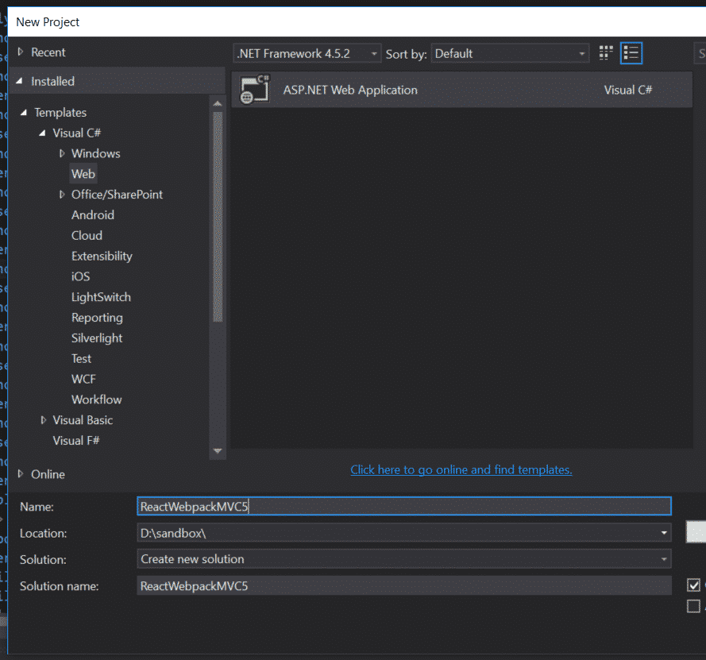

When you get to the template options, be sure to change the authentication method to _Windows Authentication_.

I'm asking you to do this here, because there's a hitch with Windows auth you might run into later when using Webpack. Since you're on the .NET platform, there's a good chance you're using a Windows environment. Just in case you're going to use Windows authentication in your project, I want to illustrate (later) a way around a potential issue.

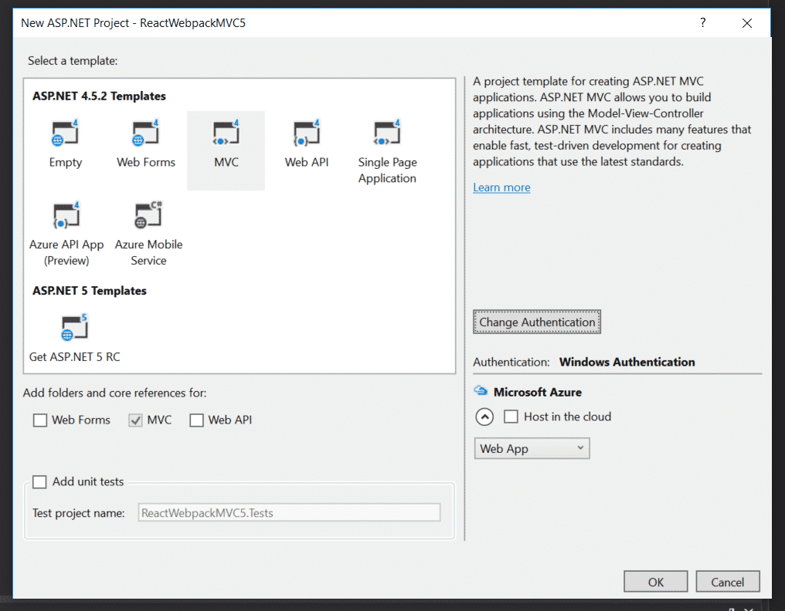

## Installing the Necessary npm Packages

If you don't already have npm installed, head over to [the download page](https://www.npmjs.com/get-npm) and install it.

Next, we'll need to get to a command line. You can do this inside Visual Studio via the Package Manager Console. Just be sure to navigate to your project folder (not the solution folder) by typing in `cd reactwebpackmvc5` first.

Alternately, you could navigate to the project folder in Windows Explorer. Then, click in the whitespace of the address bar (or press F4). Finally, replace the path in the address bar with `cmd` and press return.

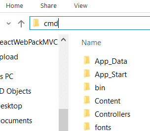

Create a new _package.json_ file by running this in the command line:

npm init -y

If you didn't install this with the Package Manager Console, you might want to add the _package.json_ file to the project so that you can view it inside of Visual Studio.

If you need to, right-click the project name, then select _Add -> Existing item..._

Next, we're going to install a number of packages to make everything work with ReactJs and Webpack.

Here's the list, along with a brief explanation of what they do:

- **webpack**. Javascript module bundler.
- **webpack-cli**. A command-line interface for webpack.
- **react**. Creates ReactJS components.
- **react-dom**. Renders the React components in the DOM.
- **@babel/core**. Converts newer Javascript syntax into older syntax supported by the browser. Needed to contend with JSX syntax in your Javascript files.
- **@babel/preset-env**. A preset configuration for Babel with the most common defaults.
- **@babel/preset-react**. A preset configuration specifically for ReactJS syntax.
- **babel-loader**. Needed to make Babel work with Webpack.

Install all of these by entering the following into the command line:

npm install -D @babel/core @babel/preset-env @babel/preset-react babel-loader react react-dom webpack webpack-cli

## Creating the React Files

Let's throw together a really simple React app with a single component to test out our bundling.

In your Visual Studio project, in the _Scripts_ folder, create another folder called _react_. Then create the files _app.js_ and _List.jsx_. Your solution explorer should look like this:

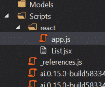

Add the following code to _app.js_:

import React from "react";
import ReactDOM from "react-dom";
import List from "./List";

var app = document.getElementById("app");
ReactDOM.render(<List/>, app);

This will render the List component into the div with the id of "app".

In _List.jsx_, create the component code by entering the following:

import React from "react";

export default class List extends React.Component {
    render() {
        const Items = \[
          <li>First item</li>,
          <li>Second item</li>
        \];

        return (
            <ul>
                {Items}
            </ul>
        );
    }
}

At this point, you may see some really ugly syntax highlighting, like this:

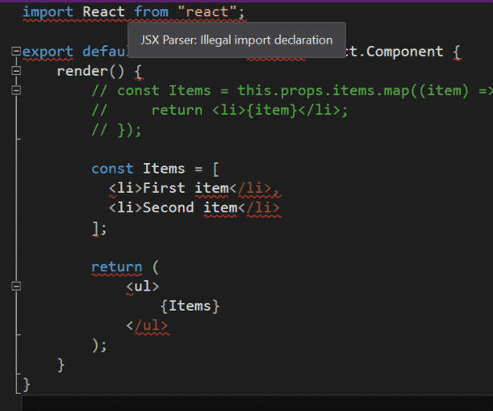

If you want to fix this, we need to change our settings so that the TypeScript Editor is used to open JSX files.

To do so, go to _Tools -> Options -> Text Editor -> File Extension_.

In the box marked _Extension_, type `jsx`. From the _Editor_ dropdown, select `TypeScript Editor`. Click on _Add_, and you should see something like the following: 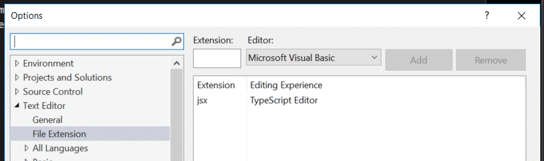

Click _OK_, close and re-open _List.jsx_, and all of the error highlighting should be gone.

However, when you then run the project locally, the JSX file will be locked for editing (at least when I tried it). This would entirely defeat any hot module replacement (re-bundling the app as you save changes), since you can't change the file contents.

Also, bear in mind that the JSX in _app.js_ will still show syntax error highlighting.

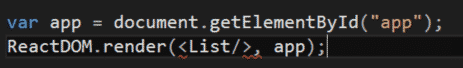

You have a few options here.

You can live with it.

You can rename _app.js_ to _app.jsx_ and the errors will go away. The same "file lock when debugging" issue might come up, though.

Or you can use a different text editor altogether. I really like [Atom](https://atom.io/)'s syntax highlighting.

## Creating the webpack.config.js File

Add a new Javascript file to the root of your project, and call it _webpack.config.js_.

Paste the following code into the file:

const path = require('path');

module.exports = {
    mode: 'development',
    entry: './Scripts/react/app.js', //or app.jsx
    output: {
        path: path.resolve(\_\_dirname, './Scripts/react/dist'),
        filename: 'bundle.js',
    },
    resolve: {
        extensions: \['\*', '.js', '.jsx'\]
    },
    module: {
        rules: \[
            {
                test: /\\.(js|jsx)/,
                exclude: /node\_modules/,
                use: {
                    loader: 'babel-loader',
                    options: {
                        "presets": \["@babel/preset-env", "@babel/preset-react"\]
                    }
                }
            }
        \]
    }
};

Over in the _package.json_ file, edit the `scripts` object to include the following:

"scripts": {
  "build": "webpack"
},

Now, in the console, let's run that script. Type in the following:

npm run build

This should create a sub-folder in our _react_ folder called _dist_, along with the file _bundle.js._

In order to see it, you may have to click on _Show All Files_ and include the folder in your project.

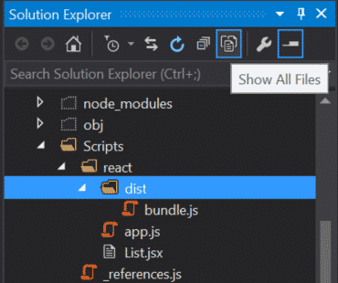

## Testing out Our Bundle

Head over to the Index view in _Views -> Home -> Index.cshtml_. Add the following markup:

@{
    ViewBag.Title = "Home Page";
}

We've added the div where the React app will be rendered, along with a reference to our bundle script. Run the project locally, and you should see a boring-yet-functional list:

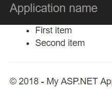

Yay! We've got ReactJS and Webpack (mostly) working.

Let's add a few more bells and whistles.

## Hot Module Replacement

Right now, every time you make a change to your Javascript files, you need to run the command to rebuild, wait, and then refresh the page.

Hot Module Replacement watches for file changes, recompiles the bundle automatically, and updates the DOM in your browser. All of this without any direct commands from you. Here's how to set it up:

Install **webpack-dev-server** from the console.

npm install -D webpack-dev-server

Go to your _app.js_ file. We'll need to add one method call to make the app work with Hot Module Replacement. Add this line to the end of the file:

module.hot.accept();

In _webpack.config.js_, Change the `output` object to include a public path.

output: {
    path: path.resolve(\_\_dirname, './Scripts/react/dist'),
    filename: 'bundle.js',
    publicPath: 'Scripts/react/dist'
},

Make sure that the publicPath is the same as the directory listed in the path variable.

Next, add the following object to the end of your _webpack.config.js_ file:

devServer: {
    proxy: {
        '\*': {
            target: 'http://localhost:59829', //change this to your port
            changeOrigin: true
        },
        port: 8080,
        host: '0.0.0.0',
        hot: true,
    },
}

In _package.json, c_hange the `scripts` object to this:

"scripts": {
  "build": "webpack",
  "dev": "webpack-dev-server --open --hot"
},

The _dev_ script will tell the dev server to start running, and the "--hot" flag enables hot module replacement. The "--open" flag will automatically open the dev server in a new internet browser tab.

Cross your fingers and type the following into the console:

npm run dev

A new browser window should open up, and...

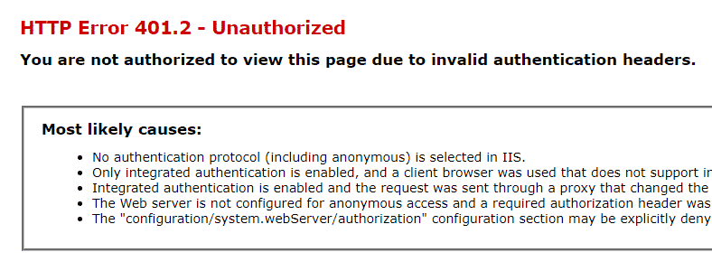

Oops. The dev server isn't sending the necessary validation headers. (You may have a different authentication setup that prevents this error from even happening. If you don't get this error, feel free to skip the next section.)

Fortunately, there's a way to fix this.

## Fixing Invalid Authentication Headers

Install the _agentkeepalive_ npm package.

npm install -D agentkeepalive

Add this line to the top of _webpack.config.js_ so that we can use the package.

const agent = require('agentkeepalive');

Next, change the `devServer` object to the following:

devServer: {
    proxy: {
        '\*': {
            target: 'http://localhost:59829', //change this to your port
            changeOrigin: true,
            agent: new agent({
                maxSockets: 100,
                keepAlive: true,
                maxFreeSockets: 10,
                keepAliveMsecs: 100000,
                timeout: 6000000,
                keepAliveTimeout: 90000 // free socket keepalive for 90 seconds
            }),
            onProxyRes: (proxyRes) => {
                var key = 'www-authenticate';
                proxyRes.headers\[key\] = proxyRes.headers\[key\] && proxyRes.headers\[key\].split(',');
            },
        },
        port: 8080,
        host: '0.0.0.0',
        hot: true,
    },
}

I am indebted to [this GitHub issues thread](https://github.com/chimurai/http-proxy-middleware/issues/39) (and a StackOverflow post that I can no longer find) for this solution.

Now, try running `npm run dev` again. A new browser tab will pop open, and you should see our old, boring list on the home page.

Try changing one of the items in the _List.jsx_ component, like adding extra exclamation points.

You should see, before your eyes, the rendered component matching your changes:

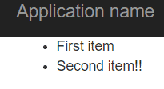

If you open up Chrome DevTools, you should see something like the following logs in the console:

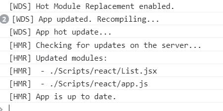

## Getting Server-Side Data into a Webpack Bundle

Sometimes we need to get data from the server into a React component. This could be a list of objects, or even something as simple as an ID. Whatever the case, you can't pass in JSON from your server-populated models without some extra setup. Here's how.

Start by creating some server-side data. In your _HomeController.cs_, make the _Index_ method look like this:

public ActionResult Index()
{
    //in a real app, this would come from a database
    var myList = new List<string>() { "This is one item", "This is another item", "And this is a third" };
    return View(myList);
}

In _webpack.config.js_, we'll need to add some configuration to allow for a **library**. Adding library settings will allow us to access functions from outside of the bundle.

Change the `output` object to read like this:

output: {
    path: path.resolve(\_\_dirname, './Scripts/react/dist'),
    filename: 'bundle.js',
    publicPath: 'Scripts/react/dist',
    libraryTarget: 'var',
    library: 'EntryPoint'
},

Next, in the Home views, go to _Index.cshtml._ Change the markup to this:

@model List<string>
@{
    ViewBag.Title = "Home Page";
}

We've changed the view to expect a List of strings as a model. After loading the bundle, we're going to call the `run` function (which we'll define in a second) in the EntryPoint library. We pass in a JSON encoded representation of our C# string List, which we'll then use to populate our List in _List.jsx_.

Change _app.js_ to export the `run` function and _List.jsx_ to accept our server-generated List as props.

_app.js_

import React from "react";
import ReactDOM from "react-dom";
import List from "./List";

var app = document.getElementById("app");
export function run(myList) {
   ReactDOM.render(
       <List items={myList} />, app
   );
}

_List.jsx_

import React from "react";

export default class List extends React.Component {
    render() {
         const Items = this.props.items.map((item) => {
             return <li>{item}</li>;
         });

        return (
            <ul>
                {Items}
            </ul>
        );
    }
}

Then, run `npm run build` in the console to build our new list. You should see something like the following on the Home page when you run your Visual Studio project again:

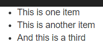

There is one significant downside to this approach. You won't be able to use Hot Module Replacement effectively anymore. Take a look back at the code in _app.js_ and see if you can figure out why.

The ReactDOM is rendered in the `run` function. This function is called from outside the bundle in our View. When Webpack recompiles the bundle, it's not going to re-render because that function is never called.

I haven't yet found a good away to get completely around this issue. One option is to change this line in your _package.json:_

"dev": "webpack-dev-server --open --hot"

To this:

"dev": "webpack-dev-server --open --watch"

This will watch for any changes in your Javascript files. If there are any changes, webpack recompiles your modules and refreshes the page. This isn't quite as slick as hot module replacement, but it does still make development faster.

## Alternative to Webpack: ReactJS.NET

If you'd rather have all of your bundling done server-side, there's a .NET library for that: [ReactJS.NET](https://reactjs.net/).

Instead of setting up a Webpack file and doing all of your configuration through Javascript, the ReactJS setup lives with the rest of your ASP.NET bundles, in the _App\_Start_ folder in _BundleConfig.cs_. A sample bundle setup looks like this:

bundles.Add(new JsxBundle("~/bundles/main").Include(
    "~/Scripts/HelloWorld.jsx",
    "~/Scripts/AnythingElse.jsx",
    "~/Scripts/ajax.js",
));

If you'd rather work in a .NET-only environment, I'd recommend checking it out.

I only have a few hesitations. If you're using other modules with React that require Webpack anyway, you're going to have your configuration in two different places, in two different languages.

Also, ReactJS.NET is much less ubiquitous than Webpack, so the documentation is sparser. Most of the tutorials regarding React are going to assume you're using a Javascript bundler. You'll find yourself having to mentally translate the instructions back into the idioms of this library.

It's honestly not a huge deal, but I can see some people finding it more cumbersome than it's worth. You ought to at least poke around with ReactJS.NET for a little bit to see if it suits your needs.

## ReactJs Webpack and ASP.NET: Summary

Here's a minimal setup for React and Webpack based on what we did in this article. Now that you understand the steps, you can copy-paste this to your heart's content.

_package.json_

Note: agentkeepalive is only needed for fixing a Windows authentication error with Hot Module Replacement.

{
  "name": "ReactWebPackMVC5",
  "version": "1.0.0",
  "description": "",
  "main": "index.js",
  "scripts": {
    "build": "webpack",
    "dev": "webpack-dev-server --open --hot"
  },
  "keywords": \[\],
  "author": "",
  "license": "ISC",
  "devDependencies": {
    "@babel/core": "^7.0.0",
    "@babel/preset-env": "^7.0.0",
    "@babel/preset-react": "^7.0.0",
    "agentkeepalive": "^3.5.1",
    "babel-loader": "^8.0.2",
    "react": "^16.5.0",
    "react-dom": "^16.5.0",
    "webpack": "^4.18.0",
    "webpack-cli": "^3.1.0",
    "webpack-dev-server": "^3.1.8"
  }
}

_webpack.config.js_

Again, agentkeepalive is only needed for fixing a Windows authentication error with Hot Module Replacement. The same is true for the `agent` and `onProxyRes` properties.

const path = require('path');
const agent = require('agentkeepalive')

module.exports = {
    mode: 'development',
    entry: './Scripts/react/app.js', //or app.jsx
    output: {
        path: path.resolve(\_\_dirname, './Scripts/react/dist'),
        filename: 'bundle.js',
        publicPath: 'Scripts/react/dist'
    },
    resolve: {
        extensions: \['\*', '.js', '.jsx'\]
    },
    module: {
        rules: \[
            {
                test: /\\.(js|jsx)/,
                exclude: /node\_modules/,
                use: {
                    loader: 'babel-loader',
                    options: {
                        "presets": \["@babel/preset-env", "@babel/preset-react"\]
                    }
                }
            }
        \]
    },
    devServer: {
        proxy: {
            '\*': {
                target: 'http://localhost:59829',
                changeOrigin: true,
                agent: new agent({
                    maxSockets: 100,
                    keepAlive: true,
                    maxFreeSockets: 10,
                    keepAliveMsecs: 100000,
                    timeout: 6000000,
                    keepAliveTimeout: 90000 // free socket keepalive for 90 seconds
                }),
                onProxyRes: (proxyRes) => {
                    var key = 'www-authenticate';
                    proxyRes.headers\[key\] = proxyRes.headers\[key\] && proxyRes.headers\[key\].split(',');
                },
            },
            port: 8080,
            host: '0.0.0.0',
            hot: true,
        },
    }
};
