I recently finished up the final chapters on my book about Bootstrap 4 and .NET. Like many tech professionals, I now want to turn it into a course, full of video examples and what some have called my "okay" voice. But to do that I need to make a decision: what platform to create and sell my course on? Maybe you're here in the same situation. If you're a developer, you probably know something about your area that you could turn into a saleable ecourse. In this post, we'll look at Teachable vs Udemy as options for hosting ecourses.

# Teachable: The Clear Winner

Teachable allows for far more control over your course, allowing for custom domains and custom course design. You have more options for course pricing plans, including subscriptions. While Udemy provides a marketplace where students are already primed to buy, Udemy will take _at least_ 50% of the revenue from your course sales. That is, unless you do your own marketing and provide students with coupons directly. But, if you're doing your own marketing anyway, why not just direct your energy towards a platform where you can keep almost all your money (minus credit card transaction and processing fees).

Read on to understand why Teachable is the clear winner in the online course space.

## Custom Domains on Teachable vs Udemy

Custom domains are really important for branding, since you can make your course active at [www.yourcourse.com](http://www.yourcourse.com) instead of [www.someothersite.com/yourcourse](http://www.someothersite.com/yourcourse).

Your potential students are more likely to identify your course with _you_ and thus more likely to buy more of your products in the future. If they're used to seeing your course on a general marketplace website, they may be drawn away from your offerings in the future when they're browsing for more content.

Teachable _does_ allow custom domains, while Udemy does _not_.

This makes sense, given that Udemy is all about driving traffic to its marketplace, not about empowering individual sellers on their own sites.

**Winner: Teachable**

## Custom Course Design

Again thinking about how important branding is, you may want to think about personalizing the look of your classroom. Adding your logo, your brand colors, and other elements will help your students associate the class with you.

With Teachable, you can customize the logo, favicon, and homepage background. Its font is limited 11 different choices (like Lato, Open Sans, and Raleway), so you can't choose just any font you'd like. You do get some choice in the matter, though.

Teachable allows you to select preset color palettes, or create your own custom color palette. Using this tool, you can set the color of the nav bar, links, buttons, headings, body text, and more.

Udemy has no such options. You cannot custom the color or font of your course, and while you can add your logo in the course thumbnail, you will have the Udemy logo in the site's navbar.

**Winner: Teachable**

## Marketing and Discoverability

Of course, making a class won't mean anything if you can't drive traffic to it. You need students to take your course!

Teachable does not do any sort of marketing for your courses.

As a marketplace, Udemy actively markets its courses through web advertising and its search feature.

Why doesn't Teachable market your courses for you? I'll let them explain their point of view, as stated in [one of their official blog posts](https://support.teachable.com/hc/en-us/articles/222820167-Does-Teachable-Market-My-Courses-):

> Because every school on Teachable is unique, we do not cross-sell courses.
> 
> Course marketplaces (e.g. Udemy) do cross-market courses to other students, sometimes from competing instructors in your area of expertise. This can actually have the effect of reducing business to your courses by sending users to another instructor’s site.
> 
> More than that, Teachable’s policy of non-cross-promotion provides a better experience for students because they won’t receive marketing emails for other courses.

In short, having a marketplace advertise for you _could_ result in lower sales because they're going to advertise for all of their course providers, and not just you.

But what if you really want the comfort of having the marketing done for you? In digging around for advice on how to market a course, it turns out you're likely to do a lot of marketing if you're on Udemy anyway.

Darrell Gurney, Founder of CareerGuy, [explains](https://theworkathomewife.com/how-to-become-a-udemy-super-seller/) that even after creating an approved Udemy course, "it comes down to basic marketing as to who gets noticed and what courses get bought… no matter what you know, you need to learn how to market better."

Depending on your niche, in order to be really successful on Udemy, you have to learn how to find students yourself and not just rely on Udemy's internal search. So, you're going to have to learn how to do internet marketing anyway, along with all the downsides to Udemy (which we'll discuss).

There's another downside to Udemy's marketing. [Krystal Wascher](https://krystalwascher.com/blog-bloggers-course-creators/why-i-stopped-selling-online-courses-on-udemy) is an audiobook producer and coach who left Udemy for Teachable. She argues that marketing with Udemy comes at a great cost, one that eventually no longer made business sense for her. "Udemy will ONLY promote your courses if you enroll in their marketing program," she explains. "Udemy can (and usually will) offer your course at a deep discount. It’s common to see courses that are normally priced for $199 (which is the highest price Udemy allows) for as little at $9.99 or $12.99."

On the other hand, it's not like there's a shortage of success stories from people who use Udemy.

Ken Wells, for instance, [argues](https://entrepreneurs.maqtoob.com/5-reasons-why-you-should-be-selling-courses-on-udemy-f5b6c5150781) that using a marketplace is better because you are tapping into "a large group of buyers for your niche," people who are ready to buy anyway. He claims $57,000 in course sales over a ten-month period, and that all of the traffic to his site came from Udemy.

**Winner: Technically Udemy**, since it does do some marketing for you.

## Pricing and Revenue Share

So let's start getting into the dollars and cents.

On Udemy, courses must be priced between $19.99 and $199 (or free). It also has this restriction (that I wouldn't have thought of):

"While you can change the price of your \[Udemy\] course at any time, you can switch from Free to Paid only once. If you switch from free to paid and back to free (or vice versa) after the course is published, your promotional announcements for the course will be permanently disabled."

Teachable has no restrictions on price, though prices do need to be in whole numbers ($20, not $19.99). You can offer [four different pricing plans](https://support.teachable.com/hc/en-us/articles/219442088-Course-Pricing-Plans) to your students:

- Free
- One Time Payments
- Subscriptions
- Payment Plans

Udemy has no such flexibility: students pay once and have access to the course forever.

What about making that sweet, sweet, payday?

Udemy's [revenue share](https://support.udemy.com/hc/en-us/articles/229605008-Instructor-Revenue-Share) is kinda complicated, to be honest.

**Instructor Promotion**: If a student buys your course using one of your coupon codes, you'll get 97% of the purchase price.

**Udemy Organic:** This is where a student finds your class through Udemy's search function. You'll snag 50% of the course price this way.

**Paid User Acquisition Channel Sales:** If you get a sale via one of Udemy's affiliates, you'll earn 25% (in most cases).

Affiliates are advertisers or content-creators (like bloggers or YouTubers) who link to your course with a special tracking URL. For sending buyers to your course, the affiliates get the lion's share of the revenue.

In summary: for most cases, you'll earn 50% or less of the revenue from your class. The only way to get higher is to generate a coupon and get it directly into the hands of potential buyers.

What about **Teachable**?

Every time some buys a course, course bundle, or subscription, Teachable collects a processing fee.

**US transactions only:** 2.9% + $0.30 

**US + international:** additional processing fee of 1% for credit and debit cards, and 1.5% for PayPal.

Teachable does not charge any processing fees for free courses.

In addition, there is also a transaction fee depending on what plan you choose:

Free: 10% + $1

Basic ($29 a month): 5%

Professional ($79 a month): 0%

Business ($399): 0%

To me, it makes sense to start on one of the lower tiers and then move up once you find more success. It wouldn't make much sense to start out paying $79 a month to avoid fees if you're only selling a few courses a month anyway. Obviously, do the math on this in your own situation.

**Winner: Teachable**. You have more flexibility on pricing and get to keep a bigger share of the course earnings.

## Discounting

Go take a look at Udemy's site and browse through a few of their courses. I'm willing to bet that you'll see most of them at a deep discount: 80%-90%, easily.

This is because those instructors have opted into the Udemy Deals Program, where Udemy will frequently (and deeply) discount your courses. In exchange, they'll promote it more on their site.

You can't control what the discount is, or how long it lasts, except to opt out of the Deals Program entirely.

One danger in this is that constantly having your courses discounted sets up an expectation in your audience that your product is cheap. If I'm being honest, every time I've bought a course from Udemy, I've waited until it's on sale. No sense paying $200 for a course when I can wait a few weeks and get it for $10 or $15.

But then, of course, if it's always on sale for 80% off, then it's not really a sale, is it? That's the _normal price_ of the course, and Udemy's students are conditioned for this.

On the other hand, with Teachable, you have complete control over how much of a discount you give, and when the coupon expires. The only restriction is that paid courses cannot be discounted lower than $1. (But if you want to make a course free with the coupon, that's fine.)

**Winner: Teachable.** Much more control over discounts. Sell your class for what it's worth.

 

## Affiliate Programs

Like I mentioned above, Udemy has its own affiliate program. Content creators and advertisers sign up and drive traffic back to Udemy.

You, the course creator, have absolutely no control over this.

Teachable, on the other hand, lets you control the amount of commission you give affiliates, track affiliate traffic, or you can just not have an affiliate program at all if you don't want to bother.

**Winner: Teachable.**

## Head to Head Setup: Teachable vs. Udemy

So that's enough with the specs. If you're like me, you'll want to know what it's like to set these up. In the next section, my goal is to set up a super-basic course in both of these teaching platforms. I'll create a free account, and upload one video (the only YouTube video I have at the moment) as the first lesson.

This obviously won't give me the experience of creating a full course, but it should provide us enough of a picture to judge the initial onboarding process. Let's go!

## How to set up a Teachable Course

Initial signup seems pretty standard, no hiccups here.

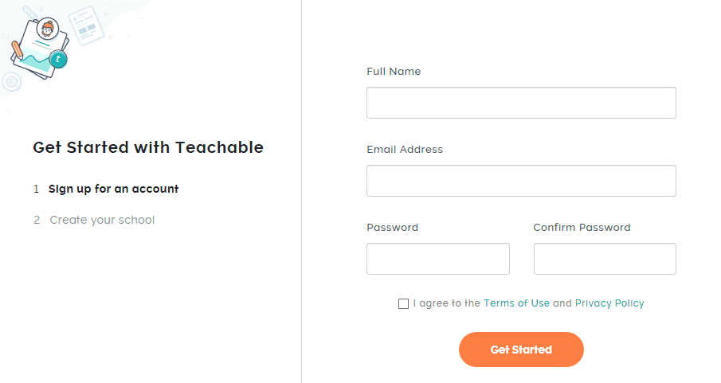

Then I get to name my school.

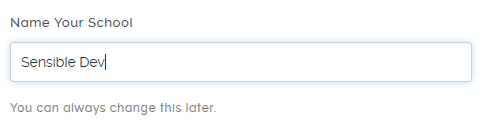

Then I need to answer some basic questions about me and the school I want to create. At this point I'm wondering if my "school" is an umbrella that I create all my classes under, or if "school" is another term for "course."

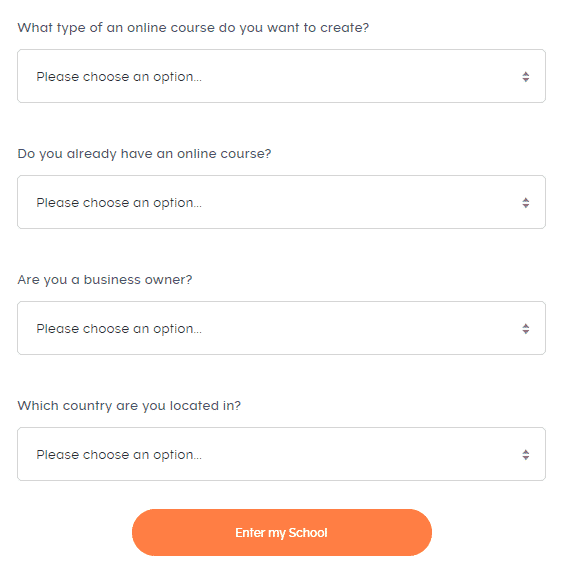

After that, I'm transported to my dashboard. Looking at the vertical navbar on the left, it does look like I create multiple classes under the "Sensible Dev" brand. Fine by me.

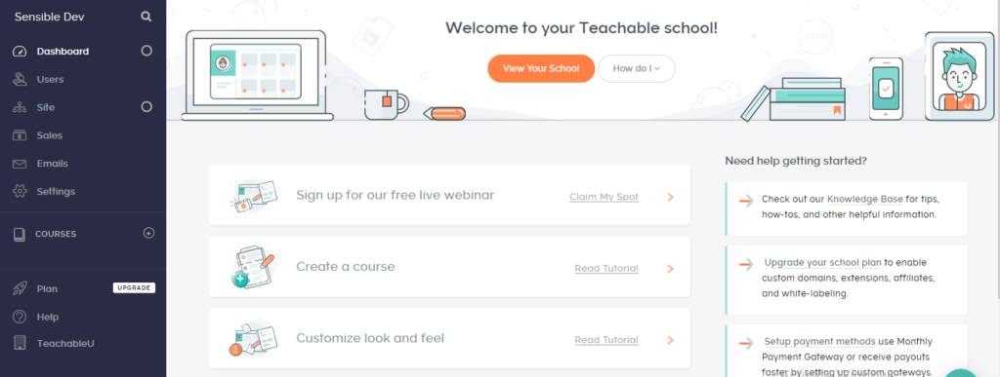

This page feels a little busy to me, but let's see if it's forgiving. I don't feel like signing up for a webinar, so let's click on "Create a course."

This opens up a new tab with a lengthy tutorial.

But I don't like reading or following directions, so I'm going to close out this tab and just click on the plus sign next to "Courses" in the navbar.

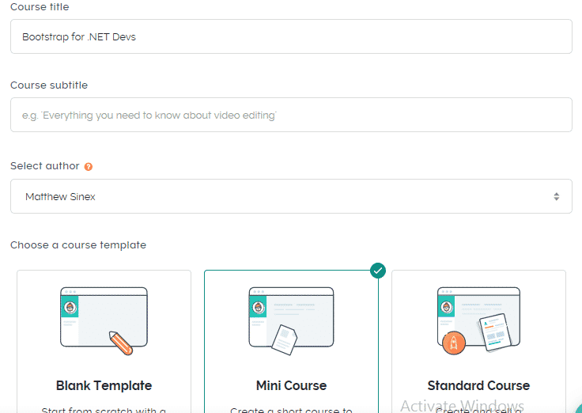

All right, I'm naming my course and choosing a template. I'm curious about "Mini Course," so I pick that. Why not?

The next screen shows my generated mini-course. There's this section at the top:

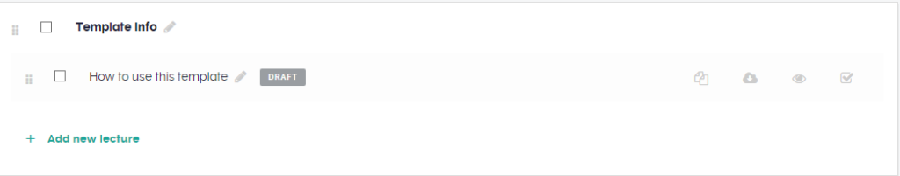

Which, if I click on the text "How to use this template," there's a little blurb about the usefulness of short courses as lead magnets. Fair enough. Beneath that there's this structure:

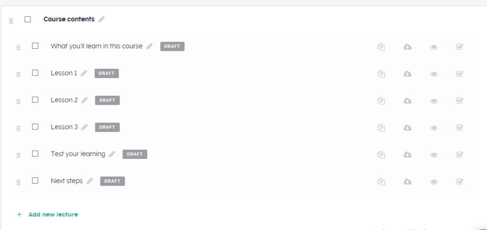

And I'm assuming that if I click on the pencil icon, I can edit this. Turns out I can click the pencil or the text. Let's start with the first section, "What you'll learn in this course."

You can add a file, text, quiz, code example, or custom code. The "code example" gives you an interface kind of like codepen. I believe this is because I selected the "Technology" category when creating the course, and I'm not sure if this is available to all templates.

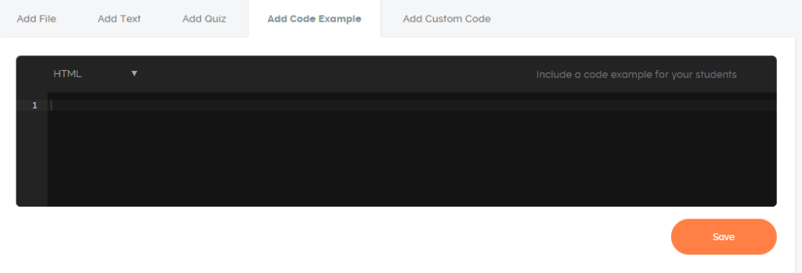

Let's move on to the next section. As it turns out, each time you add one of the elements (file, text, etc.), it appears below the interface. Because of the resolution of my screen, this was added "below the fold" and I didn't initially know what happened when I pressed "Save." My text just seemed to disappear. To be fair, I was on a laptop with a very not-high resolution.

In any case, once you've added all the elements for a lesson, you can re-arrange them to your liking.

At this point, I wanted to preview my course. One thing that wasn't immediately clear was that I needed to publish my lectures in order to preview them. That meant clicking the checkboxes over on the right on this screen:

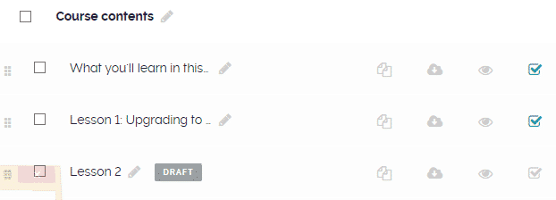

With that done, I can now see what the class would look like to a would-be student:

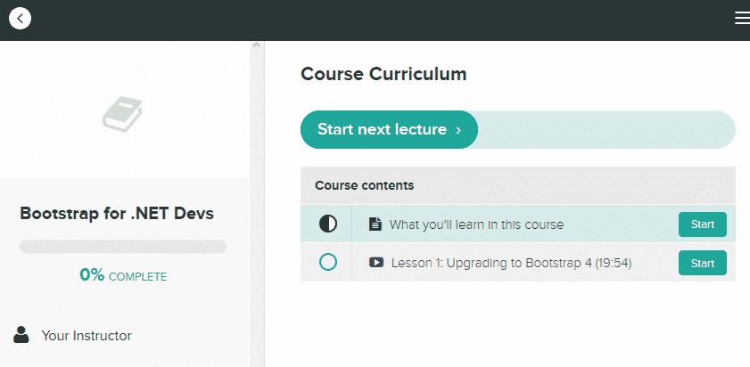

Obviously, we've got some things to fill in, but I think it looks pretty slick. There are some obvious screens in other sections of the admin panel, like setting pricing, that were pretty intuitive as well.

From the main admin page, I can also click on "Site," and then "Theme" to select School Theme options. It didn't _look_ like I could set theme options per course, but maybe I just wasn't looking hard enough. Here are some of the options:

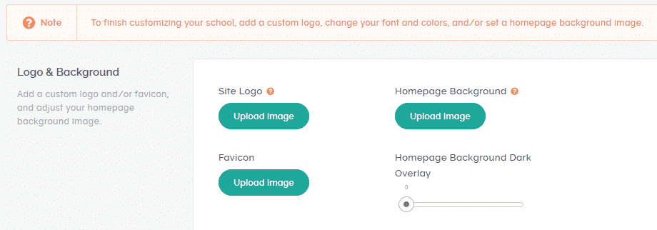

Overall, I really liked the interface for Teachable, and setting up my course was pretty easy. There were a few things that weren't obvious at first, but then again, I also didn't read the tutorials completely. There isn't too much I can complain about here, and, by-and-large, I enjoyed putting this mini-course together. Since I had the video already completed, creating this took maybe 20 to 30 minutes, including messing around with options just to see what they did.

Now let's see what it's like to set up a course on Udemy.

## How to set up a Udemy Course

I started by clicking on "Become an Instructor" on Udemy's homepage. After signing in with my existing Udemy account (I assume you create one if you don't have one already), I had to answer a three-question survey with questions like this:

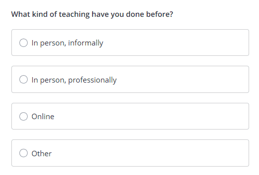

Pretty simple so far. With that done, let's ignore the tutorials and click on the big "Create Your Course" button.

Over the next few screens, I select what kind of course I'm making (Course vs. Practice Test), give my course a name, the category of course, and how many hours a week I plan on working on the course.

Next, I answer some questions about targeting the right students:

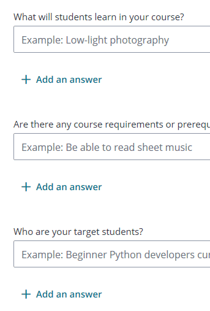

Annoyingly, what I thought was the "Next" or "Save" button is obscured by one of those "Have a question?" buttons:

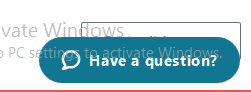

Turns out it's the language selection button, and I don't actually need to click this. Instead, I'm supposed to click through the sidebar navigation:

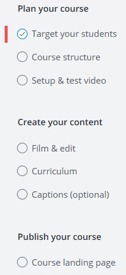

The next few tabs ("Course Structure," "Setup & test video," and "Film & Edit") have no interactive content, but are tips for how to structure your course and how to get good video results.

You don't actually create the course content until the "Curriculum" link, which looks like this:

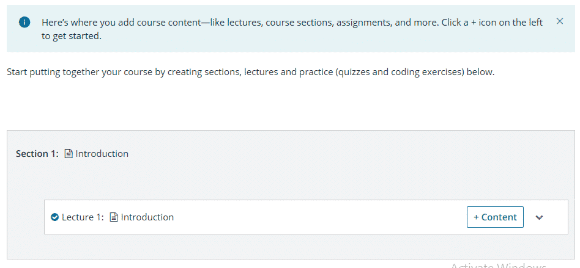

There are no "templates" as in Teachable. All right, let's add a couple of lectures, just to see what that's like.

As the tip on the top states, you need to click the "+ icon on the left" to add lectures. It took me a minute to figure out that this is _invisible_ until you hover over it:

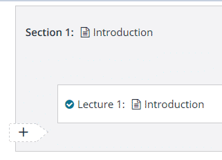

All right, then. I tried uploading my video file, but, alas, the file size was apparently too big for Udemy:

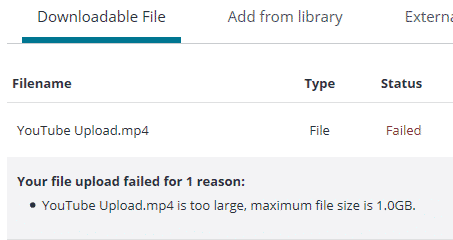

I should note that, at least in Windows, the file size is listed as 0.99 GB, so I thought I would've been fine. Guess it's just too close to the limit.

In any case, you need to have at least five lectures in your course in order to publish it. After that, you can customize your course landing page in a limited way: you can add a description, course image, and promotional video, but that's it.

You can set a price in ten dollar increments, starting at $19.99 (so $19.99, $29.99, etc.). _But_ to set a price, you need to complete what Udemy calls a "Premium Instructor Application." This include providing some personal information, a picture of yourself, a payout method, and agreement to some terms and rules.

I didn't do any of this, because my course isn't complete anyway.

You then, finally, can submit your course for review. But before you can do that, you have to complete a verification process. I didn't particularly feel like doing that either. From what I understand, once you finally complete all those steps, Udemy will evaluate your course before it goes live. They mostly look for video and audio quality.

The process of creating course felt pretty intuitive and I didn't encounter any frustrations aside from the invisible plus sign and the file size limit. (This limit was not present in Teachable).

## Teachable vs Udemy: Conclusion

All in all, I prefer Teachable as a platform to Udemy. You retain more control over your course, in appearance, branding, and pricing. No matter which platform you choose, you'll have to do some marketing to get the most out of your sales. And, if you have to do that anyway, you may as well go with the one where you get to keep more of the money you earn.
