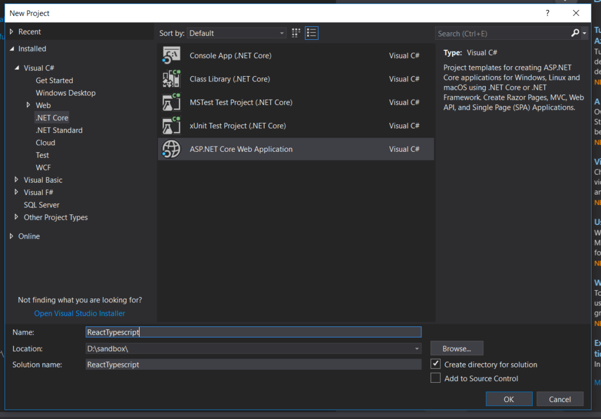
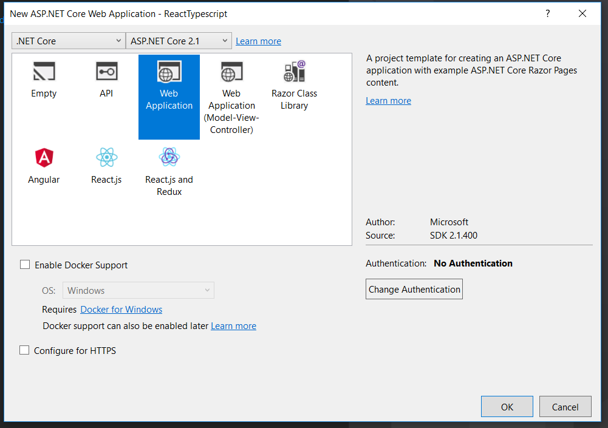
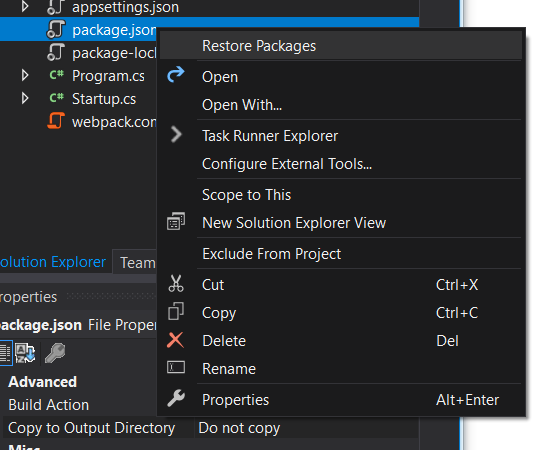
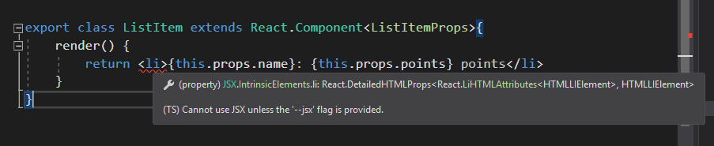
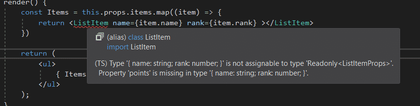
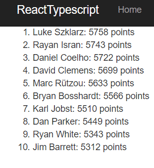

React is the most popular Javascript framework around today. While it makes front-end development easier on its own, there are a lot of ways to extend its functionality. For instance, wouldn't it be great to have strongly typed React components with IDE auto-completion? In this TypeScript React tutorial, we're going to look at how to strongly type your React code.

## What is TypeScript?

TypeScript is a superset of JavaScript. It add types to JavaScript, but compiles down to ordinary JavaScript that your browser can understand. While the project is open-source, it is maintained by Microsoft.

## Advantages of TypeScript and React

TypeScript allows for type-checking of complex types, which is great when you're passing props to React components.

If you're using one of the more popular IDEs, TypeScript will come with autocomplete options, which makes development faster.

As an ASP.NET developer myself, using TypeScript works well with Visual Studio. Since that's what I'm used to using, I'll use Visual Studio 2017 in these examples. However, whatever IDE you're using will likely be similar.

So let's get down to business and set up our .NET Core project.

## TypeScript React Tutorial Setup

In Visual Studio, begin by creating a new project.

On the next screen, it may be tempting to select the React.js template, but I would suggest you don't. That template is set up to be a single-page React app, and if you're not familiar with how routing and SPAs work in .NET Core, you're going to be a little confused.

You should totally check it out on your own time, but that template won't help you learn TypeScript and React any better than the Web Application template.

All right, onwards and upwards.

To bundle our Javascript files, I'm going to be using Webpack. If you're not at all familiar with npm, Webpack and what they do, I'd recommend taking a look at [my deep dive write-up](https://sensibledev.com/reactjs-webpack-and-asp-net-core/).

That being said, create a new _package.json_ file in the root directory of the project and replace the default contents with this:

{
  "version": "1.0.0",
  "name": "asp.net",
  "private": true,
  "scripts": {
    "build": "webpack"
  },
  "devDependencies": {
    "@babel/core": "^7.0.0",
    "@babel/preset-env": "^7.0.0",
    "@babel/preset-react": "^7.0.0",
    "@babel/preset-typescript": "^7.1.0",
    "@types/react": "^16.7.6",
    "@types/react-dom": "^16.0.9",
    "aspnet-webpack": "^3.0.0",
    "babel-loader": "^8.0.2",
    "react": "^16.4.2",
    "react-dom": "^16.4.2",
    "typescript": "^3.1.6",
    "webpack": "^4.17.1",
    "webpack-cli": "^3.1.0"
  }
}

Briefly speaking, we're going to need Babel in order to parse out the JSX syntax, and the Babel TypeScript loader in order to compile the TypeScript to JavaScript.

Confused yet? Modern web dev is all about comptranspiling things to other things and then back to other things.

Yay!

Anyhow, you can open up the command line, get to your project folder, and run the following:

npm-install

Alternately, you could right-click on the _package.json_ file in Visual Studio, and select _Restore Packages_.

Next, add a _webpack.config.js_ file to the root of your project. Add the following configuration to it:

const path = require('path');
module.exports = {
    mode: 'development',
    entry: { main: './wwwroot/js/app.tsx' },
    output: {
        path: path.resolve(\_\_dirname, './wwwroot/js/dist'),
        filename: 'bundle.js',
        publicPath: 'dist/'
    },
    resolve: {
        extensions: \['\*', '.js', '.jsx', '.tsx'\]
    },
    module: {
        rules: \[
            {
                test: /\\.ts|\\.tsx$/,
                use: \[
                    {
                        loader: 'babel-loader',
                        options: {
                            "presets": \["@babel/preset-env", "@babel/preset-react", "@babel/preset-typescript"\]
                        }
                    }
                \]
            }
        \]
    }
};

Our webpack bundle is going to start in the _/wwwroot/js_ folder in a file called _app.tsx_ (that we'll create later).

It'll output to _/wwwroot/js/dist_ in a file called _bundle.js_.

After you play around with this tutorial, you should probably work with the folder structure to match your taste.

In the _module_ attributes, we've specified that our TypeScript files will be parsed by Babel. You're going to want these for the same reason that you installed these packages via npm.

Now let's add our TypeScript files to our project.

## TypeScript React Examples

I'm going to put all of the TypeScript files in _/wwwroot/js_. It's probably better practice to make a subfolder for each React component and its sub-components, but I'm keeping things simple for you.

For this example, we're going to create a simple list of top ten players from the N64 video game, _Goldeneye 64_. I'm taking my data from [this page](https://rankings.the-elite.net/goldeneye).

So let's think about what we're going to need. It's pretty simple: an ordered list, with player names and total points.

Let's start with the simplest unit, the list item. In _/wwwroot/js_, create a file called _ListItem.tsx_. Put the following code in:

import \* as React from "react";

export interface ListItemProps { name: string, rank: number, points: number }

export class ListItem extends React.Component<ListItemProps>{
    render() {
        return <li>{this.props.name}: {this.props.points} points</li>
    }
}

Let's go over this a little. The import syntax is slightly different than standard ES6 syntax, with...

import \* as React from "react";

Instead of...

import React from "react";

Just a small syntax difference.

On the next line, we're defining the shape of the React props we need for this component. Notice how we also define the type of each prop. We'll use this interface a good deal in our other files.

Finally, we define the ListItem component, passing in the interface to shape our props. If you type this out, you'll notice that you can use Intellisense to autocomplete the prop names, and you can trigger Intellisense errors when you, for example, try to use a prop not in the interface.

You may notice that Intellisense gives us an error with our JSX:

To fix this, we need to add a _tsconfig.json_ file to our project. You can right-click on the _/wwwroot/js_ folder, select _Add -> New Item…_ and choose _TypeScript JSON Configuration File_.

The _tsconfig.json_ file needs to have at least one _.tsx_ file in its folder, so that's why you can't just put it in the root of the project.

You'll need to make the file look like this, with the added "jsx" flag.

_tsconfig.json_

{
  "compilerOptions": {
    "noImplicitAny": false,
    "noEmitOnError": true,
    "removeComments": false,
    "sourceMap": true,
    "target": "es5",
    "jsx": "react"
  },
  "exclude": \[
    "node\_modules",
    "wwwroot"
  \]
}

Now let's build our List component.

Create a file called _List.tsx_ in the _/wwwroot/js_ folder and add the following code:

import \* as React from "react";
import { ListItem, ListItemProps } from "./ListItem";

export interface ListProps { items: Array<ListItemProps> }

export class List extends React.Component<ListProps> {
    render() {
        const Items = this.props.items.map((item) => {
            return <ListItem name={item.name} rank={item.rank} points={item.points}></ListItem>
        })

        return (
            <ol>
                { Items }
            </ol>
        );
    }
}

So let's draw some observations. We're importing both the ListItem component as well as the interface for the props.

This lets us create the interface for the List props. Since we want the props and types to match the whole way through our chain of components, this really helps to catch errors.

Instead of defining the list item props here again, we just define ListProps as an array of ListItemProps.

The rest of this file should look similar to what we had earlier, with the props being strongly typed.

Helpfully, if you forget one of the props for the ListItems, Intellisense will yell at you:

For the last of our TypeScript files, let's add _app.tsx_, which will instantiate our React app instance.

_app.tsx_

import \* as React from "react";
import \* as ReactDOM from "react-dom";

import { List } from "./List";
import { ListItemProps } from "./ListItem";

const items: ListItemProps\[\] = \[
    { name: 'Luke Szklarz', rank: 1, points: 5758},
    { name: 'Rayan Isran', rank: 2, points: 5743},
    { name: 'Daniel Coelho', rank: 3, points: 5722},
    { name: 'David Clemens', rank: 4, points: 5699},
    { name: 'Marc Rützou', rank: 5, points: 5633},
    { name: 'Bryan Bosshardt', rank: 6, points: 5566},
    { name: 'Karl Jobst', rank: 7, points: 5510},
    { name: 'Dan Parker', rank: 8, points: 5449},
    { name: 'Ryan White', rank: 9, points: 5343},
    { name: 'Jim Barrett', rank: 10, points: 5312}
\];
ReactDOM.render(
    <List items={ items } />,
    document.getElementById("example")
);

As you can see, we're importing our List component and the interface for our ListItem props. We define our array of objects representing the rankings.

Then we call ReactDOM.render, like you would in any React app.

## Testing it Out

Head over to _Pages/Index.cshtml_.

Replace everything there with the following markup:

@page
@model IndexModel
@{
    ViewData\["Title"\] = "Home page";
}

    

@section Scripts {
    
}

My friends, we have a list.

## TypeScript React Tutorial: Further Reading

Now that you have that under your belt, and you understand the basics, feel free to play around with Microsoft's [TypeScript React Starter](https://github.com/Microsoft/TypeScript-React-Starter) template.

You can also check out the official [TypeScript documentation](https://www.typescriptlang.org/docs/home.html). Of particular use is the [Do's and Dont's page](https://www.typescriptlang.org/docs/handbook/declaration-files/do-s-and-don-ts.html), with a lot of helpful examples about best practices.

While not every project might need TypeScript, it's certainly an option worth looking into that might save you some headaches in preventing and catching bugs. I hope that you've found this tutorial useful. Happy, sensible coding!
