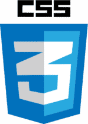
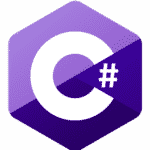
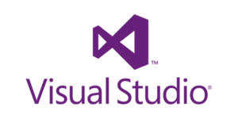

Whether you're brand new to .NET or a seasoned pro, you have to keep learning if you want to stay at the top of your game. In this ultimate guide to learning ASP.NET web development, I'm going to share with you the four things all .NET devs should know.

I'm going to draw on my years of experience as both a web developer and a teacher. I'll reveal the best resources to learn ASP.NET, shaving months (if not years) off your learning journey.

I try to recommend the best, regardless of whether a resource is free or paid (though I'll be sure to tell you which is which).

I've tried to make this list as lean as possible. This is not meant to be exhaustive, but a common place for all .NET devs to start.

_Disclaimer: This report contains affiliate links to products. I may receive a commission for purchases made through these links. But don't worry, I don't recommend anything that I wouldn't recommend to a teammate or best friend._

## Summary

Hey, I get it, you're busy! Cutting to the chase, here are the four things you should know if you're trying to learn ASP.NET web development.

### #1. ASP.NET Web Dev Skills Roadmap

If you're going to call yourself a .NET dev, you should, at minimum, know how to work with the following:

- HTML, CSS, C#, Javascript
- Visual Studio, MVC Pattern, Routing, Forms, Model Binding, Validation, Authentication, Authorization
- SQL Server, Entity Framework

### #2. Best Online Platform to learn ASP.NET Web Dev

[Pluralsight](https://sensibledev.com/recommends/pluralsight-free-trial/) is the best online platform for learning ASP.NET web development. It has the widest selection of curated, quality courses from experts in the field.

\[maxbutton id="1" \]

### #3. Best Books to Learn ASP.NET Web Dev

[Pro ASP.NET Core MVC 2](https://sensibledev.com/recommends/pro-asp-net-core-mvc-2/) and [Pro ASP.NET MVC 5](https://sensibledev.com/recommends/pro-asp-net-mvc-5/), both by Adam Freeman, are the best books to learn the respective versions of ASP.NET web development..

[The C# Player's Guide](https://sensibledev.com/recommends/c-players-guide/) is the best book for beginners learning C#, while Jon Skeet's [C# In Depth](https://sensibledev.com/recommends/c-in-depth/) is a great intermediate to advanced book.

As far as Javascript is concerned, [You Don't Know JS](https://github.com/getify/You-Dont-Know-JS) is a great book series for beginners (free). Follow that up with [Eloquent Javascript](https://eloquentjavascript.net/) (also free).

### #4. Best YouTube Channels to Learn ASP.NET Web Dev

[Tim Corey's YouTube channel](https://www.youtube.com/user/IAmTimCorey) has a lot of great ASP.NET and C# content, as does Moshfegh Hamedani on his channel [Programming with Mosh](https://www.youtube.com/user/programmingwithmosh).

Now that you know where we're going, let's dig into _why_ I'm making these recommendations.

## #1. ASP.NET Web Dev Skills Roadmap

To begin, we should define _what_ we're trying to learn. Becoming a web developer requires a lot of skills, and the list can seem overwhelming. While there's always more to learn, you should have the following skills _at a minimum_ to be a successful .NET dev.

### Prerequisites

#### HTML

At their core, all web pages are documents. (And in the early days, that's _all_ they were.) HTML is the skeleton of your page, defining the layout of your document. You'll want to understand basic HTML, as well as some of the newer HTML5 features.

#### CSS

If HTML is the skeleton, CSS is the designer clothing. Cascading style sheets define the appearance of your web page.

#### Javascript

Without Javascript, your web pages are just going to sit there, doing nothing. You need Javascript to really make your applications hum.

#### C#

Finally, you're going to need to know a programming language to code on the server. The language of choice for ASP.NET web development is C#, which, thankfully, is fairly easy to learn.

### Essential ASP.NET Web Dev

#### Visual Studio (or VS Code for Linux)

Visual Studio is the IDE (Interactive Development Environment) for .NET programming. You'll do all of your coding in this program, so you should know your way around it. The current version is Visual Studio 2017. There are many employers still using the 2015 version, but if you're starting out you should use the latest one.

You'll also see a lot of talk out there about .NET MVC 5 (sometimes just ASP.NET or ASP.NET MVC) versus .NET Core. Just know that the latest version is .NET Core, and focus on that unless your employer still uses the older version.

#### The MVC Pattern

Model-View-Controller (MVC) is a common architectural pattern, and it's not unique to ASP.NET. You should know the purpose of models, views, and controllers, as well as how they interact. You'll also want to learn how ASP.NET organizes the difference pieces of MVC.

#### Routing

When an ASP.NET controller receives a web request, it should be able to accept URLs that do not correspond exactly to files. For example, it's much easier to ask for _www.yoursite.com/products_ instead of _www.yoursite.com/pages/products.aspx_. You should know how to define the default routes in your application and how to override them if need be.

#### Forms and Model Binding

When a user submits a form, you need to be able to get at that form data in a meaningful way. This is done in .NET via model binding, where posted form values get mapped to object properties. You ought to know how this works and some common gotchas that occur with certain types (like posting a list of complex objects).

#### Validation

Of course, you'll want to put constraints on your form input. Which fields are required? Which are supposed to be text values and which are supposed to be numbers, or phone numbers? There are some very easy built-in ways to achieve this in .NET, both server-side and client-side. But you need to know how to use it.

#### Authentication and Authorization

Authentication is determining who a user _is_, and authorization is what a user can _do_. You don't want just anyone poking around in the admin panel. You'll want to understand how Visual Studio can create authentication code for you, and how to modify that when you need to pull credentials in some custom way.

### Databases

#### SQL Server

You need to store your application's data somewhere. While .NET does support a wide variety of SQL (and NoSQL) versions, you can't go too wrong learning Microsoft's version of the query language.

#### Entity Framework

Entity Framework is a library for .NET that lets you write C# code to create, read, update, and delete records in the database.

### And the rest of it...

There are, of course, many more things to learn in web development, like test-driven development, web APIs, and front-end Javascript frameworks. But the topics I've listed above are the absolute essentials, and if you're beginning your career, you'll want to focus on those first.

So how do we go about learning all of this? Let's start with the best online ASP.NET courses.

## #2. Best Online Platform to Learn .NET Web Dev

### [Pluralsight](https://sensibledev.com/recommends/pluralsight-free-trial/)

\[maxbutton id="1" \]

I think Pluralsight is the overall best choice for learning ASP.NET Web development. It has the widest library of quality ASP.NET courses taught by knowledgeable instructors and is commonly held in high regard by actual web developers using it.

Pluralsight's instructors include industry professionals and Microsoft MVPs like Scott Allen and Shawn Wildermuth. There's a level of expertise here that you won't necessary find on other platforms.

A Pluralsight subscription gives you access to thousands of video courses for a reasonable price. If you pay yearly, you're only looking at $25 a month. That's less than the cost of my pick for [the best C# book](https://sensibledev.com/recommends/c-players-guide/), which is already pretty darn cheap. If you're serious about improving your dev skills, the cost is almost certainly worth it.

Then there's the advantage of a vast library over a pay-as-you-go business model (like Udemy). You can easily jump from topic to topic in Pluralsight. For example, if you're going through the .NET Core tutorial, and want to refresh your memory about how LINQ works, you can just hop on over to the LINQ course and go to the appropriate section. With Udemy, you'd have to fork over more cash to fill in that knowledge gap, not to mention the time wasted researching which courses are worth your money.

#### What People Say About Pluralsight

Pluralsight is also highly regarded by online communities. Here's a brief sampling of social media reviews:

"I have been using Pluralsight for almost a year now and it’s worth every penny… if you want to get a job in the tech industry then I would highly recommend you to give Pluralsight a try." - [William McCollum, Senior Software Engineer at Dropbox](https://www.quora.com/Is-Pluralsight-any-good)

"I've been using \[Pluralsight\] for maybe 10 weeks, and it is the most valuable learning tool in my arsenal." - [Plasticonoband, /r/learnprogramming](https://www.reddit.com/r/learnprogramming/comments/8hh4p2/best_way_to_learn_c_and_net_for_web_development/dyjx380)

"I'm a big fan of Pluralsight, and a member since 2010. Courses by Shawn Wildermuth, Scott Allen, Gill Cleeren are good. It costs money but it's worth it." - [jamesallen74, /r/dotnet](https://www.reddit.com/r/dotnet/comments/7gs0i3/best_site_to_learn_aspnet/dqlbx3o)

"I love Pluralsight for C#. I took a 15 week boot camp and felt my knowledge was very lacking. Pluralsight really filled in the gaps." - [16080459, /r/csharp](https://www.reddit.com/r/csharp/comments/6vsk0x/whats_your_opinion_on_the_pluralsight_c_learning/dm35euq)

#### Recommended Pluralsight Courses

[C# Fundamentals with Visual Studio 2015](https://sensibledev.com/recommends/c-fundamentals-with-visual-studio-2015/)

[ASP.NET Core Fundamentals](https://sensibledev.com/recommends/asp-net-core-fundamentals/)

[Building a RESTful API with ASP.NET Core](https://sensibledev.com/recommends/building-a-restful-api-with-asp-net-core/)

#### Downsides about Pluralsight, but not dealbreakers

Some users reported duplication within the learning paths, and advised not to take the learning paths as something you have to follow exactly. Others reported having dissatisfaction with some instructors, but this mostly had to do with either tone of voice or speed. Almost every review found some course that was valuable.

### Best Paid Pluralsight Alternatives

### [Treehouse](https://sensibledev.com/recommends/treehouse/ "Treehouse")

I really like Treehouse. The courses are taught by competent instructors. The site is very well designed, and easy to navigate. At $25 a month, it's very affordable.

However, I feel that Pluralsight will be a better pick for most .NET developers. First, Treehouse is geared mostly towards beginning web development. This is great if you're first starting out, but you'll soon grow out of it.

Second, the course selection for Treehouse is much slimmer than Pluralsight. For example, Treehouse has only three courses pertaining to ASP.NET Core, while Pluralsight has around 100.

If push came to shove, I'd say give Pluralsight a try first. If you're finding it too heavy (which I think you won't), switch to Treehouse for a month or two and come back to Pluralsight when you're more comfortable.

##### Recommended Treehouse Courses

[Beginning ASP.NET Web Development Track](https://sensibledev.com/recommends/asp-net-web-development-track/)

* * *

### [Udemy](https://sensibledev.com/recommends/udemy/)

Instead of paying a monthly subscription like Pluralsight or Treehouse, you pay Udemy by the course. If you have very little spare time, or you want to work through the courses more slowly, Udemy might end up being cheaper in the long run.

Of course, this puts you at a disadvantage if you need to jump between topics. You might end up actually paying more than Pluralsight once you factor in how many courses you'll need to purchase. This is greatly dependent on your needs, schedule, and budget.

And Udemy's courses aren't _bad_, by any means. I've paid for a few courses there in the past and really liked them. You just have to do your research and carefully read the reviews. Pay particular attention to the date that the course was last updated.

What I really don't like about Udemy is the inconsistency in teaching quality. While there is some quality control in terms of video and sound quality, just about anyone can put up a course about anything. For example, there are currently 466 HTML courses on Udemy. I guarantee you don't need four hundred HTML classes, and most of those are going to be average to sub-par.

As one Reddit user put it: "In the beginning, I tried Udemy but I felt like some of them had no clue what they were talking about... they were just people who read other sites to make a course. On the other side, some of the instructors on Pluralsight are straight from Microsoft and have even written well known programming books for publishers like Wrox and Apress." [ToMissTheMarc2, /r/csharp](https://www.reddit.com/r/csharp/comments/3tymeb/plural_sight_is_it_worth_it/cxaghnc)

Another thing to note is that the pricing of the courses is misleading. While most of the classes are advertised as having a base price of $100 or more, almost none of them ever sell for that much. Udemy holds continuous sales that discount its courses by 90%, so if one of the classes you want _isn't_ "on sale," just wait a few days. I've personally never paid more than $15 for a Udemy course.

You can visit my [Udemy coupon page](https://sensibledev.com/udemy-discount-coupons/) to see the latest Udemy promotions.

##### Recommended Courses

[The Complete ASP.NET MVC 5 Course](https://sensibledev.com/recommends/the-complete-asp-net-mvc-5-course/)

[Build a Real-world App with ASP.NET Core and Angular 2](https://sensibledev.com/recommends/build-a-real-world-app-with-asp-net-core-and-angular-2/)

[The Web Developer Bootcamp](https://sensibledev.com/recommends/the-web-developer-bootcamp/)

* * *

### [LinkedIn Learning](https://www.linkedin.com/learning/)

Formerly Lynda, LinkedIn Learning actually has a pretty impressive course catalog along with well-defined learning paths. It bills itself as being great for organizations, and offers to personalize professional development based on your team's needs.

The only reason I wouldn't recommend LinkedIn Learning over Pluralsight is that LinkedIn isn't as .NET focused. For example, it has a full-stack web developer pathway that teaches PHP, Ruby on Rails, and Node. ASP.NET MVC is absent from this pathway.

That's not to say that the platform doesn't have any .NET content. But Pluralsight's content is just _more_ focused.

On the other hand, LinkedIn Learning offers a free trial for a month, so you could try it out without much risk.

##### Recommended Courses

[Learning ASP.NET Core MVC](https://www.linkedin.com/learning/learning-asp-dot-net-core-mvc)

[Building and Securing RESTful APIs in ASP.NET Core](https://www.linkedin.com/learning/building-and-securing-restful-apis-in-asp-dot-net-core-2)

### [Best Free Alternative: Microsoft Virtual Academy](https://mva.microsoft.com/)

If you're not ready to shell out any money, I'd suggest checking out Microsoft Virtual Academy. These are official Microsoft courses taught by Microsoft employees. Their library isn't as vast as Pluralsight's, but it'll certainly get you started.

##### Recommended Courses

[ASP.NET Core - Beginner](https://mva.microsoft.com/en-US/training-courses/aspnet-core-beginner-18153?l=VM5gy36dE_6611787171)

[ASP.NET Core - Intermediate](https://mva.microsoft.com/en-us/training-courses/aspnet-core-intermediate-18154?l=Lr2Zz0beE_7111787171)

[ASP.NET Core - Advanced](https://mva.microsoft.com/en-US/training-courses/aspnet-core-advanced-18155?l=Rw9sqs7dE_7011787171)

## #3. Best Books to Learn .NET Web Dev

While I think that most people benefit more from online courses with videos and hands-on exercises, there are those who prefer to learn from books. You also might like to have a reference guide or two hanging around.

These are my choices for the best books covering the many skills necessary for .NET web development.

There are so many HTML and CSS books out there, it's hard to recommend just one. They're all so similar, and I almost want to point you to [the MDN HTML tutorials](https://developer.mozilla.org/en-US/docs/Web/HTML) and leave it at that. But if you really want a book recommendation (twist my arm), I'd say to get Jon Duckett's amazing [HTML and CSS: Design and Build Websites](https://sensibledev.com/recommends/html-and-css-design-and-build-websites/ "HTML and CSS: Design and Build Websites").

The [C# Player's Guide](https://sensibledev.com/recommends/c-players-guide/ "C# Player's Guide") is the best book for beginners learning C#, while Jon Skeet's [C# In Depth](https://sensibledev.com/recommends/c-in-depth/ "C# In Depth") is a great intermediate to advanced book. [The C# Yellow Book](http://www.csharpcourse.com/) is a good free alternative. You can see my in-depth review of these, and other C# books, in my round-up of the best C# books for beginners.

[Pro ASP.NET Core MVC 2](https://sensibledev.com/recommends/pro-asp-net-core-mvc-2/) and [Pro ASP.NET MVC 5](https://sensibledev.com/recommends/pro-asp-net-mvc-5/) are the best books to learn MVC 5 and .NET Core, respectively. Both are written by Adam Freeman. They come highly recommended on both Reddit and Quora, and are Amazon best sellers.

You should also check out the official Microsoft documentation, like this one: [Introduction to ASP.NET Core](https://docs.microsoft.com/en-us/aspnet/core/?view=aspnetcore-2.1). Many of the tutorials are surprisingly well-written for official docs, though I've certainly found some turkeys that were hard to understand.

You're also going to need to know some Javascript. I know, it's yet another language, and it can be kinda weird sometimes, but you really can't escape it. My two picks are both free: [You Don't Know JS](https://github.com/getify/You-Dont-Know-JS) for beginners and [Eloquent Javascript](https://eloquentjavascript.net/) for intermediate learning.

Oh, and I know we haven't talked about user experience _at all_ yet, but I have to tell you about one special book: [Don't Make Me Think](https://sensibledev.com/recommends/dont-make-me-think/) by Steve Krug. It's not a programming book, but a book about web usability and how to design interfaces for users. Once you start building real-world projects, you _have_ to check this book out.

## #4. Best YouTube Channels to Learn .NET Web Dev

Another great way to keep up your skills current is to check out the user-generated content on YouTube. Two channels with great .NET content are [Tim Corey's YouTube channel](https://www.youtube.com/user/IAmTimCorey) and Moshfegh Hamedani's [Programming with Mosh](https://www.youtube.com/user/programmingwithmosh).

I also want to make a special mention of [Joshua Fluke](https://www.youtube.com/user/Tychos1/). Though not a .NET channel, Joshua has a lot of great practical advice about how to advance your career, no matter what tech stack you're using. For example, Fluke has actually posted videos of his phone interviews for programming jobs, like [this one for a front-end role](https://www.youtube.com/watch?v=S6lwJ6Rixnc). That takes some guts!

## Ultimate Guide to Learning ASP.NET Web Development: Conclusion

With this list of resources in hand, you've got a great start in your .NET web dev learning journey. Now it's up to you to go out there and build something.

Happy, sensible coding!
